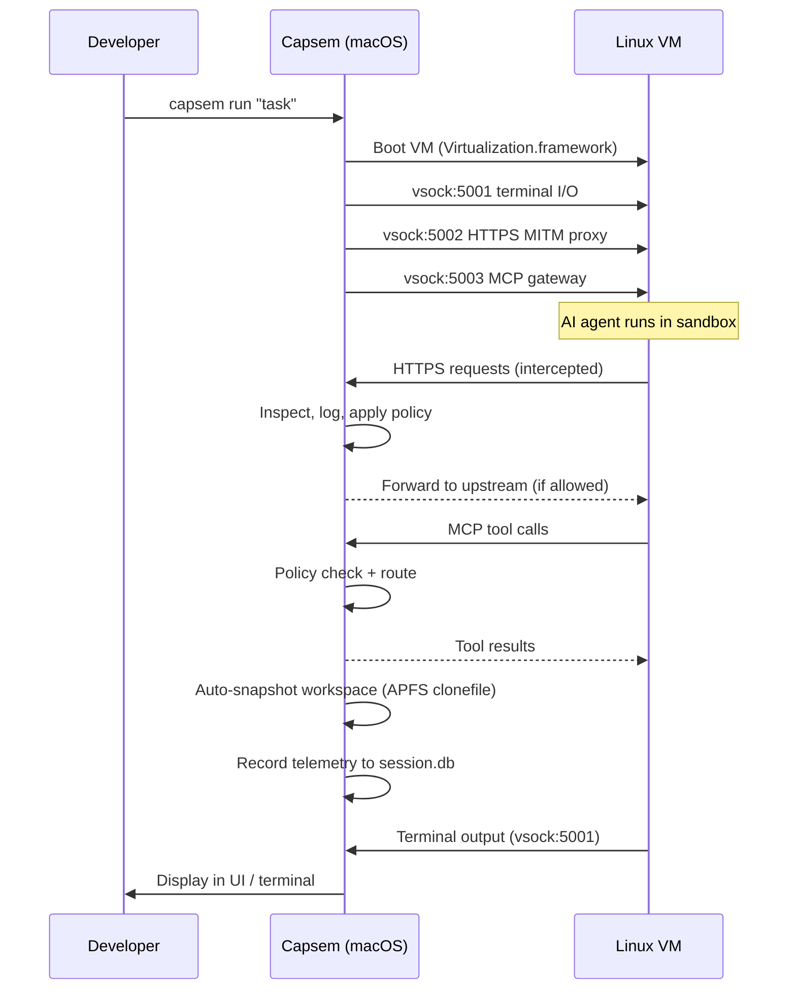

<p align="center">
  
</p>

<h1 align="center">Capsem</h1>

<p align="center">
  Sandbox AI coding agents in hardware-isolated Linux VMs on your Mac.<br/>
  Full network control, HTTPS inspection, MCP tool routing, and per-session telemetry.
</p>

<p align="center">
  <a href="https://github.com/google/capsem/releases/latest"></a>
  <a href="https://codecov.io/gh/google/capsem"></a>
  <a href="https://github.com/google/capsem/actions/workflows/ci.yaml"></a>
  <a href="https://github.com/google/capsem/blob/main/LICENSE"></a>
</p>

> **Disclaimer**: This project is not an official Google project. It is not supported by Google and Google specifically disclaims all warranties as to its quality, merchantability, or fitness for a particular purpose.

## Features

- **Hardware VM isolation** -- Each agent runs in its own Apple Virtualization.framework VM with Stage 2 page tables. No shared memory, no container escapes.
- **Air-gapped networking** -- No NIC exists in the VM. All HTTPS traffic is intercepted by a transparent MITM proxy with per-domain allow/block policy and full request/response telemetry.
- **Hardened kernel** -- Custom-compiled Linux kernel: no loadable modules, no IP stack, KASLR, stack protector, FORTIFY_SOURCE. 7MB vs 30MB stock Debian.
- **HTTPS inspection** -- TLS termination with per-domain minted certificates. Every API call is logged: provider, model, tokens, cost, tool calls, trace linking.
- **MCP tool gateway** -- Routes MCP tool calls from AI agents through a policy engine. Built-in tools (`fetch_http`, `grep_http`, `http_headers`) and external MCP server passthrough.
- **Workspace snapshots** -- Rolling auto-snapshots via APFS clonefile. Create, list, diff, revert, compact snapshots from MCP tools or the in-VM `snapshots` CLI.
- **Per-session telemetry** -- SQLite database per session: network events, model calls (with token counts and cost), tool calls, MCP calls, file events. Queryable from the UI.
- **Security presets** -- Medium/High security profiles. Corporate lockdown via `/etc/capsem/corp.toml` (MDM-distributed). Per-domain HTTP method+path rules.
- **AI agent support** -- Claude Code, Gemini CLI, and Codex run in yolo mode by default. The VM is the security boundary, not the agent's permission system.
- **Boot in ~2 seconds** -- Squashfs rootfs + VirtioFS overlay + initrd-bundled agent binaries. No disk formatting, no package installs.

## How it works



1. Capsem boots a Linux VM with a hardened kernel and read-only rootfs
2. The AI agent (Claude, Gemini, Codex) starts in `/root` with full filesystem access
3. All HTTPS traffic is intercepted -- API calls are parsed for model, tokens, cost, and tool usage
4. MCP tool calls are routed through a policy engine with built-in and external tool support
5. Workspace snapshots are taken automatically every 5 minutes (APFS clonefile, zero-copy)
6. The session database records everything for the telemetry UI

## Install

**Download the DMG** from the [latest release](https://github.com/google/capsem/releases/latest), open it, and drag Capsem.app to Applications.

Or with Homebrew (coming soon):

```sh
brew install --cask capsem
```

Or build from source:

```sh
just doctor          # check prerequisites
just build-assets    # build VM assets (~10 min, first time only)
just install         # test + build + codesign + install
```

Requires macOS 13+ on Apple Silicon.

## Usage

### GUI

```sh
open /Applications/Capsem.app
```

### CLI

```sh
capsem uname -a
capsem echo hello
capsem 'ls -la /proc/cpuinfo'
```

## Architecture

```
crates/capsem-core/    VM library (config, boot, vsock, MITM proxy, MCP gateway)
crates/capsem-app/     Tauri binary (GUI, CLI, IPC commands)
crates/capsem-agent/   Guest binaries (PTY agent, net proxy, MCP relay)
crates/capsem-logger/  Telemetry DB (writer, reader, schema)
crates/capsem-proto/   Wire protocol (vsock message encoding)
frontend/              Astro 5 + Svelte 5 + Tailwind v4 + DaisyUI v5
guest/config/          Guest image configuration (TOML configs)
guest/artifacts/       Guest scripts and diagnostics (capsem-init, tests)
```

## Development

```sh
just dev             # hot-reloading Tauri app (frontend + Rust)
just ui              # frontend-only dev server (mock mode, no VM)
just run             # cross-compile + repack + build + sign + boot (~10s)
just test            # unit tests + cross-compile + frontend check
just full-test       # test + capsem-doctor + integration + bench
```

See `just --list` for all targets.

## Testing

| Layer | Command | What it tests |
|-------|---------|---------------|
| Unit | `cargo test --workspace` | 1,500+ Rust tests across all crates |
| Frontend | `cd frontend && pnpm run test` | Svelte component + store tests |
| In-VM | `just run "capsem-doctor"` | 284 sandbox/network/runtime diagnostics inside the VM |
| Integration | `just full-test` | End-to-end: boot VM, exercise all telemetry pipelines, verify DBs |

## Security

Capsem assumes the AI agent is adversarial. The sandbox is hardened at every layer:

| Layer | Protection |
|-------|-----------|
| Hardware | Apple Silicon Stage 2 page tables, no shared memory |
| Kernel | Custom-compiled, `CONFIG_MODULES=n`, `CONFIG_INET=n`, KASLR |
| Network | No NIC. DNS/HTTP/IP physically impossible. MITM proxy on vsock only. |
| Filesystem | Read-only squashfs rootfs. Only `/root`, `/tmp`, `/run` writable. |
| Boot integrity | BLAKE3 hashes of kernel/initrd/rootfs compiled into the binary |
| Processes | PID 1 is our init. No systemd, no cron, no sshd. |
| Agent binaries | Deployed read-only (chmod 555), verified at boot |

Full threat model: [docs/security.md](docs/security.md)

## Tech stack

- [Rust](https://www.rust-lang.org) -- VM library, MITM proxy, MCP gateway, guest agents
- [Tauri 2.0](https://tauri.app) -- Desktop app framework
- [Apple Virtualization.framework](https://developer.apple.com/documentation/virtualization) -- Hardware VM isolation
- [Astro 5](https://astro.build) + [Svelte 5](https://svelte.dev) -- Frontend
- [Tailwind v4](https://tailwindcss.com) + [DaisyUI v5](https://daisyui.com) -- Design system
- [rustls](https://github.com/rustls/rustls) + [hyper](https://hyper.rs) -- TLS termination and HTTP inspection
- [SQLite](https://sqlite.org) -- Per-session telemetry storage

## Documentation

- [Architecture](docs/architecture.md) -- system design and data flows
- [Security](docs/security.md) -- threat model, isolation guarantees
- [Configuration](docs/config.md) -- settings registry and policy engine

## Disclaimer

This project is not an official Google project. It is not supported by Google and Google specifically disclaims all warranties as to its quality, merchantability, or fitness for a particular purpose.

## License

See [LICENSE](LICENSE).
