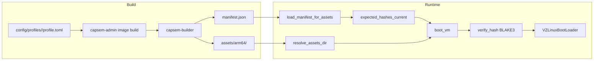

The asset pipeline moves kernel, initrd, and rootfs images from build through to boot. Assets are per-architecture (arm64 for Apple Silicon, x86_64 for Linux/KVM), integrity-checked with BLAKE3 hashes at every stage, and distributed via a version-scoped manifest.

## Build

Profile configuration lives under `config/profiles/<profile_id>/`. The
profile-derived build rail validates the profile ledger and materializes a backend image
workspace before Docker runs:

```
config/profiles/<id>/profile.toml
  -> capsem-admin image build
  -> generated backend image spec
  -> capsem-builder
  -> assets/{arch}/
```

Two build templates exist:

| Template | Output | What it does |
|----------|--------|-------------|
| `kernel` | `vmlinuz`, `initrd.img` | Builds a minimal Linux kernel from `defconfig` |
| `rootfs` | `rootfs.erofs` | Builds the full guest filesystem with packages, runtimes, and tools |

The build process also cross-compiles guest agent binaries (`capsem-pty-agent`, `capsem-net-proxy`, `capsem-mcp-server`) for the target architecture and injects them into the rootfs.

### Output layout

```
assets/
  arm64/
    vmlinuz
    initrd.img
    rootfs.erofs
  x86_64/
    vmlinuz
    initrd.img
    rootfs.erofs
  manifest.json
  B3SUMS
```

### Commands

| Command | What it does |
|---------|-------------|
| `just build-assets code [arch]` | Full profile-derived build: kernel + rootfs + checksums |
| `just shell` / `just exec "CMD"` | Repack initrd, materialize runtime config, sign, boot |
| `capsem-admin manifest generate assets` | Generate `assets/manifest.json` from an asset directory |
| `capsem-admin profile materialize` | Generate `target/config` from source `config/` plus `assets/manifest.json` |
| `capsem-admin assets channel build` | Generate `target/release-channel` with `assets/<channel>/manifest.json` for release.capsem.org |
| `capsem-admin image build --profile config/profiles/code/profile.toml --config-root config --arch arm64 --template rootfs` | Build one template for one arch through the profile rail |

`config/` is checked-in source material: profile, corp, settings, rule files,
and support templates. The current build's runtime config is generated under
`target/config/`. Local dev, smoke tests, CI, and release packaging all use the
same profile-derived build rail; there is no dev-only profile patcher.

## Manifest Format

The manifest (`assets/manifest.json`, format 2) is a single top-level file covering every arch. Asset versions and binary versions are tracked independently with compatibility ranges (`min_binary`, `min_assets`):

```json
{
  "format": 2,
  "refresh_policy": "24h",
  "assets": {
    "current": "2026.0421.30",
    "releases": {
      "2026.0421.30": {
        "date": "2026-04-21",
        "deprecated": false,
        "min_binary": "1.0.0",
        "arches": {
          "arm64": {
            "vmlinuz":         {"hash": "<64-char blake3>", "size": 7797248},
            "initrd.img":      {"hash": "<blake3>",         "size": 2314963},
            "rootfs.erofs":    {"hash": "<blake3>",         "size": 720896000}
          },
          "x86_64": { "...": "..." }
        }
      }
    }
  },
  "binaries": {
    "current": "1.0.1776688771",
    "releases": {
      "1.0.1776688771": {
        "date": "2026-04-21",
        "deprecated": false,
        "min_assets": "2026.0421.30"
      }
    }
  }
}
```

The public asset channel is a deployed view of that same manifest. The generated
Cloudflare Pages root is `target/release-channel/`, with the machine manifest at
`target/release-channel/assets/stable/manifest.json`. After deployment the URL
is `https://release.capsem.org/assets/stable/manifest.json`.
The release-channel deploy smoke verifies public `Cache-Control` headers after
Cloudflare publishes the generated site: mutable pointers (`/`, `/health.json`,
and `/assets/<channel>/manifest.json`) stay `no-cache, must-revalidate`, while
immutable asset and profile release artifacts stay
`public, max-age=31536000, immutable`.

Key points:
- **Single file, not per-arch.** Arches are nested under `assets.releases.<ver>.arches.<arch>`.
- **Filenames are bare** (`"vmlinuz"`, not `"arm64/vmlinuz"`) -- the arch map provides the context.
- **GitHub release asset names are arch-prefixed.** The published files are
  named `arm64-vmlinuz`, `arm64-initrd.img`, `arm64-rootfs.erofs`,
  `x86_64-vmlinuz`, and so on. The manifest intentionally keeps bare logical
  filenames because the arch map already names the architecture.
- **Hashes are BLAKE3**, 64 lowercase hex characters. Format is validated by `asset_manager.rs`; non-format-2 manifests are rejected.
- **Compatibility is explicit.** `min_binary` on an asset release and `min_assets` on a binary release define the allowed pairings for upgrades and downloads.
  The runtime selector enforces both directions: an older binary will not hydrate
  asset bytes whose release declares a newer `min_binary`.
- **Deprecated releases are history, not candidates.** Deprecated VM asset
  releases remain in the channel manifest and release-site history for audit and
  pinned-VM compatibility, but new sessions and asset hydration skip them when
  selecting a compatible release.

### Manifest producer

`capsem-admin manifest generate <assets_dir>` is the public and supported
manifest producer. It points at an asset directory, computes BLAKE3 hashes and
sizes for every built architecture, writes `B3SUMS`, writes
`<assets_dir>/manifest.json`, and reports the manifest in admin-readable JSON
when `--json` is passed.

`just build-assets`, `just _pack-initrd`, CI, release packaging, and corp
custom builds must all use this profile-derived build rail. The lower-level builder code is an
implementation detail behind `capsem-admin`; docs and automation should not call
manifest generator internals directly.

After manifest generation, `scripts/create_hash_assets.py` creates
`<stem>-<hex16>.<ext>` hardlinks so the dev layout matches the
content-addressable names used by the installed layout.

After `_pack-initrd` updates the manifest, `_materialize-config` runs
`capsem-admin profile materialize` and writes:

```
target/config/
  settings.toml
  corp.toml
  profiles/code/profile.toml # selected arch assets rewritten from manifest
  profiles/code/*.toml|yaml # copied rule files
  assets/manifest.json
```

The generated profile uses verified `file://` URLs for the active local arch.
Checked-in `config/profiles/<id>/profile.toml` stays source truth and must not
be edited to match a local repacked initrd.

### Custom corp build manifest flow

Corporate/custom asset builds use the same sequence as release:

```bash
capsem-admin manifest generate /path/to/assets --version 1.3.corp.1 --json
capsem-admin manifest check /path/to/assets/manifest.json --json
bash scripts/build-pkg.sh \
  --manifest file:///path/to/assets/manifest.json \
  target/release/bundle/macos/Capsem.app \
  target/release \
  /path/to/assets \
  target/config \
  1.3.corp.1
```

The package copies that selected manifest into its payload and writes
`manifest-origin.json`. Installed service status exposes the manifest path,
BLAKE3 hash, origin, and source so corp can debug exactly which manifest a
machine is using. `--manifest` is always URL-shaped: local custom manifests use
`file:///absolute/path/to/manifest.json`, while hosted corp channels use
`https://...` or `http://...`. Do not use `capsem update --corp` for asset
channels; `--corp` provisions corporate policy config, while corporate VM asset
channels use `capsem update --assets --manifest <URL>`.

## Runtime Hash Verification

Asset hashes are **not** baked into the binary at compile time -- that would tie every binary release to a specific asset release and defeat the `min_binary`/`min_assets` compatibility model. Instead, the binary is hash-agnostic. Profile/corp configuration selects asset URLs, and BLAKE3 hashes verify the bytes before boot.

At boot, the service loads profiles from `target/config/profiles` in dev/test
and from the installed profile directory in packaged runs. The selected
profile's asset descriptors are the runtime contract:

1. VM create chooses a profile id, normally `code`.
2. The profile resolves the current host-arch kernel, initrd, and rootfs assets.
3. Asset ensure/download verifies bytes against profile BLAKE3 hash and size.
4. The resolved paths and hashes are passed to `VmConfig::builder()`;
   `VmConfig::build()` hashes the files and refuses to boot on mismatch.

Failure modes:

- **Generated config missing**: the justfile service path fails before launch.
- **Generated profile/manifest mismatch**: `capsem-admin profile check` rejects
  the materialized profile before boot.
- **Asset bytes mismatch**: asset ensure or `VmConfig::build()` rejects the
  file and the VM does not boot.

Release authenticity evidence is handled by SBOM and build provenance
attestations. Runtime asset authorization is profile/corp URL selection plus
BLAKE3 byte verification.

## Runtime Asset Resolution

### Step 1: Find assets directory

`resolve_assets_dir()` searches these locations in order, returning the first that contains `vmlinuz`:

1. `CAPSEM_ASSETS_DIR` environment variable (dev override)
2. macOS `.app` bundle `Contents/Resources/`
3. `./assets` (workspace root)
4. `../../assets` (from crate directory)

For each candidate, it checks **per-arch first** (`candidate/{arch}/vmlinuz`), then **flat** (`candidate/vmlinuz`).

### Step 2: Find rootfs

`resolve_rootfs()` checks in order:

1. **Profile/dev logical asset**: the selected profile's current-arch
   `file://.../assets/{arch}/rootfs.erofs`
2. **Installed hash asset**: `~/.capsem/assets/rootfs-{hash16}.erofs`

### Step 3: Download if missing

If rootfs is not found locally, `create_asset_manager()` loads the manifest and initiates download:

1. Reads the selected profile's asset URL/hash/size descriptor
2. Downloads the URL when the hash-prefixed local asset is missing
3. Verifies BLAKE3 hash and size after download, deletes on mismatch
4. Atomically renames temp file to final path

The compatible asset selector ignores releases marked `deprecated: true` for
new downloads. Existing VM pins and cleanup preserve already-pinned asset bytes
through the VM lifecycle rail; deprecation prevents new selection rather than
rewriting running VMs.

Release installers are intentionally thin. They install host binaries and the
selected `manifest.json`; kernel/initrd/rootfs bytes are downloaded from the
GitHub release as separate arch-prefixed assets on first use and verified before
boot.

### Step 4: Boot

`boot_vm()` builds `VmConfig` with profile-selected asset paths and hashes:

```
VmConfig::builder()
    .kernel_path(assets/vmlinuz)    + profile kernel hash
    .initrd_path(assets/initrd.img) + profile initrd hash
    .disk_path(rootfs.erofs)        + profile rootfs hash
    .build()  // verifies all hashes
```

`build()` calls `verify_hash()` for each file -- reads in 64KB chunks, computes BLAKE3, compares with expected. A `HashMismatch` error prevents boot entirely.

## Hash Verification Summary

Assets are verified at multiple points:

| When | Where | What happens on mismatch |
|------|-------|-------------------------|
| After download | `asset_manager.rs` | Temp file deleted, download retried |
| Before boot | `vm/config.rs` | `ConfigError::HashMismatch`, boot prevented |

Both use BLAKE3 with 64-character hex format. In dev/test, expected hashes are
copied from `assets/manifest.json` into
`target/config/profiles/code/profile.toml` by the shared
`capsem-admin profile materialize` rail. Runtime then reads the generated
profile, not the source profile.

## Per-Architecture Isolation

- A Capsem binary supports exactly **one architecture** (no runtime switching); `std::env::consts::ARCH` is used to select the manifest arch key.
- `host_manifest_arch()` maps `aarch64` -> `arm64` (the key used in the manifest).
- The manifest has **separate hash entries per arch** -- no cross-arch confusion is possible.


