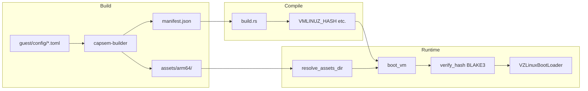

The asset pipeline moves kernel, initrd, and rootfs images from build through to boot. Assets are per-architecture (arm64 for Apple Silicon, x86_64 for Linux/KVM), integrity-checked with BLAKE3 hashes at every stage, and distributed via a version-scoped manifest.

## Build

Guest image configuration lives in `guest/config/` as TOML files. The `capsem-builder` CLI loads them, renders Jinja2 Dockerfile templates, and produces per-architecture assets:

```
guest/config/*.toml -> load_guest_config() -> capsem-builder build -> assets/{arch}/
```

Two build templates exist:

| Template | Output | What it does |
|----------|--------|-------------|
| `kernel` | `vmlinuz`, `initrd.img` | Builds a minimal Linux kernel from `defconfig` |
| `rootfs` | `rootfs.squashfs` | Builds the full guest filesystem with packages, runtimes, and tools |

The build process also cross-compiles guest agent binaries (`capsem-pty-agent`, `capsem-net-proxy`, `capsem-mcp-server`) for the target architecture and injects them into the rootfs.

### Output layout

```
assets/
  arm64/
    vmlinuz
    initrd.img
    rootfs.squashfs
  x86_64/
    vmlinuz
    initrd.img
    rootfs.squashfs
  manifest.json
  B3SUMS
```

### Commands

| Command | What it does |
|---------|-------------|
| `just build-assets` | Full build: kernel + rootfs + checksums |
| `just run` | Repack initrd with latest guest binaries, rebuild app, sign, boot |
| `capsem-builder build guest/ --arch arm64 --template rootfs` | Build one template for one arch |

## Manifest Format

The manifest (`assets/manifest.json`) records BLAKE3 hashes and file sizes for every asset, organized per-architecture:

```json
{
  "latest": "0.12.1",
  "releases": {
    "0.12.1": {
      "arm64": {
        "assets": [
          {"filename": "vmlinuz", "hash": "<64-char blake3 hex>", "size": 7797248},
          {"filename": "initrd.img", "hash": "<blake3>", "size": 2680689},
          {"filename": "rootfs.squashfs", "hash": "<blake3>", "size": 462032896}
        ]
      },
      "x86_64": {
        "assets": [...]
      }
    }
  }
}
```

Key points:
- **Filenames are bare** (e.g., `"vmlinuz"`, not `"arm64/vmlinuz"`) -- the arch nesting provides the context
- **Hashes are BLAKE3**, 64-character hexadecimal strings
- A legacy **flat format** (`releases[version].assets` without arch nesting) is also supported for backward compatibility

### Two manifest producers

| Producer | Used by | When |
|----------|---------|------|
| `docker.py:generate_checksums()` | `just build-assets` | After full image builds |
| `scripts/gen_manifest.py` | `just _pack-initrd` | After injecting updated guest binaries into initrd |

Both detect per-arch directory structure in `assets/` and produce the nested format automatically.

## Compile-Time Hash Embedding

`crates/capsem-app/build.rs` runs at compile time and extracts hashes from `manifest.json`:

1. Maps `CARGO_CFG_TARGET_ARCH` to manifest key (`aarch64` -> `arm64`, `x86_64` -> `x86_64`)
2. Looks up `releases[version][arch].assets` (per-arch), falls back to `releases[version].assets` (flat)
3. Sets environment variables: `VMLINUZ_HASH`, `INITRD_HASH`, `ROOTFS_HASH`

At runtime, `boot.rs` reads these via `option_env!()` and passes them to `VmConfig::builder()`. The hashes are baked into the binary -- they cannot be modified at runtime.

## Runtime Asset Resolution

### Step 1: Find assets directory

`resolve_assets_dir()` searches these locations in order, returning the first that contains `vmlinuz`:

1. `CAPSEM_ASSETS_DIR` environment variable (dev override)
2. macOS `.app` bundle `Contents/Resources/`
3. `./assets` (workspace root)
4. `../../assets` (from crate directory)

For each candidate, it checks **per-arch first** (`candidate/{arch}/vmlinuz`), then **flat** (`candidate/vmlinuz`).

### Step 2: Find rootfs

`resolve_rootfs()` checks in order:

1. **Bundled**: `{assets_dir}/rootfs.squashfs`
2. **Downloaded (versioned)**: `~/.capsem/assets/v{version}/rootfs.squashfs`
3. **Downloaded (legacy)**: `~/.capsem/assets/rootfs.squashfs`

### Step 3: Download if missing

If rootfs is not found locally, `create_asset_manager()` loads the manifest and initiates download:

1. Loads `manifest.json` from assets dir or its parent (handles per-arch layout)
2. Creates `AssetManager` with version-scoped download directory (`~/.capsem/assets/v{version}/`)
3. Downloads from GitHub Releases with HTTP resume support (Range headers)
4. Verifies BLAKE3 hash after download, deletes on mismatch
5. Atomically renames temp file to final path

### Step 4: Boot

`boot_vm()` builds `VmConfig` with asset paths and compile-time hashes:

```
VmConfig::builder()
    .kernel_path(assets/vmlinuz)         + expected_kernel_hash
    .initrd_path(assets/initrd.img)      + expected_initrd_hash
    .disk_path(rootfs)                   + expected_disk_hash
    .build()  // verifies all hashes
```

`build()` calls `verify_hash()` for each file -- reads in 64KB chunks, computes BLAKE3, compares with expected. A `HashMismatch` error prevents boot entirely.

## Hash Verification Summary

Assets are verified at multiple points:

| When | Where | What happens on mismatch |
|------|-------|-------------------------|
| After download | `asset_manager.rs` | Temp file deleted, download retried |
| Before boot | `vm/config.rs` | `ConfigError::HashMismatch`, boot prevented |

Both use BLAKE3 with 64-character hex format. The download check uses the manifest hash; the boot check uses the compile-time embedded hash.

## Per-Architecture Isolation

- `host_arch()` is determined at **compile time** via `#[cfg(target_arch)]`
- A Capsem binary supports exactly **one architecture** (no runtime switching)
- `build.rs` extracts hashes for the **target architecture only**
- The manifest has **separate hash entries per arch** -- no cross-arch confusion is possible


