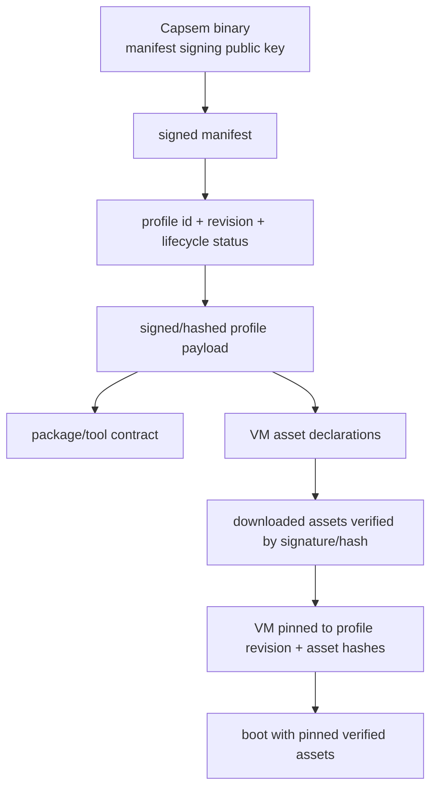

The Profile V2 bedrock release is the line between the rescue work and later
improvement sprints. It ships the engine/profile terms that future credential
brokers, rate limits, plugins, workbench views, and marketing pages must build
on without renaming or reshaping them.

## Shipped Contract

| Boundary | Contract |
|---|---|
| Profiles | Signed catalog, immutable profile revisions, `active` / `deprecated` / `revoked` status, package/tool contracts, VM asset declarations, profile-owned enforcement and detection packs, and explicit VM profile pins. |
| Network Engine | HTTP, DNS, MCP, and model transport parsing/transmission. It applies typed Security Engine decisions; it does not own policy semantics. |
| File Engine | File IPC, MCP file tools, filesystem observation, snapshots, restore/revert, quarantine, and observe-only file behavior emit normalized file/snapshot security events. |
| Process Engine | Exec, audit, parent/child process identity, command attribution, and process-to-file/network links emit normalized process security events. |
| Security Engine | Preprocessors, CEL enforcement, confirm-aware `ask`, detection before sinks, postprocessors, runtime registries, backtest/hunt, counters, decisions, declarative mutations, and final action projection. |
| Resolved Event Emitter | Canonical resolved-event journal first; logs, telemetry, detection export, timeline/domain projections, and status/debug read models consume it. |
| Runtime routes | `/enforcement/*` and `/detection/*` validate, compile, backtest, list, add/update/delete runtime overlays, expose stats, and run detection hunts. |
| CLI and UI | Operators can select profiles, create profile-backed VMs, inspect VM profile state, and operate runtime enforcement/detection without raw SQL or curl. |

Authored rule expressions use canonical typed roots from `capsem-proto`:
`http`, `dns`, `mcp`, `model`, `file`, `process`, `profile`, and `common`.
`event.*` is internal-only and rejected in user/corp-authored rules.

## Explicitly Deferred

The following work is intentionally outside the bedrock release unless its own
gate lands before release:

| Sprint | Deferred scope |
|---|---|
| S10 | Credential brokerage and release. |
| S13 | Remote enforcement/observer plugins. |
| S16a / S17 | Rich workbench views and deeper security UI polish. |
| S19a | Marketing site refresh. |
| S19b | Reporting setup and packaged dashboards. |
| S20 | OpenAPI-to-MCP product workflow. |
| S21 | Local LLM support. |
| S22 | Rate limits, budgets, and quotas. |
| S23 | Other post-bedrock product expansion. |

Docs, UI, and release notes must not claim those features as shipped behavior.
They may describe the reserved extension points only when the current contract
already carries the required event identity, attribution, counters, or route
names.

## Release Blockers

- A shipped event family bypasses the Security Engine or Resolved Event Emitter.
- A public rule surface accepts `event.*`.
- A VM launches without profile id, revision, package contract, and asset pins.
- CLI or UI requires raw HTTP/UDS/SQL to operate shipped profile or rule flows.
- `ask` is exposed as user-facing behavior without a real confirm resolver, or
  silently behaves as allow.
- Docs claim credential brokerage, quotas, remote plugins, OpenTelemetry polish,
  or marketing performance numbers that are not proven by landed artifacts.

## Chain Of Trust

Compact form: binary trust root -> signed manifest -> profile
id/revision/status -> verified profile payload -> package/tool contract +
asset declarations -> verified downloaded assets -> VM profile/revision/asset
pin -> boot.

