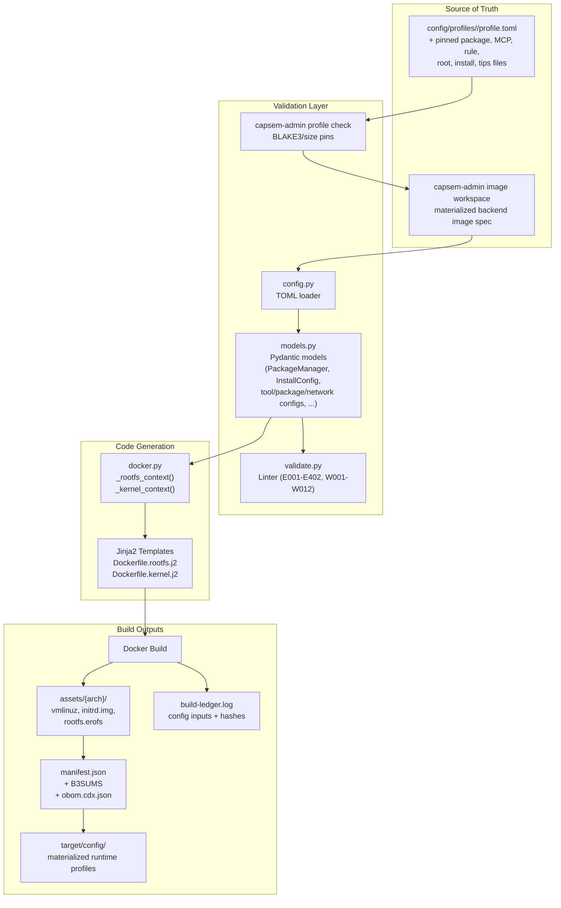
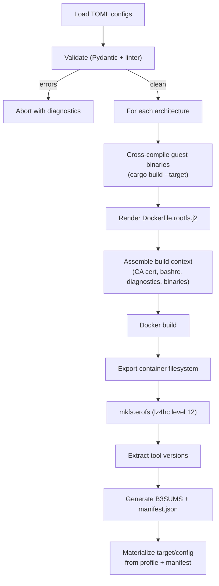
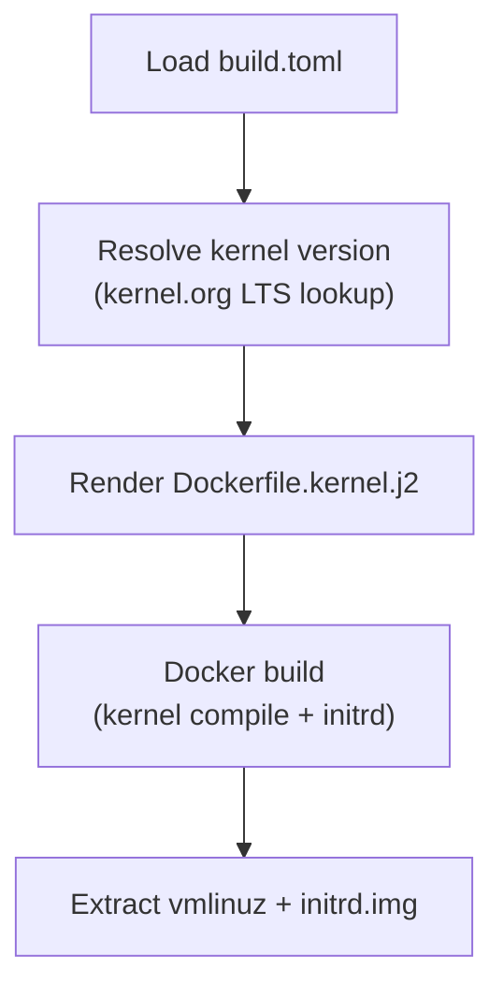
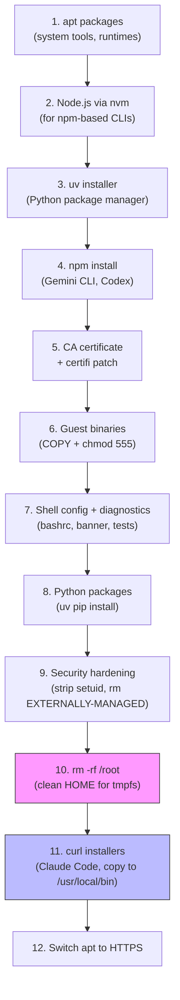
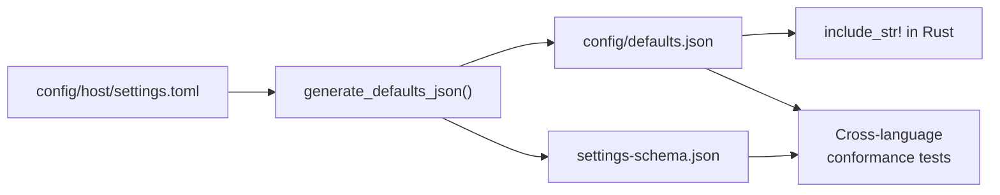

Capsem builds VM assets from the profile/admin rail. Checked-in
`config/profiles/<profile_id>/profile.toml` and its hash-pinned sibling files
are product truth. `capsem-admin image build` resolves that profile into a
generated backend workspace, then `capsem-builder` validates the backend image
spec, renders Jinja2 Dockerfiles, and produces per-architecture VM assets.

## Architecture



### Data flow

The data flows through four layers:

1. **Profile ledger** (`config/profiles/<id>/profile.toml`) -- runtime and build
   product truth: assets, package files, MCP config, security rules, plugins,
   root seed, install script, tips, and OBOM descriptors.
2. **Admin materialization** (`capsem-admin image workspace`) -- validates
   profile BLAKE3/size pins and writes a generated backend image workspace.
3. **Pydantic models** (`models.py`) -- validate the generated backend image
   spec with enums (`PackageManager`: apt, uv, pip, npm, curl), frozen models,
   and cross-field validators.
4. **Context dicts and Jinja2 templates** (`docker.py`, `config/docker/`) --
   produce per-architecture Dockerfiles and build contexts.

Four outputs are produced:

1. **Rendered Dockerfiles** -- Jinja2 templates (`Dockerfile.rootfs.j2`,
   `Dockerfile.kernel.j2`) parameterized per architecture.
2. **VM assets** -- `vmlinuz`, `initrd.img`, and `rootfs.erofs`.
3. **build-ledger.log** -- JSONL debug evidence for rendered inputs, context
   hashes, profile/package inputs, EROFS settings, git revision, and project
   version.
4. **target/config/** -- generated runtime config produced by
   `capsem-admin profile materialize` from checked-in `config/` plus
   `assets/manifest.json`.

## Backend Image Spec

| File | Model | Purpose | Key Fields |
|------|-------|---------|------------|
| `build.toml` | `BuildConfig` | Architectures, compression | `compression`, `compression_level`, `architectures.*` |
| `manifest.toml` | `ImageManifestConfig` | Image identity and changelog | `name`, `version`, `description`, `changelog` |
| `packages/apt.toml` | `PackageSetConfig` | Apt package set | `manager`, `install_cmd`, `packages`, `network` |
| `packages/python.toml` | `PackageSetConfig` | Python package set | `manager`, `install_cmd`, `packages` |
| `kernel/defconfig.*` | (raw) | Kernel configs per arch | Linux kernel defconfig files |

These files are backend image spec, usually generated under `target/` by the
admin rail. Do not add provider authorization, credentials, security policy, UI
settings, or MCP runtime truth to the backend image spec. Those belong to the
profile, corp config, rule files, and plugins.

Example `build.toml`:

```toml
[build]
compression = "zstd"
compression_level = 15

[build.erofs]
enabled = true
compression = "lz4hc"
compression_level = 12

[build.architectures.arm64]
base_image = "debian:bookworm-slim"
docker_platform = "linux/arm64"
rust_target = "aarch64-unknown-linux-musl"
kernel_branch = "7.0"
kernel_image = "arch/arm64/boot/Image"
defconfig = "kernel/defconfig.arm64"
node_major = 24
```

Profile package files such as `config/profiles/code/apt-packages.txt`,
`python-requirements.txt`, and `npm-packages.txt` are materialized into backend
package TOML before the build. Provider allow/block decisions live in
profile/corp enforcement rules. Credentials are captured and materialized by
the credential broker plugin at runtime and logged only as BLAKE3 references.

## Validation Pipeline

`capsem-builder validate` runs compiler-style diagnostics with error codes, severity levels, and file:line references. Errors block the build; warnings are informational.

### Error Codes

| Range | Category | Examples |
|-------|----------|----------|
| E001-E002 | TOML parsing | Missing `build.toml`, invalid TOML syntax |
| E003-E005 | Pydantic validation | Schema violations, empty package lists, invalid enum values |
| E006 | Domain validation | URLs in domain fields, ports, path components |
| E008 | Duplicate keys | Same key in multiple files within a directory |
| E009-E010 | File content | Non-absolute paths, invalid JSON in `.json` file settings |
| E100-E103 | Schema / JSON | Generated JSON fails schema validation |
| E200-E202 | Cross-language | Rust/Python conformance mismatches |
| E300-E305 | Artifacts | Missing defconfig, CA cert, capsem-init, diagnostics |
| E400-E402 | Docker | Dockerfile generation failures |

### Warning Codes

| Code | Description |
|------|-------------|
| W001 | Package sets configured but no registry config |
| W002 | Development packages (`-dev`, `-devel`) in package lists |
| W003 | Potential secrets detected in file content, headers, or env |
| W004 | Package set with no network config |
| W005 | Conflicting profile/corp enforcement rules |
| W006 | Placeholder file content (TODO, FIXME) |
| W007 | Overly broad security rule match expressions |
| W008 | Duplicate tool credential hints |
| W009 | Shell metacharacters in install_cmd |
| W010 | PATH missing essential directories (`/usr/bin`, `/bin`) |
| W011 | Wide-open network/security rule posture |
| W012 | Unknown Rust target (not a known musl target) |

Diagnostic output format:

```
error: [E006] config/security/network.toml: Invalid domain pattern 'https://api.anthropic.com'
warning: [W003] config/mcp/capsem.toml: Potential secret in mcp.capsem.headers.Authorization
```

## Multi-Architecture Support

Two architectures are supported. Each is self-contained in `build.toml` and produces an independent asset directory.

| Architecture | Hypervisor | Docker Platform | Rust Target | Kernel Image |
|-------------|------------|-----------------|-------------|--------------|
| arm64 | Apple VZ (macOS) / KVM (Linux) | `linux/arm64` | `aarch64-unknown-linux-musl` | `arch/arm64/boot/Image` |
| x86_64 | KVM | `linux/amd64` | `x86_64-unknown-linux-musl` | `arch/x86_64/boot/bzImage` |

Output layout:

```
assets/
  arm64/
    vmlinuz
    initrd.img
    rootfs.erofs
    tool-versions.txt
  x86_64/
    vmlinuz
    initrd.img
    rootfs.erofs
    tool-versions.txt
  manifest.json
  B3SUMS
target/
  config/
    assets/manifest.json
    profiles/code/profile.toml
```

## Build Pipeline



The kernel build follows a parallel path:



Key implementation details:

- **Container runtime auto-detection.** Docker CLI.
- **CI cache integration.** Docker buildx with GitHub Actions cache (`type=gha`) when `GITHUB_ACTIONS` is set.
- **Kernel version resolution.** Fetches the latest stable version for the configured LTS branch from `kernel.org/releases.json`, falls back to a hardcoded version on network failure.
- **Cross-compilation.** Guest agent binaries are cross-compiled with `cargo build --target {rust_target}` using `rust-lld` as the linker (configured in `.cargo/config.toml`).
- **Clock skew resilience.** All `apt-get update` calls use `-o Acquire::Check-Valid-Until=false` to handle container VM clock drift.

## Container Runtime Requirements

On macOS, Docker runs inside a Colima VM with limited resources. The rootfs
build runs apt, npm, and profile install steps, requiring substantial memory.

| Threshold | RAM | Notes |
|-----------|-----|-------|
| **Minimum** | 12 GB | Tauri install-test cold build SIGTERMs below this (exit 143 mid-cargo) |
| **Recommended** | 16 GB | Comfortable margin for build-assets + install-test together |
| **CI (GitHub Actions)** | 7 GB | Standard runner; install-test container uses pre-baked image so no cold build |

```bash
# Colima (macOS): configure VM resources
colima stop
colima start --vm-type vz --vz-rosetta --memory 16 --cpu 8

# Linux: Docker runs natively, no memory tuning needed
# sudo apt install docker.io
```

`just doctor` and `capsem-builder doctor` both check these resources automatically and fail if below minimum.

## Install Manager Types

Profile-owned package files and install scripts resolve into backend package
sets. The builder supports multiple install strategies:

| Manager | Template Handling | Use Case | Example |
|---------|------------------|----------|---------|
| `npm` | Batched into single `npm install -g --prefix` | Node.js CLI tools | Gemini CLI, Codex |
| `curl` | Profile install script or backend curl package set | Native binary installers | Claude Code |
| `apt` | Package set (not per-provider) | System packages | coreutils, git, curl |
| `uv` | Package set (not per-provider) | Python packages | numpy, pytest |
| `pip` | Package set (not per-provider) | Python packages (fallback) | -- |

### The `/root` tmpfs constraint

At runtime, `/root` is a tmpfs overlay -- anything baked into the rootfs under `/root/` during the Docker build is hidden. This matters for CLI installers that put binaries in `~/.local/bin/` or `~/.claude/bin/`:

```dockerfile
# The installer puts claude at ~/.local/bin/claude, which is /root/.local/bin/
# inside the container. Since /root is tmpfs at runtime, copy to /usr/local/bin.
RUN curl -fsSL https://claude.ai/install.sh | bash && \
    for bin in /root/.local/bin/*; do \
        [ -f "$bin" ] && install -m 555 "$bin" /usr/local/bin/; \
    done
```

The `install -m 555` enforces the guest binary security invariant: all binaries are read-only, non-writable by the guest.

### Adding a new install manager

To add a new manager type (e.g., `cargo`):

1. Add the enum value to `PackageManager` in `models.py`
2. Collect packages in `_rootfs_context()` in `docker.py` -- create a new list variable
3. Pass it to the template context dict
4. Add a Jinja2 block in `Dockerfile.rootfs.j2`
5. Update tests in `test_docker.py` and the admin workspace materialization tests

### Rootfs Dockerfile layer structure

The generated `Dockerfile.rootfs.j2` follows a specific ordering. Understanding this is important when adding new install steps -- the `/root` cleanup and binary permissions are load-bearing:



Step 10 and 11 ordering matters: curl installers run _after_ the `/root` cleanup so there's a clean HOME. Binaries are immediately copied to `/usr/local/bin/` since `/root` becomes tmpfs at boot.

## Manifest, Build Ledger, and OBOM

Every build produces `manifest.json` at the asset root. The manifest records
asset hashes and compatibility. The per-arch `build-ledger.log` records debug
evidence for the inputs that produced the assets. The CycloneDX OBOM records
installed base-image components.

| Section | Source | Contents |
|---------|--------|----------|
| Assets | `b3sum` output | Filename, BLAKE3 hash, size in bytes |
| Build ledger | build pipeline | Rendered Dockerfile/context hashes, profile/package inputs, EROFS settings |
| OBOM | cdxgen | Installed base-image package/component names and versions |

The `audit` subcommand parses vulnerability scanner output and fails on CRITICAL or HIGH findings.

## CLI Commands

| Command | Description | Key Options |
|---------|-------------|-------------|
| `build` | Render Dockerfiles or build images | `--arch`, `--dry-run`, `--json`, `--template`, `--output`, `--kernel-version` |
| `validate` | Lint and validate backend image spec | `--artifacts` (check built artifacts too) |
| `inspect` | Show config summary | `--json` |
| `audit` | Parse vulnerability scan results | `--scanner` (trivy/grype), `--input`, `--json` |
| `mcp` | Start MCP stdio server for builder tools | (none) |
| `doctor` | Check build prerequisites and active profile | `--profile`, `--config-root` |

Usage:

```bash
# Validate the active profile and profile-owned files
cargo run -p capsem-admin -- profile check config/profiles/code/profile.toml --config-root config

# Dry-run: render the profile-derived build plan without building
cargo run -p capsem-admin -- image build --profile config/profiles/code/profile.toml --config-root config --dry-run --json

# Build rootfs for arm64 through the admin rail
cargo run -p capsem-admin -- image build --profile config/profiles/code/profile.toml --config-root config --arch arm64 --template rootfs

# Build kernel for all architectures
uv run capsem-builder build --template kernel

# Check prerequisites and active profile
uv run capsem-builder doctor --profile code --config-root config
```

## Settings JSON Generation

Settings schema generation is separate from image building. Settings are UI/app
preferences; profiles own assets, MCP, rules, plugins, and image payloads.



`generate_defaults_json()` transforms host settings source into the
hierarchical JSON tree consumed by the Rust settings registry. This JSON defines
each setting's name, description, type, default value, and UI metadata.

The schema is generated from `SettingsRoot.model_json_schema()` (Pydantic) and written to `config/settings-schema.json`. Cross-language conformance tests verify that:

1. The generated `defaults.json` validates against the JSON schema.
2. Rust's compiled-in defaults match the Python-generated output.
3. Every setting referenced in Rust code exists in the schema.

This ensures the Python build tooling and Rust runtime never drift.
