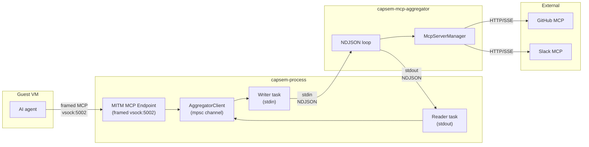
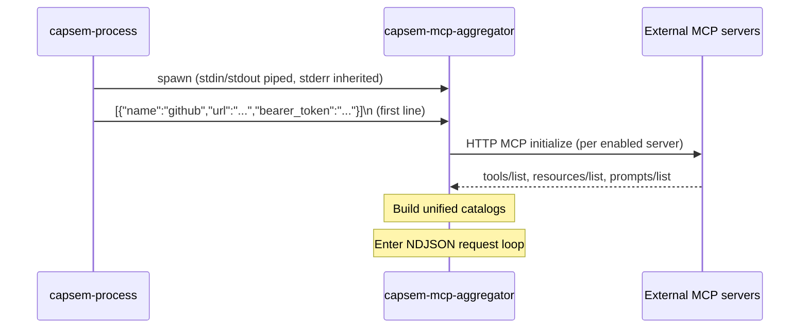

The MCP aggregator (`capsem-mcp-aggregator`) is a low-privilege subprocess that manages connections to external MCP servers. It runs in an isolated process with only network access -- no VM, no session database, no filesystem, no service IPC.

## Why a separate process

External MCP servers require network access, bearer tokens, and custom HTTP headers. The main per-VM process (`capsem-process`) has extensive privileges: VM control, session database, VirtioFS workspace, service IPC. Running external server connections inside capsem-process would expose all of those privileges to any vulnerability in an MCP server connection or the HTTP/SSE transport layer.

The aggregator subprocess enforces a hard privilege boundary:

| | capsem-process | capsem-mcp-aggregator |
|---|---|---|
| VM control (vsock) | Yes | No |
| Session database | Yes | No |
| VirtioFS workspace | Yes | No |
| Service IPC | Yes | No |
| Network (external MCP servers) | No | Yes |
| Bearer tokens / API keys | No | Yes |

If the aggregator is compromised, the attacker has network access and MCP server credentials -- but cannot reach the VM, read telemetry, or modify files.

## Architecture

The aggregator sits between the host MITM MCP endpoint (which handles guest VM requests) and external MCP servers (which provide tools like GitHub, Slack, etc.).



The policy boundary is the MITM MCP endpoint, not the aggregator. External
MCP tool calls are inspected, allowed, asked, blocked, or rewritten before the
aggregator receives them. Network traffic that an external MCP server performs
from the host is outside the guest MITM path and does not create guest
`net_events` rows.

Four layers handle the flow:

1. **AggregatorClient** (in capsem-process) -- typed async API wrapping an mpsc channel. Multiple endpoint sessions share one client via `Arc`.
2. **Driver tasks** (in capsem-process) -- writer task serializes requests to subprocess stdin; reader task deserializes responses from stdout and routes them to pending callers via oneshot channels.
3. **NDJSON loop** (in capsem-mcp-aggregator) -- reads requests from stdin, dispatches to `McpServerManager`, writes responses to stdout.
4. **McpServerManager** (in capsem-core) -- manages `rmcp` HTTP connections to external servers, builds unified tool/resource/prompt catalogs with namespacing.

## Subprocess lifecycle

### Spawn

capsem-process spawns the aggregator during VM startup, after resolving the
VM-effective Profile V2 `mcpServers` list from built-in, corp, and user profile
layers.



The binary is located next to `capsem-process` in `~/.capsem/bin/`. If not found (dev builds without a full install), capsem-process falls back to an in-process mock that returns empty results for catalog queries and errors for tool calls.

### Steady state

The subprocess runs for the lifetime of the VM. Requests arrive on stdin, responses go to stdout, logs go to stderr (inherited by the parent).

### Shutdown

Two paths:

1. **Normal**: capsem-process sends a `shutdown` request. The aggregator disconnects all servers and exits.
2. **Parent exit**: capsem-process closes stdin (process exit, crash, or signal). The aggregator detects EOF, calls `shutdown_all()`, and exits.

### Crash recovery

If the aggregator crashes, the reader and writer driver tasks in capsem-process exit (broken pipe / EOF). Subsequent requests from the endpoint receive a channel-closed error. The endpoint returns a JSON-RPC error to the guest -- the VM continues running, only external MCP tools become unavailable.

## NDJSON protocol

Communication uses newline-delimited JSON over stdin/stdout. Each message is a single JSON object terminated by `\n`. Maximum line length is 1 MB.

### Initialization

The first line on stdin is a JSON array of server definitions:

```json
[
  {
    "name": "github",
    "url": "https://api.githubcopilot.com/mcp/",
    "headers": {},
    "bearer_token": "ghp_xxxx",
    "enabled": true,
    "source": "claude",
    "unsupported_stdio": false
  }
]
```

Servers marked `unsupported_stdio: true` are stdio-only servers that cannot be connected over HTTP -- the aggregator skips them. Disabled servers are also skipped.

### Request format (process to aggregator)

```json
{"id": 1, "method": "list_servers"}
{"id": 2, "method": "list_tools"}
{"id": 3, "method": "list_resources"}
{"id": 4, "method": "list_prompts"}
{"id": 5, "method": "call_tool", "params": {"name": "github__search_repos", "arguments": {"query": "rust"}}}
{"id": 6, "method": "read_resource", "params": {"uri": "capsem://github/repo://owner/repo"}}
{"id": 7, "method": "get_prompt", "params": {"name": "github__review_pr", "arguments": {}}}
{"id": 8, "method": "refresh", "params": {"servers": [...]}}
{"id": 9, "method": "shutdown"}
```

### Response format (aggregator to process)

```json
{"id": 1, "servers": [{"name": "github", "connected": true, "tool_count": 5, ...}]}
{"id": 2, "tools": [{"namespaced_name": "github__search_repos", "server_name": "github", ...}]}
{"id": 5, "result": {"content": [{"type": "text", "text": "..."}]}}
{"id": 8, "ok": true}
{"id": 9, "ok": true}
```

Error responses:

```json
{"id": 5, "error": "server not found: github"}
```

### Correlation

Each request carries an `id` (monotonically increasing `AtomicU64`). The response echoes the same `id`. The driver's reader task uses a `HashMap<u64, oneshot::Sender>` to route responses back to the correct caller.

## Operations

| Method | Purpose | Response |
|--------|---------|----------|
| `list_servers` | Server definitions with connection status | `servers: [...]` |
| `list_tools` | All discovered tools across connected servers | `tools: [...]` |
| `list_resources` | All discovered resources | `resources: [...]` |
| `list_prompts` | All discovered prompts | `prompts: [...]` |
| `call_tool` | Call a namespaced tool on an external server | `result: {...}` |
| `read_resource` | Read a namespaced resource from an external server | `result: {...}` |
| `get_prompt` | Get a namespaced prompt from an external server | `result: {...}` |
| `refresh` | Disconnect all servers, replace definitions, reconnect | `ok: true` |
| `shutdown` | Disconnect all servers and exit | `ok: true` |

## Tool namespacing

External tools are namespaced with `__` (double underscore) to prevent collisions across servers:

```
github__search_repos     (server "github", tool "search_repos")
slack__send_message      (server "slack", tool "send_message")
```

Resources use URI-based namespacing:

```
capsem://github/repo://owner/repo
```

The aggregator splits on the first `__` when routing, so tool names containing `__` are supported (e.g., `github__my__tool` routes to server `github`, tool `my__tool`).

## Server definition sources

MCP server definitions are resolved from profile layers with the same
provenance and lock semantics as the rest of Profile V2. The effective list is
processed in trust order so locked corp entries cannot be shadowed by user or
auto-detected entries:

1. **Corp profile entries** from signed corp profile payloads. They can lock
   providers, tool lists, and rule ownership.
2. **User profile entries** when the profile marks the MCP section editable.
3. **Auto-detected entries** from host AI CLI configs
   (`~/.claude/settings.json`, `~/.gemini/settings.json`) when import into the
   selected profile is permitted.

Names containing `__` or matching `builtin` are rejected. Empty names are rejected.

## Hot reload

`POST /reload-config` allows live reconfiguration without restarting the VM:

1. Service receives `POST /reload-config`
2. Service sends `ReloadConfig` IPC to capsem-process
3. capsem-process reads the session-effective Profile V2 state and rebuilds MCP server definitions
4. capsem-process sends `refresh` with new definitions to the aggregator
5. Aggregator disconnects all servers, replaces definitions, reconnects

This supports adding, removing, or reconfiguring MCP servers while a VM is running.

## Service API integration

The service management API is Profile V2 connector based. `GET /mcp/connectors`
lists effective connectors, `POST /mcp/connectors` adds a direct connector to a
user profile, and `DELETE /mcp/connectors/{id}` removes a direct user connector.
Tool calls are not exposed through the service management API; guest MCP calls
flow through the framed MITM endpoint and aggregator runtime.

## Error handling

The aggregator is designed for graceful degradation:

| Scenario | Behavior |
|----------|----------|
| Some servers fail to connect at startup | Warning logged, continue with working servers |
| Tool call to disconnected server | Error response to caller, other tools unaffected |
| Malformed request line | Logged, skipped, loop continues |
| Subprocess crash | Endpoint returns JSON-RPC errors, VM keeps running |
| Serialization failure | Fallback JSON error response written to stdout |
| Stdin EOF | Graceful shutdown (all servers disconnected) |

## Key source files

| File | Purpose |
|------|---------|
| `capsem-mcp-aggregator/src/main.rs` | Subprocess binary: init, NDJSON loop, request dispatch |
| `capsem-core/src/mcp/aggregator.rs` | Protocol types (`AggregatorRequest/Response`) and `AggregatorClient` |
| `capsem-core/src/mcp/server_manager.rs` | `McpServerManager`: rmcp connections, tool catalog, namespacing |
| `capsem-core/src/mcp/mod.rs` | `build_server_list()`: auto-detect + manual + corp merge |
| `capsem-process/src/main.rs` | `spawn_mcp_aggregator()`: launch, driver tasks, mock fallback |
| `capsem-core/src/net/mitm_proxy/mcp_endpoint.rs` | MITM MCP endpoint: policy, telemetry, and dispatch through the aggregator |
| `capsem-proto/src/ipc.rs` | Service-process IPC messages for MCP operations |
