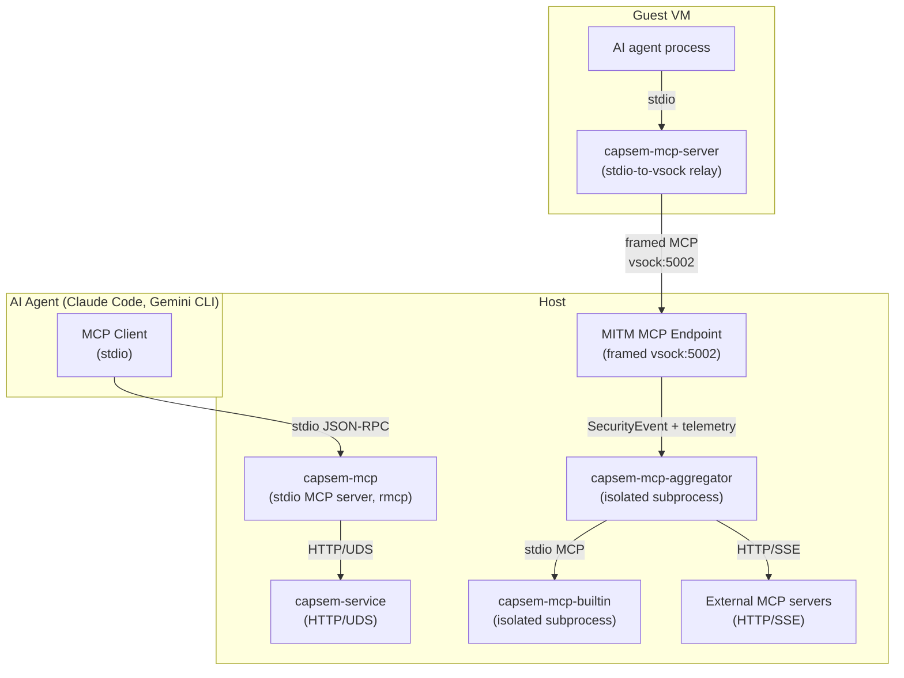
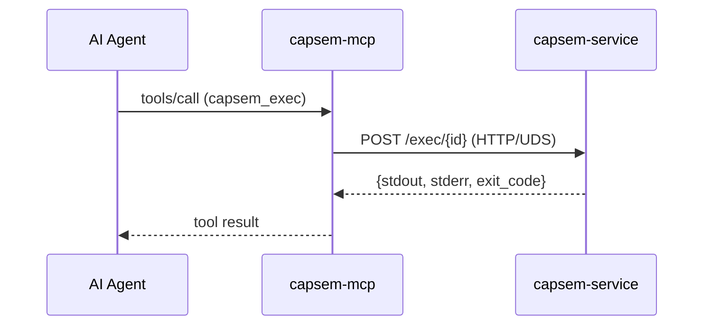
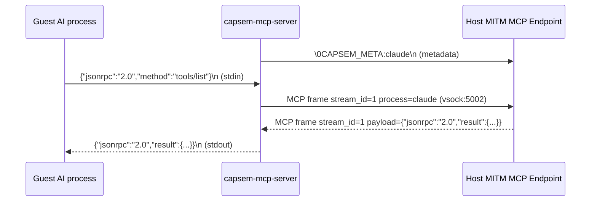
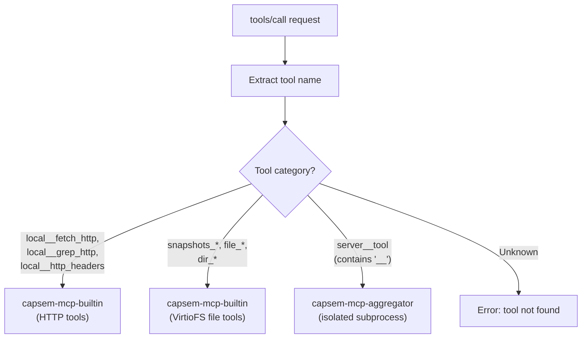

Capsem has two MCP entry points: a **host-side server** (`capsem-mcp`) that exposes sandbox management tools to AI agents via stdio, and a **guest-side relay** (`capsem-mcp-server`) that carries tool calls from inside the VM to the host MITM MCP endpoint over framed vsock.

## Two-server architecture



The host MCP server manages VMs. The guest relay provides MCP tools to code
running inside the VM while the host endpoint owns parsing, Security Engine
dispatch, telemetry, and routing.

## Host MCP server (capsem-mcp)

The host MCP server runs as a stdio process, typically spawned by an AI agent (Claude Code, Gemini CLI). It uses the `rmcp` crate for JSON-RPC handling.

### Request flow



### Tool registry

26 tools for full sandbox lifecycle management, telemetry, host diagnostics, and guest MCP routing:

| Tool | Description | Service endpoint |
|------|-------------|-----------------|
| `capsem_create` | Create a new VM (name, RAM, CPUs, env, image) | `POST /provision` |
| `capsem_list` | List all VMs with status and config | `GET /list` |
| `capsem_info` | VM details (ID, PID, status, persistent) | `GET /info/{id}` |
| `capsem_exec` | Run shell command inside VM (timeout param) | `POST /exec/{id}` |
| `capsem_run` | One-shot: provision + exec + destroy | `POST /run` |
| `capsem_read_file` | Read file from VM workspace | `GET /files/{id}/content?path=<relpath>` |
| `capsem_write_file` | Write file to VM workspace | `POST /files/{id}/content?path=<relpath>` |
| `capsem_stop` | Stop VM (persistent: preserve, ephemeral: destroy) | `POST /stop/{id}` |
| `capsem_suspend` | Suspend VM (save RAM/CPU state) | `POST /suspend/{id}` |
| `capsem_resume` | Resume stopped persistent VM | `POST /resume/{name}` |
| `capsem_persist` | Convert ephemeral VM to persistent | `POST /persist/{id}` |
| `capsem_delete` | Permanently destroy VM and all state | `DELETE /delete/{id}` |
| `capsem_purge` | Kill all temp VMs (all=true includes persistent) | `POST /purge` |
| `capsem_fork` | Fork VM into reusable image | `POST /fork/{id}` |
| `capsem_vm_logs` | Get security, process, and serial logs (grep + tail params) | `GET /logs/{id}` |
| `capsem_service_logs` | Get service logs (grep + tail params) | Service log file |
| `capsem_host_logs` | Get an allowlisted host log by symbolic name | `GET /host-logs/{name}` |
| `capsem_panics` | Extract structured panics and backtraces from host logs | `GET /panics` |
| `capsem_triage` | Summarize recent panics, IPC drops, server errors, and slow ops | `GET /triage` |
| `capsem_timeline` | Render a time-ordered session timeline by event layer and trace ID | `GET /timeline/{id}` |
| `capsem_inspect_schema` | Get CREATE TABLE statements for telemetry DB | Schema constant |
| `capsem_inspect` | Run SQL query against VM's session.db | `POST /inspect/{id}` |
| `capsem_version` | MCP server version and service connectivity | Local + service |
| `capsem_mcp_connectors` | List Profile V2 `mcpServers` entries | `GET /mcp/connectors` |
| `capsem_mcp_add` | Add a standard MCP server entry to a profile | `POST /mcp/connectors` |
| `capsem_mcp_delete` | Delete a direct user Profile V2 MCP server entry | `DELETE /mcp/connectors/{id}` |

### Service auto-launch

If the service is not running when the MCP server starts, it attempts to launch `capsem-service` from the same `bin/` directory. It polls the UDS socket for up to 5 seconds before giving up.

## Guest MCP relay (capsem-mcp-server)

The guest MCP relay is a minimal stdio-to-framed-vsock bridge. It does not
route or execute tools; the host MITM MCP endpoint owns parsing, Security
Engine dispatch, telemetry, and routing.

### Framed relay



### Wire protocol

| Step | Data | Direction |
|------|------|-----------|
| 1. Connect | vsock:5002 (`VSOCK_PORT_SNI_PROXY`) | Guest -> Host |
| 2. Metadata | `\0CAPSEM_META:<process_name>\n` | Guest -> Host |
| 3. Relay | Length-prefixed MCP frames containing JSON-RPC payloads | Bidirectional |
| 4. EOF | stdin closes -> half-close vsock write | Guest -> Host |

The `\0` prefix distinguishes connection metadata from framed content. Process names are sanitized: control characters and spaces replaced with underscores, truncated to 128 characters. The frame envelope also carries the authoritative per-request process name.

Two threads handle the relay:
- **Main thread**: stdin -> vsock (reads from AI agent, writes to host)
- **Reader thread**: vsock -> stdout (reads from host, writes back to AI agent)

## Tool routing (host endpoint)

The MITM MCP endpoint receives framed JSON-RPC over vsock:5002, builds a typed
MCP `SecurityEvent`, records `mcp_calls`, and routes allowed requests through
the aggregator:



### Tool routing categories

| Category | Criteria | Handler | Examples |
|----------|----------|---------|----------|
| Builtin HTTP | `local__fetch_http`, `local__grep_http`, `local__http_headers` | `capsem-mcp-builtin` | `local__fetch_http`, `local__grep_http`, `local__http_headers` |
| File tools | Name starts with `snapshots_`, `file_`, `dir_` | `capsem-mcp-builtin` (VirtioFS only) | `file_read`, `dir_list`, `snapshots_create` |
| External | Contains `__` separator (server namespace) | `AggregatorClient` routes to isolated subprocess | `github__list_repos`, `slack__send_message` |

External tool calls are routed through the [MCP Aggregator](/architecture/mcp-aggregator/) -- an isolated subprocess that manages all external MCP server connections with privilege separation.

### Security Engine enforcement

Every `tools/call` request is checked at the framed MITM boundary before the
aggregator sees it. Profile-owned enforcement rules use canonical MCP policy
roots such as `mcp.request.server_name`, `mcp.request.tool_name`,
`mcp.request.arguments`, `mcp.response.result_status`, and
`mcp.response.content`. Authored rules do not target internal `event.*` fields.

| decision | Boundary behavior |
|---|---|
| `allow` | Tool call proceeds. |
| `ask` | Fails closed until an approval UI exists. The request is not dispatched. |
| `block` | Returns an enforcement JSON-RPC error. The request is not dispatched. |
| `rewrite` | Applies only validated declarative mutations before returning to the guest. |

The Security Engine writes the resolved event, final decision, rule id, reason,
and allowed mutations before telemetry/audit/logging projections run. `warn` is
historical terminology and is not an enforcement decision.

## MCP call logging

Every `tools/call` request is logged to the session database `mcp_calls` table:

| Column | Source |
|--------|--------|
| `server_name` | `builtin`, `file`, or external server name |
| `method` | JSON-RPC method (`tools/call`, `tools/list`, etc.) |
| `tool_name` | Tool name from request params |
| `decision` | Terminal transport result: `allowed`, `denied`, or `error` |
| `duration_ms` | End-to-end call duration |
| `request_preview` | Truncated request body |
| `response_preview` | Truncated response body |
| `process_name` | Guest process from metadata line |
| `policy_action` | Final enforcement decision: `allow`, `ask`, `block`, or `rewrite` |
| `policy_rule` | Matching rule key, for example `security.rules.mcp.block_prod_token` |
| `policy_reason` | Optional human-readable audit reason |
| `trace_id` | Cross-table correlation ID |

See [Session Telemetry](/architecture/session-telemetry/) for the full `mcp_calls` schema.

## Endpoint runtime state

| Field | Type | Purpose |
|-------|------|---------|
| `aggregator` | `AggregatorClient` | Client handle for the isolated MCP aggregator subprocess |
| `db` | `Arc<DbWriter>` | Async telemetry writer |
The `AggregatorClient` is cloneable (`Arc`-wrapped mpsc channel) and shared
across endpoint sessions for a given VM. New frames are lifted into the
Security Engine so reloads affect already-open guest MCP connections through the
same resolved-event path used by HTTP, model, file, and process activity.

## Profile Configuration

MCP server definitions live in Profile V2 payloads under `mcpServers` using the
standard MCP server shape. The service resolves built-in, corp, and user
profile layers, then passes the VM-effective connector list to the aggregator.

```toml
[mcpServers.github]
command = "github-mcp-server"
args = ["stdio"]

[mcpServers.github.capsem]
enabled = true
editable = true
allowed_tools = ["search_repositories", "get_file_contents"]
```

External MCP servers may be auto-detected from AI CLI settings
(`~/.claude/settings.json`, `~/.gemini/settings.json`) and normalized into
profile entries when the relevant profile section is editable. Corp profiles
can lock the section so users may use approved tools without changing provider
or rule configuration. The resolved connector list is passed to the [MCP
Aggregator](/architecture/mcp-aggregator/) subprocess at spawn time and on
reload.

## Key source files

| File | Purpose |
|------|---------|
| `capsem-mcp/src/main.rs` | Host MCP server: 26 tools, rmcp handler, service bridge |
| `capsem-agent/src/mcp_server.rs` | Guest relay: stdin/stdout <-> framed MCP over vsock:5002 |
| `capsem-core/src/net/mitm_proxy/mcp_frame.rs` | Framed transport parser, stream lifecycle, and disconnect metrics |
| `capsem-core/src/net/mitm_proxy/mcp_endpoint.rs` | Host endpoint: JSON-RPC dispatch, policy, telemetry |
| `capsem-core/src/mcp/aggregator.rs` | Aggregator protocol types and `AggregatorClient` |
| `capsem-core/src/mcp/builtin_tools.rs` | Builtin HTTP tools (fetch_http, grep_http, http_headers) |
| `capsem-core/src/mcp/file_tools.rs` | File and snapshot tools (VirtioFS workspace) |
| `capsem-core/src/mcp/server_manager.rs` | External MCP server lifecycle and tool catalog |
| `crates/capsem-security-engine/` | MCP SecurityEvent projection and resolved-event evidence |
| `capsem-mcp-aggregator/src/main.rs` | Isolated subprocess: NDJSON loop, server connections |
| `capsem-process/src/main.rs` | `spawn_mcp_aggregator()`: launch and driver tasks |
| `config/profiles/` | Built-in Profile V2 MCP server definitions |

See [MCP Aggregator](/architecture/mcp-aggregator/) for the full subprocess architecture.
