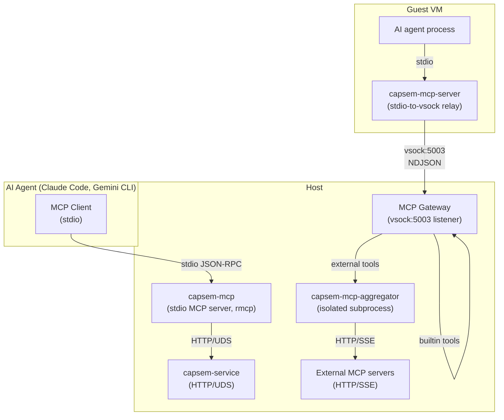
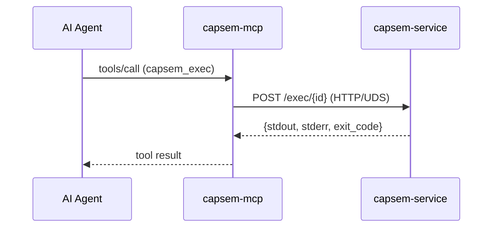
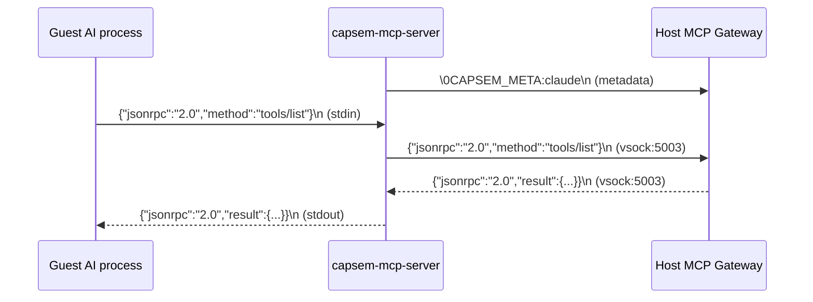
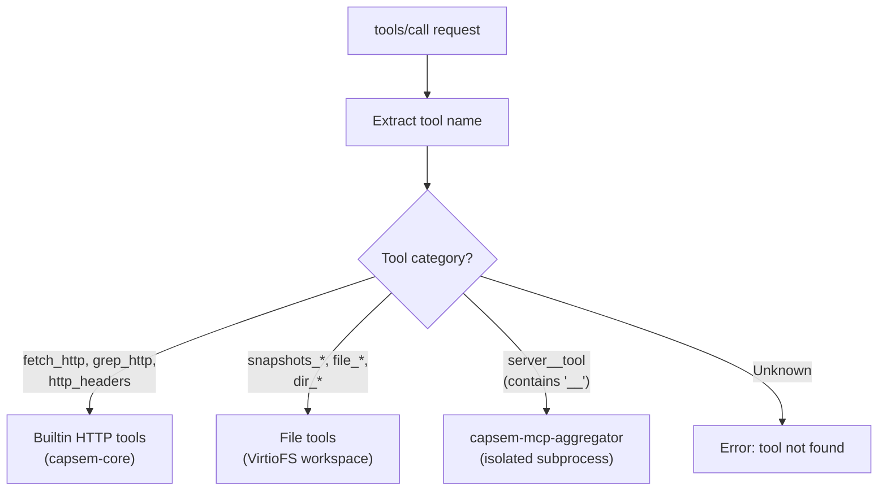

Capsem has two MCP servers: a **host-side server** (`capsem-mcp`) that exposes sandbox management tools to AI agents via stdio, and a **guest-side gateway** (`capsem-mcp-server`) that relays tool calls from inside the VM to external MCP servers on the host via vsock.

## Two-server architecture



The host MCP server manages VMs. The guest gateway provides tools to code running inside the VM.

## Host MCP server (capsem-mcp)

The host MCP server runs as a stdio process, typically spawned by an AI agent (Claude Code, Gemini CLI). It uses the `rmcp` crate for JSON-RPC handling.

### Request flow



### Tool registry

21 tools for full sandbox lifecycle management:

| Tool | Description | Service endpoint |
|------|-------------|-----------------|
| `capsem_create` | Create a new VM (name, RAM, CPUs, env, image) | `POST /provision` |
| `capsem_list` | List all VMs with status and config | `GET /list` |
| `capsem_info` | VM details (ID, PID, status, persistent) | `GET /info/{id}` |
| `capsem_exec` | Run shell command inside VM (timeout param) | `POST /exec/{id}` |
| `capsem_run` | One-shot: provision + exec + destroy | `POST /run` |
| `capsem_read_file` | Read file from guest filesystem | `GET /read_file/{id}` |
| `capsem_write_file` | Write file to guest filesystem | `POST /write_file/{id}` |
| `capsem_stop` | Stop VM (persistent: preserve, ephemeral: destroy) | `POST /stop/{id}` |
| `capsem_suspend` | Suspend VM (save RAM/CPU state) | `POST /suspend/{id}` |
| `capsem_resume` | Resume stopped persistent VM | `POST /resume/{name}` |
| `capsem_persist` | Convert ephemeral VM to persistent | `POST /persist/{id}` |
| `capsem_delete` | Permanently destroy VM and all state | `DELETE /delete/{id}` |
| `capsem_purge` | Kill all temp VMs (all=true includes persistent) | `POST /purge` |
| `capsem_fork` | Fork VM into reusable image | `POST /fork/{id}` |
| `capsem_vm_logs` | Get serial/process logs (grep + tail params) | `GET /logs/{id}` |
| `capsem_service_logs` | Get service logs (grep + tail params) | Service log file |
| `capsem_inspect_schema` | Get CREATE TABLE statements for telemetry DB | Schema constant |
| `capsem_inspect` | Run SQL query against VM's session.db | `POST /inspect/{id}` |
| `capsem_version` | MCP server version and service connectivity | Local + service |

### Service auto-launch

If the service is not running when the MCP server starts, it attempts to launch `capsem-service` from the same `bin/` directory. It polls the UDS socket for up to 5 seconds before giving up.

## Guest MCP server (capsem-mcp-server)

The guest MCP server is a minimal stdio-to-vsock relay. It does not parse, route, or execute tools -- that all happens on the host side.

### NDJSON relay



### Wire protocol

| Step | Data | Direction |
|------|------|-----------|
| 1. Connect | vsock:5003 (`VSOCK_PORT_MCP_GATEWAY`) | Guest -> Host |
| 2. Metadata | `\0CAPSEM_META:<process_name>\n` | Guest -> Host |
| 3. Relay | NDJSON lines (JSON-RPC) | Bidirectional |
| 4. EOF | stdin closes -> half-close vsock write | Guest -> Host |

The `\0` prefix distinguishes metadata lines from JSON-RPC content (valid JSON never starts with NUL). Process names are sanitized: control characters and spaces replaced with underscores, truncated to 128 characters.

Two threads handle the relay:
- **Main thread**: stdin -> vsock (reads from AI agent, writes to host)
- **Reader thread**: vsock -> stdout (reads from host, writes back to AI agent)

## Tool routing (host gateway)

The MCP gateway on the host receives NDJSON from vsock:5003 and routes each `tools/call` request to the appropriate handler:



### Tool routing categories

| Category | Criteria | Handler | Examples |
|----------|----------|---------|----------|
| Builtin HTTP | Matches `is_builtin_tool()` | `builtin_tools` module | `fetch_http`, `grep_http`, `http_headers` |
| File tools | Name starts with `snapshots_`, `file_`, `dir_` | `file_tools` module (VirtioFS only) | `file_read`, `dir_list`, `snapshots_create` |
| External | Contains `__` separator (server namespace) | `AggregatorClient` routes to isolated subprocess | `github__list_repos`, `slack__send_message` |

External tool calls are routed through the [MCP Aggregator](/architecture/mcp-aggregator/) -- an isolated subprocess that manages all external MCP server connections with privilege separation.

### Policy enforcement

Every tool call is checked against the MCP policy before execution:

| Decision | Meaning |
|----------|---------|
| `allowed` | Tool call proceeds |
| `denied` | Returns error response, logged |
| `warned` | Proceeds but flagged in telemetry |

## MCP call logging

Every `tools/call` request is logged to the session database `mcp_calls` table:

| Column | Source |
|--------|--------|
| `server_name` | `builtin`, `file`, or external server name |
| `method` | JSON-RPC method (`tools/call`, `tools/list`, etc.) |
| `tool_name` | Tool name from request params |
| `decision` | `allowed`, `denied`, `warned`, `error` |
| `duration_ms` | End-to-end call duration |
| `request_preview` | Truncated request body |
| `response_preview` | Truncated response body |
| `process_name` | Guest process from metadata line |

See [Session Telemetry](/architecture/session-telemetry/) for the full `mcp_calls` schema.

## Gateway configuration

| Field | Type | Purpose |
|-------|------|---------|
| `aggregator` | `AggregatorClient` | Client handle for the isolated MCP aggregator subprocess |
| `db` | `Arc<DbWriter>` | Async telemetry writer |
| `policy` | `RwLock<Arc<McpPolicy>>` | Hot-reloadable MCP policy |
| `domain_policy` | `RwLock<Arc<DomainPolicy>>` | Domain policy for builtin HTTP tools |
| `http_client` | `reqwest::Client` | HTTP client for builtin tools |
| `auto_snapshots` | `Option<Arc<Mutex<AutoSnapshotScheduler>>>` | Snapshot scheduler (VirtioFS only) |
| `workspace_dir` | `Option<PathBuf>` | Workspace path for file tools (VirtioFS only) |

The `AggregatorClient` is cloneable (`Arc`-wrapped mpsc channel) and shared across all gateway sessions for a given VM. The policy uses double-Arc for atomic swap: the outer `RwLock` protects an inner `Arc<McpPolicy>`. New sessions clone the inner `Arc` for a consistent snapshot.

## Configuration files

MCP server definitions live in TOML files under `guest/config/mcp/`:

```toml
# guest/config/mcp/capsem.toml
[capsem]
name = "Capsem"
description = "Built-in Capsem MCP server for file and snapshot tools"
transport = "stdio"
command = "/run/capsem-mcp-server"
builtin = true
enabled = true
```

External MCP servers are auto-detected from AI CLI settings (`~/.claude/settings.json`, `~/.gemini/settings.json`), defined manually in `~/.capsem/user.toml`, or injected via corp policy. Definitions are merged by `build_server_list()` and passed to the [MCP Aggregator](/architecture/mcp-aggregator/) subprocess at spawn time.

## Key source files

| File | Purpose |
|------|---------|
| `capsem-mcp/src/main.rs` | Host MCP server: 21 tools, rmcp handler, service bridge |
| `capsem-agent/src/mcp_server.rs` | Guest relay: stdin/stdout <-> vsock:5003 |
| `capsem-core/src/mcp/gateway.rs` | Host gateway: vsock listener, tool routing, NDJSON handling |
| `capsem-core/src/mcp/aggregator.rs` | Aggregator protocol types and `AggregatorClient` |
| `capsem-core/src/mcp/builtin_tools.rs` | Builtin HTTP tools (fetch_http, grep_http, http_headers) |
| `capsem-core/src/mcp/file_tools.rs` | File and snapshot tools (VirtioFS workspace) |
| `capsem-core/src/mcp/server_manager.rs` | External MCP server lifecycle and tool catalog |
| `capsem-core/src/mcp/policy.rs` | MCP policy evaluation (allow/deny/warn per tool) |
| `capsem-mcp-aggregator/src/main.rs` | Isolated subprocess: NDJSON loop, server connections |
| `capsem-process/src/main.rs` | `spawn_mcp_aggregator()`: launch and driver tasks |
| `guest/config/mcp/` | MCP server TOML definitions |

See [MCP Aggregator](/architecture/mcp-aggregator/) for the full subprocess architecture.
