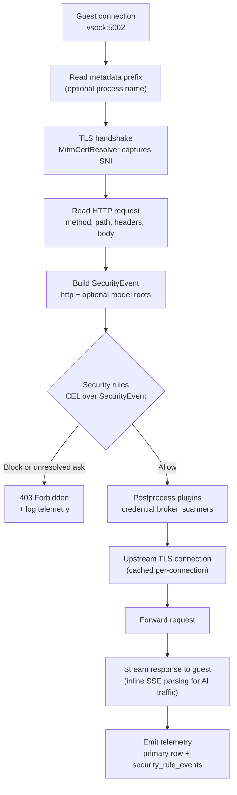
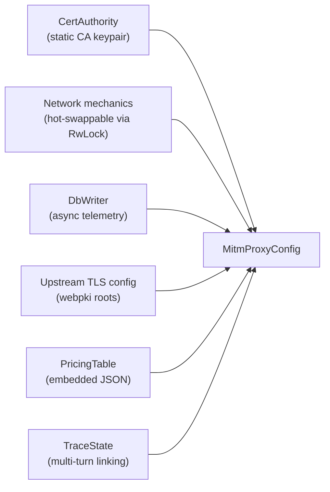
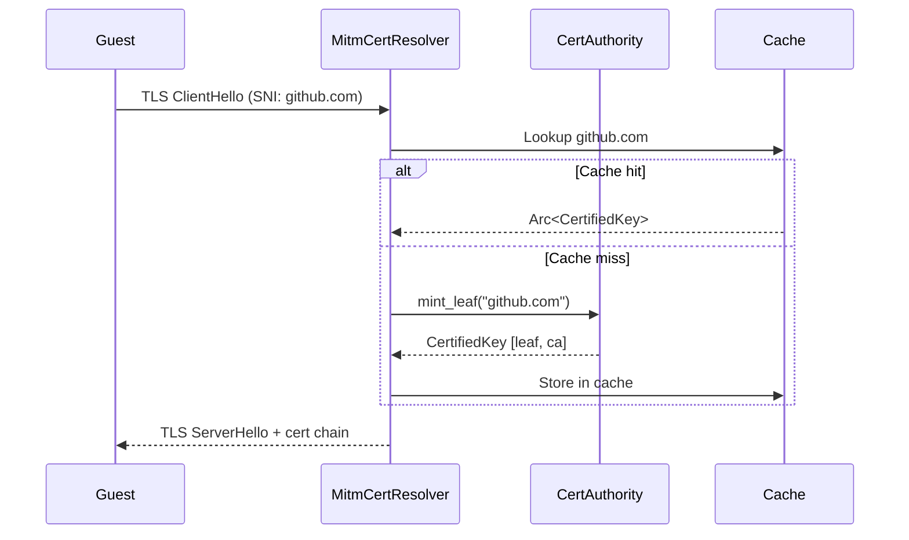
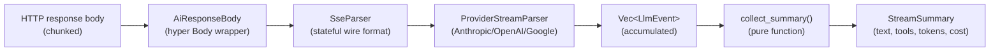
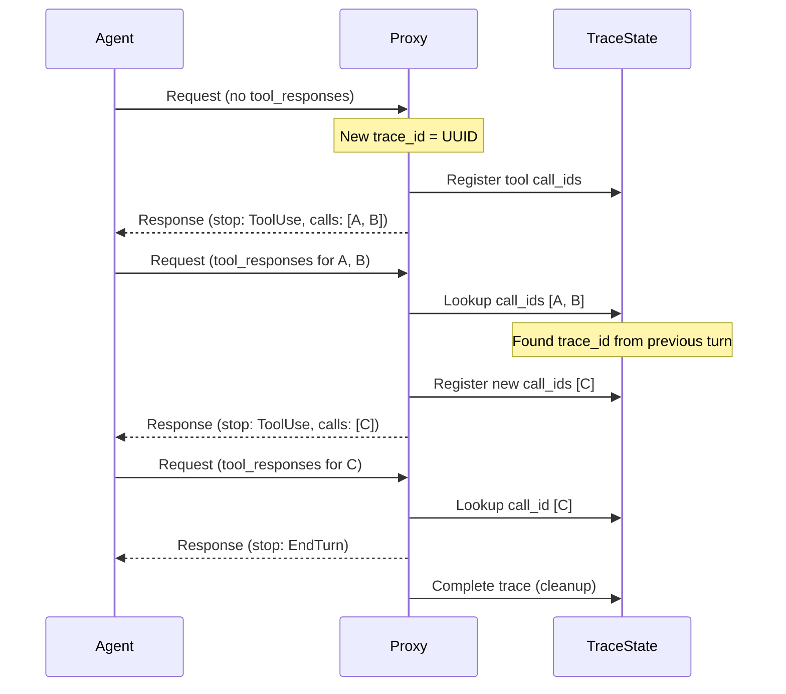

The MITM proxy is Capsem's HTTPS inspection layer. It terminates TLS from the
guest, normalizes protocol details into `SecurityEvent`, evaluates the shared
security rule rail, forwards allowed requests to the real upstream, and logs
telemetry plus matched rule rows to the session database.

## Connection pipeline

Each guest HTTPS connection flows through this pipeline:



The proxy uses hyper for HTTP parsing and tokio-rustls for TLS. Each vsock connection can carry multiple HTTP requests via keep-alive -- upstream connections are cached per-connection to avoid re-establishing TLS for each request.

## Configuration



| Field | Type | Purpose |
|-------|------|---------|
| `ca` | `Arc<CertAuthority>` | Static Capsem CA for leaf cert minting |
| `policy` | `Arc<RwLock<Arc<NetworkPolicy>>>` | Hot-swappable network mechanics such as body capture and upstream port handling |
| `db` | `Arc<DbWriter>` | Async telemetry writer to session.db |
| `upstream_tls` | `Arc<rustls::ClientConfig>` | Shared TLS config with webpki root CAs |
| `pricing` | `PricingTable` | Embedded model pricing for cost estimation |
| `trace_state` | `Mutex<TraceState>` | Links multi-turn tool-use conversations by trace_id |
| security rules | `Arc<RwLock<Arc<SecurityRuleSet>>>` | Hot-swappable CEL rules over `SecurityEvent` roots |

## Certificate authority

The proxy mints per-domain TLS certificates on-the-fly, signed by a static Capsem CA.

### Cert minting flow



### Certificate parameters

| Parameter | Value |
|-----------|-------|
| Algorithm | ECDSA P-256 |
| Validity | 24 hours |
| Back-dating | 1 hour (clock skew tolerance) |
| SAN | DNS name of the target domain |
| Extended key usage | ServerAuth |
| Chain | `[leaf, CA]` (2 certificates) |
| CA key source | `security/keys/capsem-ca.key` (committed, compile-time `include_str!`) |

### Cache behavior

The cache uses double-checked locking: read lock for hits, write lock only on miss with a second check after acquiring the write lock. Concurrent requests for the same domain never mint duplicate certs.

### Why the CA key is public

The MITM proxy CA private key is committed to the repository. This is intentional -- the CA is only trusted inside Capsem's own air-gapped VMs and has zero trust outside them. A public key provides transparency: anyone can verify there is no hidden interception. Per-installation key generation would reduce auditability.

## Network Mechanics And Security Rules

See [Network Isolation](/security/network-isolation/) for the full security rule
reference. Key properties:

| Property | Behavior |
|----------|----------|
| Network mechanics | Port routing, body capture, decompression, provider metadata, and cache behavior |
| Security authority | `SecurityRuleSet` over normalized `SecurityEvent` fields |
| Default behavior | Profile defaults compile into normal late-priority rules |
| Conflict resolution | Earlier/lower priority enforcement wins; `block` is absolute once effective |

Network mechanics are hot-swappable via `RwLock`. Each HTTP request snapshots
the `Arc<NetworkPolicy>` for mechanical settings, then evaluates the shared
`SecurityRuleSet` after protocol parsing and before upstream materialization.

## HTTP Security Rules

The MITM proxy creates a normalized `SecurityEvent` and evaluates the shared
rule rail. HTTP rules use first-party fields such as `http.host`,
`http.method`, `http.path`, `http.status`, and `http.body`. They can also match
other roots attached to the same event, such as `model.provider`, without
creating a second callback-specific rule.

Example:

```toml
[profiles.rules.block_openai_github]
name = "block_openai_github"
action = "block"
reason = "Block OpenAI organization GitHub writes"
match = 'http.host == "github.com" && http.method == "POST" && http.path.matches("^/openai(/|$)")'
```

Plugin behavior is expressed through `preprocess` or `postprocess` rules. For
example, credential brokering is a postprocess plugin rule over the same HTTP
event; plugin-private header handling must not become a public CEL field unless
it is intentionally added to the `SecurityEvent` contract.

## AI traffic handling

For AI provider domains, the proxy parses SSE response streams inline to extract structured telemetry.

### Provider detection

| Domain | Provider | API paths |
|--------|----------|-----------|
| `api.anthropic.com` | Anthropic | `/v1/messages` |
| `api.openai.com` | OpenAI | `/v1/responses`, `/v1/chat/completions` |
| `generativelanguage.googleapis.com` | Google | `/v1beta/*` |

### SSE parsing pipeline



Parsing runs inline during `poll_frame()` -- response bytes pass through unchanged to the guest with zero added latency.

### Normalized event types

| Event | Fields | Description |
|-------|--------|-------------|
| `MessageStart` | `message_id`, `model` | Stream began |
| `TextDelta` | `index`, `text` | Incremental text output |
| `ThinkingDelta` | `index`, `text` | Reasoning/chain-of-thought output |
| `ToolCallStart` | `index`, `call_id`, `name` | Model invoked a tool |
| `ToolCallArgumentDelta` | `index`, `delta` | Incremental tool call JSON arguments |
| `ToolCallEnd` | `index` | Tool call arguments complete |
| `ContentBlockEnd` | `index` | Content block finished |
| `Usage` | `input_tokens`, `output_tokens`, `details` | Token usage update (details: `cache_read`, `thinking`, etc.) |
| `MessageEnd` | `stop_reason` | Stream finished (`EndTurn`, `ToolUse`, `MaxTokens`, `ContentFilter`) |
| `Unknown` | `event_type`, `raw` | Unrecognized SSE event (logged, not parsed) |

### Tool call origin classification

| Origin | Criteria | Example |
|--------|----------|---------|
| `native` | Default for tool names without `__` | `write_file`, `bash` |
| `local` | Matches `is_builtin_tool()` | `fetch_http`, `grep_http`, `http_headers` |
| `mcp_proxy` | Name contains `__` (MCP namespace separator) | `github__list_repos` |

### Cost estimation

Model pricing is loaded from `config/genai-prices.json` (embedded at compile time via `include_str!`). Cost = `(input_tokens * input_price + output_tokens * output_price)`. Updated via `just update_prices`.

## Trace state correlation

The `TraceState` tracks multi-turn agent conversations across request/response cycles:



All `model_calls` rows in the same trace share a `trace_id`, enabling per-turn cost and token aggregation.

## Telemetry emission

Telemetry is emitted asynchronously after the response body completes (not during streaming):

| Event type | When | Data |
|-----------|------|------|
| `NetEvent` | Every HTTP request | Domain, method, path, status, bytes, latency, decision, body previews |
| `ModelCall` | AI provider requests only | Provider, model, tokens, cost, tool calls, text content, trace_id |

The `TelemetryBody` wrapper around the hyper response body triggers `tokio::spawn(emitter.emit())` when the body stream reaches EOF.

## Performance

| Optimization | Mechanism |
|-------------|-----------|
| Connection reuse | Upstream `reqwest` sender cached per-connection for keep-alive |
| TLS session reuse | Shared `rustls::ClientConfig` with webpki roots |
| Cert caching | Double-checked locking; each domain minted once |
| Inline parsing | SSE parsing runs in `poll_frame()`, zero-copy passthrough |
| Async telemetry | DB writes happen on a dedicated thread; never blocks the proxy |
| Policy snapshots | `Arc` clone per request avoids holding the `RwLock` during I/O |

## Key source files

| File | Purpose |
|------|---------|
| `capsem-core/src/net/mitm_proxy.rs` | Connection handling, HTTP forwarding, telemetry emission |
| `capsem-core/src/net/cert_authority.rs` | CA loading, leaf cert minting, cache |
| `capsem-core/src/net/domain_policy.rs` | Domain allow/block evaluation |
| `capsem-core/src/net/policy_config/` | Named policy rule parsing, validation, and condition evaluation |
| `capsem-core/src/net/mitm_proxy/` | HTTP/model policy enforcement hooks and proxy pipeline |
| `capsem-core/src/net/ai_traffic/` | SSE parsing, provider parsers, events, pricing |
| `capsem-core/src/net/ai_traffic/mod.rs` | TraceState for multi-turn linking |
| `security/keys/capsem-ca.key`, `security/keys/capsem-ca.crt` | Static ECDSA P-256 CA keypair |
