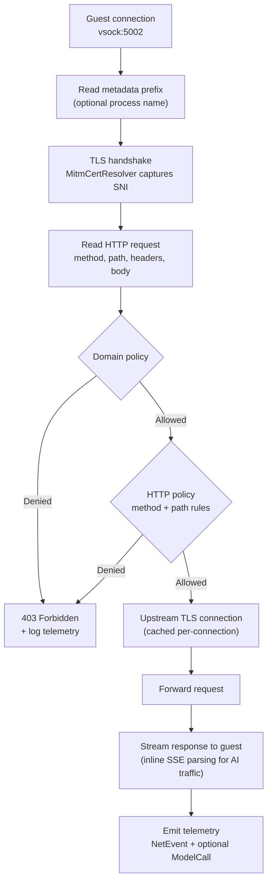
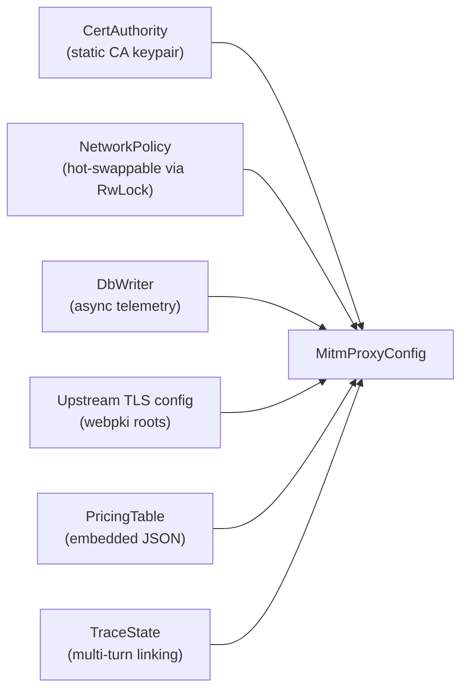
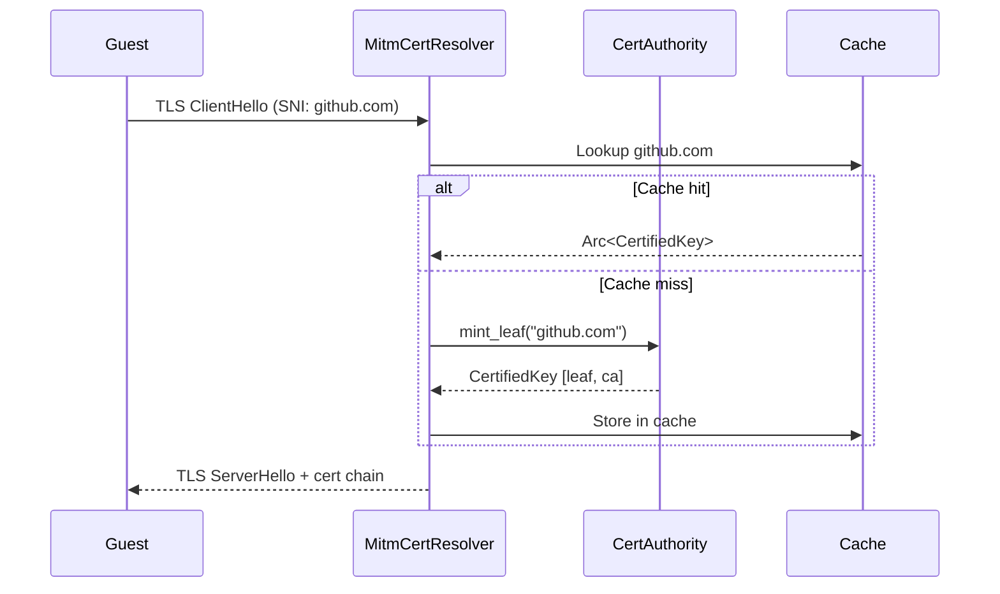
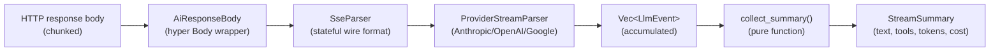
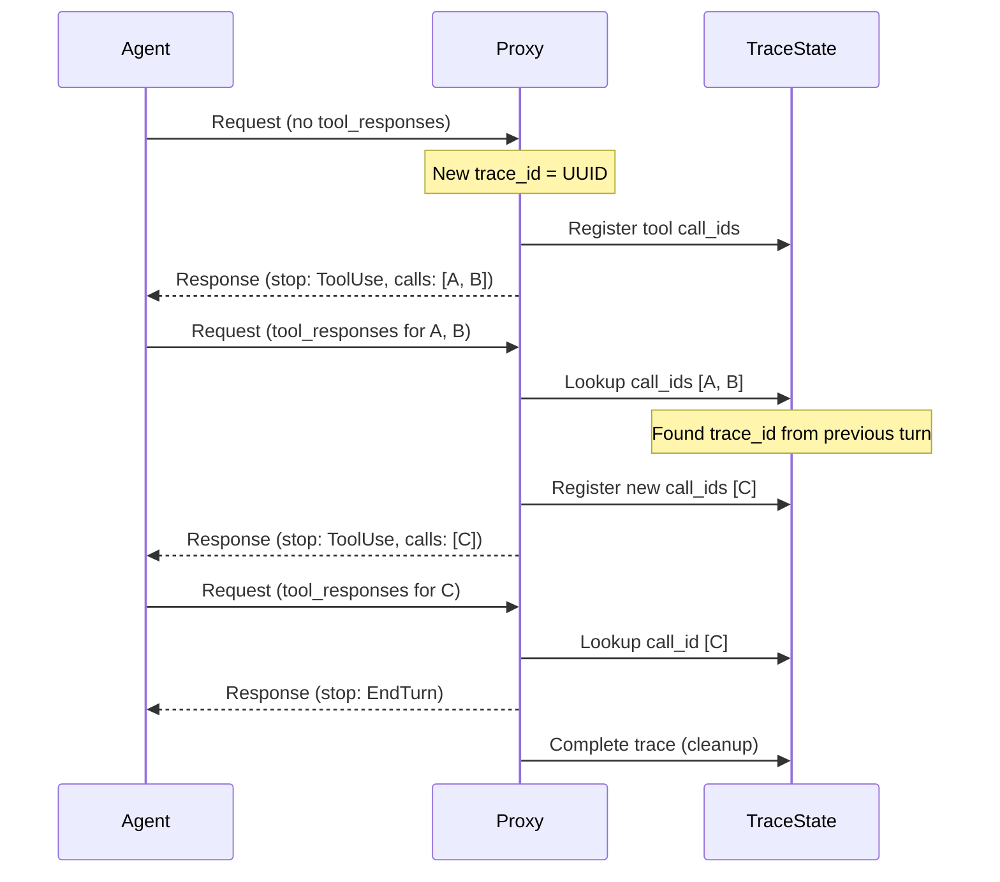

The MITM proxy is Capsem's network inspection layer. It terminates TLS from the guest, inspects every HTTP request against domain and method-level policy, forwards allowed requests to the real upstream, and logs full telemetry to the session database.

## Connection pipeline

Each guest HTTPS connection flows through this pipeline:

The proxy uses hyper for HTTP parsing and tokio-rustls for TLS. Each vsock connection can carry multiple HTTP requests via keep-alive -- upstream connections are cached per-connection to avoid re-establishing TLS for each request.

## Configuration

| Field | Type | Purpose |
|-------|------|---------|
| `ca` | `Arc<CertAuthority>` | Static Capsem CA for leaf cert minting |
| `policy` | `Arc<RwLock<Arc<NetworkPolicy>>>` | Hot-swappable domain + HTTP policy; settings changes take effect on next request |
| `db` | `Arc<DbWriter>` | Async telemetry writer to session.db |
| `upstream_tls` | `Arc<rustls::ClientConfig>` | Shared TLS config with webpki root CAs |
| `pricing` | `PricingTable` | Embedded model pricing for cost estimation |
| `trace_state` | `Mutex<TraceState>` | Links multi-turn tool-use conversations by trace_id |

## Certificate authority

The proxy mints per-domain TLS certificates on-the-fly, signed by a static Capsem CA.

### Cert minting flow

### Certificate parameters

| Parameter | Value |
|-----------|-------|
| Algorithm | ECDSA P-256 |
| Validity | 24 hours |
| Back-dating | 1 hour (clock skew tolerance) |
| SAN | DNS name of the target domain |
| Extended key usage | ServerAuth |
| Chain | `[leaf, CA]` (2 certificates) |
| CA key source | `config/capsem-ca.key` (committed, compile-time `include_str!`) |

### Cache behavior

The cache uses double-checked locking: read lock for hits, write lock only on miss with a second check after acquiring the write lock. Concurrent requests for the same domain never mint duplicate certs.

### Why the CA key is public

The MITM proxy CA private key is committed to the repository. This is intentional -- the CA is only trusted inside Capsem's own air-gapped VMs and has zero trust outside them. A public key provides transparency: anyone can verify there is no hidden interception. Per-installation key generation would reduce auditability.

## Domain policy engine

See [Network Isolation](/security/network-isolation/) for the full domain policy reference. Key properties:

| Property | Behavior |
|----------|----------|
| Evaluation order | Block list -> Allow list -> Default deny |
| Pattern types | Exact (`github.com`) and wildcard (`*.github.com`) |
| Case sensitivity | Case-insensitive |
| Conflict resolution | Block always beats allow |

The policy is hot-swappable via `RwLock`. Each HTTP request snapshots the `Arc<NetworkPolicy>`, so disabling a provider blocks the next request even on an existing keep-alive connection.

## HTTP policy engine

For domains that pass the domain check, optional HTTP rules provide method + path level control:

| Stage | Check | Action on match |
|-------|-------|-----------------|
| 1 | Domain policy | Deny -> return 403 immediately |
| 2 | HTTP rules for domain | First matching rule's action applies |
| 3 | No matching rule | Allow (backward compat for allowed domains) |

Rules match on method (`GET`, `POST`, `*`) and path (exact or prefix wildcard like `/api/v1/*`).

## AI traffic handling

For AI provider domains, the proxy parses SSE response streams inline to extract structured telemetry.

### Provider detection

| Domain | Provider | API paths |
|--------|----------|-----------|
| `api.anthropic.com` | Anthropic | `/v1/messages` |
| `api.openai.com` | OpenAI | `/v1/responses`, `/v1/chat/completions` |
| `generativelanguage.googleapis.com` | Google | `/v1beta/*` |

### SSE parsing pipeline

Parsing runs inline during `poll_frame()` -- response bytes pass through unchanged to the guest with zero added latency.

### Normalized event types

| Event | Fields | Description |
|-------|--------|-------------|
| `MessageStart` | `message_id`, `model` | Stream began |
| `TextDelta` | `index`, `text` | Incremental text output |
| `ThinkingDelta` | `index`, `text` | Reasoning/chain-of-thought output |
| `ToolCallStart` | `index`, `call_id`, `name` | Model invoked a tool |
| `ToolCallArgumentDelta` | `index`, `delta` | Incremental tool call JSON arguments |
| `ToolCallEnd` | `index` | Tool call arguments complete |
| `ContentBlockEnd` | `index` | Content block finished |
| `Usage` | `input_tokens`, `output_tokens`, `details` | Token usage update (details: `cache_read`, `thinking`, etc.) |
| `MessageEnd` | `stop_reason` | Stream finished (`EndTurn`, `ToolUse`, `MaxTokens`, `ContentFilter`) |
| `Unknown` | `event_type`, `raw` | Unrecognized SSE event (logged, not parsed) |

### Tool call origin classification

| Origin | Criteria | Example |
|--------|----------|---------|
| `native` | Default for tool names without `__` | `write_file`, `bash` |
| `local` | Matches `is_builtin_tool()` | `fetch_http`, `grep_http`, `http_headers` |
| `mcp_proxy` | Name contains `__` (MCP namespace separator) | `github__list_repos` |

### Cost estimation

Model pricing is loaded from `config/genai-prices.json` (embedded at compile time via `include_str!`). Cost = `(input_tokens * input_price + output_tokens * output_price)`. Updated via `just update_prices`.

## Trace state correlation

The `TraceState` tracks multi-turn agent conversations across request/response cycles:

All `model_calls` rows in the same trace share a `trace_id`, enabling per-turn cost and token aggregation.

## Telemetry emission

Telemetry is emitted asynchronously after the response body completes (not during streaming):

| Event type | When | Data |
|-----------|------|------|
| `NetEvent` | Every HTTP request | Domain, method, path, status, bytes, latency, decision, body previews |
| `ModelCall` | AI provider requests only | Provider, model, tokens, cost, tool calls, text content, trace_id |

The `TelemetryBody` wrapper around the hyper response body triggers `tokio::spawn(emitter.emit())` when the body stream reaches EOF.

## Performance

| Optimization | Mechanism |
|-------------|-----------|
| Connection reuse | Upstream `reqwest` sender cached per-connection for keep-alive |
| TLS session reuse | Shared `rustls::ClientConfig` with webpki roots |
| Cert caching | Double-checked locking; each domain minted once |
| Inline parsing | SSE parsing runs in `poll_frame()`, zero-copy passthrough |
| Async telemetry | DB writes happen on a dedicated thread; never blocks the proxy |
| Policy snapshots | `Arc` clone per request avoids holding the `RwLock` during I/O |

## Key source files

| File | Purpose |
|------|---------|
| `capsem-core/src/net/mitm_proxy.rs` | Connection handling, HTTP forwarding, telemetry emission |
| `capsem-core/src/net/cert_authority.rs` | CA loading, leaf cert minting, cache |
| `capsem-core/src/net/domain_policy.rs` | Domain allow/block evaluation |
| `capsem-core/src/net/http_policy.rs` | Method + path rule evaluation |
| `capsem-core/src/net/ai_traffic/` | SSE parsing, provider parsers, events, pricing |
| `capsem-core/src/net/ai_traffic/mod.rs` | TraceState for multi-turn linking |
| `config/capsem-ca.key`, `config/capsem-ca.crt` | Static ECDSA P-256 CA keypair |
