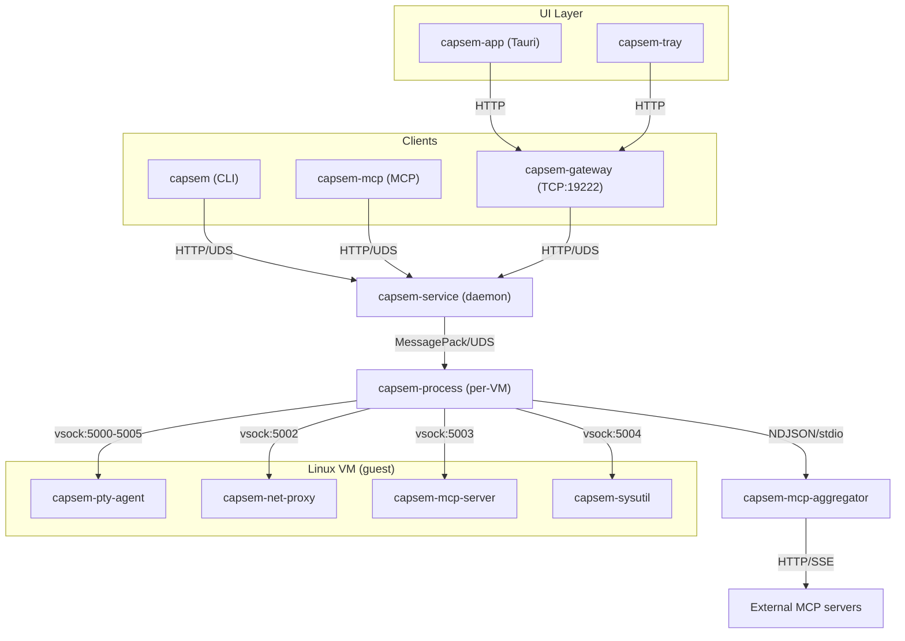

Capsem uses a service-oriented architecture with multiple cooperating binaries. Every VM operation flows through a single path: client -> service -> per-VM process -> guest.

## Host binaries

Seven binaries run on the host machine. They are installed to `~/.capsem/bin/` by `capsem setup`.

| Binary | Role | Communication |
|--------|------|---------------|
| **capsem** | CLI client | HTTP over UDS to service |
| **capsem-service** | Background daemon | Axum HTTP over UDS (`~/.capsem/run/service.sock`) |
| **capsem-process** | Per-VM process | Spawned by service, MessagePack over UDS |
| **capsem-mcp** | MCP server for AI agents | stdio (rmcp), HTTP over UDS to service |
| **capsem-mcp-aggregator** | External MCP server connections | NDJSON over stdin/stdout, spawned by capsem-process |
| **capsem-gateway** | HTTP/WebSocket gateway | TCP port 19222, proxies to service UDS |
| **capsem-tray** | System tray | Polls gateway for VM status |

Additionally, **capsem-app** is a thin Tauri webview shell (desktop GUI). It connects to the gateway at `http://127.0.0.1:19222` and has no direct VM logic -- all operations route through the gateway to the service.

## Guest binaries

Four binaries run inside each Linux VM, cross-compiled for `aarch64-unknown-linux-musl` and `x86_64-unknown-linux-musl`. All are deployed chmod 555 (read-only).

| Binary | Role | Vsock port |
|--------|------|------------|
| **capsem-pty-agent** | PTY bridge, control channel, exec, file I/O | 5000 (control), 5001 (terminal), 5005 (exec) |
| **capsem-net-proxy** | Redirects HTTPS to host MITM proxy | 5002 |
| **capsem-mcp-server** | In-guest MCP gateway, routes tool calls | 5003 |
| **capsem-sysutil** | Lifecycle multi-call (shutdown/halt/poweroff/reboot/suspend) | 5004 |

## Communication diagram

All clients route through capsem-service. There is no direct VM boot from any other binary.



## IPC protocol stack

Each layer uses a different protocol optimized for its role:

| Layer | Protocol | Socket |
|-------|----------|--------|
| Frontend/Tray -> gateway | HTTP/1.1 over TCP | `127.0.0.1:19222` (Bearer token auth) |
| Gateway -> service | HTTP/1.1 over UDS | `~/.capsem/run/service.sock` |
| CLI/MCP -> service | HTTP/1.1 over UDS | `~/.capsem/run/service.sock` |
| Service -> process | MessagePack over UDS | `~/.capsem/run/instances/{id}.sock` |
| Process -> guest | Binary frames over vsock | Ports 5000-5005 |

### Vsock port assignments

| Port | Purpose | Binary |
|------|---------|--------|
| 5000 | Control messages (resize, heartbeat, exec, file I/O) | capsem-pty-agent |
| 5001 | Terminal data (PTY I/O) | capsem-pty-agent |
| 5002 | MITM proxy (HTTPS connections) | capsem-net-proxy |
| 5003 | MCP gateway (tool routing, NDJSON) | capsem-mcp-server |
| 5004 | Lifecycle commands (shutdown/suspend) | capsem-sysutil |
| 5005 | Exec output (direct child stdout) | capsem-pty-agent |

## Service lifecycle

### Auto-launch cascade

When the service starts, it spawns two companion processes:

1. **capsem-gateway** -- TCP gateway on port 19222
2. **capsem-tray** -- system tray menu bar icon

All three are separate OS processes. If the service crashes, the LaunchAgent/systemd restarts it automatically.

### Service registration

| Platform | Mechanism | Unit |
|----------|-----------|------|
| macOS | LaunchAgent | `~/Library/LaunchAgents/com.capsem.service.plist` |
| Linux | systemd user unit | `~/.config/systemd/user/capsem.service` |

Both are configured for auto-restart (`KeepAlive`/`Restart=always`) and run-at-login.

### CLI auto-launch

The CLI (`capsem`) auto-launches the service if it's not running. On every service-dependent command:

1. Check socket connectivity
2. Try service manager (LaunchAgent/systemd)
3. Fall back to direct spawn
4. Poll socket for up to 5 seconds

## Per-VM process isolation

Each running VM gets its own `capsem-process` child. This provides security isolation:

- **Minimal environment**: service uses `env_clear()` before spawn -- API keys and tokens from the user's shell never reach the process
- **Socket permissions 0600**: only the owning user can connect to per-VM sockets
- **Session directory 0700**: contains workspace, system, serial.log, session.db
- **No guest-triggered exit**: control channel errors cause loop exit, not `process::exit()`
- **VirtioFS boundary**: only `session_dir/guest/` is shared -- host-only files (session.db, serial.log, snapshots, checkpoints) are outside the share
- **MCP aggregator isolation**: external MCP server connections run in a separate subprocess (`capsem-mcp-aggregator`) with only network access -- no VM, database, or filesystem access. See [MCP Aggregator](/architecture/mcp-aggregator/) for details.

## Service HTTP API

The service exposes a REST API over UDS. The gateway proxies this transparently.

| Method | Path | Purpose |
|--------|------|---------|
| POST | `/provision` | Create a new VM (`persistent: true` for named VMs) |
| GET | `/list` | List all VMs (running + stopped persistent) |
| GET | `/info/{id}` | VM details (config, status, persistent) |
| POST | `/exec/{id}` | Execute command, return stdout/stderr/exit_code |
| POST | `/run` | One-shot: provision + exec + destroy |
| POST | `/stop/{id}` | Stop VM (persistent: preserve; ephemeral: destroy) |
| POST | `/resume/{name}` | Resume a stopped persistent VM |
| POST | `/persist/{id}` | Convert ephemeral to persistent |
| POST | `/purge` | Kill all temp VMs (`all: true` includes persistent) |
| POST | `/write_file/{id}` | Write file to guest |
| POST | `/read_file/{id}` | Read file from guest |
| GET | `/logs/{id}` | Serial/boot logs |
| POST | `/inspect/{id}` | SQL query against session.db |
| DELETE | `/delete/{id}` | Destroy VM and wipe state |
| POST | `/suspend/{id}` | Suspend VM to disk (persistent only) |
| POST | `/fork/{id}` | Fork VM into reusable image |
| GET | `/stats` | Full telemetry dump (all sessions) |
| POST | `/reload-config` | Hot-reload settings from disk |

## Installation

`capsem setup` is the primary install path -- an interactive wizard that runs on first use.

### Setup wizard (6 steps)

1. **Corp config** -- optional enterprise config from URL or file
2. **Asset download** -- background download of VM assets (kernel, rootfs, initrd)
3. **Security preset** -- medium or high (corp can lock this)
4. **AI providers** -- auto-detect Anthropic, Google, OpenAI, GitHub credentials
5. **Repository access** -- detect Git, SSH, GitHub token
6. **Service install** -- register LaunchAgent/systemd + PATH check

Auto-runs non-interactively on first CLI use if `~/.capsem/setup-state.json` is missing. Re-run with `capsem setup --force`.

### Install layout

```
~/.capsem/
  bin/                 capsem, capsem-service, capsem-process, capsem-mcp, capsem-gateway, capsem-tray
  assets/              manifest.json, v{VERSION}/{vmlinuz, initrd.img, rootfs.squashfs}
  run/                 service.sock, service.pid, gateway.token, gateway.port, instances/
  setup-state.json     Wizard progress (resumable)
  update-check.json    Self-update cache (24h TTL)
  user.toml            User settings
  corp.toml            Enterprise config (optional)
```

### Self-update

`capsem update` checks GitHub for new asset versions, downloads in background, cleans up old versions. Binary swap is handled by the platform package manager (DMG/deb).

## Rust crate architecture

| Crate | Type | What |
|-------|------|------|
| `capsem-core` | lib | All shared business logic (VM, network, policy, telemetry, config) |
| `capsem-service` | bin | Daemon. Axum HTTP over UDS, spawns/manages capsem-process children |
| `capsem-process` | bin | Per-VM. Boots VM via capsem-core, bridges vsock, job store |
| `capsem` | bin | CLI. HTTP over UDS to service, direct UDS to process for shell |
| `capsem-mcp` | bin | MCP server (stdio). rmcp crate, bridges tool calls to service |
| `capsem-mcp-aggregator` | bin | Isolated subprocess. Manages external MCP server connections via NDJSON |
| `capsem-gateway` | bin | HTTP gateway. Axum on TCP:19222, Bearer auth, WebSocket terminal relay |
| `capsem-app` | bin | Thin Tauri webview. Points at gateway, bundles frontend/dist as fallback |
| `capsem-tray` | bin | System tray. Polls gateway, shows VM status |
| `capsem-agent` | bin(4) | Guest binaries (pty-agent, net-proxy, mcp-server, sysutil) |
| `capsem-logger` | lib | Session DB schema, queries, async writer |
| `capsem-proto` | lib | Shared protocol types (host-guest, service-process IPC) |
