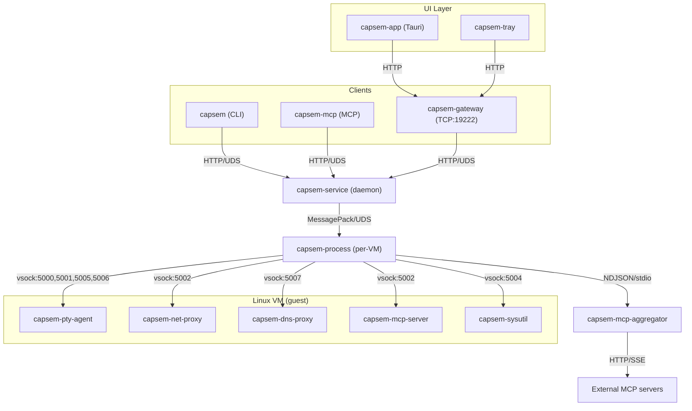

Capsem uses a service-oriented architecture with multiple cooperating binaries. Every VM operation flows through a single path: client -> service -> per-VM process -> guest.

## Host binaries

Seven binaries run on the host machine. They are installed to
`~/.capsem/bin/` by the platform package or source install flow.

| Binary | Role | Communication |
|--------|------|---------------|
| **capsem** | CLI client | HTTP over UDS to service |
| **capsem-service** | Background daemon | Axum HTTP over UDS (`~/.capsem/run/service.sock`) |
| **capsem-process** | Per-VM process | Spawned by service, MessagePack over UDS |
| **capsem-mcp** | MCP server for AI agents | stdio (rmcp), HTTP over UDS to service |
| **capsem-mcp-aggregator** | External MCP server connections | NDJSON over stdin/stdout, spawned by capsem-process |
| **capsem-gateway** | HTTP/WebSocket gateway | TCP port 19222, proxies to service UDS |
| **capsem-tray** | System tray | Polls gateway for VM status |

Additionally, **capsem-app** is a thin Tauri webview shell (desktop GUI). It connects to the gateway at `http://127.0.0.1:19222` and has no direct VM logic -- all operations route through the gateway to the service.

## Guest binaries

Five binaries run inside each Linux VM, cross-compiled for `aarch64-unknown-linux-musl` and `x86_64-unknown-linux-musl`. All are deployed chmod 555 (read-only).

| Binary | Role | Vsock port |
|--------|------|------------|
| **capsem-pty-agent** | PTY bridge, control channel, exec, file I/O, kernel audit stream | 5000 (control), 5001 (terminal), 5005 (exec), 5006 (audit) |
| **capsem-net-proxy** | Redirects HTTPS to host MITM proxy | 5002 |
| **capsem-dns-proxy** | Redirects DNS queries to the host DNS policy/resolver path | 5007 |
| **capsem-mcp-server** | Guest MCP stdio-to-framed-vsock relay | 5002 |
| **capsem-sysutil** | Lifecycle multi-call (shutdown/halt/poweroff/reboot/suspend) | 5004 |

## Communication diagram

All clients route through capsem-service. There is no direct VM boot from any other binary.



## IPC protocol stack

Each layer uses a different protocol optimized for its role:

| Layer | Protocol | Socket |
|-------|----------|--------|
| Frontend/Tray -> gateway | HTTP/1.1 over TCP | `127.0.0.1:19222` (Bearer token auth) |
| Gateway -> service | HTTP/1.1 over UDS | `~/.capsem/run/service.sock` |
| CLI/MCP -> service | HTTP/1.1 over UDS | `~/.capsem/run/service.sock` |
| Service -> process | MessagePack over UDS | `~/.capsem/run/instances/{id}.sock` |
| Process -> guest | Binary frames over vsock | Ports 5000, 5001, 5002, 5004, 5005, 5006, 5007 |

### Vsock port assignments

| Port | Purpose | Binary |
|------|---------|--------|
| 5000 | Control messages (resize, heartbeat, exec, file I/O) | capsem-pty-agent |
| 5001 | Terminal data (PTY I/O) | capsem-pty-agent |
| 5002 | MITM proxy and framed guest MCP endpoint | capsem-net-proxy, capsem-mcp-server |
| 5004 | Lifecycle commands (shutdown/suspend) | capsem-sysutil |
| 5005 | Exec output (direct child stdout) | capsem-pty-agent |
| 5006 | Kernel audit stream | capsem-pty-agent |
| 5007 | DNS proxy queries | capsem-dns-proxy |

## Service lifecycle

### Auto-launch cascade

When the service starts, it spawns two companion processes:

1. **capsem-gateway** -- TCP gateway on port 19222
2. **capsem-tray** -- system tray menu bar icon

All three are separate OS processes. If the service crashes, the LaunchAgent/systemd restarts it automatically.

### Service registration

| Platform | Mechanism | Unit |
|----------|-----------|------|
| macOS | LaunchAgent | `~/Library/LaunchAgents/com.capsem.service.plist` |
| Linux | systemd user unit | `~/.config/systemd/user/capsem.service` |

Both are configured for auto-restart (`KeepAlive`/`Restart=always`) and run-at-login.

### CLI auto-launch

The CLI (`capsem`) auto-launches the service if it's not running. On every service-dependent command:

1. Check socket connectivity
2. Try service manager (LaunchAgent/systemd)
3. Fall back to direct spawn
4. Poll socket for up to 5 seconds

## Per-VM process isolation

Each running VM gets its own `capsem-process` child. This provides security isolation:

- **Minimal environment**: service uses `env_clear()` before spawn -- API keys and tokens from the user's shell never reach the process
- **Socket permissions 0600**: only the owning user can connect to per-VM sockets
- **Session directory 0700**: contains workspace, system, serial.log, session.db
- **No guest-triggered exit**: control channel errors cause loop exit, not `process::exit()`
- **VirtioFS boundary**: only `session_dir/guest/` is shared -- host-only files (session.db, serial.log, snapshots, checkpoints) are outside the share
- **MCP aggregator isolation**: external MCP server connections run in a separate subprocess (`capsem-mcp-aggregator`) with only network access -- no VM, database, or filesystem access. See [MCP Aggregator](/architecture/mcp-aggregator/) for details.

## Service HTTP API

The service exposes a REST API over UDS. The gateway exposes the same contract
through an explicit allowlist. Unknown paths return 404 at the gateway and are
not forwarded to the service.

`status` means hot runtime counters suitable for polling. `info` means
configuration and identity. Profile-owned behavior lives under
`/profiles/{profile_id}/...`; only service-wide runtime aggregation lives at
the root.

### VM Runtime

| Method | Path | Purpose |
|--------|------|---------|
| POST | `/vms/create` | Create a VM from a profile, optionally with a name and resource overrides |
| GET | `/vms/list` | List VMs and their profile/status metadata |
| GET | `/vms/{id}/info` | VM identity, profile, config, plugin descriptors, and non-hot metadata |
| GET | `/vms/{id}/status` | Runtime state for one VM |
| POST | `/vms/{id}/exec` | Execute command, return stdout/stderr/exit_code |
| POST | `/run` | One-shot: provision + exec + destroy |
| POST | `/vms/{id}/stop` | Stop a VM |
| POST | `/vms/{id}/pause` | Suspend a VM to disk when supported |
| POST | `/vms/{id}/start` | Start a stopped VM |
| POST | `/vms/{id}/resume` | Resume a stopped or paused VM |
| POST | `/vms/{id}/save` | Save current VM state |
| GET | `/vms/{id}/save/status` | Save operation status |
| POST | `/vms/{id}/fork` | Fork VM into a reusable image/VM state |
| GET | `/vms/{id}/fork/status` | Fork operation status |
| DELETE | `/vms/{id}/delete` | Destroy VM and wipe state |
| POST | `/purge` | Stop/delete matching VMs according to the request |
| POST | `/vms/{id}/files/write` | Write file to guest |
| POST | `/vms/{id}/files/read` | Read file from guest |
| GET/POST | `/vms/{id}/files/content` | Download or upload file content |
| GET | `/vms/{id}/files/list` | List guest files through the file API |
| GET | `/vms/{id}/logs` | Serial/boot logs |
| GET | `/vms/{id}/timeline` | VM event timeline |
| GET | `/vms/{id}/history` | Session history summary |
| GET | `/vms/{id}/history/processes` | Process history |
| GET | `/vms/{id}/history/counts` | History counters |
| GET | `/vms/{id}/history/transcript` | Terminal transcript history |

### Ledger Runtime

| Method | Path | Purpose |
|--------|------|---------|
| GET | `/vms/{id}/security/latest` | Latest `security_rule_events` rows for one VM |
| GET | `/vms/{id}/security/status` | VM-scoped security ledger counters |
| GET | `/vms/{id}/detection/latest` | Latest detection-bearing security rows for one VM |
| GET | `/vms/{id}/detection/status` | VM-scoped detection counters |
| GET | `/vms/{id}/enforcement/latest` | Latest enforcement-bearing security rows for one VM |
| GET | `/vms/{id}/enforcement/status` | VM-scoped enforcement counters |
| GET | `/security/latest` | Service-wide latest security rows |
| GET | `/security/status` | Service-wide security counters |
| GET | `/detection/latest` | Service-wide latest detection rows |
| GET | `/detection/status` | Service-wide detection counters |
| GET | `/enforcement/latest` | Service-wide latest enforcement rows |
| GET | `/enforcement/status` | Service-wide enforcement counters |

### Profiles, Rules, Plugins, Assets, MCP

| Method | Path | Purpose |
|--------|------|---------|
| GET | `/profiles/list` | List configured profiles |
| GET | `/profiles/status` | Profile readiness, asset status, and validation state |
| POST | `/profiles/reload` | Reload the profile catalog |
| GET | `/profiles/{profile_id}/info` | Profile identity/config truth |
| POST | `/profiles/{profile_id}/validate` | Validate a profile |
| POST | `/profiles/{profile_id}/reload` | Reload one profile |
| GET | `/profiles/{profile_id}/obom` | Base-image CycloneDX OBOM metadata and local document when installed |
| POST | `/profiles/{profile_id}/enforcement/evaluate` | Evaluate a supplied security event against enforcement rules |
| GET | `/profiles/{profile_id}/enforcement/info` | Enforcement file/config info |
| GET | `/profiles/{profile_id}/enforcement/rules/list` | Compiled enforcement rules |
| PUT | `/profiles/{profile_id}/enforcement/rules/{rule_id}/edit` | Add or replace one enforcement rule |
| DELETE | `/profiles/{profile_id}/enforcement/rules/{rule_id}/delete` | Delete one enforcement rule |
| POST | `/profiles/{profile_id}/enforcement/reload` | Reload enforcement rules |
| POST | `/profiles/{profile_id}/detection/evaluate` | Evaluate a supplied security event against detection rules |
| GET | `/profiles/{profile_id}/detection/info` | Detection file/config info |
| GET | `/profiles/{profile_id}/detection/rules/list` | Compiled detection rules |
| PUT | `/profiles/{profile_id}/detection/rules/{rule_id}/edit` | Add or replace one detection rule |
| DELETE | `/profiles/{profile_id}/detection/rules/{rule_id}/delete` | Delete one detection rule |
| POST | `/profiles/{profile_id}/detection/reload` | Reload detection rules |
| GET | `/profiles/{profile_id}/plugins/list` | Profile plugin config plus registry descriptors |
| GET | `/profiles/{profile_id}/plugins/info` | Plugin subsystem info for the profile |
| GET | `/profiles/{profile_id}/plugins/{plugin_id}/info` | One plugin config and descriptor |
| PATCH | `/profiles/{profile_id}/plugins/{plugin_id}/edit` | Edit one plugin config |
| GET | `/profiles/{profile_id}/assets/status` | Profile asset readiness |
| GET | `/profiles/{profile_id}/assets/info` | Profile asset descriptors |
| POST | `/profiles/{profile_id}/assets/ensure` | Download/verify profile assets |
| GET | `/profiles/{profile_id}/mcp/info` | Profile MCP config info |
| GET | `/profiles/{profile_id}/mcp/servers/list` | Profile MCP servers |
| PUT | `/profiles/{profile_id}/mcp/servers/{server_id}/edit` | Add or replace one MCP server |
| DELETE | `/profiles/{profile_id}/mcp/servers/{server_id}/delete` | Delete one MCP server |
| GET | `/profiles/{profile_id}/mcp/servers/{server_id}/tools/list` | Tools for one MCP server |
| POST | `/profiles/{profile_id}/mcp/servers/{server_id}/refresh` | Refresh one MCP server |
| PATCH | `/profiles/{profile_id}/mcp/servers/{server_id}/tools/{tool_id}/edit` | Enable/disable or edit one MCP tool |
| POST | `/profiles/{profile_id}/mcp/servers/{server_id}/tools/{tool_id}/call` | Call one MCP tool |

### Service, Settings, Corp

| Method | Path | Purpose |
|--------|------|---------|
| GET | `/version` | Service version |
| GET | `/stats` | Full telemetry dump (all sessions) |
| GET | `/service-logs` | Service log tail |
| GET | `/triage` | Debug triage bundle |
| GET | `/panics` | Panic log summary |
| GET | `/host-logs/{name}` | Named host log |
| GET | `/settings/info` | UI/application settings |
| PATCH | `/settings/edit` | Edit settings-owned preferences |
| GET | `/corp/info` | Corporate constraint/reporting config |
| PUT | `/corp/edit` | Replace corporate config |
| POST | `/corp/validate` | Validate corporate config |
| POST | `/corp/reload` | Reload corporate config |

## Installation

Install registers the service and places host binaries under `~/.capsem/bin/`.
The service owns asset resolution and reports missing/downloading/ready state
to the UI and CLI. Provider credentials are configured in normal user/corp
settings or brokered from runtime security events; there is no setup wizard
authority path.

### Install layout

```
~/.capsem/
  bin/                 capsem, capsem-service, capsem-process, capsem-mcp, capsem-gateway, capsem-tray
  assets/              manifest.json, vmlinuz-{hash16}, initrd-{hash16}.img, rootfs-{hash16}.erofs
  run/                 service.sock, service.pid, gateway.token, gateway.port, instances/
  update-check.json    Self-update cache (24h TTL)
  settings.toml        UI/application preferences
  corp.toml            Enterprise constraints/reporting config (optional)
  profiles/            Profile-owned assets, rules, MCP, plugins, VM defaults
```

### Self-update

`capsem update` checks GitHub for new asset versions, downloads missing
kernel/initrd/rootfs bytes in the background, verifies BLAKE3 hashes, and
cleans up old hash-named files. Binary swap is handled by the platform package
manager (`.pkg` on macOS, `.deb` on Linux).

## Rust crate architecture

| Crate | Type | What |
|-------|------|------|
| `capsem-core` | lib | All shared business logic (VM, network, policy, telemetry, config) |
| `capsem-service` | bin | Daemon. Axum HTTP over UDS, spawns/manages capsem-process children |
| `capsem-process` | bin | Per-VM. Boots VM via capsem-core, bridges vsock, job store |
| `capsem` | bin | CLI. HTTP over UDS to service, direct UDS to process for shell |
| `capsem-mcp` | bin | MCP server (stdio). rmcp crate, bridges tool calls to service |
| `capsem-mcp-aggregator` | bin | Isolated subprocess. Manages external MCP server connections via NDJSON |
| `capsem-gateway` | bin | HTTP gateway. Axum on TCP:19222, Bearer auth, WebSocket terminal relay |
| `capsem-app` | bin | Thin Tauri webview. Points at gateway, bundles frontend/dist for the service-unavailable screen |
| `capsem-tray` | bin | System tray. Polls gateway, shows VM status |
| `capsem-agent` | bin(5) | Guest binaries (pty-agent, net-proxy, dns-proxy, mcp-server, sysutil) |
| `capsem-logger` | lib | Session DB schema, queries, async writer |
| `capsem-proto` | lib | Shared protocol types (host-guest, service-process IPC) |
