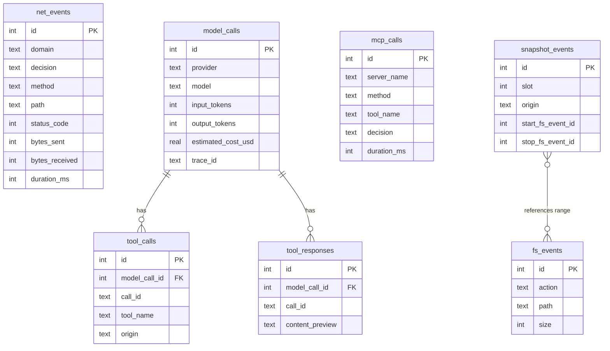
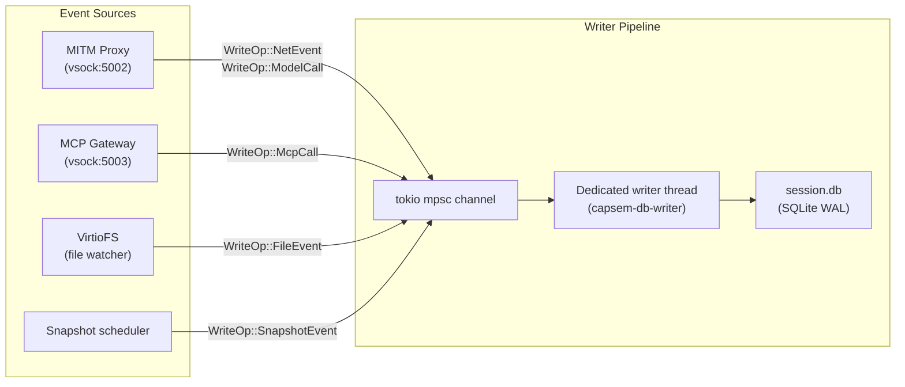
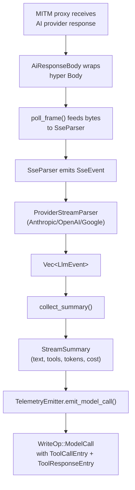

Every Capsem VM gets its own SQLite database (`session.db`) that records all network requests, AI model calls, MCP tool invocations, file changes, and snapshots. The database lives in the session directory and is destroyed with the VM (ephemeral) or preserved (persistent/forked).

## Schema overview

## Tables

### net_events

Every HTTP request through the MITM proxy, whether allowed or denied.

| Column | Type | Description |
|--------|------|-------------|
| `id` | INTEGER PK | Auto-increment |
| `timestamp` | TEXT | ISO 8601 |
| `domain` | TEXT | Target domain |
| `port` | INTEGER | Default 443 |
| `decision` | TEXT | `allowed`, `denied`, `error` |
| `process_name` | TEXT | Guest process that initiated the request |
| `pid` | INTEGER | Guest process ID |
| `method` | TEXT | HTTP method |
| `path` | TEXT | Request path |
| `query` | TEXT | Query string |
| `status_code` | INTEGER | Upstream response status |
| `bytes_sent` | INTEGER | Request body size |
| `bytes_received` | INTEGER | Response body size |
| `duration_ms` | INTEGER | End-to-end latency |
| `matched_rule` | TEXT | Which policy rule matched |
| `request_headers` | TEXT | Request headers (when body logging enabled) |
| `response_headers` | TEXT | Response headers |
| `request_body_preview` | TEXT | First 4 KB of request body |
| `response_body_preview` | TEXT | First 4 KB of response body |
| `conn_type` | TEXT | Default `https`, `https-mitm` for proxied |

### model_calls

AI provider API calls with parsed response metadata.

| Column | Type | Description |
|--------|------|-------------|
| `id` | INTEGER PK | Auto-increment |
| `timestamp` | TEXT | ISO 8601 |
| `provider` | TEXT | `anthropic`, `openai`, `google` |
| `model` | TEXT | e.g. `claude-opus-4` |
| `process_name` | TEXT | Guest process |
| `pid` | INTEGER | Guest process ID |
| `method` | TEXT | HTTP method (always `POST`) |
| `path` | TEXT | API path (e.g. `/v1/messages`) |
| `stream` | INTEGER | Boolean: 1 if SSE streaming |
| `system_prompt_preview` | TEXT | First N chars of system prompt |
| `messages_count` | INTEGER | Number of messages in request |
| `tools_count` | INTEGER | Number of tools in request |
| `request_bytes` | INTEGER | Request body size |
| `request_body_preview` | TEXT | First 4 KB of request body |
| `message_id` | TEXT | Provider message ID |
| `status_code` | INTEGER | HTTP status |
| `text_content` | TEXT | Concatenated text output |
| `thinking_content` | TEXT | Chain-of-thought output |
| `stop_reason` | TEXT | `end_turn`, `tool_use`, `max_tokens`, `content_filter` |
| `input_tokens` | INTEGER | Input token count |
| `output_tokens` | INTEGER | Output token count |
| `duration_ms` | INTEGER | Request duration |
| `response_bytes` | INTEGER | Response body size |
| `estimated_cost_usd` | REAL | Cost estimate from pricing table |
| `trace_id` | TEXT | Links multi-turn agent conversations |
| `usage_details` | TEXT | JSON: `{"cache_read": 800, "thinking": 200}` |

### tool_calls

Tool invocations extracted from model responses. One row per `tool_use` content block.

| Column | Type | Description |
|--------|------|-------------|
| `id` | INTEGER PK | Auto-increment |
| `model_call_id` | INTEGER FK | References `model_calls.id` |
| `call_index` | INTEGER | Position in the response |
| `call_id` | TEXT | Provider-assigned call ID |
| `tool_name` | TEXT | Tool name |
| `arguments` | TEXT | JSON arguments |
| `origin` | TEXT | `native`, `local`, `mcp_proxy` |
| `mcp_call_id` | INTEGER | FK to `mcp_calls` (reserved, not yet populated) |

### tool_responses

Tool results from subsequent requests (matched by `call_id`).

| Column | Type | Description |
|--------|------|-------------|
| `id` | INTEGER PK | Auto-increment |
| `model_call_id` | INTEGER FK | References `model_calls.id` |
| `call_id` | TEXT | Matches `tool_calls.call_id` |
| `content_preview` | TEXT | Truncated tool result |
| `is_error` | INTEGER | Boolean: 1 if tool returned error |

### mcp_calls

MCP JSON-RPC tool invocations through the guest MCP gateway (vsock:5003).

| Column | Type | Description |
|--------|------|-------------|
| `id` | INTEGER PK | Auto-increment |
| `timestamp` | TEXT | ISO 8601 |
| `server_name` | TEXT | MCP server name (e.g. `builtin`, `github`) |
| `method` | TEXT | JSON-RPC method (`tools/call`, `tools/list`, etc.) |
| `tool_name` | TEXT | Tool name (for `tools/call`) |
| `request_id` | TEXT | JSON-RPC request ID |
| `request_preview` | TEXT | Truncated request body |
| `response_preview` | TEXT | Truncated response body |
| `decision` | TEXT | `allowed`, `denied`, `error` |
| `duration_ms` | INTEGER | Call duration |
| `error_message` | TEXT | Error details if failed |
| `process_name` | TEXT | Guest process |
| `bytes_sent` | INTEGER | Request size |
| `bytes_received` | INTEGER | Response size |

### fs_events

File system changes in the workspace (tracked by VirtioFS).

| Column | Type | Description |
|--------|------|-------------|
| `id` | INTEGER PK | Auto-increment |
| `timestamp` | TEXT | ISO 8601 |
| `action` | TEXT | `created`, `modified`, `deleted`, `restored` |
| `path` | TEXT | File path relative to workspace |
| `size` | INTEGER | File size in bytes |

### snapshot_events

Automatic and manual workspace snapshots.

| Column | Type | Description |
|--------|------|-------------|
| `id` | INTEGER PK | Auto-increment |
| `timestamp` | TEXT | ISO 8601 |
| `slot` | INTEGER | Ring buffer slot (0-11 for auto) |
| `origin` | TEXT | `auto` or `manual` |
| `name` | TEXT | Optional snapshot name |
| `files_count` | INTEGER | Files in snapshot |
| `start_fs_event_id` | INTEGER | First fs_event in range |
| `stop_fs_event_id` | INTEGER | Last fs_event in range |

## Data flow

### Write operations

| Variant | Source | Table(s) |
|---------|--------|----------|
| `WriteOp::NetEvent` | MITM proxy | `net_events` |
| `WriteOp::ModelCall` | MITM proxy (AI traffic) | `model_calls` + `tool_calls` + `tool_responses` |
| `WriteOp::McpCall` | MCP gateway | `mcp_calls` |
| `WriteOp::FileEvent` | VirtioFS watcher | `fs_events` |
| `WriteOp::SnapshotEvent` | Snapshot scheduler | `snapshot_events` |

### Writer architecture

The `DbWriter` spawns a dedicated thread that owns the SQLite connection:

1. Async callers send `WriteOp` via `tx.send()` (non-blocking)
2. Writer thread blocks on `rx.blocking_recv()` for the first op
3. After receiving one op, drains the rest of the queue
4. Executes all drained ops in a single SQLite transaction
5. Repeats

This **block-then-drain** pattern batches writes for efficiency while keeping the async callers non-blocking. The channel has configurable backpressure capacity.

SQLite pragmas: WAL journal mode, NORMAL synchronous. Field values are defensively capped at 256 KB.

**Drop order is critical:** `Drop::drop()` takes `tx` before joining the thread. Without this, the join would deadlock (thread waits for all senders to drop, but `tx` drops after the join).

## AI traffic enrichment

For AI provider traffic, the response body is parsed inline to extract:
- Model name and message ID
- Text and thinking output
- Tool calls with arguments and origin classification
- Token usage (input, output, cache_read, thinking breakdowns)
- Cost estimate from embedded pricing table
- Stop reason (end_turn, tool_use, max_tokens)
- Trace ID for multi-turn correlation

## Aggregation queries

The `DbReader` provides pre-built aggregate queries:

| Query | Returns | Use case |
|-------|---------|----------|
| `session_stats()` | `SessionStats` | Dashboard summary: totals for net, model, tokens, cost |
| `provider_token_usage()` | `Vec<ProviderTokenUsage>` | Per-provider breakdown: call count, tokens, cost |
| `domain_counts()` | `Vec<DomainCount>` | Per-domain request counts with allowed/denied split |
| `time_buckets()` | `Vec<TimeBucket>` | Requests over time (for charts) |
| `tool_usage()` | `Vec<ToolUsageCount>` | Most-used tools by call count |
| `tool_usage_with_stats()` | `Vec<ToolUsageWithStats>` | Tool usage with byte and duration stats |
| `mcp_tool_usage()` | `Vec<McpToolUsage>` | MCP tool usage by server and tool name |
| `trace_summaries()` | `Vec<TraceSummary>` | Per-trace: tokens, cost, duration, tool count |
| `trace_detail(id)` | `TraceDetail` | All model calls in a trace with tool data |

## Access patterns

| Access point | Protocol | Query type |
|-------------|----------|------------|
| `capsem inspect <id> "SQL"` | CLI -> service HTTP `/inspect/{id}` | Raw SQL (read-only) |
| `capsem info <id> --stats` | CLI -> service HTTP `/info/{id}` | Pre-built `SessionStats` |
| MCP `capsem_inspect` | MCP -> service HTTP `/inspect/{id}` | Raw SQL (read-only) |
| MCP `capsem_inspect_schema` | MCP -> service HTTP | Table schemas for LLM context |
| Frontend dashboard | Gateway -> `/inspect/{id}` | sql.js in-browser (downloads session.db) |

The `/inspect` endpoint executes arbitrary SQL against the session database in read-only mode (`query_only` pragma). The reader connection uses separate pragmas from the writer.

## Per-VM isolation

| Property | Value |
|----------|-------|
| Location | `~/.capsem/sessions/{id}/session.db` |
| Lifetime | Created at VM boot, destroyed with ephemeral VM or preserved with persistent VM |
| Access | Only the owning capsem-process can write; service reads via IPC |
| VirtioFS boundary | `session.db` is outside the VirtioFS share; guest cannot access it |
| Concurrent access | WAL mode allows concurrent reader + writer |
| Fork behavior | `capsem fork` checkpoints and copies session.db into the image |

## Key source files

| File | Purpose |
|------|---------|
| `capsem-logger/src/schema.rs` | Table DDL, pragmas, migrations |
| `capsem-logger/src/events.rs` | Event structs (NetEvent, ModelCall, McpCall, etc.) |
| `capsem-logger/src/writer.rs` | DbWriter, WriteOp, block-then-drain loop |
| `capsem-logger/src/reader.rs` | DbReader, aggregation queries, raw SQL |
| `capsem-logger/src/db.rs` | SessionDb convenience wrapper |
