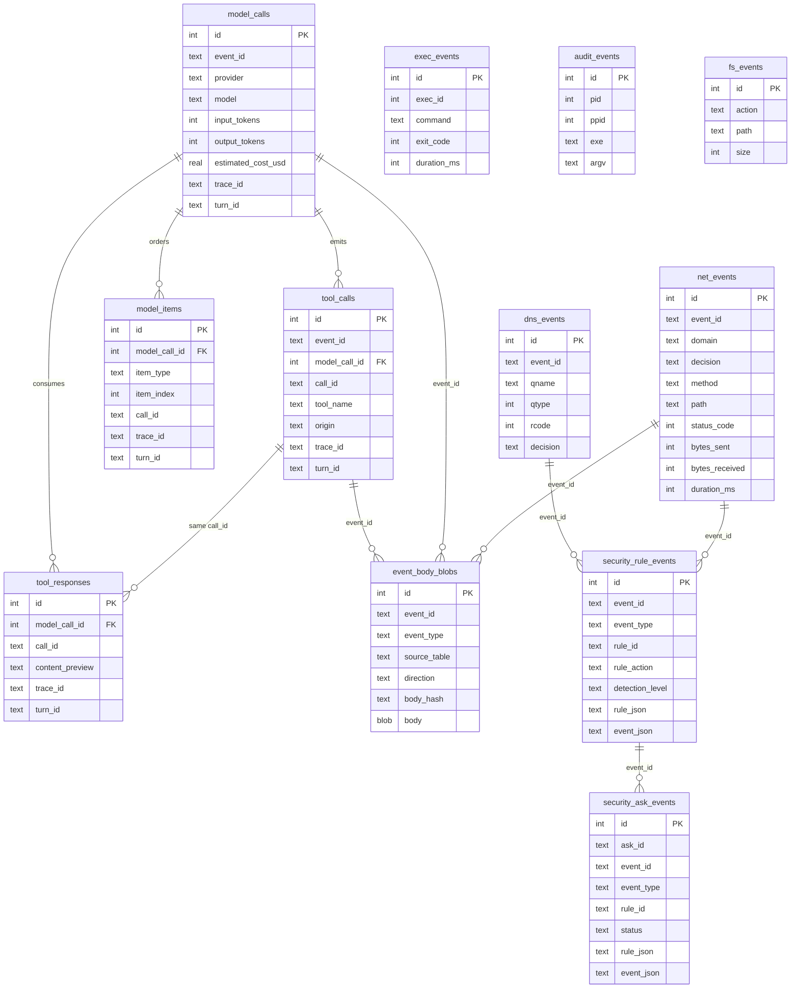
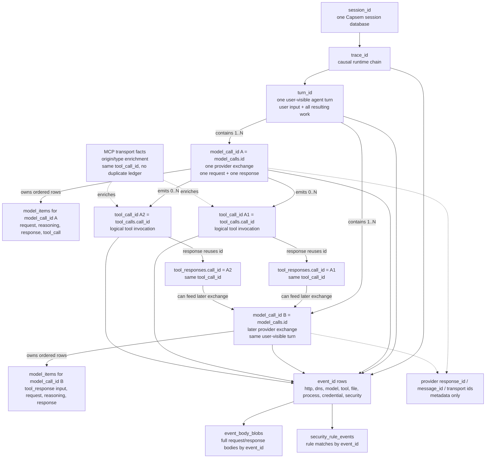
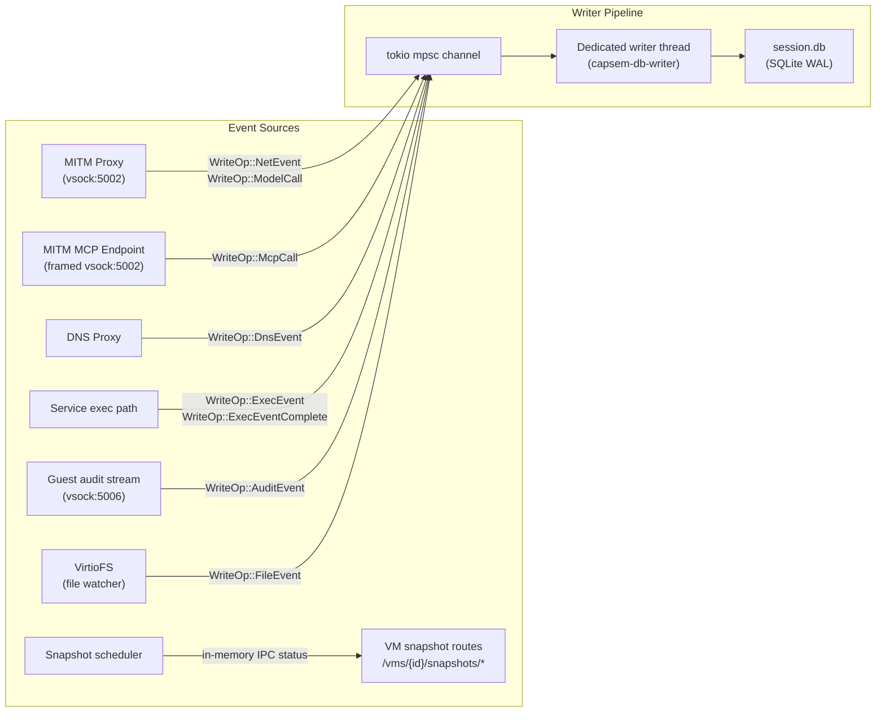
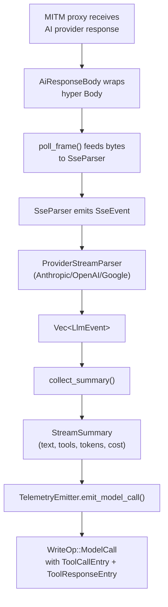

Every Capsem VM gets its own SQLite database (`session.db`) that records network requests, DNS queries, AI model calls, MCP tool invocations, exec activity, kernel audit events, file changes, security rule matches, credential substitutions, and snapshots. The database lives in the session directory and follows the VM lifecycle; retained/forked VMs keep their database for forensic review.

## Session Identity

The route/session `id` is an opaque VM id and is the only key that may select a
session directory, `session.db`, active instance, DB handle, terminal/log/stats
route, or UI tab. A user-facing VM name such as `co-work1` or `code-vm1` is a
display/resume alias only.

API payloads that describe persistent sessions must keep both fields:
`id` for routing and DB lookup, `name` for display. User surfaces may accept
commands like `capsem resume co-work1`, but that layer must translate the name
to the VM id before calling `/vms/{id}/...`. Service route code must not
collapse `name` into `id`; doing so can make a selected session read another
session's database and show the wrong provider/model data.

## Schema overview



## Identity Graph

The ledger uses a small set of scoped ids. Each id has one job, and no
provider id replaces these joins:

- `event_id` identifies one emitted ledger event row. Security rows, body blobs,
  and event detail routes join back through this id.
- `trace_id` groups runtime work caused by one causal operation across tables:
  HTTP, DNS, model, tool, file, process, credentials, and security.
- `turn_id` groups all work caused by one user-visible agent turn: the user's
  input, every provider exchange needed to answer it, every tool request and
  response, and every emitted HTTP/DNS/file/process/security row caused by it.
- `model_call_id` is the `model_calls.id` value for exactly one provider
  request/response exchange inside a turn. It owns that exchange's request,
  reasoning/thinking, response, model-emitted tool-call items, token counts, and
  provider metadata. It is not the whole user turn; a single `turn_id` can
  contain multiple `model_call_id` values.
- `tool_call_id` identifies one logical tool invocation across model-native
  tools, MCP transport, Capsem built-ins, and local tools. In SQLite it is stored
  as `tool_calls.call_id` and `tool_responses.call_id`.

Provider response ids, message ids, and transport request ids are provider or
transport metadata. They are not Capsem's join contract.



One `turn_id` is the user-input scope. It can contain multiple
`model_call_id` values when an agent calls the model, executes tools, then calls
the model again with tool results. One `model_call_id` is one provider-exchange
scope and carries that exchange's request, reasoning/thinking, response, token
counts, and ordered `model_items`. It can emit zero or more `tool_call_id`
values; this is the canonical one-to-many relationship for model-visible tools.
Stated as the debugging invariant: one `model_call_id` can emit N
`tool_call_id` values, and each emitted tool response must reuse that
`tool_call_id`.
A tool response must carry the same `tool_call_id` as the tool request. In the
current SQLite schema, the persisted `tool_call_id` value is stored in
`tool_calls.call_id` and `tool_responses.call_id`.

MCP is not a second user-facing tool ledger. MCP-origin `tools/call` activity
must resolve to a `tool_calls` row with `origin = 'mcp'` or enrich an existing
logical `tool_call_id`. An MCP call observed without a corresponding logical
tool call is an integrity/security finding, not a separate product counter.

The key cardinalities are:

- One session has many `trace_id` values.
- One `trace_id` has one or more `turn_id` values.
- One `turn_id` has one or more `model_call_id` values.
- One `model_call_id` has one provider request and one provider response.
- One `model_call_id` has many `model_items` rows: request, reasoning,
  response, tool_call, and tool_response items in observed order.
- One `model_call_id` can emit many `tool_call_id` values.
- One `tool_call_id` has one tool request and zero or more observed response
  rows, all with the same `tool_call_id`.
- One `event_id` identifies one emitted row and joins its security, body, and
  display details.

## Tables

### net_events

Every HTTP request through the MITM proxy, whether allowed or denied.

| Column | Type | Description |
|--------|------|-------------|
| `id` | INTEGER PK | Auto-increment |
| `event_id` | TEXT | 12-hex primary event id for `security_rule_events` joins |
| `timestamp` | TEXT | ISO 8601 |
| `domain` | TEXT | Target domain |
| `port` | INTEGER | Default 443 |
| `decision` | TEXT | `allowed`, `denied`, `error` |
| `process_name` | TEXT | Guest process that initiated the request |
| `pid` | INTEGER | Guest process ID |
| `method` | TEXT | HTTP method |
| `path` | TEXT | Request path |
| `query` | TEXT | Query string |
| `status_code` | INTEGER | Upstream response status |
| `bytes_sent` | INTEGER | Request body size |
| `bytes_received` | INTEGER | Response body size |
| `duration_ms` | INTEGER | End-to-end latency |
| `matched_rule` | TEXT | Compatibility helper; security rule truth is in `security_rule_events` |
| `request_headers` | TEXT | Request headers (when body logging enabled) |
| `response_headers` | TEXT | Response headers |
| `request_body_preview` | TEXT | Compact display field; forensic body truth is in `event_body_blobs` |
| `response_body_preview` | TEXT | Compact display field; forensic body truth is in `event_body_blobs` |
| `conn_type` | TEXT | Default `https`, `https-mitm` for proxied |
| `policy_mode` | TEXT | Transport-local policy mode hint, when set |
| `policy_action` | TEXT | Denormalized transport hint; `security_rule_events.rule_action` is rule truth |
| `policy_rule` | TEXT | Denormalized transport hint; `security_rule_events.rule_id` is rule truth |
| `policy_reason` | TEXT | Denormalized transport hint; `security_rule_events.rule_json` is rule truth |
| `trace_id` | TEXT | Cross-table correlation ID |

### model_calls

AI provider API calls with parsed response metadata.

| Column | Type | Description |
|--------|------|-------------|
| `id` | INTEGER PK | Auto-increment |
| `event_id` | TEXT | 12-hex primary event id for `security_rule_events` joins |
| `timestamp` | TEXT | ISO 8601 |
| `provider` | TEXT | `anthropic`, `openai`, `google` |
| `model` | TEXT | e.g. `claude-opus-4` |
| `process_name` | TEXT | Guest process |
| `pid` | INTEGER | Guest process ID |
| `method` | TEXT | HTTP method (always `POST`) |
| `path` | TEXT | API path (e.g. `/v1/messages`) |
| `stream` | INTEGER | Boolean: 1 if SSE streaming |
| `system_prompt_preview` | TEXT | First N chars of system prompt |
| `messages_count` | INTEGER | Number of messages in request |
| `tools_count` | INTEGER | Number of tools in request |
| `request_bytes` | INTEGER | Request body size |
| `request_body_preview` | TEXT | Compact display field; forensic body truth is in `event_body_blobs` |
| `message_id` | TEXT | Provider message ID |
| `status_code` | INTEGER | HTTP status |
| `text_content` | TEXT | Concatenated text output |
| `thinking_content` | TEXT | Chain-of-thought output |
| `stop_reason` | TEXT | `end_turn`, `tool_use`, `max_tokens`, `content_filter` |
| `input_tokens` | INTEGER | Input token count |
| `output_tokens` | INTEGER | Output token count |
| `duration_ms` | INTEGER | Request duration |
| `response_bytes` | INTEGER | Response body size |
| `estimated_cost_usd` | REAL | Cost estimate from pricing table |
| `trace_id` | TEXT | Links multi-turn agent conversations |
| `turn_id` | TEXT | User-visible agent turn that contains this model exchange |
| `usage_details` | TEXT | JSON: `{"cache_read": 800, "thinking": 200}` |

### event_body_blobs

Full captured request and response bodies for HTTP, model, and tool events. The
primary protocol tables keep compact display fields for table scans; forensic
body truth lives here and joins by `event_id` plus `direction`.

| Column | Type | Description |
|--------|------|-------------|
| `id` | INTEGER PK | Auto-increment |
| `event_id` | TEXT | 12-hex event id from `net_events`, `model_calls`, or `tool_calls` |
| `event_type` | TEXT | Canonical event type such as `http.request`, `model.call`, or `mcp.tool_call` |
| `source_table` | TEXT | `net_events`, `model_calls`, or `tool_calls` |
| `direction` | TEXT | `request` or `response` |
| `content_type` | TEXT | MIME type or protocol content type, when known |
| `original_bytes` | INTEGER | Full body byte count observed at the boundary |
| `stored_bytes` | INTEGER | Bytes persisted in `body` |
| `truncated` | INTEGER | `1` when the persisted body hit the capture limit |
| `body_hash` | TEXT | `blake3:*` hash of the observed body bytes |
| `body` | BLOB | Captured body bytes, currently bounded to 10 MB per direction |
| `trace_id` | TEXT | Cross-table correlation ID |
| `created_at` | TEXT | Insert timestamp |

The UI and debug routes may render parsed JSON, text, or binary summaries from
this table, but they must not invent a second body source. If a compact preview
and a blob disagree, the blob table is the ledger.

### tool_calls

Canonical product/security tool invocation ledger. One row per model-native,
built-in/local, or MCP-origin tool invocation. User-facing tool counts, CEL tool
evidence, and forensic tool activity start here.

| Column | Type | Description |
|--------|------|-------------|
| `id` | INTEGER PK | Auto-increment |
| `model_call_id` | INTEGER FK | References `model_calls.id` |
| `call_index` | INTEGER | Position in the response |
| `call_id` | TEXT | Canonical `tool_call_id` value for this logical tool invocation |
| `tool_name` | TEXT | Tool name |
| `arguments` | TEXT | JSON arguments |
| `origin` | TEXT | `native`, `mcp`, `builtin`, `local`, or `mcp_proxy` |
| `trace_id` | TEXT | Cross-table correlation ID |
| `turn_id` | TEXT | User-visible agent turn that contains this tool invocation |

### tool_responses

Tool results from subsequent requests (matched by `call_id`).

| Column | Type | Description |
|--------|------|-------------|
| `id` | INTEGER PK | Auto-increment |
| `model_call_id` | INTEGER FK | References `model_calls.id` |
| `call_id` | TEXT | Same canonical `tool_call_id` value as `tool_calls.call_id` |
| `content_preview` | TEXT | Truncated tool result |
| `is_error` | INTEGER | Boolean: 1 if tool returned error |
| `trace_id` | TEXT | Cross-table correlation ID |
| `turn_id` | TEXT | User-visible agent turn that contains this tool response |

### dns_events

DNS queries handled by the host DNS proxy.

| Column | Type | Description |
|--------|------|-------------|
| `id` | INTEGER PK | Auto-increment |
| `event_id` | TEXT | 12-hex primary event id for `security_rule_events` joins |
| `timestamp` | TEXT | ISO 8601 |
| `qname` | TEXT | Queried name |
| `qtype` | INTEGER | DNS record type |
| `qclass` | INTEGER | DNS class |
| `rcode` | INTEGER | DNS response code |
| `decision` | TEXT | `allowed`, `denied`, `redirected`, or `error` |
| `matched_rule` | TEXT | Compatibility helper; security rule truth is in `security_rule_events` |
| `source_proto` | TEXT | DNS transport source |
| `process_name` | TEXT | Guest process, when known |
| `upstream_resolver_ms` | INTEGER | Upstream resolver latency |
| `trace_id` | TEXT | Cross-table correlation ID |
| `policy_mode` | TEXT | Transport-local policy mode hint, when set |
| `policy_action` | TEXT | Denormalized transport hint; `security_rule_events.rule_action` is rule truth |
| `policy_rule` | TEXT | Denormalized transport hint; `security_rule_events.rule_id` is rule truth |
| `policy_reason` | TEXT | Denormalized transport hint; `security_rule_events.rule_json` is rule truth |

### security_rule_events

Every matched security rule, across HTTP, DNS, MCP, model, file, and process
events. Credential substitution and snapshot lifecycle rows may appear in the
ledger, but 1.3 does not expose fake `credential.*` or `snapshot.*` rule roots.

| Column | Type | Description |
|--------|------|-------------|
| `id` | INTEGER PK | Auto-increment |
| `timestamp_unix_ms` | INTEGER | Match timestamp |
| `event_id` | TEXT | 12-hex primary event id from the protocol/event table |
| `event_type` | TEXT | Canonical security event type such as `http.request`, `mcp.tool_call`, or `file.read` |
| `rule_id` | TEXT | Stable rule id such as `profiles.rules.skill_loaded` |
| `rule_action` | TEXT | `allow`, `ask`, `block`, `preprocess`, `rewrite`, or `postprocess` |
| `detection_level` | TEXT | `none`, `informational`, `low`, `medium`, `high`, or `critical` |
| `rule_json` | TEXT | JSON rule snapshot at match time |
| `event_json` | TEXT | JSON normalized `SecurityEvent` payload matched by the rule |
| `trace_id` | TEXT | Cross-table correlation ID |

This table is the forensic rule ledger. Runtime `/latest` and `/status` views
must be regeneratable from these rows and the primary event tables.

### security_ask_events

Append-only lifecycle rows for `ask` decisions.

| Column | Type | Description |
|--------|------|-------------|
| `id` | INTEGER PK | Auto-increment |
| `timestamp_unix_ms` | INTEGER | Ask lifecycle timestamp |
| `ask_id` | TEXT | 12-hex ask id |
| `event_id` | TEXT | 12-hex primary event id |
| `event_type` | TEXT | Canonical security event type |
| `rule_id` | TEXT | Rule that requested ask |
| `rule_name` | TEXT | Rule telemetry name |
| `status` | TEXT | `pending`, `approved`, or `denied` |
| `rule_json` | TEXT | JSON rule snapshot |
| `event_json` | TEXT | JSON normalized `SecurityEvent` payload |
| `resolver` | TEXT | Approver/resolver identity, when present |
| `reason` | TEXT | Resolution reason, when present |
| `trace_id` | TEXT | Cross-table correlation ID |

### exec_events

Commands executed through Capsem service APIs and MCP tools.

| Column | Type | Description |
|--------|------|-------------|
| `id` | INTEGER PK | Auto-increment |
| `event_id` | TEXT | 12-hex primary event id for ledger joins |
| `timestamp` | TEXT | ISO 8601 |
| `exec_id` | INTEGER | Per-session exec identifier |
| `command` | TEXT | Command string |
| `exit_code` | INTEGER | Process exit code, when complete |
| `duration_ms` | INTEGER | Runtime duration, when complete |
| `stdout_preview` | TEXT | Truncated stdout |
| `stderr_preview` | TEXT | Truncated stderr |
| `stdout_bytes` | INTEGER | Full stdout byte count |
| `stderr_bytes` | INTEGER | Full stderr byte count |
| `source` | TEXT | Source path, usually `api` or MCP |
| `trace_id` | TEXT | Cross-table correlation ID |
| `process_name` | TEXT | Guest process name, when known |
| `pid` | INTEGER | Guest process ID, when known |
| `credential_ref` | TEXT | Brokered credential reference, when present |

### audit_events

Kernel audit `execve` records streamed from the guest over vsock:5006.

| Column | Type | Description |
|--------|------|-------------|
| `id` | INTEGER PK | Auto-increment |
| `timestamp` | TEXT | ISO 8601 |
| `pid` | INTEGER | Guest process ID |
| `ppid` | INTEGER | Guest parent process ID |
| `uid` | INTEGER | Guest user ID |
| `exe` | TEXT | Executable path |
| `comm` | TEXT | Kernel command name |
| `argv` | TEXT | Reconstructed command arguments |
| `cwd` | TEXT | Working directory |
| `exit_code` | INTEGER | Exit code, when known |
| `session_id` | INTEGER | Kernel audit session ID |
| `tty` | TEXT | TTY, when present |
| `audit_id` | TEXT | Kernel audit event ID |
| `exec_event_id` | INTEGER | Related `exec_events.id`, when correlated |
| `parent_exe` | TEXT | Parent executable, when known |
| `trace_id` | TEXT | Cross-table correlation ID |

### fs_events

File system changes in the workspace (tracked by VirtioFS).

| Column | Type | Description |
|--------|------|-------------|
| `id` | INTEGER PK | Auto-increment |
| `event_id` | TEXT | 12-hex primary event id for ledger joins |
| `timestamp` | TEXT | ISO 8601 |
| `action` | TEXT | `created`, `modified`, `deleted`, `restored` |
| `path` | TEXT | File path relative to workspace |
| `size` | INTEGER | File size in bytes |
| `trace_id` | TEXT | Cross-table correlation ID |
| `credential_ref` | TEXT | Brokered credential reference, when present |

### Snapshot State

Automatic and manual workspace snapshot state is not a session DB table.
Snapshots are host recovery state, exposed through VM-scoped snapshot routes.
Running VMs answer from the `capsem-process` in-memory scheduler over IPC;
stopped VMs reconstruct status from that VM's snapshot metadata only when a
snapshot route is requested. Explicit snapshot MCP calls remain visible as MCP
activity, and file restores remain visible as `fs_events`.

## Data flow



### Write operations

| Variant | Source | Table(s) |
|---------|--------|----------|
| `WriteOp::NetEvent` | MITM proxy | `net_events` |
| `WriteOp::ModelCall` | MITM proxy (AI traffic) | `model_calls` + `tool_calls` + `tool_responses` |
| `WriteOp::McpCall` | MITM MCP endpoint | `tool_calls` for `tools/call`; `security_rule_events` for protocol evidence |
| `WriteOp::ExecEvent` / `ExecEventComplete` | Service exec path | `exec_events` |
| `WriteOp::AuditEvent` | Guest audit stream | `audit_events` |
| `WriteOp::FileEvent` | VirtioFS watcher | `fs_events` |
| `WriteOp::DnsEvent` | DNS proxy | `dns_events` |
| `WriteOp::SecurityRuleEvent` | Security engine | `security_rule_events` |
| `WriteOp::SecurityAskEvent` | Security engine | `security_ask_events` |

## Security Rule Audit

Use `just query-session` to prove that a security rule matched, which primary
event it matched, and which normalized payload the rule saw. The ledger is
`security_rule_events`; protocol tables provide the boundary-specific details.

### Latest Rule Matches

```bash
just query-session "
SELECT event_id, event_type, rule_id, rule_action, detection_level, trace_id
FROM security_rule_events
ORDER BY timestamp_unix_ms DESC
LIMIT 20;"
```

For forensic review, inspect the stored rule and event snapshots:

```bash
just query-session "
SELECT rule_id, rule_json, event_json
FROM security_rule_events
WHERE event_id = '<event_id>'
ORDER BY id DESC;"
```

### HTTP Join

```bash
just query-session "
SELECT n.event_id, n.domain, n.method, n.path, n.decision,
       s.rule_id, s.rule_action, s.detection_level
FROM net_events n
JOIN security_rule_events s ON s.event_id = n.event_id
ORDER BY n.id DESC
LIMIT 20;"
```

### DNS Join

```bash
just query-session "
SELECT d.event_id, d.qname, d.qtype, d.rcode, d.decision,
       s.rule_id, s.rule_action, s.detection_level
FROM dns_events d
JOIN security_rule_events s ON s.event_id = d.event_id
ORDER BY d.id DESC
LIMIT 20;"
```

### MCP-Origin Tool Join

```bash
just query-session "
SELECT t.event_id, t.server_name, t.method, t.tool_name, t.decision,
       s.rule_id, s.rule_action, s.detection_level, t.error_message
FROM tool_calls t
LEFT JOIN security_rule_events s ON s.event_id = t.event_id
WHERE t.origin = 'mcp'
ORDER BY t.id DESC
LIMIT 20;"
```

### Ask Lifecycle

```bash
just query-session "
SELECT ask_id, event_id, rule_id, rule_name, status, resolver, reason
FROM security_ask_events
ORDER BY timestamp_unix_ms DESC
LIMIT 20;"
```

For no-dispatch checks, pair an `ask` or `block` rule row with the primary
event row and the expected boundary result. The rule decision is
`security_rule_events.rule_action`; the primary table's `decision` remains the
transport outcome at that boundary.

## Writer Architecture

The `DbWriter` spawns a dedicated thread that owns the SQLite connection:

1. Async callers send `WriteOp` via `tx.send()` (non-blocking)
2. Writer thread blocks on `rx.blocking_recv()` for the first op
3. After receiving one op, drains the rest of the queue
4. Executes all drained ops in a single SQLite transaction
5. Repeats

This **block-then-drain** pattern batches writes for efficiency while keeping the async callers non-blocking. The channel has configurable backpressure capacity.

SQLite pragmas: WAL journal mode, NORMAL synchronous. Field values are defensively capped at 256 KB.

**Drop order is critical:** `Drop::drop()` takes `tx` before joining the thread. Without this, the join would deadlock (thread waits for all senders to drop, but `tx` drops after the join).

## AI traffic enrichment



For AI provider traffic, the response body is parsed inline to extract:
- Model name and message ID
- Text and thinking output
- Tool calls with arguments and origin classification
- Token usage (input, output, cache_read, thinking breakdowns)
- Cost estimate from embedded pricing table
- Stop reason (end_turn, tool_use, max_tokens)
- Trace ID for multi-turn correlation

## Aggregation queries

The `DbReader` provides pre-built aggregate queries:

| Query | Returns | Use case |
|-------|---------|----------|
| `session_stats()` | `SessionStats` | Dashboard summary: totals for net, model, tokens, cost |
| `provider_token_usage()` | `Vec<ProviderTokenUsage>` | Per-provider breakdown: call count, tokens, cost |
| `domain_counts()` | `Vec<DomainCount>` | Per-domain request counts with allowed/denied split |
| `time_buckets()` | `Vec<TimeBucket>` | Requests over time (for charts) |
| `tool_usage()` | `Vec<ToolUsageCount>` | Most-used tools by call count |
| `tool_usage_with_stats()` | `Vec<ToolUsageWithStats>` | Tool usage with byte and duration stats |
| `mcp_tool_usage()` | `Vec<McpToolUsage>` | MCP tool usage by server and tool name |
| `trace_summaries()` | `Vec<TraceSummary>` | Per-trace: tokens, cost, duration, tool count |
| `trace_detail(id)` | `TraceDetail` | All model calls in a trace with tool data |

## Access patterns

| Access point | Protocol | Query type |
|-------------|----------|------------|
| `capsem info <id> --stats` | CLI -> service HTTP `/vms/{id}/info` | Pre-built `SessionStats` |
| Frontend Stats tab | Gateway -> typed VM-scoped ledger routes | Per-table summaries and event inspection |
| MCP `capsem_timeline` | MCP -> service HTTP `/vms/{id}/timeline` | Typed time-ordered event stream |
| MCP logs/triage tools | MCP -> typed service routes | Logs, panic triage, and operational diagnostics |

Capsem does not expose arbitrary SQL over HTTP, gateway, frontend, or MCP.
`session.db` is the durable ledger and can be inspected directly by a developer
when doing local forensics, but product routes use typed logger/database APIs.
Any hot `mem`/disk split belongs inside the logger DB object, never in service
route state.

## Frontend Stats And Inspection

The VM **Stats** tab is ledger/database backed. It does not infer security
state from profile config or live rules. It reads typed service ledger routes
that are backed by the logger DB API and VM-scoped rule routes:

| Stats tab | Primary source |
|-----------|----------------|
| Model | `model_calls` |
| Tools | `tool_calls` |
| HTTP | `net_events` |
| DNS | `dns_events` |
| Files | `fs_events` |
| Process | `exec_events`, `audit_events` |
| Credentials | `substitution_events` |
| Security | `/vms/{id}/security/latest`, `/vms/{id}/security/status`, `/vms/{id}/detection/latest`, `/vms/{id}/enforcement/latest` |
| Snapshots | `/vms/{id}/snapshots/status`, `/vms/{id}/snapshots/list` |

The old raw SQL Inspector tab and `/vms/{id}/inspect` route were removed. Add
new typed logger DB APIs when the UI, TUI, MCP, or CLI needs more ledger
evidence; do not reintroduce a general SQL proxy or service-owned logged-data
projection.

## Per-VM isolation

| Property | Value |
|----------|-------|
| Location | `~/.capsem/sessions/{id}/session.db` |
| Lifetime | Created at VM boot and retained or deleted with the VM's lifecycle state |
| Access | Only the owning capsem-process can write; service reads via IPC |
| VirtioFS boundary | `session.db` is outside the VirtioFS share; guest cannot access it |
| Concurrent access | WAL mode allows concurrent reader + writer |
| Fork behavior | `capsem fork` checkpoints and copies session.db into the image |

## Key source files

| File | Purpose |
|------|---------|
| `capsem-logger/src/schema.rs` | Table DDL, pragmas, migrations |
| `capsem-logger/src/events.rs` | Event structs (NetEvent, ModelCall, McpCall, etc.) |
| `capsem-logger/src/writer.rs` | DbWriter, WriteOp, block-then-drain loop |
| `capsem-logger/src/reader.rs` | DbReader, aggregation queries, raw SQL |
| `capsem-logger/src/db.rs` | SessionDb convenience wrapper |
