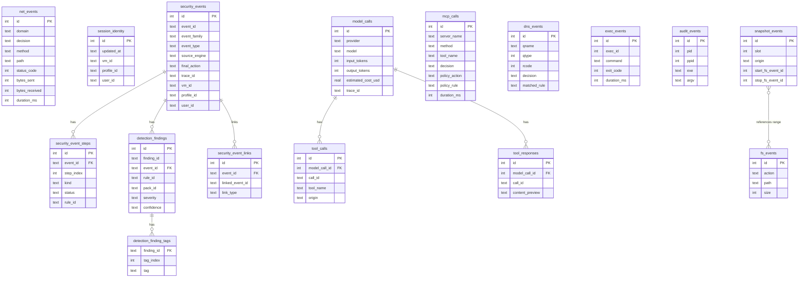
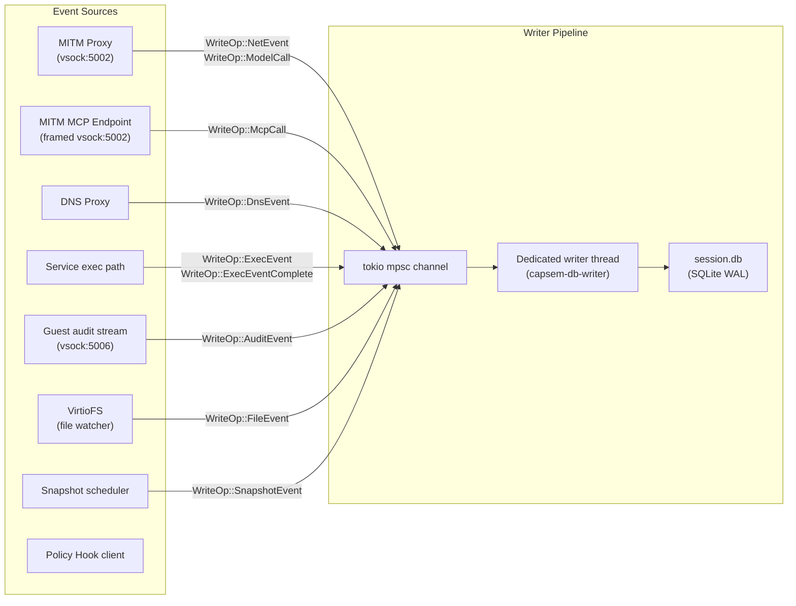
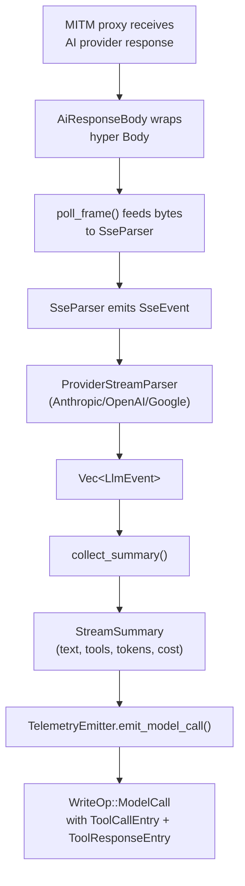

Every Capsem VM gets its own SQLite database (`session.db`) that records canonical security events, network requests, DNS queries, AI model calls, MCP tool invocations, exec activity, kernel audit events, file changes, and snapshots. The database lives in the session directory and is destroyed with the VM (ephemeral) or preserved (persistent/forked).

Each database also carries one `session_identity` row. That row is the durable
identity envelope for the event stream: the VM id, the resolved profile id, and
the local user id that launched the VM. Event rows keep their hot-path shape and
join to this identity at export/status time.

## Schema overview



## Tables

### session_identity

One durable identity row for the VM/session that owns this database.

| Column | Type | Description |
|--------|------|-------------|
| `id` | INTEGER PK | Always `1` |
| `updated_at` | TEXT | ISO 8601 time when identity was last attached |
| `vm_id` | TEXT | Capsem VM/session id |
| `profile_id` | TEXT | Resolved Profile V2 id pinned to the session |
| `user_id` | TEXT | Local host user id recorded by the service/process boundary |

### security_events

The canonical journal row for a resolved Security Engine event. Domain tables
remain useful projections, but this table is the normalized place to read final
decisions, attribution, and cross-engine identity.

| Column | Type | Description |
|--------|------|-------------|
| `id` | INTEGER PK | Auto-increment |
| `event_id` | TEXT UNIQUE | Stable event id |
| `timestamp` | TEXT | ISO 8601 timestamp derived from the event |
| `timestamp_unix_ms` | INTEGER | Millisecond timestamp used by replay/tests |
| `event_family` | TEXT | `dns`, `http`, `mcp`, `model`, `file`, `process`, `credential`, `vm`, `profile`, `conversation`, or `snapshot` |
| `event_type` | TEXT | Typed event name such as `http.request` |
| `source_engine` | TEXT | Engine that emitted the event |
| `final_action` | TEXT | `continue`, `ask`, `rewrite`, `block`, `throttle`, `quarantine`, `restore`, `drop_connection`, `observe_only`, or `error` |
| `enforceability` | TEXT | `inline_blockable`, `observe_only`, or `remediation_only` |
| `attribution_scope` | TEXT | `host`, `vm`, `profile`, `session`, or `unknown` |
| `origin_kind` | TEXT | Where the activity originated, for example `guest_network` or `host_service` |
| `accounting_owner` | TEXT | Counter/quota owner, such as `vm:<id>` or `host:<id>` |
| `trace_id` | TEXT | Cross-table correlation id |
| `vm_id`, `session_id`, `profile_id`, `user_id` | TEXT | Durable ownership fields |
| `process_id`, `turn_id`, `message_id`, `tool_call_id`, `mcp_call_id` | TEXT | Optional correlation ids |
| `redaction_state` | TEXT | `raw`, `redacted`, or `summary-only` |
| `label_count`, `mutation_count`, `finding_count` | INTEGER | Compact summary counters |

### security_event_steps

Ordered processing steps for a security event: preprocessors, plugin callbacks,
enforcement matches, confirmation, rate-limit checks, detection matches,
postprocessors, and emitter delivery.

| Column | Type | Description |
|--------|------|-------------|
| `event_id` | TEXT FK | Linked `security_events.event_id` |
| `step_index` | INTEGER | Stable order within the resolved event |
| `kind` | TEXT | Processing step kind |
| `status` | TEXT | `applied`, `matched`, `skipped`, or `error` |
| `rule_id` | TEXT | Matching rule, when present |
| `pack_id` | TEXT | Rule/plugin pack, when present |
| `message` | TEXT | Short diagnostic |

### detection_findings

Detection findings produced by the Security Engine before telemetry/logging
sinks run.

| Column | Type | Description |
|--------|------|-------------|
| `finding_id` | TEXT UNIQUE | Stable finding id |
| `event_id` | TEXT FK | Linked `security_events.event_id` |
| `rule_id` | TEXT | Detection rule id |
| `pack_id` | TEXT | Detection pack id |
| `sigma_id` | TEXT | Optional Sigma rule id |
| `title` | TEXT | Finding title |
| `severity` | TEXT | `info`, `low`, `medium`, `high`, or `critical` |
| `confidence` | TEXT | `low`, `medium`, or `high` |

Finding tags live in `detection_finding_tags` as one row per tag so hunting and
timeline filters can index them without parsing JSON.

### security_event_links

Correlation edges between events. Examples include parent event links,
trace-history links, context-history links, model-to-tool links, process-to-file
links, and future snapshot/file relationships.

### net_events

Every HTTP request through the MITM proxy, whether allowed or denied.

| Column | Type | Description |
|--------|------|-------------|
| `id` | INTEGER PK | Auto-increment |
| `timestamp` | TEXT | ISO 8601 |
| `domain` | TEXT | Target domain |
| `port` | INTEGER | Default 443 |
| `decision` | TEXT | `allowed`, `denied`, `error` |
| `process_name` | TEXT | Guest process that initiated the request |
| `pid` | INTEGER | Guest process ID |
| `method` | TEXT | HTTP method |
| `path` | TEXT | Request path |
| `query` | TEXT | Query string |
| `status_code` | INTEGER | Upstream response status |
| `bytes_sent` | INTEGER | Request body size |
| `bytes_received` | INTEGER | Response body size |
| `duration_ms` | INTEGER | End-to-end latency |
| `matched_rule` | TEXT | Which enforcement rule matched |
| `request_headers` | TEXT | Request headers (when body logging enabled) |
| `response_headers` | TEXT | Response headers |
| `request_body_preview` | TEXT | First 4 KB of request body |
| `response_body_preview` | TEXT | First 4 KB of response body |
| `conn_type` | TEXT | Default `https`, `https-mitm` for proxied |
| `policy_mode` | TEXT | Policy engine mode, when set |
| `policy_action` | TEXT | Typed policy action (`allow`, `ask`, `block`, `rewrite`) |
| `policy_rule` | TEXT | Matching enforcement rule key |
| `policy_reason` | TEXT | Optional audit reason or fail-closed detail |
| `trace_id` | TEXT | Cross-table correlation ID |

### model_calls

AI provider API calls with parsed response metadata.

| Column | Type | Description |
|--------|------|-------------|
| `id` | INTEGER PK | Auto-increment |
| `timestamp` | TEXT | ISO 8601 |
| `provider` | TEXT | `anthropic`, `openai`, `google` |
| `model` | TEXT | e.g. `claude-opus-4` |
| `process_name` | TEXT | Guest process |
| `pid` | INTEGER | Guest process ID |
| `method` | TEXT | HTTP method (always `POST`) |
| `path` | TEXT | API path (e.g. `/v1/messages`) |
| `stream` | INTEGER | Boolean: 1 if SSE streaming |
| `system_prompt_preview` | TEXT | First N chars of system prompt |
| `messages_count` | INTEGER | Number of messages in request |
| `tools_count` | INTEGER | Number of tools in request |
| `request_bytes` | INTEGER | Request body size |
| `request_body_preview` | TEXT | First 4 KB of request body |
| `message_id` | TEXT | Provider message ID |
| `status_code` | INTEGER | HTTP status |
| `text_content` | TEXT | Concatenated text output |
| `thinking_content` | TEXT | Chain-of-thought output |
| `stop_reason` | TEXT | `end_turn`, `tool_use`, `max_tokens`, `content_filter` |
| `input_tokens` | INTEGER | Input token count |
| `output_tokens` | INTEGER | Output token count |
| `duration_ms` | INTEGER | Request duration |
| `response_bytes` | INTEGER | Response body size |
| `estimated_cost_usd` | REAL | Cost estimate from pricing table |
| `trace_id` | TEXT | Links multi-turn agent conversations |
| `usage_details` | TEXT | JSON: `{"cache_read": 800, "thinking": 200}` |

### tool_calls

Tool invocations extracted from model responses. One row per `tool_use` content block.

| Column | Type | Description |
|--------|------|-------------|
| `id` | INTEGER PK | Auto-increment |
| `model_call_id` | INTEGER FK | References `model_calls.id` |
| `call_index` | INTEGER | Position in the response |
| `call_id` | TEXT | Provider-assigned call ID |
| `tool_name` | TEXT | Tool name |
| `arguments` | TEXT | JSON arguments |
| `origin` | TEXT | `native`, `local`, `mcp_proxy` |
| `mcp_call_id` | INTEGER | Optional FK to `mcp_calls`; current model traffic does not populate it |
| `trace_id` | TEXT | Cross-table correlation ID |

### tool_responses

Tool results from subsequent requests (matched by `call_id`).

| Column | Type | Description |
|--------|------|-------------|
| `id` | INTEGER PK | Auto-increment |
| `model_call_id` | INTEGER FK | References `model_calls.id` |
| `call_id` | TEXT | Matches `tool_calls.call_id` |
| `content_preview` | TEXT | Truncated tool result |
| `is_error` | INTEGER | Boolean: 1 if tool returned error |
| `trace_id` | TEXT | Cross-table correlation ID |

### mcp_calls

MCP JSON-RPC tool invocations through the guest MCP relay and host MITM MCP endpoint (framed vsock:5002).

| Column | Type | Description |
|--------|------|-------------|
| `id` | INTEGER PK | Auto-increment |
| `timestamp` | TEXT | ISO 8601 |
| `server_name` | TEXT | MCP server name (e.g. `builtin`, `github`) |
| `method` | TEXT | JSON-RPC method (`tools/call`, `tools/list`, etc.) |
| `tool_name` | TEXT | Tool name (for `tools/call`) |
| `request_id` | TEXT | JSON-RPC request ID |
| `request_preview` | TEXT | Truncated request body |
| `response_preview` | TEXT | Truncated response body |
| `decision` | TEXT | `allowed`, `denied`, `error` |
| `duration_ms` | INTEGER | Call duration |
| `error_message` | TEXT | Error details if failed |
| `process_name` | TEXT | Guest process |
| `bytes_sent` | INTEGER | Request size |
| `bytes_received` | INTEGER | Response size |
| `policy_mode` | TEXT | Policy engine mode (`audit_only` or `enforce`) |
| `policy_action` | TEXT | Typed policy action (`allow`, `ask`, `block`, `rewrite`) |
| `policy_rule` | TEXT | Matching rule key, for example `policy.mcp.block_prod_token` |
| `policy_reason` | TEXT | Optional audit reason |
| `trace_id` | TEXT | Cross-table correlation ID |

### dns_events

DNS queries handled by the host DNS proxy.

| Column | Type | Description |
|--------|------|-------------|
| `id` | INTEGER PK | Auto-increment |
| `timestamp` | TEXT | ISO 8601 |
| `qname` | TEXT | Queried name |
| `qtype` | INTEGER | DNS record type |
| `qclass` | INTEGER | DNS class |
| `rcode` | INTEGER | DNS response code |
| `decision` | TEXT | `allowed`, `denied`, `redirected`, or `error` |
| `matched_rule` | TEXT | Domain or Policy DNS rule that matched |
| `source_proto` | TEXT | DNS transport source |
| `process_name` | TEXT | Guest process, when known |
| `upstream_resolver_ms` | INTEGER | Upstream resolver latency |
| `trace_id` | TEXT | Cross-table correlation ID |
| `policy_mode` | TEXT | Policy engine mode, when set |
| `policy_action` | TEXT | Typed policy action (`allow`, `ask`, `block`, `rewrite`) |
| `policy_rule` | TEXT | Matching enforcement rule key |
| `policy_reason` | TEXT | Optional audit reason or fail-closed detail |

| `endpoint_id` | TEXT | Hook endpoint identifier |
### exec_events

Commands executed through Capsem service APIs and MCP tools.

| Column | Type | Description |
|--------|------|-------------|
| `id` | INTEGER PK | Auto-increment |
| `timestamp` | TEXT | ISO 8601 |
| `exec_id` | INTEGER | Per-session exec identifier |
| `command` | TEXT | Command string |
| `exit_code` | INTEGER | Process exit code, when complete |
| `duration_ms` | INTEGER | Runtime duration, when complete |
| `stdout_preview` | TEXT | Truncated stdout |
| `stderr_preview` | TEXT | Truncated stderr |
| `stdout_bytes` | INTEGER | Full stdout byte count |
| `stderr_bytes` | INTEGER | Full stderr byte count |
| `source` | TEXT | Source path, usually `api` or MCP |
| `mcp_call_id` | INTEGER | Related `mcp_calls.id`, when known |
| `trace_id` | TEXT | Cross-table correlation ID |
| `process_name` | TEXT | Guest process name, when known |
| `pid` | INTEGER | Guest process ID, when known |

### audit_events

Kernel audit `execve` records streamed from the guest over vsock:5006.

| Column | Type | Description |
|--------|------|-------------|
| `id` | INTEGER PK | Auto-increment |
| `timestamp` | TEXT | ISO 8601 |
| `pid` | INTEGER | Guest process ID |
| `ppid` | INTEGER | Guest parent process ID |
| `uid` | INTEGER | Guest user ID |
| `exe` | TEXT | Executable path |
| `comm` | TEXT | Kernel command name |
| `argv` | TEXT | Reconstructed command arguments |
| `cwd` | TEXT | Working directory |
| `exit_code` | INTEGER | Exit code, when known |
| `session_id` | INTEGER | Kernel audit session ID |
| `tty` | TEXT | TTY, when present |
| `audit_id` | TEXT | Kernel audit event ID |
| `exec_event_id` | INTEGER | Related `exec_events.id`, when correlated |
| `parent_exe` | TEXT | Parent executable, when known |
| `trace_id` | TEXT | Cross-table correlation ID |

### fs_events

File system changes in the workspace (tracked by VirtioFS).

| Column | Type | Description |
|--------|------|-------------|
| `id` | INTEGER PK | Auto-increment |
| `timestamp` | TEXT | ISO 8601 |
| `action` | TEXT | `created`, `modified`, `deleted`, `restored` |
| `path` | TEXT | File path relative to workspace |
| `size` | INTEGER | File size in bytes |
| `trace_id` | TEXT | Cross-table correlation ID |

### snapshot_events

Automatic and manual workspace snapshots.

| Column | Type | Description |
|--------|------|-------------|
| `id` | INTEGER PK | Auto-increment |
| `timestamp` | TEXT | ISO 8601 |
| `slot` | INTEGER | Ring buffer slot (0-11 for auto) |
| `origin` | TEXT | `auto` or `manual` |
| `name` | TEXT | Optional snapshot name |
| `files_count` | INTEGER | Files in snapshot |
| `start_fs_event_id` | INTEGER | First fs_event in range |
| `stop_fs_event_id` | INTEGER | Last fs_event in range |
| `trace_id` | TEXT | Cross-table correlation ID |

## Data flow



### Write operations

| Variant | Source | Table(s) |
|---------|--------|----------|
| `WriteOp::NetEvent` | MITM proxy | `net_events` |
| `WriteOp::ModelCall` | MITM proxy (AI traffic) | `model_calls` + `tool_calls` + `tool_responses` |
| `WriteOp::McpCall` | MITM MCP endpoint | `mcp_calls` |
| `WriteOp::ExecEvent` / `ExecEventComplete` | Service exec path | `exec_events` |
| `WriteOp::AuditEvent` | Guest audit stream | `audit_events` |
| `WriteOp::FileEvent` | VirtioFS watcher | `fs_events` |
| `WriteOp::SnapshotEvent` | Snapshot scheduler | `snapshot_events` |
| `WriteOp::DnsEvent` | DNS proxy | `dns_events` |

## Policy Decision Audit

Use `just query-session` to prove that a policy decision happened at the
intended boundary and that blocked or rewritten payloads did not leak.

### MCP

```bash
just query-session "
SELECT timestamp, tool_name, decision, policy_action, policy_rule, policy_reason, error_message
FROM mcp_calls
WHERE policy_rule IS NOT NULL
ORDER BY id DESC
LIMIT 20;"
```

For no-dispatch checks, pair the policy row with the expected error response:

```bash
just query-session "
SELECT tool_name, policy_action, policy_rule, response_preview
FROM mcp_calls
WHERE policy_action IN ('ask', 'block', 'rewrite')
ORDER BY id DESC
LIMIT 20;"
```

MCP Security Engine enforcement blocks use `policy_action = 'block'`. The
coarse `mcp_calls.decision` field still uses `denied` for denied JSON-RPC
outcomes.

### HTTP

```bash
just query-session "
SELECT timestamp, domain, method, path, decision, matched_rule, status_code
     , policy_action, policy_rule, policy_reason
FROM net_events
WHERE matched_rule IS NOT NULL OR policy_rule IS NOT NULL
ORDER BY id DESC
LIMIT 20;"
```

Header-strip rules should be checked against the captured headers:

```bash
just query-session "
SELECT domain, request_headers, response_headers
FROM net_events
WHERE matched_rule = 'security.rules.http.strip_credentials'
ORDER BY id DESC
LIMIT 5;"
```

The stripped header names may appear as keys depending on capture settings,
but stripped secret values must not appear in header or body preview fields.

### DNS

```bash
just query-session "
SELECT timestamp, qname, qtype, rcode, decision, matched_rule, process_name
     , policy_action, policy_rule, policy_reason
FROM dns_events
WHERE matched_rule IS NOT NULL OR policy_rule IS NOT NULL OR decision != 'allowed'
ORDER BY id DESC
LIMIT 20;"
```

DNS block rows prove no upstream resolution happened when
`upstream_resolver_ms = 0`. DNS rewrite rows should carry the enforcement rule and
`policy_action = 'rewrite'`; synthetic answer payloads are not stored in
session telemetry.

### Model and Tool Traffic

Model enforcement uses the existing parsed AI rows plus enforcement rule metadata as
the enforcement slice lands. Today, use these rows to prove the subject and
no-leak side of model enforcement tests:

```bash
just query-session "
SELECT id, provider, model, path, trace_id, request_body_preview, text_content
FROM model_calls
ORDER BY id DESC
LIMIT 10;"
```

```bash
just query-session "
SELECT tc.tool_name, tc.origin, tc.arguments, tr.content_preview, tc.trace_id
FROM tool_calls tc
LEFT JOIN tool_responses tr
  ON tr.call_id = tc.call_id AND tr.trace_id = tc.trace_id
ORDER BY tc.id DESC
LIMIT 20;"
```

Model request policy records no-leak decisions on the associated `net_events`
row. Model response, tool-call, and tool-response enforcement use the same
rule, decision, and reason vocabulary on `net_events`; response-side rewrites
must show only the rewritten preview.

For model-extracted tool calls, `tool_calls.origin` uses `native`, `local`, or
`mcp_proxy`. The `tool_calls.mcp_call_id` column exists for future direct
correlation, but the current model telemetry path does not populate it.

decision, rule id, reason, latency, timeout/schema/transport error text,
fail-closed fallback decision, audit tags, `trace_id`, and `session_id`.
Hook tests should also query the downstream boundary row (`mcp_calls`,
`net_events`, `dns_events`, or `model_calls`) when proving no-dispatch and
no-leak behavior.

## Writer Architecture

The `DbWriter` spawns a dedicated thread that owns the SQLite connection:

1. Async callers send `WriteOp` via `tx.send()` (non-blocking)
2. Writer thread blocks on `rx.blocking_recv()` for the first op
3. After receiving one op, drains the rest of the queue
4. Executes all drained ops in a single SQLite transaction
5. Repeats

This **block-then-drain** pattern batches writes for efficiency while keeping the async callers non-blocking. The channel has configurable backpressure capacity.

SQLite pragmas: WAL journal mode, NORMAL synchronous. Field values are defensively capped at 256 KB.

**Drop order is critical:** `Drop::drop()` takes `tx` before joining the thread. Without this, the join would deadlock (thread waits for all senders to drop, but `tx` drops after the join).

## AI traffic enrichment



For AI provider traffic, the response body is parsed inline to extract:
- Model name and message ID
- Text and thinking output
- Tool calls with arguments and origin classification
- Token usage (input, output, cache_read, thinking breakdowns)
- Cost estimate from embedded pricing table
- Stop reason (end_turn, tool_use, max_tokens)
- Trace ID for multi-turn correlation

## Aggregation queries

The `DbReader` provides pre-built aggregate queries:

| Query | Returns | Use case |
|-------|---------|----------|
| `session_stats()` | `SessionStats` | Dashboard summary: totals for net, model, tokens, cost |
| `provider_token_usage()` | `Vec<ProviderTokenUsage>` | Per-provider breakdown: call count, tokens, cost |
| `domain_counts()` | `Vec<DomainCount>` | Per-domain request counts with allowed/denied split |
| `time_buckets()` | `Vec<TimeBucket>` | Requests over time (for charts) |
| `tool_usage()` | `Vec<ToolUsageCount>` | Most-used tools by call count |
| `tool_usage_with_stats()` | `Vec<ToolUsageWithStats>` | Tool usage with byte and duration stats |
| `mcp_tool_usage()` | `Vec<McpToolUsage>` | MCP tool usage by server and tool name |
| `trace_summaries()` | `Vec<TraceSummary>` | Per-trace: tokens, cost, duration, tool count |
| `trace_detail(id)` | `TraceDetail` | All model calls in a trace with tool data |

## Access patterns

| Access point | Protocol | Query type |
|-------------|----------|------------|
| `capsem inspect <id> "SQL"` | CLI -> service HTTP `/inspect/{id}` | Raw SQL (read-only) |
| `capsem info <id> --stats` | CLI -> service HTTP `/info/{id}` | Pre-built `SessionStats` |
| MCP `capsem_inspect` | MCP -> service HTTP `/inspect/{id}` | Raw SQL (read-only) |
| MCP `capsem_inspect_schema` | MCP -> service HTTP | Table schemas for LLM context |
| Frontend dashboard | Gateway -> `/inspect/{id}` | sql.js in-browser (downloads session.db) |

The `/inspect` endpoint executes arbitrary SQL against the session database in read-only mode (`query_only` pragma). The reader connection uses separate pragmas from the writer.

## Per-VM isolation

| Property | Value |
|----------|-------|
| Location | `~/.capsem/sessions/{id}/session.db` |
| Lifetime | Created at VM boot, destroyed with ephemeral VM or preserved with persistent VM |
| Access | Only the owning capsem-process can write; service reads via IPC |
| VirtioFS boundary | `session.db` is outside the VirtioFS share; guest cannot access it |
| Concurrent access | WAL mode allows concurrent reader + writer |
| Fork behavior | `capsem fork` checkpoints and copies session.db into the image |

## Key source files

| File | Purpose |
|------|---------|
| `capsem-logger/src/schema.rs` | Table DDL, pragmas, migrations |
| `capsem-logger/src/events.rs` | Event structs (NetEvent, ModelCall, McpCall, etc.) |
| `capsem-logger/src/writer.rs` | DbWriter, WriteOp, block-then-drain loop |
| `capsem-logger/src/reader.rs` | DbReader, aggregation queries, raw SQL |
| `capsem-logger/src/db.rs` | SessionDb convenience wrapper |
