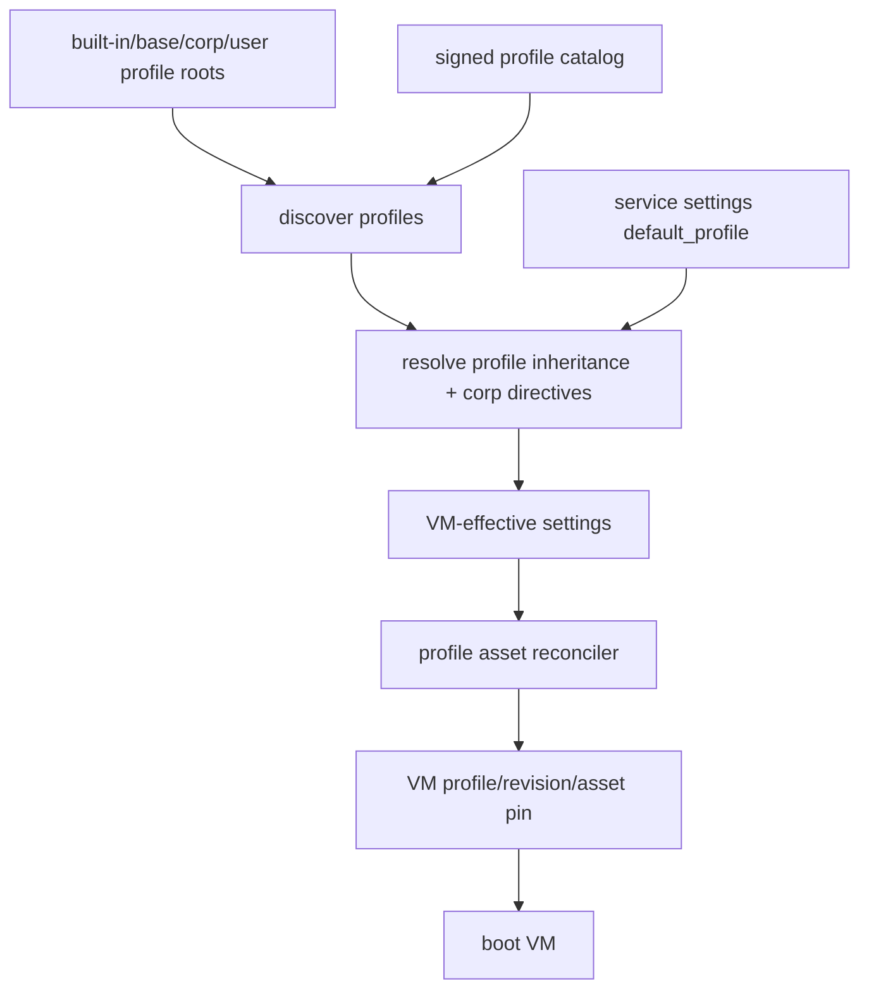

Capsem has two configuration planes.

| Plane | Scope | Examples |
|---|---|---|
| Service settings | Host/service-wide control plane. | Profile roots, selected default profile, signed catalog URL, asset cache, telemetry endpoint, service limits. |
| Profiles | VM/session contract. | AI providers, MCP servers, skills, package/tool contracts, VM assets, enforcement packs, detection packs, editable-section locks. |

The service resolves one effective profile for a VM. That resolved profile is
attached to the VM at creation time and recorded as a pin: profile id,
revision, profile payload hash, package contract hash, and boot asset hashes.
Existing VMs do not silently migrate when a profile updates.

## Resolution Flow

Base and corp profiles can provide locked assumptions. User profiles can extend
or fork only when the profile section permits it. Editable-section booleans
control whether users may change skills, MCP servers, AI providers, rules, VM
settings, and other profile sections.

## Profile Status

Use the `ProfileRevisionStatus` enum everywhere:

| Value | Meaning |
|---|---|
| `active` | Install/update this revision and allow new VMs. |
| `deprecated` | Keep installed, warn, allow existing VMs, avoid as the default recommendation. |
| `revoked` | Block install/update and block VM launch. Existing pinned VMs surface high-severity warnings and must be logged according to the runtime contract. |

There is no `removed` status. A revision missing from the manifest is absent;
a listed revision that must not be installed or launched is `revoked`.

## Rule Ownership

Profile-owned enforcement and detection packs are part of the profile contract.
Runtime overlays can be added through `/enforcement/*` and `/detection/*`, but
profile/corp-owned rows are read-only unless the owning profile section is
editable.

Generated rules carry provenance:

| Field | Meaning |
|---|---|
| `owner_setting_path` | The setting that produced the rule, such as `security.capabilities.network_egress` or `mcpServers.github.capsem.allowed_tools`. |
| `owner_setting_label` | Human-readable label for UI/debug output. |
| `editable` | Whether the rule may be changed through user-level tools. |

Priority is ascending: lower numbers run first.

| Range | Owner |
|---|---|
| `-1000` to `-1` | Corp-exclusive. |
| `0` | Toggle/system-derived. |
| `1` to `999` | User-authored/default UI range. |
| `1000` | System catch-all, not hand-authored. |

See [Enforcement](/security/enforcement/) and
[Detection Format](/security/detection/) for runtime behavior.

