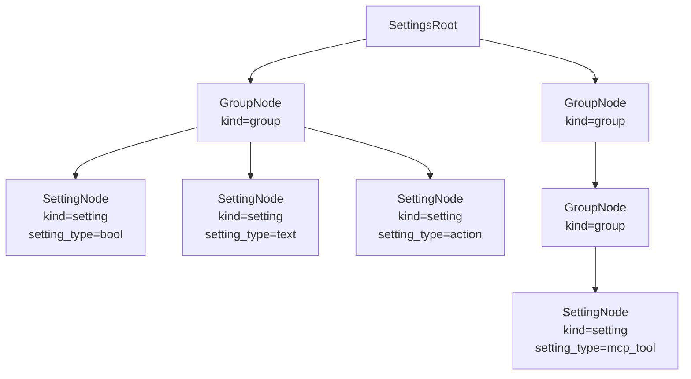
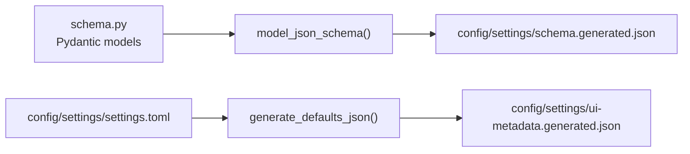
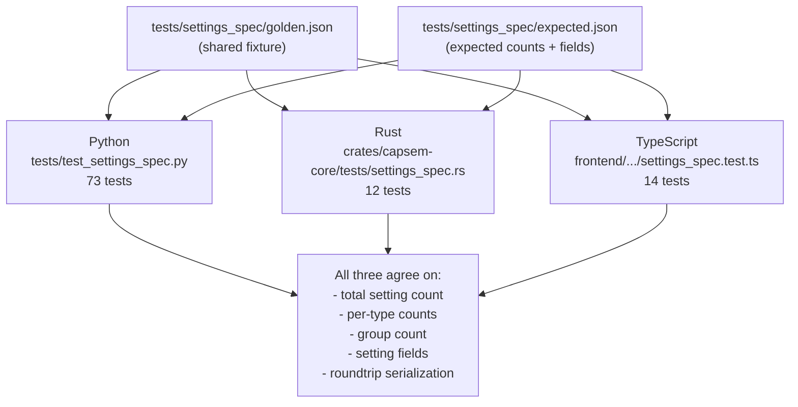
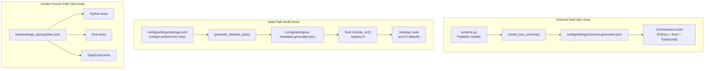

The settings schema is the structural contract for UI/application preferences
only. Runtime behavior belongs to profile/corp ledgers, not settings. Pydantic
models in Python are the single source of truth for settings shape, JSON Schema
is generated from them, and Python/Rust/TypeScript must parse settings
identically.

Key files:

| File | Role |
|---|---|
| `src/capsem/builder/schema.py` | Pydantic models (canonical schema) |
| `config/settings/schema.generated.json` | Generated JSON Schema |
| `config/settings/ui-metadata.generated.json` | Generated UI metadata and defaults from `config/settings/settings.toml` |
| `crates/capsem-core/src/net/policy_config/types.rs` | Rust settings serde contract |
| `frontend/src/lib/types/settings.ts` | TypeScript settings wire types |
| `crates/capsem-core/tests/settings_spec.rs` | Rust conformance tests |
| `frontend/src/lib/__tests__/settings_spec.test.ts` | TypeScript conformance tests |
| `tests/test_settings_spec.py` | Python schema + conformance tests |
| `tests/settings_spec/golden.json` | Golden fixture (shared by all three) |

## Two-Node-Type Design

The settings tree has exactly two node types, discriminated by the `kind` field:



**GroupNode** (`kind="group"`): container with children.

| Field | Type | Required | Description |
|---|---|---|---|
| `key` | string | yes | Dot-separated path (e.g. `ai.anthropic`) |
| `name` | string | yes | Display name |
| `description` | string | no | Help text |
| `enabled_by` | string | no | Key of a bool setting that gates this group |
| `enabled` | bool | no | Effective enabled state (default `true`) |
| `collapsed` | bool | yes | Whether the UI renders this group collapsed |
| `children` | SettingsNode[] | yes | Nested groups and settings |

**SettingNode** (`kind="setting"`): ordinary UI/application preferences and
frontend actions. MCP runtime truth is profile-owned and is exposed by profile
routes, not generated as settings leaves.

| Field | Type | Required | Description |
|---|---|---|---|
| `key` | string | yes | Dot-separated path |
| `name` | string | yes | Display name |
| `description` | string | yes | Help text |
| `setting_type` | SettingType | yes | Data type (see enum table below) |
| `default_value` | any | no | Default from guest config |
| `effective_value` | any | no | Resolved value (corp > user > default) |
| `source` | PolicySource | no | Where effective value came from |
| `modified` | string | no | ISO timestamp of last user change |
| `corp_locked` | bool | no | Whether corp.toml overrides this |
| `enabled_by` | string | no | Key of a bool setting that gates this |
| `enabled` | bool | no | Effective enabled state |
| `collapsed` | bool | no | UI collapse state |
| `metadata` | SettingMetadata | no | Extra fields (defaults to empty) |
| `history` | HistoryEntry[] | no | Audit trail of value changes |

Actions (`check_update`) use `setting_type="action"` with the relevant metadata
fields. Consumers check `setting_type`, not `kind`.

## SettingType Enum

13 values. The first 11 are data types with stored values. The last two are structural variants.

| Value | Category | Description |
|---|---|---|
| `text` | value | Free-form string |
| `number` | value | Integer with optional min/max |
| `url` | value | URL string |
| `email` | value | Email address |
| `apikey` | value | API key (masked input, prefix hint) |
| `bool` | value | Boolean toggle |
| `file` | value | `{ path, content }` object |
| `kv_map` | value | `{ key: value }` dictionary |
| `string_list` | value | Array of strings |
| `int_list` | value | Array of integers |
| `float_list` | value | Array of floats |
| `action` | structural | UI button/widget, no stored value |
| `mcp_tool` | retired | Do not use for runtime MCP. MCP is profile-owned and route-backed. |

## Metadata Fields

All metadata lives in a single `SettingMetadata` object. Most fields are optional with sensible defaults. Fields are grouped by purpose.

### Common fields

| Field | Type | Default | Description |
|---|---|---|---|
| `domains` | string[] | `[]` | Domain patterns for network policy |
| `choices` | string[] | `[]` | Valid options (drives select widget) |
| `min` | int | `null` | Minimum value (number types) |
| `max` | int | `null` | Maximum value (number types) |
| `rules` | dict | `{}` | HTTP method permissions per rule |
| `env_vars` | string[] | `[]` | Environment variables injected into guest |
| `collapsed` | bool | `false` | Default collapse state |
| `format` | string | `null` | Value format hint (e.g. `domain_list`) |
| `docs_url` | string | `null` | Link to external documentation |
| `prefix` | string | `null` | Expected value prefix (e.g. `sk-ant-`) |
| `filetype` | string | `null` | File syntax type (e.g. `json`) |
| `widget` | Widget | `null` | Override default UI widget |
| `side_effect` | SideEffect | `null` | Frontend action on value change |
| `hidden` | bool | `false` | Exclude from UI, keep for policy |
| `builtin` | bool | `false` | Non-removable (system setting) |
| `mask` | bool | `false` | Mask display value |
| `validator` | string | `null` | Regex pattern for validation |

### Action-specific

| Field | Type | Default | Description |
|---|---|---|---|
| `action` | ActionKind | `null` | Action identifier (`check_update`) |

### Retired MCP Metadata

MCP server and tool configuration is profile-owned. It is not authored through
settings metadata and must be read through profile MCP routes.

## Security Rule Schema

Security-event rules are loaded from `corp.rules`, `profiles.rules`, provider
convenience blocks under `ai.<provider>.rules`, and referenced rule files:

```toml
[rule_files]
enforcement = "profiles/base/enforcement.toml"
sigma = "profiles/base/detection.yaml"
```

They are not ordinary settings leaves. The Rust loader validates the rule id,
mandatory `name`, enum-backed `action`, optional `detection_level`, priority
discipline, plugin requirements, and CEL fields against the first-party
`SecurityEvent` roots.

Old callback-shaped fields such as `on`, `if`, `decision`, `actions`, and
`level` are rejected by the rule parser. See [Policy](/security/policy/) for
the current TOML and Sigma rule formats.

## JSON Schema Generation

The schema generation pipeline runs from Pydantic models to two output files:



`just schema` regenerates both files:

```
just schema
# Runs: uv run python scripts/generate_schema.py
# Outputs:
#   config/settings/schema.generated.json  (JSON Schema from Pydantic)
#   config/settings/ui-metadata.generated.json         (defaults from host settings source)
```

The JSON Schema is derived from `SettingsRoot.model_json_schema()`. It contains `$defs` for all model types (GroupNode, SettingNode, SettingMetadata, enums) and a `properties.settings` array at the root.

## Cross-Language Conformance

A golden fixture at `tests/settings_spec/golden.json` is the contract. Three test suites parse the same fixture and verify identical structure:



99 tests total (73 Python, 12 Rust, 14 TypeScript). Every test suite checks:

| Assertion | Verified by |
|---|---|
| Golden fixture parses | All three |
| Total setting count matches expected.json | All three |
| Per-type counts match expected.json | All three |
| Group count matches expected.json | All three |
| Setting key, name, type, enabled_by match | All three |
| Roundtrip serialize/deserialize | Python, Rust |
| All 13 setting types present | All three |
| Action settings have `metadata.action` | All three |
| File settings have `{ path, content }` | All three |
| Hidden/builtin settings exist | All three |
| `enabled_by` references a valid bool | Python, TypeScript |

Any schema change requires updating the golden fixture, expected.json, and all three test suites. `just test` runs all of them.

## Data Flow

Two parallel paths connect the settings contract to the running application:



The data path: host settings source is processed by `generate_defaults_json()`
into `config/settings/ui-metadata.generated.json`. Rust embeds this file at compile time via
`include_str!()` in `registry.rs`. Settings are UI/app preferences. Profiles
own assets, rules, MCP, plugins, image payloads, and VM runtime posture.

The schema path: Pydantic models generate JSON Schema for documentation and validation. The conformance tests ensure all three languages agree on parsing.

## Design Decision: Two Node Types

The retired schema had four node types:

| Old type | Discriminant |
|---|---|
| Group | `kind="group"` |
| Leaf | `kind="leaf"` |
| Action | `kind="action"` |
| McpServer | `kind="mcp_server"` |

This was simplified to two:

| Current type | Discriminant | Covers |
|---|---|---|
| GroupNode | `kind="group"` | Containers with children |
| SettingNode | `kind="setting"` | Regular settings and actions |

The four-type design forced consumers to match on `kind` with four arms, even though actions and MCP servers share nearly all fields with regular settings. The two-type design uses `setting_type` as the discriminant for behavior:

- Regular settings: `setting_type` in `{text, number, bool, ...}` -- value fields populated
- Actions: `setting_type="action"` -- `metadata.action` specifies the action kind
Consumers match on `kind` (two arms: group vs. setting), then check
`setting_type` when they need type-specific behavior. MCP servers and tools do
not appear here; profile routes own MCP configuration and state.
