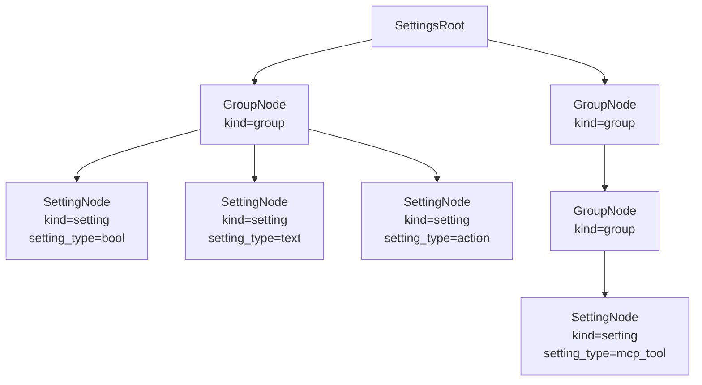
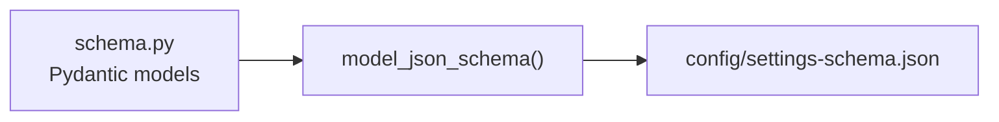
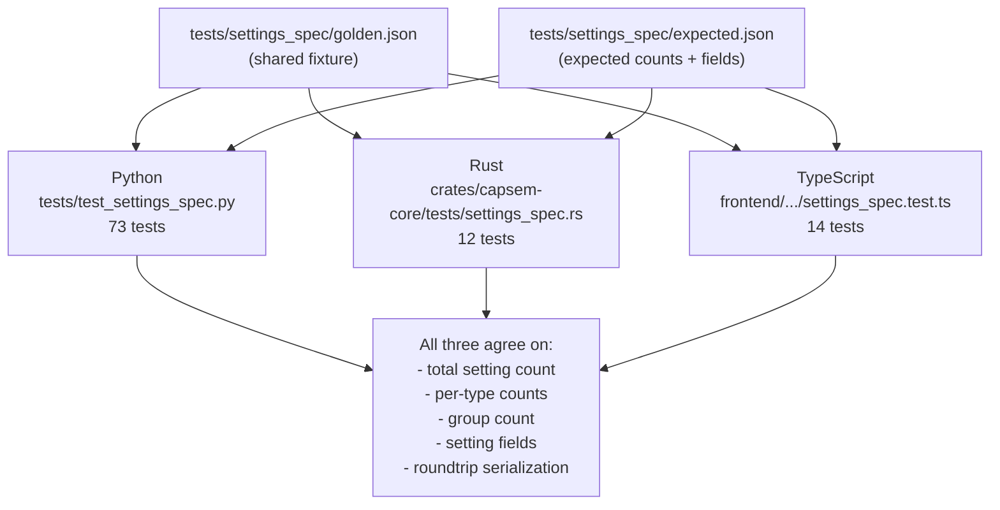

Capsem has two schema families. Service Settings V2 is the service/app control
plane contract used by corp admins and `capsem-admin`. The guest/UI descriptor
schema is the build-time contract for generated setting descriptors and frontend
rendering. They are intentionally separate.

Key files:

| File | Role |
|---|---|
| `src/capsem/builder/service_settings.py` | Pydantic Service Settings V2 admin model |
| `schemas/capsem.service-settings.v2.schema.json` | Generated JSON Schema for `capsem.service-settings.v2` |
| `schemas/fixtures/service-settings-v2-*.json` | Valid, invalid, and defaults contract fixtures shared with Rust/Python tests |
| `crates/capsem-core/src/settings_profiles/mod.rs` | Rust `ServiceSettings` runtime model and validation |
| `src/capsem/admin/cli.py` | `capsem-admin settings schema/validate/doctor` |
| `src/capsem/builder/schema.py` | Guest/UI descriptor Pydantic models |
| `config/settings-schema.json` | Guest/UI descriptor JSON Schema |
| `frontend/src/lib/types/settings.ts` | TypeScript settings and Policy wire types |
| `crates/capsem-core/tests/settings_spec.rs` | Rust conformance tests |
| `frontend/src/lib/__tests__/settings_spec.test.ts` | TypeScript conformance tests |
| `tests/test_settings_spec.py` | Python schema + conformance tests |
| `tests/settings_spec/golden.json` | Golden fixture (shared by all three) |

## Service Settings V2

Service settings configure the service control plane:

| Section | Purpose |
|---|---|
| `app` | Host app behavior and appearance defaults |
| `profiles` | Built-in, corp, and user profile roots plus selected default profile |
| `assets` | Service asset/cache locations and optional download base URL |
| `credentials` | Credential backend and credential references |
| `telemetry` | Export endpoint, headers, retry, redaction, and failure mode |
| `remote_policy` | Remote policy plugin endpoint, timeout, token reference, and failure behavior |
| `profile_catalog` | Signed profile catalog URL, payload public key, and check interval |
| `corp_directives` | Corp-applied profile overrides after profile inheritance |

The schema id is `capsem.service-settings.v2`; the artifact is
`schemas/capsem.service-settings.v2.schema.json`.

Admin validation is through `capsem-admin`:

```bash
capsem-admin settings schema
capsem-admin settings validate service.toml
capsem-admin settings validate service.toml --json
capsem-admin settings doctor service.toml --json
```

JSON input uses Pydantic `model_validate_json()`. JSON output uses
`model_dump_json()`. TOML is parsed once and immediately validated through the
same model. Raw nested JSON or TOML dictionaries are not a public admin API.

Cross-runtime drift is pinned by:

| Test | Proof |
|---|---|
| `tests/test_service_settings.py` | Python validates/dumps fixtures and checks schema/default stability |
| `crates/capsem-core/src/settings_profiles/tests.rs` | Rust parses the same fixtures and rejects the same invalid shapes |
| `schemas/fixtures/service-settings-v2-defaults.json` | Shared defaults contract; Python dumps it and Rust compares it to `ServiceSettings::default()` |

## Guest/UI Descriptor Schema

The remaining sections describe the guest/UI descriptor schema. It is not the
Service Settings V2 runtime contract and is not a compatibility layer for old
v1 service settings.

## Two-Node-Type Design

The settings tree has exactly two node types, discriminated by the `kind` field:



**GroupNode** (`kind="group"`): container with children.

| Field | Type | Required | Description |
|---|---|---|---|
| `key` | string | yes | Dot-separated path (e.g. `ai.anthropic`) |
| `name` | string | yes | Display name |
| `description` | string | no | Help text |
| `enabled_by` | string | no | Key of a bool setting that gates this group |
| `enabled` | bool | no | Effective enabled state (default `true`) |
| `collapsed` | bool | yes | Whether the UI renders this group collapsed |
| `children` | SettingsNode[] | yes | Nested groups and settings |

**SettingNode** (`kind="setting"`): everything else -- regular settings, actions, and MCP tools. The `setting_type` field determines which subfields are relevant.

| Field | Type | Required | Description |
|---|---|---|---|
| `key` | string | yes | Dot-separated path |
| `name` | string | yes | Display name |
| `description` | string | yes | Help text |
| `setting_type` | SettingType | yes | Data type (see enum table below) |
| `default_value` | any | no | Default from guest config |
| `effective_value` | any | no | Resolved value (corp > user > default) |
| `source` | PolicySource | no | Where effective value came from |
| `modified` | string | no | ISO timestamp of last user change |
| `corp_locked` | bool | no | Whether corp.toml overrides this |
| `enabled_by` | string | no | Key of a bool setting that gates this |
| `enabled` | bool | no | Effective enabled state |
| `collapsed` | bool | no | UI collapse state |
| `metadata` | SettingMetadata | no | Extra fields (defaults to empty) |
| `history` | HistoryEntry[] | no | Audit trail of value changes |

Actions (`check_update`, `preset_select`, `rerun_wizard`) and MCP tools are SettingNode variants. They use `setting_type="action"` or `setting_type="mcp_tool"` with the relevant metadata fields. Consumers check `setting_type`, not `kind`.

## SettingType Enum

13 values. The first 11 are data types with stored values. The last two are structural variants.

| Value | Category | Description |
|---|---|---|
| `text` | value | Free-form string |
| `number` | value | Integer with optional min/max |
| `url` | value | URL string |
| `email` | value | Email address |
| `apikey` | value | API key (masked input, prefix hint) |
| `bool` | value | Boolean toggle |
| `file` | value | `{ path, content }` object |
| `kv_map` | value | `{ key: value }` dictionary |
| `string_list` | value | Array of strings |
| `int_list` | value | Array of integers |
| `float_list` | value | Array of floats |
| `action` | structural | UI button/widget, no stored value |
| `mcp_tool` | structural | MCP tool definition |

## Metadata Fields

All metadata lives in a single `SettingMetadata` object. Most fields are optional with sensible defaults. Fields are grouped by purpose.

### Common fields

| Field | Type | Default | Description |
|---|---|---|---|
| `domains` | string[] | `[]` | Domain patterns for network policy |
| `choices` | string[] | `[]` | Valid options (drives select widget) |
| `min` | int | `null` | Minimum value (number types) |
| `max` | int | `null` | Maximum value (number types) |
| `rules` | dict | `{}` | HTTP method permissions per rule |
| `env_vars` | string[] | `[]` | Environment variables injected into guest |
| `collapsed` | bool | `false` | Default collapse state |
| `format` | string | `null` | Value format hint (e.g. `domain_list`) |
| `docs_url` | string | `null` | Link to external documentation |
| `prefix` | string | `null` | Expected value prefix (e.g. `sk-ant-`) |
| `filetype` | string | `null` | File syntax type (e.g. `json`) |
| `widget` | Widget | `null` | Override default UI widget |
| `side_effect` | SideEffect | `null` | Frontend action on value change |
| `hidden` | bool | `false` | Exclude from UI, keep for policy |
| `builtin` | bool | `false` | Non-removable (system setting) |
| `mask` | bool | `false` | Mask display value |
| `validator` | string | `null` | Regex pattern for validation |

### Action-specific

| Field | Type | Default | Description |
|---|---|---|---|
| `action` | ActionKind | `null` | Action identifier (`check_update`, `preset_select`, `rerun_wizard`) |

### MCP tool-specific

| Field | Type | Default | Description |
|---|---|---|---|
| `origin` | McpToolOrigin | `null` | Where the tool runs (`builtin`, `remote`, `in_vm`) |

### MCP server-specific

| Field | Type | Default | Description |
|---|---|---|---|
| `transport` | McpTransport | `null` | Protocol (`stdio`, `sse`) |
| `command` | string | `null` | Executable path (stdio transport) |
| `url` | string | `null` | Server URL (sse transport) |
| `args` | string[] | `[]` | Command arguments |
| `env` | dict | `{}` | Environment variables for the server process |
| `headers` | dict | `{}` | HTTP headers (sse transport) |

## Security Rules

Settings/profile rule storage is now structural input to the Security Engine.
Runtime HTTP, DNS, MCP, model, file, and process decisions no longer flow
through the removed named `PolicyConfig` evaluator. Author rules through the
typed `enforcement` and `detection` APIs and schemas; settings saves only carry
profile-owned configuration that those APIs can validate and compile. The
TypeScript model preserves profile rule objects during export/import and stages
them without flattening them into setting leaves.

See [Rule Authoring](/security/rules/) for the rule body schema and examples.

## JSON Schema Generation

The schema generation pipeline runs from Pydantic models to the guest/UI
descriptor schema:



`just schema` regenerates the descriptor schema:

```
just schema
# Runs: uv run python scripts/generate_schema.py
# Outputs:
#   config/settings-schema.json  (JSON Schema from Pydantic)
```

The JSON Schema is derived from `SettingsRoot.model_json_schema()`. It contains `$defs` for all model types (GroupNode, SettingNode, SettingMetadata, enums) and a `properties.settings` array at the root.

## Cross-Language Conformance

A golden fixture at `tests/settings_spec/golden.json` is the contract. Three test suites parse the same fixture and verify identical structure:



99 tests total (73 Python, 12 Rust, 14 TypeScript). Every test suite checks:

| Assertion | Verified by |
|---|---|
| Golden fixture parses | All three |
| Total setting count matches expected.json | All three |
| Per-type counts match expected.json | All three |
| Group count matches expected.json | All three |
| Setting key, name, type, enabled_by match | All three |
| Roundtrip serialize/deserialize | Python, Rust |
| All 13 setting types present | All three |
| Action settings have `metadata.action` | All three |
| MCP tool settings have `metadata.origin` | All three |
| File settings have `{ path, content }` | All three |
| Hidden/builtin settings exist | All three |
| `enabled_by` references a valid bool | Python, TypeScript |

Any schema change requires updating the golden fixture, expected.json, and all three test suites. `just test` runs all of them.

## Data Flow

Three typed paths define settings/profile behavior. Service Settings V2 is the
runtime control-plane contract, Profile V2 is the VM/session contract, and the
guest/UI descriptor schema is a development-time rendering contract. The
descriptor schema is not runtime authority and does not inject settings into
VMs.

```mermaid
flowchart TD
    subgraph "Service Settings Path"
        SPM["service_settings.py\nPydantic model"] --> SSJ["model_json_schema()"]
        SSJ --> SSS["schemas/capsem.service-settings.v2.schema.json"]
        SPM --> SSA["capsem-admin settings validate"]
        SSA --> SSR["Rust ServiceSettings validation"]
    end

    subgraph "Profile Path"
        PPM["profile Pydantic models"] --> PSJ["model_json_schema()"]
        PSJ --> PSS["schemas/capsem.profile.v2.schema.json"]
        PPM --> PVA["capsem-admin profile validate"]
        PVA --> PIN["VM profile/revision/asset pin"]
    end

    subgraph "Guest/UI Descriptor Path"
        PM["schema.py\nPydantic models"] --> JSG["model_json_schema()"]
        JSG --> SCHEMA["config/settings-schema.json"]
        SCHEMA --> TESTS["Conformance tests\n(Python + Rust + TypeScript)"]
    end

    subgraph "Golden Fixture Path (test time)"
        GOLDEN2["tests/settings_spec/golden.json"] --> PY2["Python tests"]
        GOLDEN2 --> RS2["Rust tests"]
        GOLDEN2 --> TS2["TypeScript tests"]
    end
```



The service and profile paths use Pydantic for admin validation and JSON Schema
publication, then Rust validates the same typed contract. JSON input and output
must pass through Pydantic `model_validate_json()` /
`TypeAdapter.validate_json()` and `model_dump_json()` boundaries. Raw JSON
dictionaries are not an admin or runtime API.

The descriptor path remains useful for UI rendering and cross-language fixture
tests. It does not resurrect v1 defaults, standalone MCP settings, or generated
runtime authority.

## Design Decision: Two Node Types

The original schema had four node types:

| Old type | Discriminant |
|---|---|
| Group | `kind="group"` |
| Leaf | `kind="leaf"` |
| Action | `kind="action"` |
| McpServer | `kind="mcp_server"` |

This was simplified to two:

| New type | Discriminant | Covers |
|---|---|---|
| GroupNode | `kind="group"` | Containers with children |
| SettingNode | `kind="setting"` | Regular settings, actions, MCP tools |

The four-type design forced consumers to match on `kind` with four arms, even though actions and MCP servers share nearly all fields with regular settings. The two-type design uses `setting_type` as the discriminant for behavior:

- Regular settings: `setting_type` in `{text, number, bool, ...}` -- value fields populated
- Actions: `setting_type="action"` -- `metadata.action` specifies the action kind
- MCP tools: `setting_type="mcp_tool"` -- `metadata.origin` specifies where the tool runs

Consumers match on `kind` (two arms: group vs. setting), then check `setting_type` when they need type-specific behavior. MCP servers are GroupNodes containing server config settings and MCP tool SettingNodes as children. Tool categories (snapshots, network) are nested sub-groups within the server GroupNode.

The Rust conformance tests use local test-only structs with the two-node
schema. Runtime settings/profile authority is the typed Service Settings V2 and
Profile V2 model, not a compatibility enum or generated defaults file.
