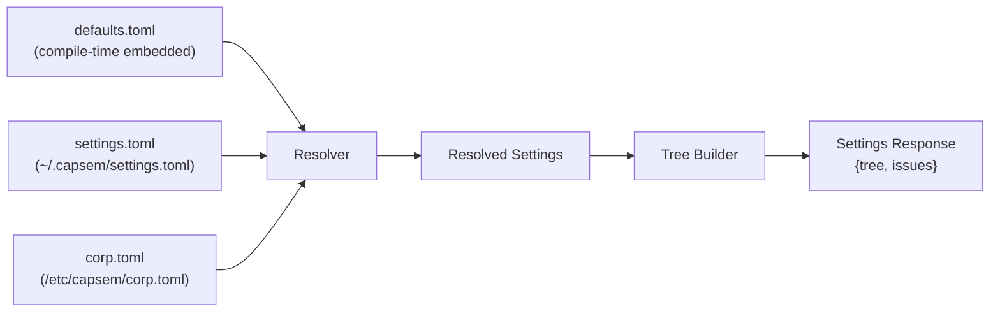
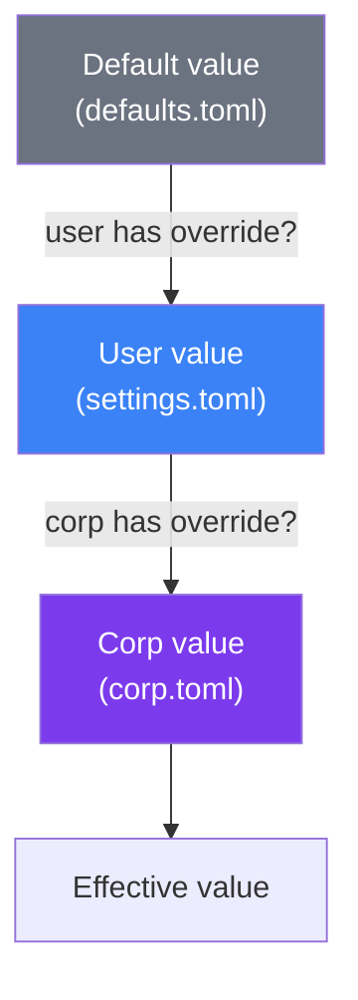
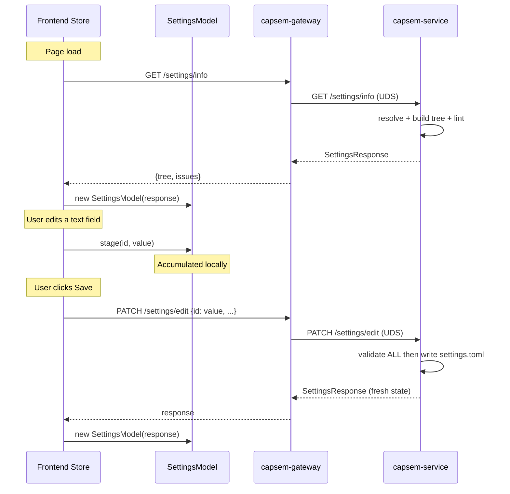
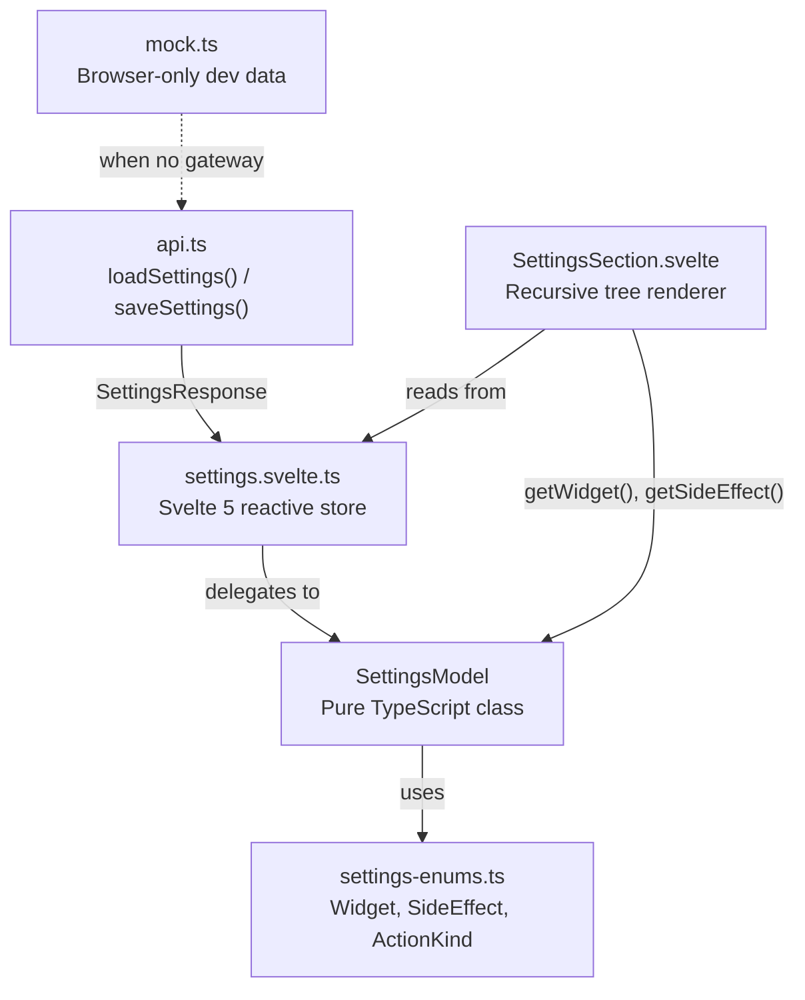
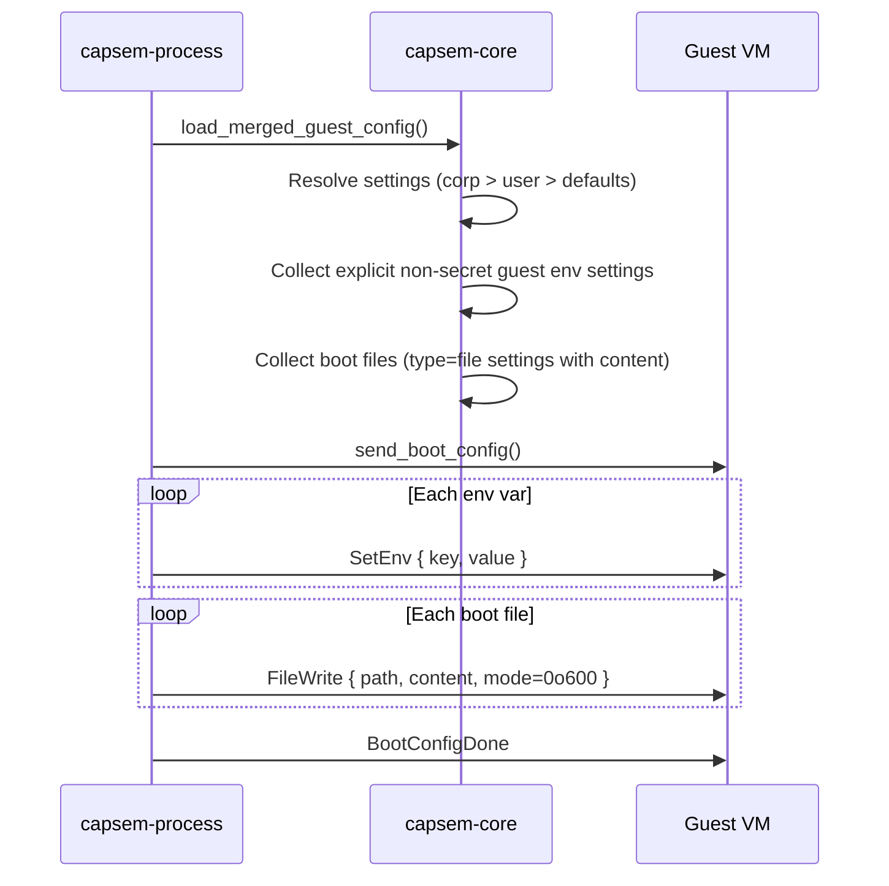
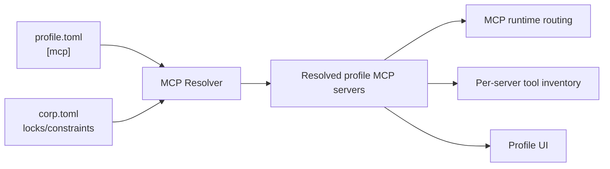

Capsem's settings system controls UI/application preferences: appearance,
notifications, local app behavior, and other service-level preferences that are
not profile runtime truth. VM resources, assets, MCP, provider access,
enforcement, detections, and credential brokerage are owned by profile/corp
contracts plus plugins, not by settings-owned AI provider toggles. Settings are
declared in TOML, merged from defaults, user, and enterprise sources with
enterprise override, and rendered in a dynamic UI.

## File Sources

Three TOML files feed the settings system, merged with a strict priority order:



| File | Location | Purpose | Editable |
|---|---|---|---|
| `defaults.toml` | Embedded at compile time | All built-in settings with types and defaults | No (source code) |
| `settings.toml` | `~/.capsem/settings.toml` | User UI/app preference overrides | Yes (UI + manual) |
| `corp.toml` | `/etc/capsem/corp.toml` | Enterprise lockdown (MDM-distributed) | IT admin only |

Environment variables can override the default settings and corp paths for testing.

## Settings Grammar

The settings TOML uses a formal grammar with four node types, distinguished by key presence:

| Discriminant | Node type | Purpose |
|---|---|---|
| has `type` key | **Leaf** | Setting with a stored value |
| has `action` key | **Action** | UI button/widget, no stored value |
| neither | **Group** | Container that organizes children |

MCP server configuration is profile-owned and may be reflected in profile UI,
but it is not a settings node type.

### Setting types

| Type | Value format | Default widget |
|---|---|---|
| `text` | String | Text input (select if `choices` set) |
| `number` | Integer | Number input with min/max |
| `bool` | Boolean | Toggle switch |
| `password` | String | Masked input with reveal |
| `apikey` | String | Masked input + prefix hint |
| `file` | `{ path, content }` | File editor with syntax highlighting |
| `string_list` | `["a", "b"]` | Chip/tag editor |
| `int_list` | `[1, 2, 3]` | Number list |
| `float_list` | `[1.0, 2.5]` | Number list |

### Action nodes

Action nodes declare UI elements directly in the TOML grammar instead of hardcoding them in the frontend:

```toml
[settings.app.check_update]
name = "Check for updates"
action = "check_update"

```

The UI renders these via a finite `ActionKind` enum -- not string comparison.

### Metadata

Each leaf setting can have a `.meta` sub-table with extra fields:

```toml
[settings.appearance.dark_mode.meta]
widget = "toggle"
side_effect = "toggle_theme"
```

Key metadata fields: `widget` (override default UI widget), `side_effect`
(frontend action on change), `hidden` (exclude from UI but still active for
settings resolution), and `builtin` (non-removable). Static API-key metadata and
provider network policy metadata are retired from settings; credentials are
broker/plugin-owned and network enforcement is rule-owned.

## Value Resolution

Settings are resolved per-key with corp taking highest priority:



**Corp override is final.** When corp.toml sets a value, it becomes `corp_locked: true`. The user cannot change it via the UI.

### Enabled resolution

Settings can be conditionally enabled via a parent toggle:

```
effective_enabled = explicit_enabled AND enabled_by_result
```

- **explicit_enabled**: corp `enabled` field > user `enabled` > defaults `enabled` > `true`
- **enabled_by_result**: if no `enabled_by` pointer, `true`. Otherwise, look up the parent toggle's effective boolean value.

Example: when `repository.providers.github.allow` is `false` (corp-locked off),
child settings such as the repository token field are `enabled: false` and
greyed out in the UI. Provider allow/block behavior is not represented this
way; it is expressed as profile/corp security rules.

### Hidden resolution

Any setting can be hidden from the UI while remaining active for policy:

```
effective_hidden = corp_hidden OR user_hidden OR defaults_hidden
```

Hidden settings are filtered from the tree sent to the frontend but still participate in policy building.

After settings edits, resolution re-runs across the current settings file and
corp locks. Retired behavior bundles and policy maps are no longer settings-owned
objects.

## IPC Protocol

The frontend communicates with the backend via HTTP through capsem-gateway (TCP port 19222), which proxies requests to capsem-service over UDS. Two logical operations handle all settings I/O:



### load_settings

Returns the full `SettingsResponse` in one call:

| Field | Type | Content |
|---|---|---|
| `tree` | `SettingsNode[]` | Hierarchical tree: groups, leaves, actions, MCP servers |
| `issues` | `ConfigIssue[]` | Validation warnings (invalid JSON, invalid paths, blocked setting writes, etc.) |

`SettingsResponse` intentionally does not include behavior bundles, provider status, MCP
policy, security rules, plugins, credentials, or VM behavior. Those belong to
profile/corp contracts, runtime plugin status, or service/VM runtime endpoints.

### save_settings

Accepts a batch of changes as `{ setting_id: value, ... }`. Behavior:

1. **Validate ALL changes upfront** (atomic -- all or nothing)
2. **Reject entire batch** if any change targets a corp-locked setting, uses an unknown ID, or fails validation
3. **Write to settings.toml** in a single file operation
4. **Return fresh `SettingsResponse`** reflecting the new state

Bool toggles use `save_settings` immediately. Text, number, file, and list
changes accumulate locally and are sent as a batch when the user clicks Save.

Security rules are stored under `profiles.rules`, `corp.rules`, or referenced
rule files. A profile can point at shared rule packs:

```toml
[rule_files]
enforcement = "profiles/base/enforcement.toml"
sigma = "profiles/base/detection.yaml"
```

Profile rule edits use the profile enforcement endpoints, not the settings save
endpoint.

## Frontend Architecture

The frontend separates logic from rendering through three layers:



| Layer | File | Responsibility |
|---|---|---|
| **Enums** | `settings-enums.ts` | Typed enums matching Rust serde output (Widget, SideEffect, ActionKind, SettingType) |
| **Model** | `settings-model.ts` | Pure TypeScript -- parsing, indexing, widget resolution, pending changes, validation. No Svelte dependency. Fully unit-tested. |
| **Store** | `settings.svelte.ts` | Thin Svelte 5 wrapper -- reactive state, IPC calls, delegates to SettingsModel |
| **View** | `SettingsSection.svelte` | Recursive renderer -- dispatches on `node.kind` (group/leaf/action) and `Widget` enum |

The model class is independently testable (43 vitest tests) and works identically whether talking to the gateway or using mock data.

## Boot-Time Config Materialization

At VM boot, resolved settings are translated into the limited non-secret
environment variables and files that are allowed to enter the guest:



Key behaviors:

- **API keys and provider credentials are never settings materialized boot
  secrets.** They are detected, substituted, and audited by the credential
  broker plugin using opaque BLAKE3 references.
- **Profile/corp rules control network access.** HTTP, DNS, MCP, model, file,
  and process events are blocked or allowed by `SecurityRuleSet` over canonical
  `SecurityEvent` fields.
- **File permissions** default to `0o600` (owner-only) for sensitive explicit
  boot files such as SSH keys.
- **Static AI CLI config-file injection is retired.** Tool/provider
  observations belong to runtime plugin/security-ledger evidence, not
  settings-owned provider files.

## MCP Server Definitions

MCP servers are profile configuration. The UI may display MCP profile config
through profile routes, but settings do not own or merge MCP runtime truth and
the settings tree never contains MCP server nodes:



Resolution is profile-first with corp constraints. Example profile entry:

```toml
[mcp.capsem]
name = "Capsem"
description = "Built-in Capsem MCP server for file and snapshot tools"
transport = "stdio"
command = "/run/capsem-mcp-server"
builtin = true
```

Enterprises can add MCP servers via corp-owned profile configuration:

```toml
[mcp.internal_tools]
name = "Internal Tools"
transport = "stdio"
command = "/opt/acme/mcp-server"
args = ["--config", "/etc/acme.json"]
```

## Security Rules

Security rules live outside ordinary `settings` leaves. They are resolved from
profile/corp enforcement TOML and Sigma detection YAML. Corp rules keep
corporate priority and lock semantics; profile/user rules run after corp rules,
and built-in default rules run last.

See [Policy](/security/policy/) for rule syntax, first-party `SecurityEvent`
fields, actions, priorities, Sigma import, examples, and telemetry.

## Corp Lockdown

Enterprise administrators distribute `corp.toml` via MDM. It controls:

| Capability | How |
|---|---|
| **Force a value** | Set the key in corp.toml -- user cannot override |
| **Disable provider traffic** | Add a corp/profile enforcement rule that matches the provider boundary and uses `action = "block"` |
| **Hide a setting** | Set `hidden = true` on the override entry |
| **Add MCP servers** | Add entries to `[mcp]` section -- user cannot remove |
| **Disable MCP servers** | Set `enabled = false` on a server definition |

Enforcement is **exclusively in the backend**. The frontend disables controls for visual feedback but never validates corp locks itself. The `save_settings` command rejects any batch containing a corp-locked change.

## Gateway API

The desktop frontend talks to `capsem-gateway`, which proxies HTTP requests to
`capsem-service` over UDS:

| Endpoint | Purpose |
|---|---|
| `GET /settings/info` | Returns `SettingsResponse` with `tree` and `issues`. |
| `PATCH /settings/edit` | Accepts a batch of settings-only changes and returns fresh `SettingsResponse`. |
