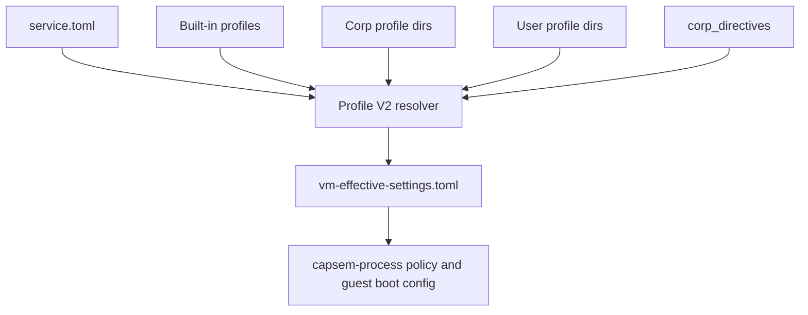

# Settings Architecture

Capsem settings are Profile V2-only. Host state lives in `service.toml` and
profile TOML files; VM runtime state is a resolved, session-local
`vm-effective-settings.toml` attachment.

There are two different contracts:

| Contract | Scope | Owned by |
|---|---|---|
| Service settings | App/service control plane: profile roots, default profile, catalog source, telemetry export, remote policy plugin config, credential references, and asset/cache locations. | `service.toml` plus `capsem.service-settings.v2` schema |
| Profiles | VM/session product policy: package and tool assumptions, VM resources, AI providers, MCP servers, skills, security capabilities, and policy rules. | Profile V2 payloads plus signed profile catalog |

Do not put VM/session policy into service settings. Do not put service-wide
profile roots, telemetry endpoints, or credential backend configuration into a
profile.

## Sources



`service.toml` selects the default profile, declares profile roots, stores
credential references, and carries corp directives. Profile files describe
capabilities, AI providers, standard MCP servers, VM resources, and policy
rules.

Profiles also carry an `editable` block for section-level governance. Each
boolean marks whether user-facing mutation routes may change that section after
the profile is selected or forked. For example, a corp profile can allow
`editable.skills = true` and `editable.mcpServers = true` while keeping
`editable.ai = false` and `editable.security_rules = false`. Forks preserve the
same editability map, and profile update routes cannot mutate the map itself.

## Service Settings V2

Service settings use schema id `capsem.service-settings.v2`. The committed
schema artifact is:

```text
schemas/capsem.service-settings.v2.schema.json
```

The Python admin model is `ServiceSettingsV2` in
`src/capsem/builder/service_settings.py`. JSON enters through Pydantic
`model_validate_json()` and JSON leaves through `model_dump_json()`. TOML is
parsed once and immediately validated through the same Pydantic model.

The supported admin commands are:

```bash
capsem-admin settings init --out service.toml
capsem-admin settings schema
capsem-admin settings validate service.toml
capsem-admin settings validate service.toml --json
capsem-admin settings doctor service.toml
capsem-admin settings doctor service.toml --json
```

`settings init` writes a valid JSON or TOML draft from the typed
`ServiceSettingsV2` model. Use `--base-dir`, `--corp-dir`, `--user-dir`,
`--default-profile`, and `--assets-dir` to seed the service control plane
without hand-authoring the initial shape.

`settings doctor` reports the schema id, default profile, profile-catalog
configuration, telemetry state, remote-policy state, and credential backend
without printing credential values.

Profile V2 admin commands currently include:

```bash
capsem-admin profile init corp-dev --out corp-dev.profile.json
capsem-admin profile init corp-dev --out corp-dev.profile.toml
capsem-admin profile schema
capsem-admin profile validate corp-dev.profile.json
capsem-admin profile validate corp-dev.profile.json --json
```

`profile init` writes a valid JSON or TOML draft for the selected profile id.
The draft uses Profile V2 defaults, includes both release architectures, and
should be edited before signing or publishing.

Service settings accept only the V2 shape. Legacy defaults JSON, old v1 policy
config, asset-manifest settings, and ad hoc builder settings are not runtime
compatibility inputs.

## Resolution

1. Load `service.toml`, defaulting missing fields.
2. Discover built-in, corp, and user profiles from the configured roots.
3. Resolve the selected profile inheritance chain.
4. Merge profile values from base to leaf.
5. Apply corp directives after profile inheritance.
6. Emit `vm-effective-settings.toml` into the session directory.

The VM process reads only the session attachment. It does not reopen host
settings files at runtime.

## Policy

Policy rules are authored in Profile V2 sections such as:

```toml
[security.rules.http.block_secret]
on = "http.request"
if = "request.data.contains_secret"
decision = "block"
priority = 10
```

Provider and MCP server toggles can also emit derived rules. Corp profiles
may author corp-priority rules; user profiles are limited to user-priority
ranges.

## MCP

MCP runtime configuration is projected from the effective profile:

- server configuration comes from the profile's standard `mcpServers` map;
- default tool behavior comes from the `mcp_tools` capability;
- per-tool rules come from `mcp.request` rules.

`mcpServers` uses the same top-level shape as common MCP client configs:
stdio servers define `command`, `args`, and `env`; remote servers define `url`,
`headers`, and `bearerToken`. Capsem-only governance belongs under the adjacent
`capsem` object, for example `mcpServers.github.capsem.allowed_tools`.

No standalone MCP settings file is loaded by the VM process.

## Operational Rules

- Setup writes `service.toml` and installs corp profiles under configured
  corp profile roots.
- Support bundles redact `service.toml` and profile TOML.
- Runtime uninstall preserves `service.toml`, profile roots, assets, logs,
  sessions, and persistent VM state.
- Product purge removes the entire Capsem home.
