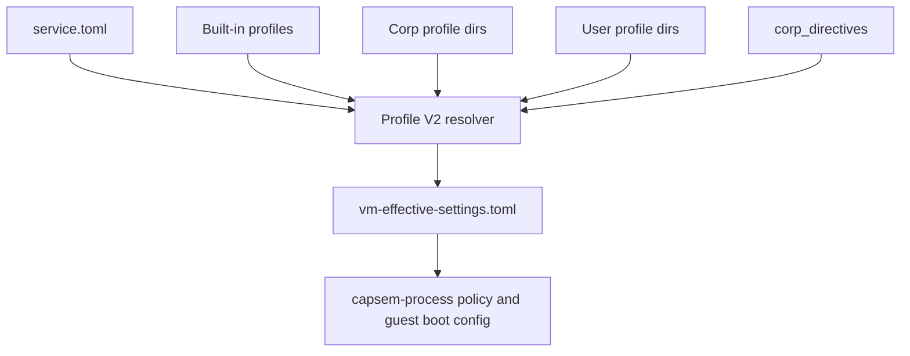

# Settings Architecture

Capsem settings are Profile V2-only. Host state lives in `service.toml` and
profile TOML files; VM runtime state is a resolved, session-local
`vm-effective-settings.toml` attachment.

## Sources



`service.toml` selects the default profile, declares profile roots, stores
credential references, and carries corp directives. Profile files describe
capabilities, AI providers, MCP connectors, VM resources, and policy rules.

## Resolution

1. Load `service.toml`, defaulting missing fields.
2. Discover built-in, corp, and user profiles from the configured roots.
3. Resolve the selected profile inheritance chain.
4. Merge profile values from base to leaf.
5. Apply corp directives after profile inheritance.
6. Emit `vm-effective-settings.toml` into the session directory.

The VM process reads only the session attachment. It does not reopen host
settings files at runtime.

## Policy

Policy rules are authored in Profile V2 sections such as:

```toml
[security.rules.http.block_secret]
on = "http.request"
if = "request.data.contains_secret"
decision = "block"
priority = 10
```

Provider and MCP connector toggles can also emit derived rules. Corp profiles
may author corp-priority rules; user profiles are limited to user-priority
ranges.

## MCP

MCP runtime configuration is projected from the effective profile:

- connector enablement comes from `mcp.connectors`;
- default tool behavior comes from the `mcp_tools` capability;
- per-tool rules come from `mcp.request` rules.

No standalone MCP settings file is loaded by the VM process.

## Operational Rules

- Setup writes `service.toml` and installs corp profiles under configured
  corp profile roots.
- Support bundles redact `service.toml` and profile TOML.
- Runtime uninstall preserves `service.toml`, profile roots, assets, logs,
  sessions, and persistent VM state.
- Product purge removes the entire Capsem home.
