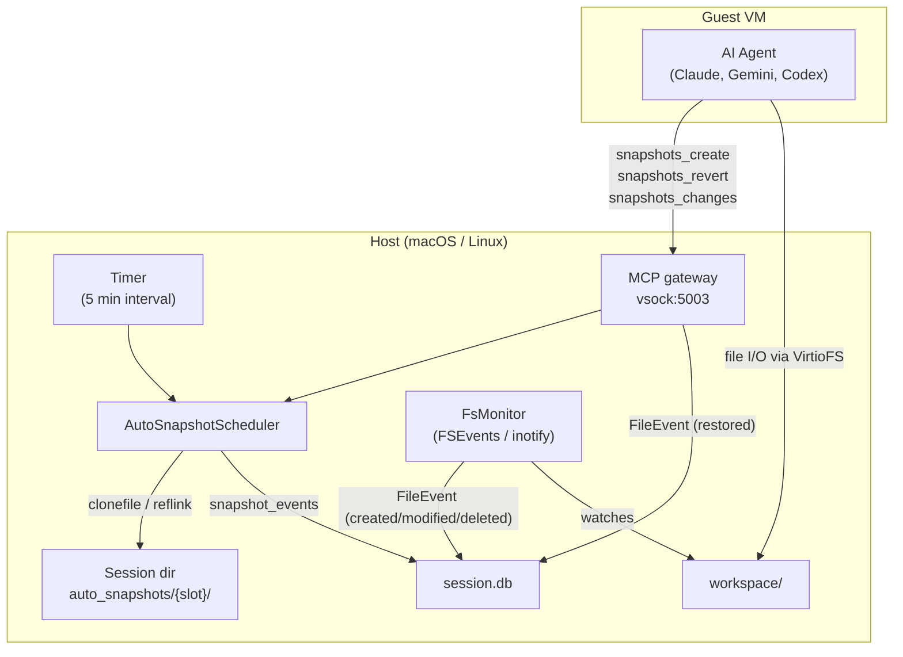
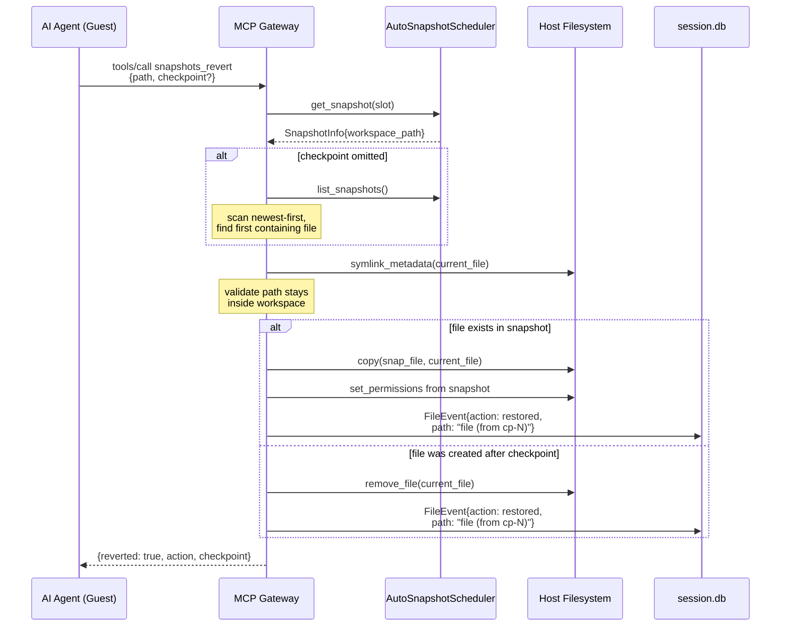
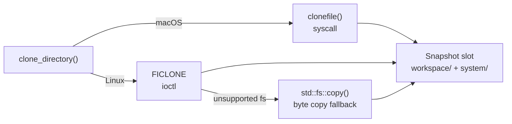

Capsem takes periodic copy-on-write snapshots of the shared workspace so AI agents can recover files, compare changes, and roll back mistakes. Snapshots use APFS clonefile on macOS (reflinks on Linux), consuming almost no extra disk space until files diverge.

## System overview



## Dual-pool architecture

Every session has two snapshot pools managed by the `AutoSnapshotScheduler`:

| Pool | Slots | Managed by | Behavior |
|------|-------|------------|----------|
| **Auto** | 10 (default) | Timer | Rolling ring buffer, taken every 5 minutes. Oldest overwritten when full. |
| **Manual** | 12 (default) | AI agent | Named checkpoints created on demand via MCP tools. Persist until deleted. |

Auto slots are numbered `0..max_auto-1`, manual slots `max_auto..max_auto+max_manual-1`. The ring buffer advances `next_auto_slot = (next_auto_slot + 1) % max_auto` after each auto snapshot.

## Storage layout

```
~/.capsem/sessions/<session-id>/
  workspace/              # Live VirtioFS shared directory
  auto_snapshots/
    0/                    # auto slot 0
      workspace/          # CoW clone of session workspace
      system/             # CoW clone of system image
      metadata.json       # {slot, timestamp, epoch_secs, epoch_millis, origin, name, hash}
    1/                    # auto slot 1
    ...
    10/                   # manual slot 0 (offset by auto_max)
```

Each `metadata.json` contains:

| Field | Type | Notes |
|-------|------|-------|
| `slot` | `usize` | Absolute slot index |
| `timestamp` | `String` | ISO 8601 |
| `epoch_secs` | `u64` | Unix seconds |
| `epoch_millis` | `u128` | Precise milliseconds for sort order |
| `origin` | `"auto"` or `"manual"` | Pool membership |
| `name` | `String?` | Human label (manual only) |
| `hash` | `String?` | Blake3 of workspace manifest (manual only, skipped for auto) |

## Revert flow

When an AI agent calls `snapshots_revert`, the following sequence occurs:



Key properties:
- Reverts are logged as `restored` file events in the session DB, including which checkpoint was used
- Path validation uses `canonicalize()` to prevent symlink escape (see [Symlink Safety](#symlink-safety))
- File permissions are restored from the snapshot metadata

## Session database integration

Every snapshot writes a row to the `snapshot_events` table. Every file change (including reverts) writes to `fs_events`. This decouples the stats UI from the MCP gateway -- the frontend queries SQL directly.

### fs_events schema

```sql
CREATE TABLE fs_events (
    id INTEGER PRIMARY KEY AUTOINCREMENT,
    timestamp TEXT NOT NULL,
    action TEXT NOT NULL,   -- 'created', 'modified', 'deleted', 'restored'
    path TEXT NOT NULL,
    size INTEGER
);
```

The `action` field has four values:

| Action | Source | Description |
|--------|--------|-------------|
| `created` | FsMonitor | New file detected in workspace |
| `modified` | FsMonitor | Existing file content changed |
| `deleted` | FsMonitor | File removed from workspace |
| `restored` | MCP gateway | File reverted from a snapshot checkpoint |

For `restored` events, the `path` field includes the source checkpoint: `"src/main.py (from cp-3)"`. This makes it easy to trace which snapshot was used for recovery.

### snapshot_events schema

```sql
CREATE TABLE snapshot_events (
    id INTEGER PRIMARY KEY AUTOINCREMENT,
    timestamp TEXT NOT NULL,
    slot INTEGER NOT NULL,
    origin TEXT NOT NULL,
    name TEXT,
    files_count INTEGER DEFAULT 0,
    start_fs_event_id INTEGER DEFAULT 0,
    stop_fs_event_id INTEGER DEFAULT 0
);
```

### Cross-reference with fs_events

Each snapshot stores a self-contained file event range `(start_fs_event_id, stop_fs_event_id]`:

- `stop_fs_event_id` = `MAX(fs_events.id)` at snapshot time
- `start_fs_event_id` = previous snapshot's `stop_fs_event_id` (or 0 for the first)

**Manual snapshots always use `start_fs_event_id = 0`.** Unlike auto snapshots which form a sequential chain, manual checkpoints are point-in-time forks. Setting start to 0 means they carry the full session's change history, which is essential when forking a session from a manual checkpoint.

The frontend computes per-snapshot change counts with a single query:

```sql
SELECT
  (SELECT COUNT(*) FROM fs_events
   WHERE id > s.start_fs_event_id AND id <= s.stop_fs_event_id
   AND action = 'created') as created,
  (SELECT COUNT(*) FROM fs_events
   WHERE id > s.start_fs_event_id AND id <= s.stop_fs_event_id
   AND action = 'modified') as modified,
  (SELECT COUNT(*) FROM fs_events
   WHERE id > s.start_fs_event_id AND id <= s.stop_fs_event_id
   AND action = 'deleted') as deleted,
  (SELECT COUNT(*) FROM fs_events
   WHERE id > s.start_fs_event_id AND id <= s.stop_fs_event_id
   AND action = 'restored') as restored
FROM snapshot_events s
WHERE s.id IN (SELECT MAX(id) FROM snapshot_events GROUP BY slot)
```

The `MAX(id) GROUP BY slot` filter deduplicates the ring buffer -- when slot 0 is overwritten, only the latest row is returned.

## Cloning backends

Snapshot creation calls `clone_directory()` which dispatches to a platform-specific backend:

| Platform | Backend | Mechanism |
|----------|---------|-----------|
| macOS | APFS | `clonefile()` syscall -- instant CoW clone, zero extra disk until divergence |
| Linux | Reflink | `FICLONE` ioctl -- falls back to byte copy if filesystem doesn't support reflinks |



## Symlink safety

All host-side code that operates on workspace paths uses `symlink_metadata()` instead of `metadata()` to avoid following symlinks created by the guest. This prevents:

- **Infinite recursion** from symlink loops (e.g., `.venv/lib64 -> lib`)
- **Sandbox escape** from absolute symlinks (e.g., `host_root -> /`)
- **Information disclosure** from symlinks to host files

The `snapshots_revert` handler additionally validates that the resolved path stays within the workspace root using `canonicalize()` + `starts_with()`.

| Code path | Protection |
|-----------|------------|
| `disk_usage_bytes` / `dir_size` | `symlink_metadata()` -- never follows links |
| `snapshots_revert` | `canonicalize()` + workspace boundary check |
| `FsMonitor` | Should use `symlink_metadata()` (tracked for hardening) |
| `clone_directory` / `compact` | Should skip or preserve symlinks (tracked for hardening) |

## Configuration

| Setting | Default | Description |
|---------|---------|-------------|
| `vm.snapshots.auto_max` | `10` | Maximum auto snapshot slots |
| `vm.snapshots.manual_max` | `12` | Maximum manual snapshot slots |
| `vm.snapshots.auto_interval` | `300` | Seconds between auto snapshots |

Settings are loaded from the merged config at VM boot time and cannot be changed mid-session.

## MCP tool routing

Snapshot tools are "builtin" MCP tools routed by the gateway without an external server. They run on `spawn_blocking` threads to avoid starving the tokio runtime (directory cloning and walkdir are blocking I/O). See [the usage guide](/usage/snapshots/) for the CLI and MCP tool reference.
