| Artifact | Path |
|---|---|
| VM lifecycle | `benchmarks/lifecycle/data_1.3.1782571508.json` |
| Fork lifecycle | `benchmarks/fork/data_1.3.1782571508.json` |
| Guest benchmark | `benchmarks/capsem-bench/data_1.3.1782571508_arm64.json` |
| Route latency | `benchmarks/route-latency/data_1.3.1782571508.json` |

## VM lifecycle

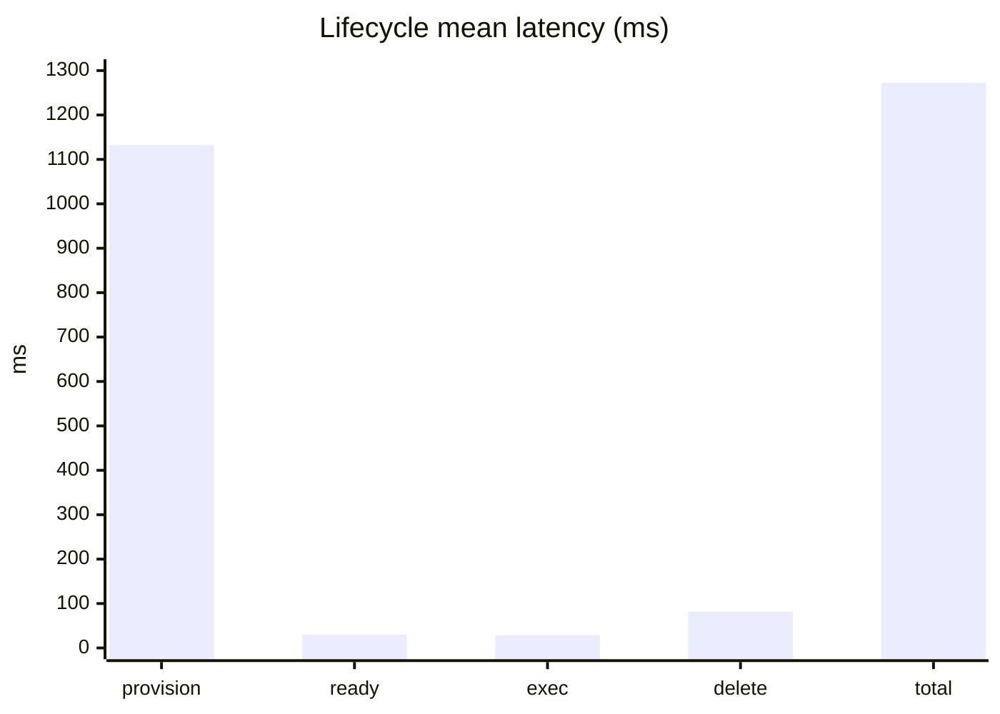

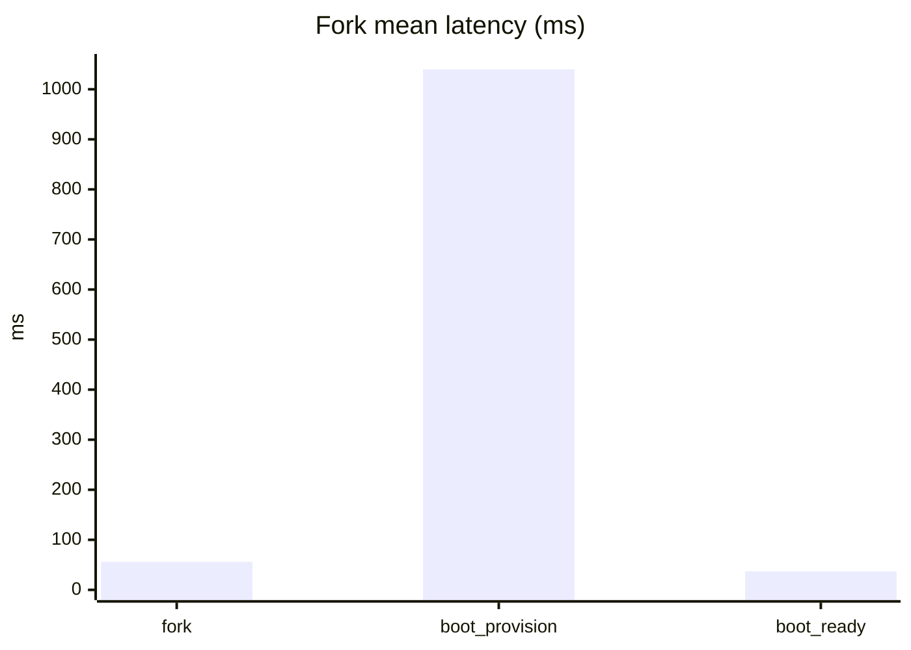

| Metric | Mean | p50 | p95 | Max |
|---|---:|---:|---:|---:|
| provision | 1132.2ms | 1094.9ms | 1196.1ms | 1207.3ms |
| exec_ready | 30.2ms | 30.3ms | 31.0ms | 31.1ms |
| exec | 28.5ms | 28.4ms | 28.8ms | 28.8ms |
| delete | 81.7ms | 78.2ms | 89.9ms | 91.2ms |
| total | 1272.6ms | 1232.4ms | 1344.7ms | 1357.2ms |
| fork | 55.9ms | - | - | 59.9ms |
| boot_provision | 1039.9ms | - | - | 1064.7ms |
| boot_ready | 37.0ms | - | - | 39.3ms |

## Disk

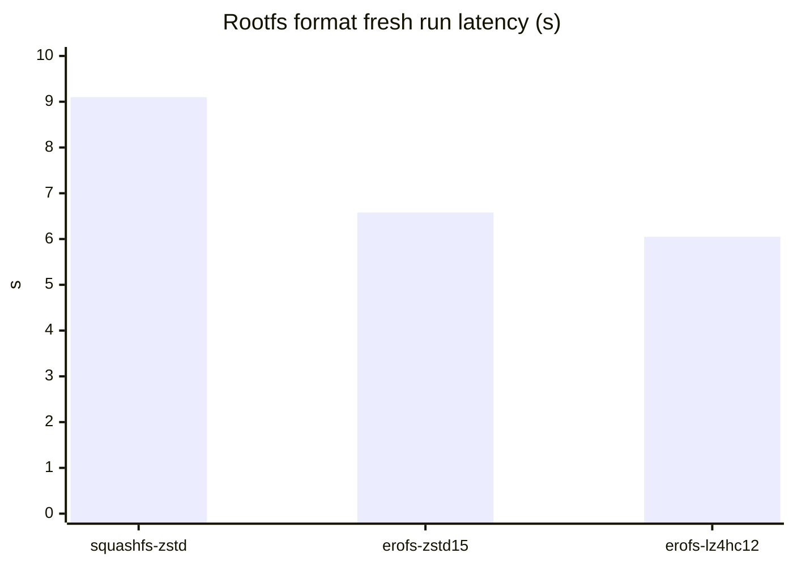

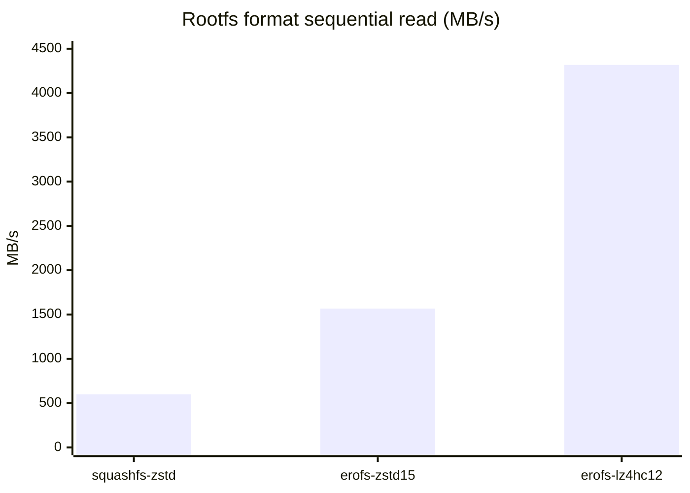

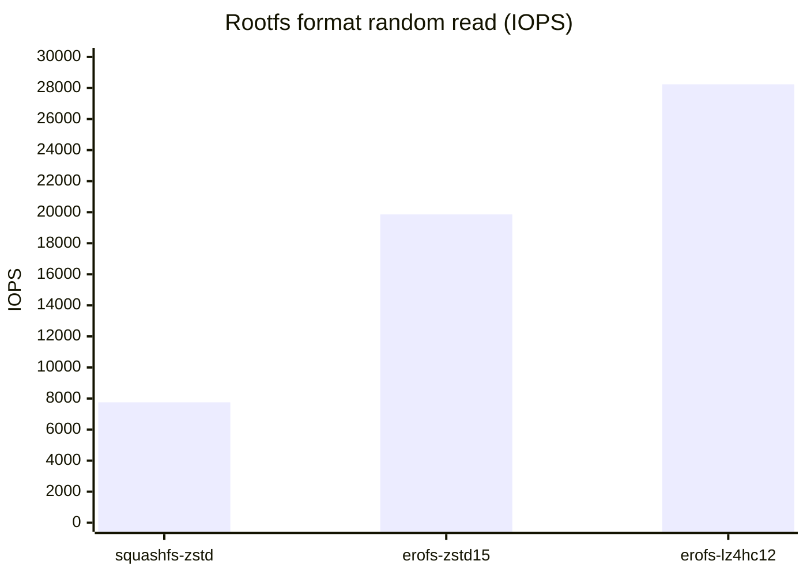

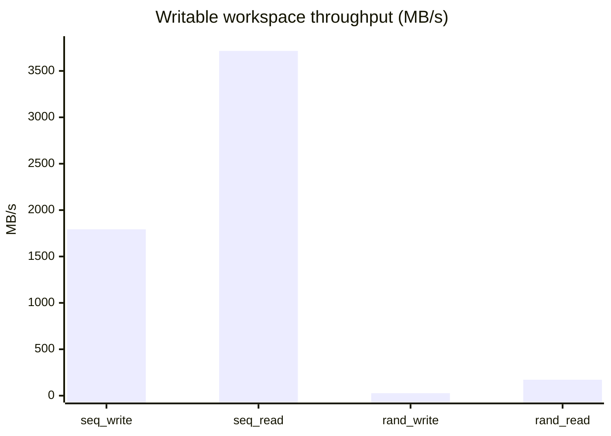

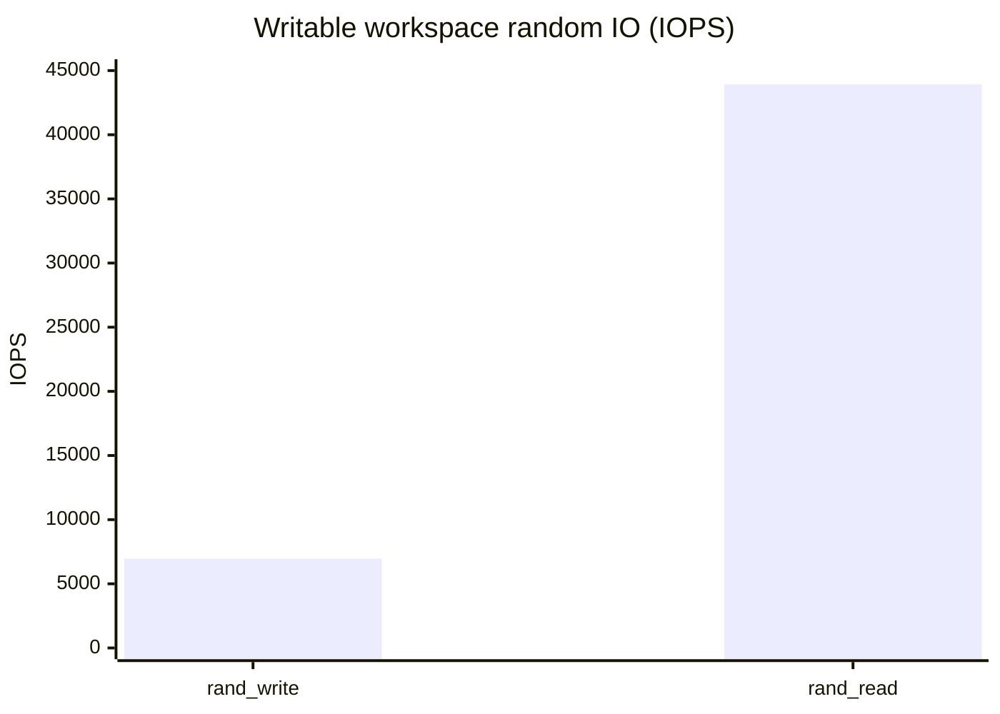

| Metric | Value |
|---|---:|
| EROFS lz4hc-12 rootfs size | 720.5 MiB |
| EROFS lz4hc-12 fresh run | 6.05s |
| Rootfs largest binary sequential read | 2541.9 MB/s |
| Rootfs random 4K read | 29045.2 IOPS |
| Workspace sequential write | 1792.8 MB/s |
| Workspace sequential read | 3715.8 MB/s |
| Workspace random 4K write | 6959.0 IOPS |
| Workspace random 4K read | 43921.1 IOPS |

## App

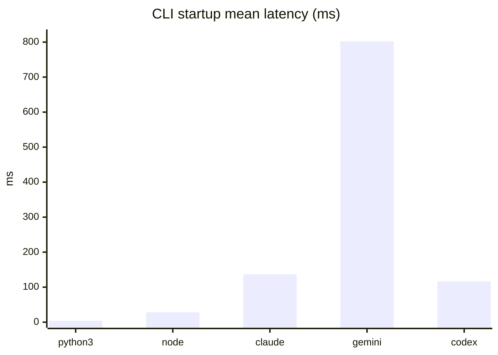

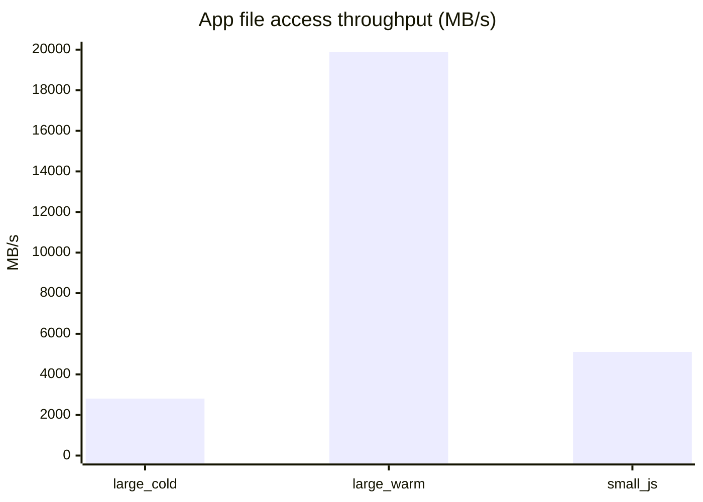

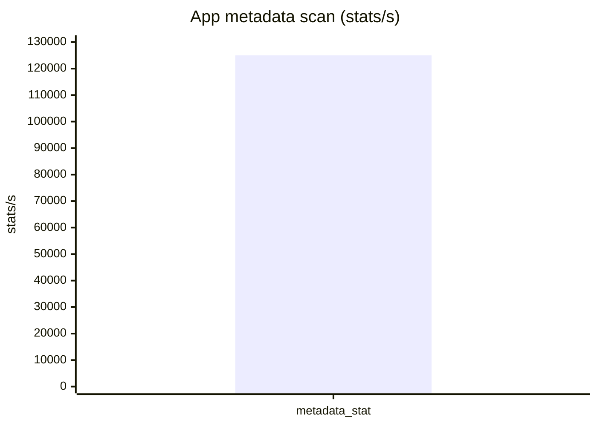

| Metric | Min | Mean | Max |
|---|---:|---:|---:|
| python3 --version | 3.4ms | 3.8ms | 4.4ms |
| node --version | 26.9ms | 28.1ms | 29.0ms |
| claude --version | 134.8ms | 137.0ms | 138.2ms |
| gemini --version | 772.6ms | 802.3ms | 818.0ms |
| codex --version | 85.3ms | 116.9ms | 134.3ms |
| small JS reads | - | 572625.7 ops/s | - |
| metadata stat | - | 125012.6 stats/s | - |

## Network

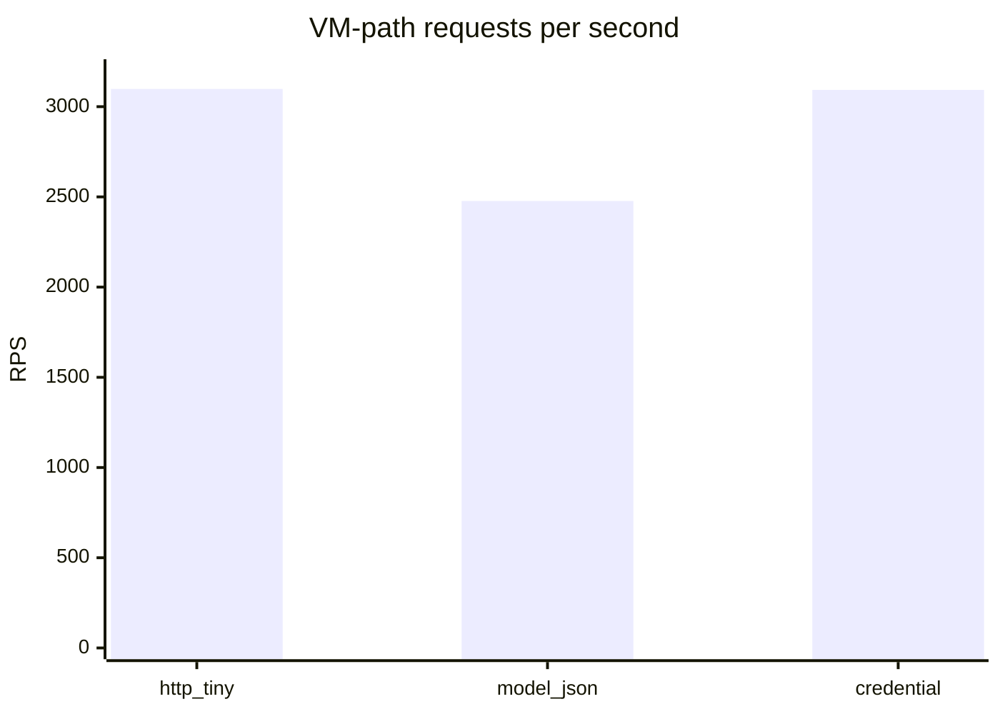

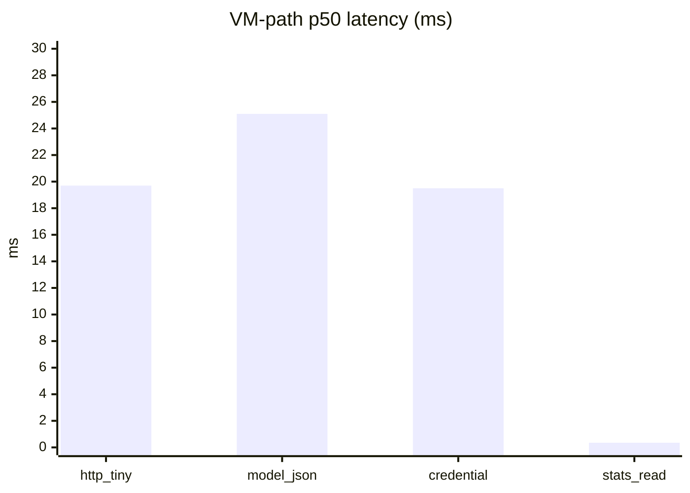

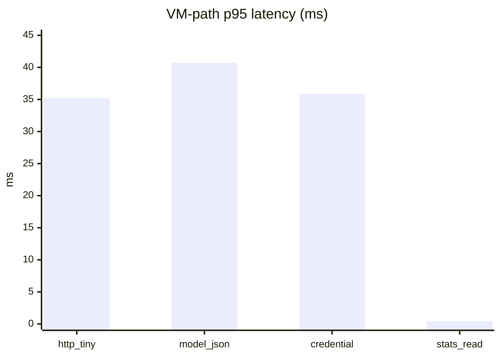

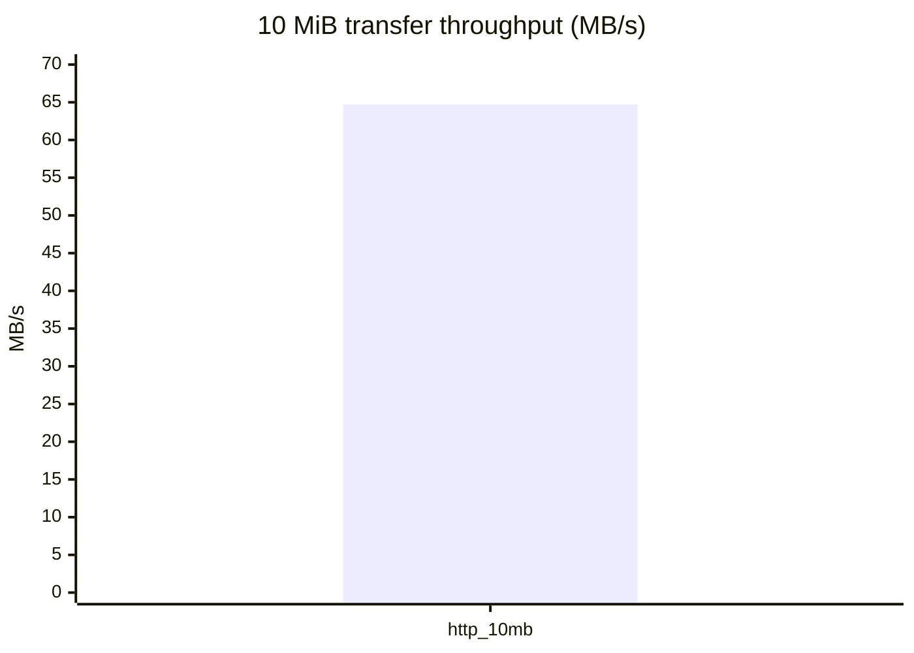

| Scenario | Success | RPS | Throughput | p50 | p95 | p99 |
|---|---:|---:|---:|---:|---:|---:|
| HTTP tiny | 50000/50000 | 3098.3 | 0.071 MB/s | 19.7ms | 35.2ms | 45.4ms |
| model_json_response | 50000/50000 | 2477.2 | 1.512 MB/s | 25.1ms | 40.7ms | 51.7ms |
| credential_response | 50000/50000 | 3092.8 | 0.652 MB/s | 19.5ms | 35.9ms | 45.5ms |
| service /stats read | 160/160 | - | - | 0.352ms | 0.449ms | 0.474ms |
| 10 MiB transfer | 1/1 | - | 64.7 MB/s | - | - | - |
