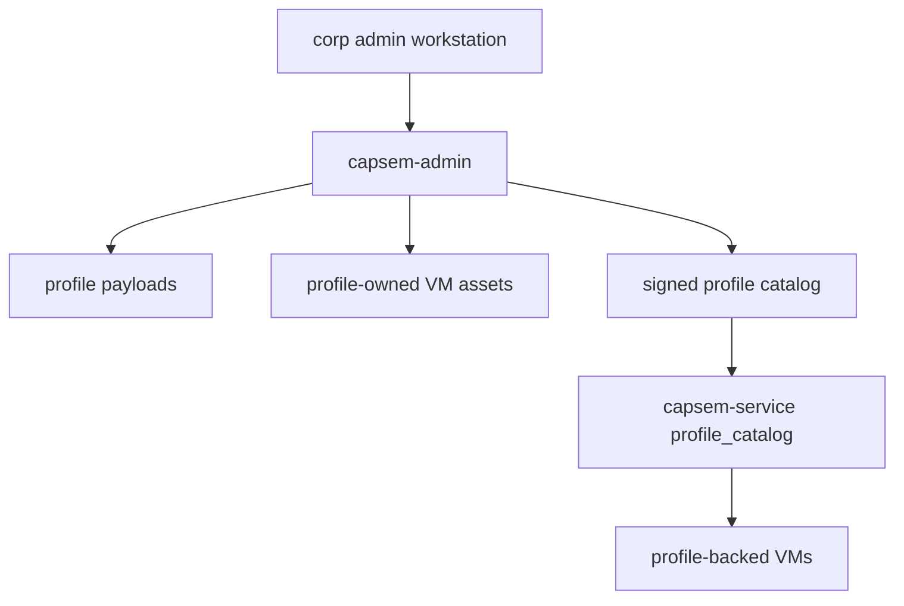

Corporate deployments publish signed profiles and catalogs instead of asking
users to edit VM image settings by hand.

## Deployment Shape

Admins usually maintain:

- base profile root for vendor/built-in defaults;
- corp profile root for locked enterprise policy;
- user profile root when local forks are allowed;
- hosted profile payloads and VM assets;
- a signed profile catalog URL configured in service settings.

## Rollout

1. Draft or update a profile.
2. Validate it with `capsem-admin profile validate`.
3. Build or verify profile-owned assets.
4. Generate and check the manifest.
5. Sign and publish the manifest.
6. Run `capsem update --assets` or wait for the service catalog check.
7. Confirm `/profiles/catalog`, `/status`, and the UI show the new state.

Use `active` for the offered revision, `deprecated` to shelter existing VMs
with warnings, and `revoked` to block install/update/new launch.

## Locks And Editable Sections

Profiles expose booleans for editable sections. A corp profile can allow users
to add skills or MCP servers while keeping AI providers, VM assets, enforcement
rules, and detection packs locked.

Rule mutation errors include the owner path, such as
`Forbidden security.capabilities.network_egress`, so operators can explain why
a generated or corp-owned rule cannot be changed.

## Custom Images

Do not hand-edit image settings for release images. The profile is the source
of truth. Use `capsem-admin image plan/build/verify/sbom`, publish the
resulting assets, and reference them from the profile catalog.

