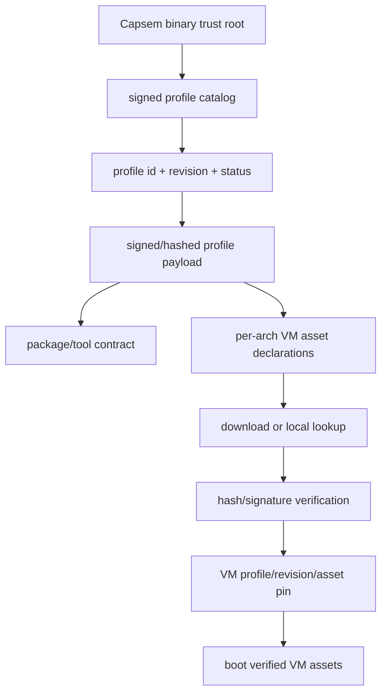

Profiles own VM assets. The signed catalog tells Capsem which profile revisions
exist, which payloads are trusted, and which asset hashes a VM may boot.

## Asset Chain



The VM pin is persistent. Updating the catalog does not silently move an
existing VM to a new profile revision.

## Profile Payload

Profile payloads declare:

- profile id and revision;
- lifecycle status: `active`, `deprecated`, or `revoked`;
- editable sections;
- package/tool requirements;
- MCP server entries;
- enforcement and detection packs;
- per-architecture VM assets.

Unknown fields are rejected by `capsem.profile.v2` validation.

## VM Asset Declarations

Each supported arch declares the assets needed to boot:

```toml
[vm.assets.arm64.vmlinuz]
url = "https://profiles.example.com/assets/arm64/vmlinuz"
hash = "blake3:<64 hex chars>"
size = 7797248

[vm.assets.arm64.initrd]
url = "https://profiles.example.com/assets/arm64/initrd.img"
hash = "blake3:<64 hex chars>"
size = 2314963

[vm.assets.arm64.rootfs]
url = "https://profiles.example.com/assets/arm64/rootfs.squashfs"
hash = "blake3:<64 hex chars>"
size = 454230016
```

All release arches must be declared unless the profile is intentionally
single-arch and the manifest marks compatibility accordingly.

## Build And Verify

```bash
capsem-admin profile validate profiles/corp-dev.profile.toml --json
capsem-admin image plan profiles/corp-dev.profile.toml --json
capsem-admin image build profiles/corp-dev.profile.toml --arch all --json
capsem-admin image verify profiles/corp-dev.profile.toml --assets-dir assets/ --json
capsem-admin image sbom profiles/corp-dev.profile.toml --assets-dir assets/ --out-dir sboms/
```

Omitting `--arch` means all supported release architectures. `--arch arm64` is
a narrowing override for local iteration.

`image verify` checks:

- declared asset files exist;
- hashes and sizes match the profile;
- package/tool inventory satisfies the profile contract;
- image doctor bundles, if supplied, match the expected VM behavior.

## Manifest Workflow

```bash
capsem-admin manifest generate --profiles profiles/ --base-url https://profiles.example.com/catalog/ --out manifest.json
capsem-admin manifest check manifest.json --fast --json
capsem-admin manifest check manifest.json --download --download-dir downloaded/ --pubkey profile-sign.pub --json
capsem-admin manifest sign manifest.json --key manifest-sign.key --out manifest.json.minisig
capsem-admin manifest verify-signature manifest.json --signature manifest.json.minisig --pubkey manifest-sign.pub --json
```

`--fast` uses HTTP `HEAD` reachability and metadata checks. `--download`
downloads profile payloads and assets, verifies every byte, and should be part
of release or corp publication gates.

## Rootfs Dependencies

Rootfs dependencies are derived from the profile package/tool contract. Do not
hand-edit release images and then try to document the drift. Add the package,
CLI, MCP dependency, or file requirement to the profile, rebuild, verify, and
publish a new signed revision.

If a package is required for a control to work, the profile should carry both:

- the package/tool requirement;
- the enforcement/detection or MCP rule that assumes it exists.

That keeps enterprise rollouts auditable: a profile revision describes both the
VM contents and the security assumptions made about those contents.

## Cleanup And Retention

Asset cleanup must preserve:

- assets referenced by installed `active` or `deprecated` profile revisions;
- assets pinned by existing VMs;
- assets currently being downloaded or verified.

Assets referenced only by absent or revoked revisions can be removed after the
service proves no existing VM pin depends on them.
