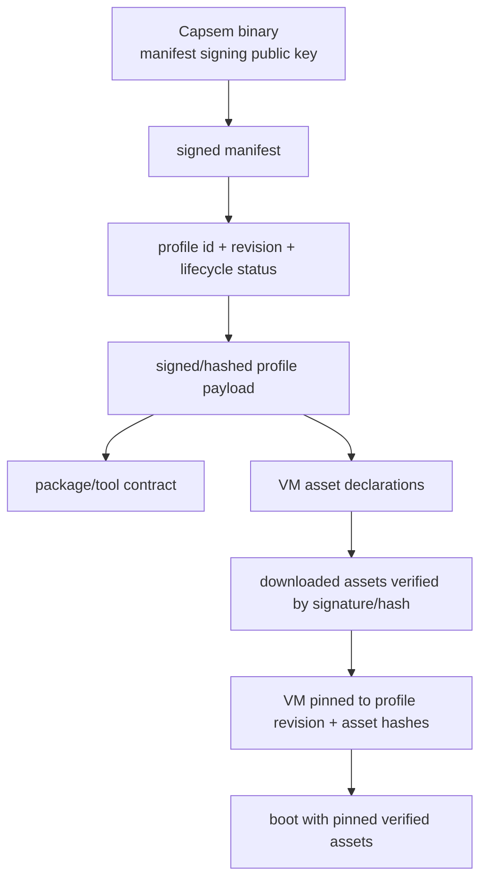

The profile catalog is a signed manifest of profiles and revisions. It tells
Capsem which revisions exist, which revision is current, and whether each
revision is `active`, `deprecated`, or `revoked`.

## Trust Chain



Compact form: binary trust root -> signed manifest -> profile
id/revision/status -> verified profile payload -> package/tool contract +
asset declarations -> verified downloaded assets -> VM profile/revision/asset
pin -> boot.

## Status Semantics

| `ProfileRevisionStatus` | Behavior |
|---|---|
| `active` | Install/update and allow new VMs. |
| `deprecated` | Keep installed, warn, allow existing VMs, avoid as default. |
| `revoked` | Block install/update and block VM launch. |

There is no `removed` status. Removing a revision from the manifest means it is
absent. If a listed revision must not be used, mark it `revoked`.

## Admin Workflow

```bash
capsem-admin manifest generate \
  --profiles profiles/ \
  --base-url https://profiles.example.com/catalog/ \
  --out manifest.json

capsem-admin manifest check manifest.json --fast --json
capsem-admin manifest check manifest.json --download --json
```

`--fast` uses bounded HTTP HEAD checks for reachability and metadata. Use
`--download` to fetch bytes and verify profile payloads/assets before rollout.

## Runtime Behavior

- `capsem update --assets` asks the service to reconcile the selected profile.
- Service startup can schedule catalog checks from service settings.
- First profile use downloads only the assets required by that profile.
- Cleanup preserves assets referenced by installed active/deprecated revisions
  and existing VM pins.
- New VMs refuse missing, incompatible, or revoked profile revisions.

