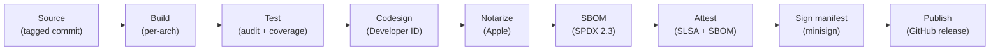
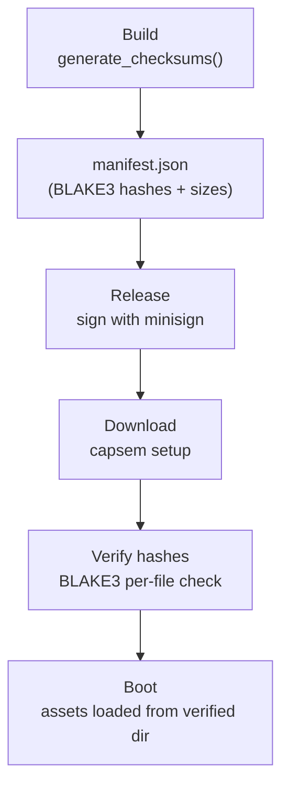

Capsem's release pipeline signs, notarizes, attests, and hash-verifies every artifact from source to installed binary.

## Release pipeline



Every step is automated in `.github/workflows/release.yaml`. A preflight job validates signing credentials before any build starts.

## Code signing

All host binaries are codesigned with a Developer ID certificate. The `com.apple.security.virtualization` entitlement is required for Apple Virtualization.framework.

### Signed binaries

| Binary | Purpose | Entitlement |
|--------|---------|-------------|
| `capsem` | CLI client | `com.apple.security.virtualization` |
| `capsem-service` | Background daemon | `com.apple.security.virtualization` |
| `capsem-process` | Per-VM process | `com.apple.security.virtualization` |
| `capsem-mcp` | MCP server | `com.apple.security.virtualization` |
| `capsem-gateway` | HTTP gateway | `com.apple.security.virtualization` |
| `capsem-tray` | System tray | `com.apple.security.virtualization` |
| `Capsem.app` | Tauri desktop app | `com.apple.security.virtualization` |

### Development vs release signing

| Context | Signing | Command |
|---------|---------|---------|
| Development | Ad-hoc (`--sign -`) | `just build` (automatic) |
| Release | Developer ID certificate | `codesign --sign "$APPLE_SIGNING_IDENTITY" --entitlements entitlements.plist --force` |

Ad-hoc signing is sufficient for local development. The justfile handles this automatically on macOS.

## Notarization

Release builds are submitted to Apple for notarization, which scans for malware and validates the signature:

```
xcrun notarytool submit Capsem-$VERSION.pkg \
  --key $APPLE_API_KEY_PATH \
  --key-id $APPLE_API_KEY \
  --issuer $APPLE_API_ISSUER \
  --wait --timeout 30m
xcrun stapler staple Capsem-$VERSION.pkg
```

Stapling embeds the notarization ticket in the artifact so macOS can verify it offline.

## SBOM

A Software Bill of Materials is generated for every release using `cargo-sbom`:

```
cargo sbom --output-format spdx_json_2_3 > capsem-sbom.spdx.json
```

| Field | Value |
|-------|-------|
| Format | SPDX 2.3 JSON |
| Scope | All Rust crate dependencies |
| Published as | `capsem-sbom.spdx.json` in GitHub release |
| Attestation | SBOM attested against DMG and deb artifacts |

## SLSA attestation

Release artifacts receive [SLSA build provenance](https://slsa.dev/) attestation via `actions/attest-build-provenance@v4`:

| Artifact | Attestation |
|----------|-------------|
| `.dmg` (macOS installer) | Build provenance |
| `.deb` (Linux package) | Build provenance |
| `rootfs.squashfs` (arm64) | Build provenance |
| `rootfs.squashfs` (x86_64) | Build provenance |
| `.dmg`, `.deb` | SBOM (SPDX 2.3) |

Attestations are published to the GitHub Attestations API and can be verified with `gh attestation verify`.

## Asset integrity

VM assets (kernel, initrd, rootfs) are verified via BLAKE3 hashes at every stage from build to boot.

### Verification flow



### manifest.json schema

```json
{
  "latest": "0.16.1",
  "releases": {
    "0.16.1": {
      "assets": [
        {
          "filename": "vmlinuz",
          "hash": "2c0bd752db929642...",
          "size": 7797248
        }
      ]
    }
  }
}
```

| Field | Type | Description |
|-------|------|-------------|
| `latest` | string | Most recent version |
| `releases` | map | Version -> release entry |
| `assets[].filename` | string | Asset filename (validated: no path separators or `..`) |
| `assets[].hash` | string | 64-character hex BLAKE3 hash |
| `assets[].size` | integer | File size in bytes |

### Hash verification

BLAKE3 hashes are computed in 256 KB chunks:

```rust
pub fn hash_file(path: &Path) -> Result<String> {
    let mut hasher = blake3::Hasher::new();
    loop {
        let n = file.read(&mut buf)?;
        if n == 0 { break; }
        hasher.update(&buf[..n]);
    }
    Ok(hasher.finalize().to_hex().to_string())
}
```

Validation rules:
- Hash must be exactly 64 hex characters
- Filenames must not contain `/`, `\`, or `..` (path traversal prevention)
- Version strings must not contain `..`, `/`, or `\`
- Empty releases are rejected

### Multi-version manifest

The manifest accumulates entries across releases. Each release merges its new version entry with the previous manifest from the latest GitHub release. This allows `capsem setup` to download assets for any supported version.

## Manifest signing

Release manifests are signed with [minisign](https://jedisct1.github.io/minisign/):

```
minisign -S -s /tmp/manifest-sign.key -m release-artifacts/manifest.json
```

| Artifact | Purpose |
|----------|---------|
| `manifest.json` | Asset hashes and version index |
| `manifest.json.minisig` | minisign signature |

Both files are published in every GitHub release.

## Supply chain controls

| Control | Implementation |
|---------|---------------|
| Rust toolchain | Stable, pinned via `dtolnay/rust-toolchain@stable` |
| Dependency audit | `cargo audit` in CI test stage |
| npm audit | `pnpm audit` in CI test stage |
| Docker base images | Pinned in guest config Dockerfiles |
| Compiler warnings | Treated as errors (`#[deny(warnings)]` in all crates) |
| Auditable builds | `cargo-auditable` embeds dependency info in binaries |
| Build context validation | `capsem.builder.doctor.check_source_files()` verifies completeness before release |
| Rootfs binary verification | Release pipeline checks all required guest binaries exist in rootfs before packaging |

### Required guest binaries

The release pipeline verifies these binaries exist in the rootfs before packaging:

| Binary | Purpose |
|--------|---------|
| `capsem-pty-agent` | PTY bridge and control channel |
| `capsem-net-proxy` | HTTPS proxy bridge |
| `capsem-mcp-server` | MCP gateway |
| `capsem-doctor` | In-VM diagnostics |
| `capsem-bench` | Performance benchmarks |
| `snapshots` | Snapshot management |
