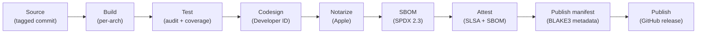
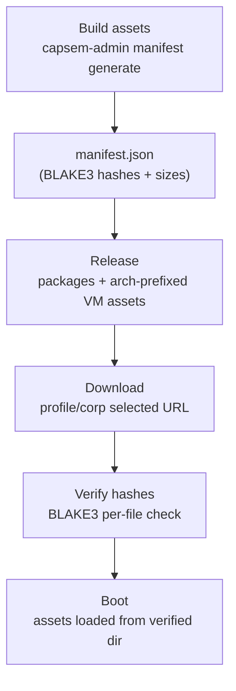

Capsem's release pipeline signs, notarizes, attests, and hash-verifies every artifact from source to installed binary.

## Release pipeline



Every step is automated in `.github/workflows/release.yaml`. A preflight job validates signing credentials before any build starts.

## Code signing

All host binaries are codesigned with a Developer ID certificate. The `com.apple.security.virtualization` entitlement is required for Apple Virtualization.framework.

### Signed binaries

| Binary | Purpose | Entitlement |
|--------|---------|-------------|
| `capsem` | CLI client | `com.apple.security.virtualization` |
| `capsem-service` | Background daemon | `com.apple.security.virtualization` |
| `capsem-process` | Per-VM process | `com.apple.security.virtualization` |
| `capsem-mcp` | MCP server | `com.apple.security.virtualization` |
| `capsem-gateway` | HTTP gateway | `com.apple.security.virtualization` |
| `capsem-tray` | System tray | `com.apple.security.virtualization` |
| `Capsem.app` | Tauri desktop app | `com.apple.security.virtualization` |

### Development vs release signing

| Context | Signing | Command |
|---------|---------|---------|
| Development | Ad-hoc (`--sign -`) | `just build` (automatic) |
| Release | Developer ID certificate | `codesign --sign "$APPLE_SIGNING_IDENTITY" --entitlements entitlements.plist --force` |

Ad-hoc signing is sufficient for local development. The justfile handles this automatically on macOS.

## Notarization

Release builds are submitted to Apple for notarization, which scans for malware and validates the signature:

```
xcrun notarytool submit Capsem-$VERSION.pkg \
  --key $APPLE_API_KEY_PATH \
  --key-id $APPLE_API_KEY \
  --issuer $APPLE_API_ISSUER \
  --wait --timeout 30m
xcrun stapler staple Capsem-$VERSION.pkg
```

Stapling embeds the notarization ticket in the artifact so macOS can verify it offline.

## SBOM and OBOM

Host binaries publish a Software Bill of Materials using `cargo-sbom`:

```
cargo sbom --output-format spdx_json_2_3 > capsem-sbom.spdx.json
```

| Field | Value |
|-------|-------|
| Format | SPDX 2.3 JSON |
| Scope | All Rust crate dependencies |
| Published as | `capsem-sbom.spdx.json` in GitHub release |
| Attestation | SBOM attested against the macOS `.pkg` artifact |

VM base images publish an Operations Bill of Materials as CycloneDX JSON. CI
generates it with `cdxgen -t os` against the exported Linux rootfs before EROFS
cleanup, pins it in `manifest.json`, and publishes it with the profile assets.

| Field | Value |
|-------|-------|
| Format | CycloneDX OBOM JSON |
| Scope | Base Linux VM image only |
| Excludes | User session mutations, workspace writes, and post-boot state |
| Published as | `<arch>-obom.cdx.json` with profile assets |
| Integrity | BLAKE3 hash stored in the materialized profile |
| Runtime API | `GET /profiles/{profile_id}/info` and `GET /profiles/{profile_id}/obom` |

The profile OBOM descriptor records the OBOM file URL, BLAKE3 hash, size,
generator, generator version, and the rootfs BLAKE3 hash it describes. Runtime
routes expose the descriptor as profile evidence; local OBOM documents are
served only after size and BLAKE3 verification.

The per-architecture `build-ledger.log` is separate debug evidence. It records
the inputs that produced the rootfs, including rendered Dockerfiles, build
context hashes, EROFS settings, git/project version, profile root and
install-script inputs, and declared package config. It is not uploaded as the
release inventory and must not claim installed package state; installed
component names and versions come from the OBOM.

## SLSA attestation

Release artifacts receive [SLSA build provenance](https://slsa.dev/) attestation via `actions/attest-build-provenance@v4`:

| Artifact | Attestation |
|----------|-------------|
| `.pkg` (macOS installer) | Build provenance |
| `.deb` (Linux package) | Build provenance |
| `vmlinuz`, `initrd.img`, `rootfs.erofs`, `obom.cdx.json` (arm64) | VM asset build provenance |
| `vmlinuz`, `initrd.img`, `rootfs.erofs`, `obom.cdx.json` (x86_64) | VM asset build provenance |
| `.pkg` | SBOM (SPDX 2.3) |
| `<arch>-obom.cdx.json` | OBOM document, hash-pinned in `manifest.json` |

Attestations are published to the GitHub Attestations API and can be verified with `gh attestation verify`.
The VM `build-ledger.log` and `B3SUMS` outputs remain debug evidence unless a
future release intentionally publishes them as separate evidence artifacts.

## Asset integrity

VM assets (kernel, initrd, rootfs) are verified via BLAKE3 hashes at every stage
from build to boot. The checked-in profile is materialized into
`target/config/` before runtime, so the service boots from a generated profile
whose asset URLs, hashes, and sizes come directly from `assets/manifest.json`.

`assets/manifest.json` is generated through `capsem-admin manifest generate
<assets_dir>`. Release automation, local packaging, and corp custom builds use
that same admin command; lower-level manifest generation internals are not a
supported public path.

### Verification flow



### Release graph schema

The public update graph starts at `https://release.capsem.org/channels.json`.
It lists channels such as stable and nightly. Each channel contains versioned
manifest records, and every record has exactly one `status` enum value:
`current`, `supported`, `deprecated`, or `revoked`. Manifest records carry
`version`, URL, SHA-256, BLAKE3, and HMAC metadata. They remain present for
auditability; absence from the channel list is removal.

The selected manifest is the compatibility and hash authority for one channel.
It lists package artifacts separately from the per-binary inventory and points
to profile catalogs:

```json
{
  "version": "1.4.0",
  "channel": "stable",
  "packages": [
    {
      "name": "Capsem-1.4.0.pkg",
      "kind": "macos-pkg",
      "url": "https://github.com/google/capsem/releases/download/v1.4.0/Capsem-1.4.0.pkg",
      "sha256": "<sha256>",
      "blake3": "<blake3>",
      "hmac": "<hmac>",
      "bytes": 12345678,
      "sbom": "https://github.com/google/capsem/releases/download/v1.4.0/capsem-sbom.spdx.json"
    }
  ],
  "binaries": [
    {
      "name": "capsem",
      "version": "1.4.0",
      "package": "Capsem-1.4.0.pkg",
      "path": "/usr/local/bin/capsem",
      "sha256": "<sha256>",
      "blake3": "<blake3>",
      "hmac": "<hmac>",
      "sbom_component": "SPDXRef-File-capsem"
    }
  ],
  "profiles": [
    {
      "id": "co-work",
      "revision": "2026.07.02.1-stable",
      "catalog_url": "https://release.capsem.org/profiles/releases/2026.07.02.1-stable/catalog.json",
      "sha256": "<sha256>",
      "blake3": "<blake3>",
      "hmac": "<hmac>"
    }
  ]
}
```

Profiles own profile images, config files, software inventory, and ABOM/OBOM
evidence. A profile may declare `min_capsem_version` when its config or image
requires newer client behavior, but it does not select the Capsem binary. The
manifest selects package and binary metadata; the profile catalog selects
profile-owned image/config/evidence metadata.

Stable and nightly are independent channels. A stable-to-nightly switch is just
choosing a different manifest URL, for example
`https://release.capsem.org/assets/stable/manifest.json` or
`https://release.capsem.org/assets/nightly/manifest.json`, and the release gate
proves package, per-binary, profile image, config, and evidence data do not
cross between channels.

### Hash verification

BLAKE3 hashes are computed in 256 KB chunks:

```rust
pub fn hash_file(path: &Path) -> Result<String> {
    let mut hasher = blake3::Hasher::new();
    loop {
        let n = file.read(&mut buf)?;
        if n == 0 { break; }
        hasher.update(&buf[..n]);
    }
    Ok(hasher.finalize().to_hex().to_string())
}
```

Validation rules:
- Hash must be exactly 64 hex characters
- Filenames must not contain `/`, `\`, or `..` (path traversal prevention)
- Version strings must not contain `..`, `/`, or `\`
- Empty releases are rejected

### Multi-version channels

Channels accumulate versioned manifest records across releases. Adding a new
stable or nightly manifest does not require mutating profiles, packages, or
other channels. Deprecating or revoking a manifest changes the record status;
publishing no record at all means that manifest is removed from the public
channel list. Runtime selection ignores revoked records.

## Manifest Role

`manifest.json` is channel metadata: package artifacts, per-binary inventory,
profile catalog references, hashes, HMACs, and compatibility. It is published
with SBOM and provenance attestations. Runtime trust comes from the selected
manifest URL, profile-owned file metadata, SHA-256/BLAKE3 verification of the
downloaded bytes, and HMAC verification of the release graph records.

For a custom corp package, generate and verify the manifest from the built asset
directory before packaging:

```bash
capsem-admin manifest generate /path/to/assets --version 1.3.corp.1 --json
capsem-admin manifest check /path/to/assets/manifest.json --json
bash scripts/build-pkg.sh --manifest file:///path/to/assets/manifest.json ...
```

The installer moves that manifest into the installed service asset directory,
and status reports the installed manifest hash plus package provenance.
`--manifest` is URL-only so custom local manifests use `file://` and hosted
corporate channels use `https://` or `http://`.

## Supply chain controls

| Control | Implementation |
|---------|---------------|
| Rust toolchain | Stable, pinned via `dtolnay/rust-toolchain@stable` |
| Dependency audit | `cargo audit` in CI test stage |
| npm audit | `pnpm audit` in CI test stage |
| Docker base images | Resolved by the profile-derived Docker template rail |
| Compiler warnings | Treated as errors (`#[deny(warnings)]` in all crates) |
| Auditable builds | `cargo-auditable` embeds dependency info in binaries |
| Build context validation | `capsem.builder.doctor.check_source_files()` verifies completeness before release |
| Rootfs binary verification | Release pipeline checks all required guest binaries exist in rootfs before packaging |

### Required guest binaries

The release pipeline verifies these binaries exist in the rootfs before packaging:

| Binary | Purpose |
|--------|---------|
| `capsem-pty-agent` | PTY bridge and control channel |
| `capsem-net-proxy` | HTTPS proxy bridge |
| `capsem-mcp-server` | Guest MCP relay |
| `capsem-doctor` | In-VM diagnostics |
| `capsem-bench` | Performance benchmarks |
| `snapshots` | Snapshot management |
