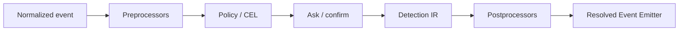

Enforcement policy decides whether a normalized security event may continue.
Detection decides which findings should be attached to the event. The two
formats are separate because blocking and alerting have different failure
modes.

## Enforcement Pack

```json
{
  "schema": "capsem.enforcement-pack.v1",
  "id": "corp-default-enforcement",
  "version": "2026.0521.1",
  "status": "active",
  "owner": "corp",
  "rules": [
    {
      "id": "block-metadata",
      "name": "Block cloud metadata",
      "event_family": "http",
      "event_type": "http.request",
      "priority": 10,
      "condition": "http.request.host == \"169.254.169.254\"",
      "decision": "block",
      "reason": "metadata endpoints are not reachable from corp VMs"
    }
  ]
}
```

Validate and export the schema:

```bash
capsem-admin enforcement schema
capsem-admin enforcement validate corp-enforcement.json --json
capsem-admin enforcement compile corp-enforcement.json --json
capsem-admin enforcement backtest corp-enforcement.json --events policy-contexts.jsonl --json
```

| Field | Meaning |
|---|---|
| `schema` | Must be `capsem.enforcement-pack.v1`. |
| `id` / `version` | Pack identity pinned by the profile. |
| `status` | `active`, `deprecated`, or `revoked`. Revoked packs must not install or launch. |
| `event_family` / `event_type` | Normalized event boundary where the rule applies. |
| `condition` | CEL expression over the canonical policy context. |
| `decision` | `allow`, `block`, `ask`, or `rewrite`. |
| `rewrite` | Required for `rewrite`, rejected for all other decisions. |

## Decisions

| Decision | Behavior |
|---|---|
| `allow` | Continue through the boundary. |
| `block` | Stop at the boundary and emit a denial result. |
| `ask` | Create an approval challenge and fail closed unless approved. |
| `rewrite` | Mutate only the declared target, then continue. |

## Ask And Confirm

`ask` is an enforcement decision, not a warning. The Security Engine must emit
the resolved event with the pending challenge before any transport dispatch
continues. A later `confirm()` resolution records the approving actor, selected
answer, rule id, reason, and trace/profile/VM attribution in
`policy_confirm_events` and the resolved-event journal.

Until a boundary has a verified approval UI, `ask` fails closed. It must never
silently behave as `allow`.

## Engine Order



Detection runs after policy and confirm resolution so findings can see the
resolved event. The emitter writes the same resolved event identity to
telemetry, audit logging, and detection-export sinks.

## Relation To Detection

Do not use Sigma as a blocking policy language. Sigma is accepted in detection
packs, validated with pySigma, and compiled into Detection IR. Enforcement
policy uses enforcement packs and CEL conditions.

Offline enforcement backtests use the same policy-context fixture envelope as
detection backtests. Conditions must target canonical roots such as
`http.request.host`, `http.request.header(...)`, and `http.request.body.text`;
internal `event.*` or raw `subject.*` authoring is rejected before install or
replay. Canonical-looking paths are also checked against the admin-supported
family contract, so `http.request.raw` and `dns.request.*` inside an HTTP rule
fail closed at compile time instead of becoming silent no-matches. Runtime
enforcement remains the CEL authority; the offline admin backtest is a fixture
replay gate for committed policy-context corpora.

See [Rule Corpus Workflow](/security/rule-corpus/) for the fixture and
cross-language parity process.
