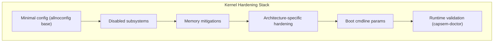
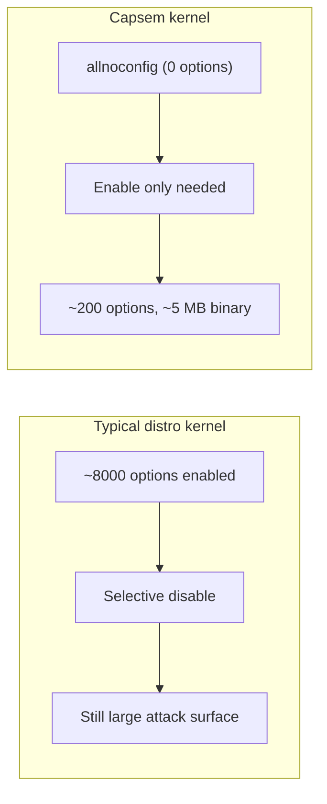

Capsem builds a custom Linux kernel from `allnoconfig` -- starting with everything disabled and enabling only what the VM needs. The result is a ~5 MB kernel with no loadable modules, no debugfs, no IPv6, and full exploit mitigations.

## Why it matters

An unhardened guest kernel gives a malicious agent multiple escalation paths:

| Vector | Risk without hardening |
|--------|----------------------|
| Loadable modules | Agent loads a `.ko` to hijack kernel functions |
| `/dev/mem`, `/dev/port` | Direct physical memory read/write from userspace |
| debugfs | Kernel internals exposed to guest processes |
| BPF, io_uring | High-CVE-count subsystems reachable via syscall |
| 32-bit compat syscalls | Legacy ABI with known exploitation primitives |
| `/proc/kallsyms` | Kernel symbol addresses defeat KASLR |

Capsem eliminates all of these at compile time.

## Defense layers



## Disabled subsystems

Every disabled subsystem removes code from the kernel binary. No runtime flag can re-enable it.

| Subsystem | Config | Why disabled |
|-----------|--------|-------------|
| Loadable modules | `MODULES=n` | Prevents loading `.ko` files; even root cannot extend the kernel |
| `/dev/mem` | `DEVMEM=n` | Blocks direct physical memory access from userspace |
| `/dev/port` | `DEVPORT=n` | Blocks I/O port access |
| debugfs | `DEBUG_FS=n` | Kernel debug info leak vector |
| Kernel symbols | `KALLSYMS=n` | Hides kernel addresses, preserves KASLR effectiveness |
| io_uring | `IO_URING=n` | High CVE count; unnecessary in a sandboxed VM |
| BPF syscall | `BPF_SYSCALL=n` | Exploitation vector for privilege escalation |
| userfaultfd | `USERFAULTFD=n` | Used in race condition exploits |
| 32-bit compat | `COMPAT=n` / `IA32_EMULATION=n` | Eliminates entire legacy syscall attack surface |
| kexec | `KEXEC=n`, `KEXEC_FILE=n` | No kernel hot-swap |
| Hibernation | `HIBERNATION=n` | No suspend-to-disk (memory dump vector) |
| Magic SysRq | `MAGIC_SYSRQ=n` | No emergency keyboard commands |
| IPv6 | `IPV6=n` | Unnecessary in air-gapped VM; reduces IP stack surface |
| Multicast | `IP_MULTICAST=n` | No multicast traffic |
| nftables | `NF_TABLES=n` | Use iptables-legacy only (simpler, smaller) |
| USB | `USB_SUPPORT=n` | No USB devices in VM |
| Sound | `SOUND=n` | No audio hardware |
| DRM/GPU | `DRM=n` | No graphics hardware |
| WiFi/Bluetooth | `WLAN=n`, `WIRELESS=n`, `BT=n` | No wireless hardware |
| Keyboard/Mouse | `INPUT_KEYBOARD=n`, `INPUT_MOUSE=n` | No HID devices |
| NFS | `NFS_FS=n`, `NETWORK_FILESYSTEMS=n` | No remote filesystems |
| SCSI/ATA | `SCSI=n`, `ATA=n` | VirtIO only; no legacy block drivers |
| Ethernet | `ETHERNET=n`, `NET_VENDOR_VIRTIO=n` | Air-gapped; only dummy NIC |

## Memory mitigations

| Mitigation | Config | Effect |
|-----------|--------|--------|
| Heap zeroing | `INIT_ON_ALLOC_DEFAULT_ON=y` | Every `kmalloc` returns zeroed memory; prevents info leaks |
| Slab freelist randomization | `SLAB_FREELIST_RANDOMIZE=y` | Randomizes freed slab object order; defeats heap spraying |
| Slab freelist hardening | `SLAB_FREELIST_HARDENED=y` | Validates freelist metadata; detects heap corruption |
| Page allocator shuffle | `SHUFFLE_PAGE_ALLOCATOR=y` | Randomizes page allocation order |
| Hardened usercopy | `HARDENED_USERCOPY=y` | Validates `copy_to_user`/`copy_from_user` bounds |
| Strict kernel RWX | `STRICT_KERNEL_RWX=y` | Enforces W^X on kernel memory pages |
| Virtual mapped stacks | `VMAP_STACK=y` | Kernel stacks as virtual memory; detects overflow via guard pages |
| KASLR | `RANDOMIZE_BASE=y` | Randomizes kernel load address |
| Stack protector | `STACKPROTECTOR=y`, `STACKPROTECTOR_STRONG=y` | Stack canaries on all functions with local variables |
| FORTIFY_SOURCE | `FORTIFY_SOURCE=y` | Compile-time buffer overflow detection |
| dmesg restriction | `SECURITY_DMESG_RESTRICT=y` | Only root can read kernel log |
| Heap ASLR | `COMPAT_BRK=n` | Enables full heap randomization |
| Seccomp | `SECCOMP=y`, `SECCOMP_FILTER=y` | Userspace syscall filtering (defense in depth) |

## Architecture-specific hardening

The kernel includes different hardware mitigations depending on the target architecture.

| Mitigation | arm64 | x86_64 | Purpose |
|-----------|-------|--------|---------|
| Branch Target Identification | `ARM64_BTI=y` | -- | Spectre-BHB mitigation; restricts indirect branch targets |
| Pointer Authentication | `ARM64_PTR_AUTH=y`, `ARM64_PTR_AUTH_KERNEL=y` | -- | Signs return addresses; defeats ROP chains |
| Kernel unmapping at EL0 | `UNMAP_KERNEL_AT_EL0=y` | -- | Removes kernel pages from userspace page tables |
| Branch predictor hardening | `HARDEN_BRANCH_PREDICTOR=y` | -- | Flushes branch predictor on context switch |
| Page Table Isolation (KPTI) | -- | `PAGE_TABLE_ISOLATION=y` | Meltdown mitigation; separate kernel/user page tables |
| Retpoline | -- | `RETPOLINE=y` | Spectre v2 mitigation; replaces indirect branches |

## Boot command line

Runtime hardening parameters passed via kernel cmdline:

```
console={hvc0|ttyS0} root=/dev/vda ro init_on_alloc=1 slab_nomerge page_alloc.shuffle=1
```

| Parameter | Rationale |
|-----------|-----------|
| `ro` | Mount rootfs read-only; squashfs is structurally immutable |
| `init_on_alloc=1` | Runtime enforcement of heap zeroing (belt-and-suspenders with `INIT_ON_ALLOC_DEFAULT_ON`) |
| `slab_nomerge` | Prevents kernel from merging slab caches; isolates allocations by type |
| `page_alloc.shuffle=1` | Randomizes page allocator at boot (complements `SHUFFLE_PAGE_ALLOCATOR`) |

Console device varies by architecture: `hvc0` for ARM64 (Apple VZ), `ttyS0` for x86_64 (KVM).

## Validation

Every hardening property is verified at runtime by `capsem-doctor` tests. If any test fails, the VM is not considered healthy.

| Property | capsem-doctor test | What it checks |
|----------|-------------------|----------------|
| No kernel modules | `test_no_kernel_modules` | `modprobe` fails |
| No `/dev/mem` | `test_no_dev_mem` | File does not exist |
| No `/dev/port` | `test_no_dev_port` | File does not exist |
| No `/proc/kcore` | `test_no_proc_kcore` | File absent or unreadable |
| No `/proc/modules` | `test_proc_modules_empty` | File absent or empty |
| No debugfs | `test_no_debugfs` | Not mounted |
| No IPv6 | `test_no_ipv6` | `/proc/net/if_inet6` absent |
| No kernel symbols | `test_no_kallsyms` | `/proc/kallsyms` absent or empty |
| Read-only rootfs | `test_kernel_cmdline_has_ro` | `ro` token in `/proc/cmdline` |
| Heap zeroing | `test_init_on_alloc` | `init_on_alloc=1` in `/proc/cmdline` |
| Slab isolation | `test_slab_nomerge` | `slab_nomerge` in `/proc/cmdline` |
| Page shuffle | `test_page_alloc_shuffle` | `page_alloc.shuffle=1` in `/proc/cmdline` |
| Seccomp available | `test_seccomp_available` | `Seccomp:` line in `/proc/self/status` |
| Squashfs rootfs | `test_squashfs_is_immutable` | `/dev/vda` filesystem type is `squashfs` |
| Overlay configured | `test_overlay_configured` | Root mount is `overlay` with `lowerdir` and `upperdir` |
| No real NICs | `test_no_real_nics` | Only `lo` and `dummy0` in `/sys/class/net/` |
| No setuid binaries | `test_no_setuid_binaries` | `find / -perm -4000` returns empty |
| No setgid binaries | `test_no_setgid_binaries` | `find / -perm -2000` returns empty |
| Guest binaries read-only | `test_guest_binary_not_writable` | All capsem binaries are chmod 555 |
| No sshd | `test_no_sshd` | `sshd` process not running |
| No cron | `test_no_cron` | `cron` process not running |
| No systemd | `test_no_systemd` | `systemd` process not running |

## Design philosophy

The kernel config follows the principle of **minimum viable surface**: start from `allnoconfig` (everything off), then enable only what the VM requires. This is the opposite of a typical distro kernel, which starts from a broad default and disables selectively.



The two defconfig files (`defconfig.arm64`, `defconfig.x86_64`) are applied with `make olddefconfig` and produce identical security properties on both architectures.
