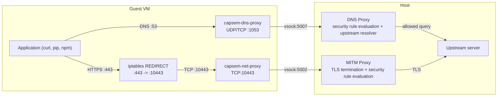
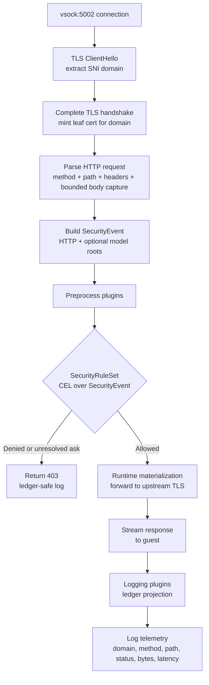
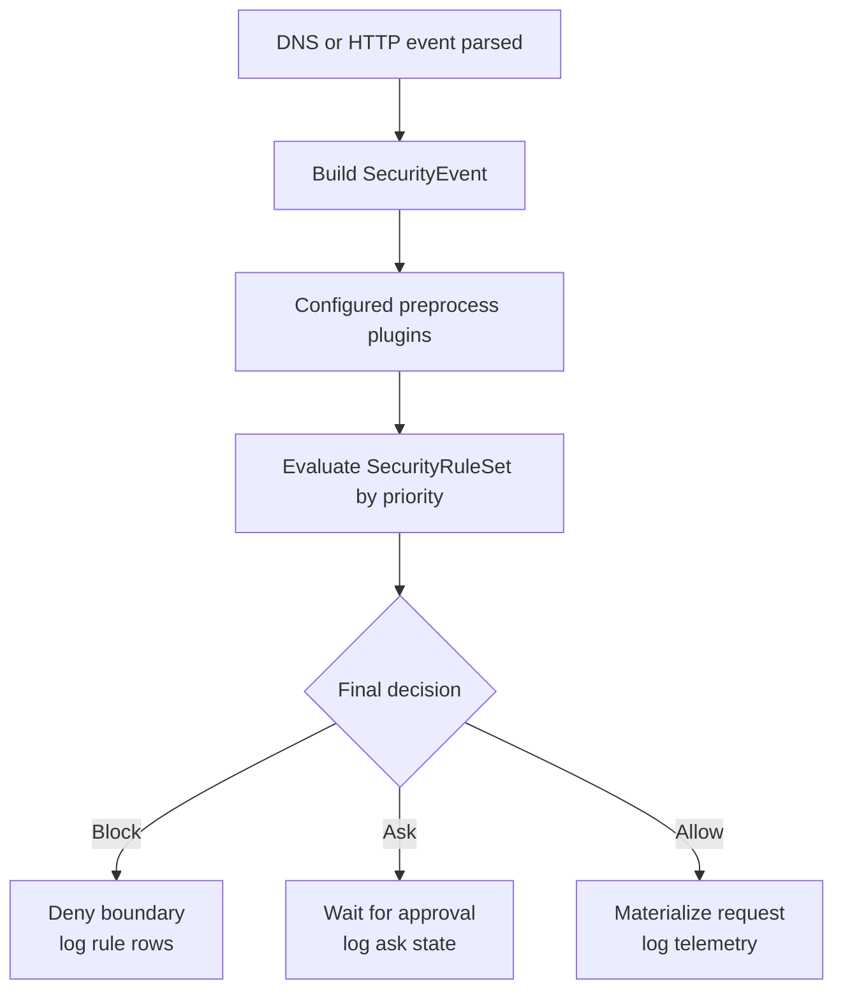

The guest VM has no real network interface. DNS and HTTPS are redirected to guest-side proxy binaries, forwarded to host handlers over vsock, checked against policy, and logged to the session database.

## Air-gapped architecture



No packets leave the VM through a NIC. DNS reaches the host only through vsock port 5007, and HTTPS reaches the host only through vsock port 5002.

## Guest network setup

`capsem-init` builds the air-gapped network stack during boot:

| Step | Command | Purpose |
|------|---------|---------|
| 1. Loopback | `ip link set lo up` | Enable localhost |
| 2. Dummy NIC | `ip link add dummy0 type dummy` | Create fake interface |
| 3. Assign IP | `ip addr add 10.0.0.1/24 dev dummy0` | Give it a local address |
| 4. Default route | `ip route add default dev dummy0` | All traffic routes to dummy0 |
| 5. DNS redirect | `iptables-nft -t nat -A OUTPUT -p udp --dport 53 -j REDIRECT --to-port 1053` plus TCP | Send DNS to `capsem-dns-proxy` |
| 6. HTTPS redirect | `iptables-nft -t nat -A OUTPUT -p tcp --dport 443 -j REDIRECT --to-port 10443` | Redirect HTTPS to the TLS proxy listener |
| 7. Plain HTTP redirect | `iptables-nft -t nat -A OUTPUT -p tcp --dport 80 -j REDIRECT --to-port 10080` plus 3128/3713/8080/11434 | Redirect HTTP/dev proxy ports to the plain-HTTP listener |
| 8. Net proxy | `capsem-net-proxy` | TCP listeners to vsock:5002 bridge |
| 9. DNS proxy | `capsem-dns-proxy` | UDP/TCP :1053 to vsock:5007 bridge |

The result: when an application resolves `github.com`, the query is captured on
port 53, handled by `capsem-dns-proxy`, and resolved or denied by the host DNS
handler. When an application connects to `github.com:443`, `iptables-nft`
redirects the socket to `127.0.0.1:10443`; `capsem-net-proxy` bridges the TCP
connection to the host over vsock port 5002.

## MITM proxy overview

The host MITM proxy receives each connection on vsock:5002 and runs a full inspection pipeline:



The proxy mints per-domain TLS certificates signed by a static Capsem CA (ECDSA P-256, 24-hour validity). The CA is baked into the guest rootfs and trusted by the system certificate store, Python certifi, and Node.js. See [MITM Proxy Architecture](/architecture/mitm-proxy/) for implementation details.

### CA trust chain

| Component | How it trusts the CA |
|-----------|---------------------|
| System store | `/usr/local/share/ca-certificates/capsem-ca.crt` + `update-ca-certificates` |
| Python certifi | Patched bundle includes Capsem CA |
| Node.js | `NODE_EXTRA_CA_CERTS` env var |
| curl/wget | `SSL_CERT_FILE` env var |
| pip/requests | `REQUESTS_CA_BUNDLE` env var |

## HTTP And DNS Rule Evaluation

Domains are not governed by a separate allow/block engine. DNS and HTTP parsing
produce `SecurityEvent` fields (`dns.*` and `http.*`), then the same CEL rule
rail decides allow, ask, block, preprocess, postprocess, and detection.

### Evaluation order



### Profile And Corp Rules

Users customize policy with profile rules; organizations add constraints with
corp rules or referenced enforcement/Sigma files.

```toml
[profiles.rules.allow_internal_http]
name = "allow_internal_http"
action = "allow"
match = 'http.host.matches("(^|.*\\.)internal\\.corp$")'

[profiles.rules.block_malware_dns]
name = "block_malware_dns"
action = "block"
match = 'dns.qname.matches("(^|.*\\.)malware\\.bad$")'
```

Corporate policy in `/etc/capsem/corp.toml` supplies locked negative-priority
rules and can reference shared enforcement TOML or Sigma YAML rule files.

## HTTP and DNS Security Rules

For allowed domains, security-event rules add method, path, body, model, file,
process, and DNS controls through the same CEL rail. HTTP and DNS parsers
attach first-party `http.*` and `dns.*` fields to `SecurityEvent`; enforcement
and detection then use the shared rule engine.

```toml
[profiles.rules.block_repo_writes]
name = "block_repo_writes"
action = "block"
match = 'http.host == "github.com" && http.method == "POST" && http.path.matches("^/openai/")'

[profiles.rules.block_ai_provider_dns]
name = "block_ai_provider_dns"
action = "block"
match = 'dns.qname == "api.openai.com" && dns.qtype == "A"'
```

See [Policy](/security/policy/) for the full rule reference.

## Telemetry

Every proxied request is logged to the per-VM `session.db`:

| Column | Content |
|--------|---------|
| `domain` | Target domain |
| `method` | HTTP method |
| `path` | Request path |
| `status_code` | Upstream response status |
| `decision` | Final security decision recorded by the ledger |
| `bytes_sent` | Request body size |
| `bytes_received` | Response body size |
| `duration_ms` | End-to-end latency |
| `request_body_preview` | Compact display field for quick scans |
| `response_body_preview` | Compact display field for quick scans |
| `matched_rule` | The security rule id that matched |

Full captured HTTP, model, and MCP request/response bodies are stored in the
`event_body_blobs` ledger table with BLAKE3 hashes, original/stored byte
counts, and truncation flags. The preview columns are for UI scanability; the
blob table is the forensic body source.

For AI provider traffic (Anthropic, OpenAI, Google), the proxy also parses SSE streams to extract model calls, token usage, tool calls, and estimated cost. See [Session Telemetry](/architecture/session-telemetry/) for the full schema.

DNS queries are logged separately in `dns_events` with `qname`, `qtype`,
`rcode`, `decision`, `matched_rule`, `process_name`, and `trace_id`.

## What gets blocked

| Scenario | Outcome | Why |
|----------|---------|-----|
| HTTPS to blocked domain (`api.openai.com`) | 403 Forbidden | Matching `block` rule |
| HTTP port 80 (`http://google.com`) | Redirected to the plain-HTTP listener | Profile/corp CEL rules still decide the request |
| Dev proxy ports (3128, 3713, 8080, 11434) | Redirected to the plain-HTTP listener | Local model/proxy traffic stays on the same security rail |
| Other non-standard ports (`https://google.com:8443`) | Connection refused | Only declared intercept ports are redirected |
| Direct IP (`https://1.1.1.1`) | Connection refused | No real NIC; dummy0 has no real route |
| POST to allowed domain with block rule | 403 Forbidden | HTTP-level rule blocks the method |

## capsem-doctor validation

Network isolation is validated by `test_network.py` across 7 layers. Tests are ordered low-to-high so failures pinpoint the exact broken layer.

| Layer | Tests | What it validates |
|-------|-------|-------------------|
| **L1: Guest plumbing** | `test_dummy0_has_ip`, `test_dns_proxy_listening_udp`, `test_dns_proxy_listening_tcp`, `test_iptables_redirect_dns_udp_to_1053`, `test_iptables_redirect_dns_tcp_to_1053`, `test_dns_resolves_via_capsem_proxy`, `test_dns_nxdomain_propagates_from_upstream`, `test_iptables_redirect_443_to_10443` | dummy0 has 10.0.0.1, DNS is captured by `capsem-dns-proxy`, real upstream answers and NXDOMAIN propagate, HTTPS redirect rule is present |
| **L2: Net proxy** | `test_net_proxy_listening`, `test_tcp_443_reaches_proxy`, `test_vsock_bridge_delivers_bytes` | capsem-net-proxy accepts TCP on :10443, iptables redirect works, bytes flow through vsock bridge |
| **L3: TLS handshake** | `test_tls_handshake_completes`, `test_tls_cert_from_capsem_ca` | Full TLS to allowed domain succeeds, MITM proxy presents Capsem CA cert |
| **L4: HTTP over MITM** | `test_curl_https_with_skip_verify`, `test_curl_verbose_diagnostics` | curl -k gets HTTP response, full handshake trace captured |
| **L5: CA trust** | `test_mitm_ca_cert_file_exists`, `test_mitm_ca_in_system_bundle`, `test_certifi_includes_capsem_ca`, `test_curl_allowed_domain_ca_trusted`, `test_python_urllib_https_trusted`, `test_ca_env_var_set` | CA cert file exists, in system bundle, in Python certifi, curl works without -k, Python TLS works, `SSL_CERT_FILE`/`REQUESTS_CA_BUNDLE`/`NODE_EXTRA_CA_CERTS` set |
| **L6: Policy enforcement** | `test_denied_domain_rejected`, `test_post_to_random_domain_denied`, `test_ai_provider_domain_blocked`, `test_http_port_80_not_proxied`, `test_non_standard_port_fails`, `test_direct_ip_no_route` | Denied domains get 403, port 80 fails, non-443 ports fail, direct IP fails |
| **L7: Throughput** | `test_proxy_download_throughput` | 100 MB download through MITM meets minimum speed threshold |

Additional network tests in `test_sandbox.py`:

| Test | Property |
|------|----------|
| `test_dummy_interface_exists` | dummy0 interface present |
| `test_dns_resolves_via_capsem_proxy` | DNS resolves through the host proxy, not the old local sentinel |
| `test_iptables_redirect` | REDIRECT rule active |
| `test_net_proxy_running` | capsem-net-proxy process alive |
| `test_dns_proxy_running` | capsem-dns-proxy process alive |
| `test_dnsmasq_not_running` | Legacy dnsmasq is absent |
| `test_no_real_nics` | Only `lo` and `dummy0` in `/sys/class/net/` |
| `test_allowed_domain` | End-to-end HTTPS to allowed domain (5-step diagnostic) |
| `test_denied_domain` | HTTPS to denied domain returns 403 or refused |
