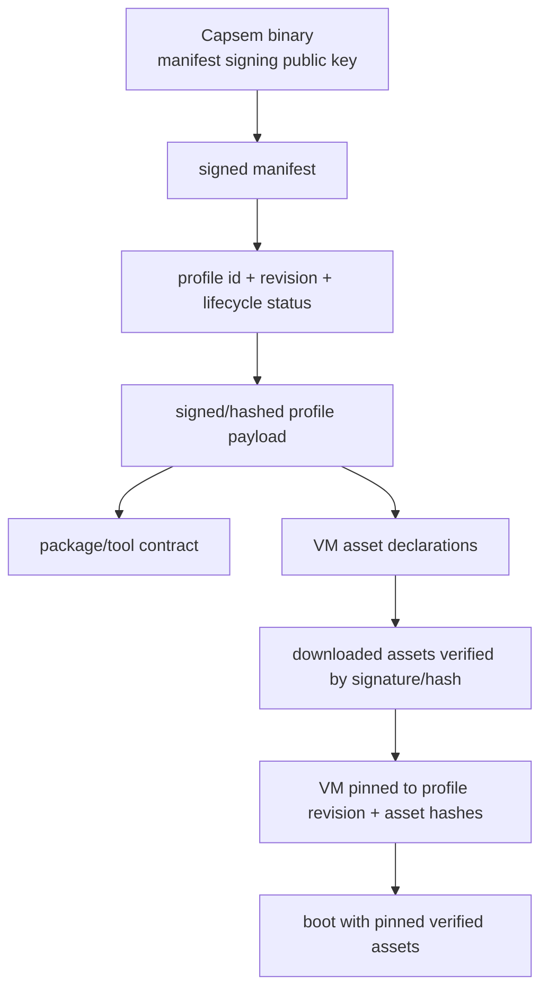

Capsem sandboxes AI agents inside Linux VMs. The security model treats the guest as fully untrusted and the host as the trusted computing base.

## Threat Model

| Party | Trust Level | Goal |
|-------|------------|------|
| Host (Capsem binary, macOS/Linux kernel) | Trusted | Contain guest escape, protect host resources |
| Guest (AI agent, user code, guest kernel) | Untrusted | May attempt sandbox escape, resource exhaustion, data exfiltration |
| Network (external services) | Controlled | DNS and HTTPS pass through host Security Engine boundaries before upstream dispatch |

**What Capsem defends against:**
- Guest code escaping the VM boundary
- Guest exhausting host CPU, memory, disk, or file descriptors
- Guest accessing network services outside profile-owned enforcement policy
- Unaudited data exfiltration via HTTPS

**What Capsem does not defend against:**
- Compromised host processes (they already have equivalent privileges)
- Hardware side-channel attacks (mitigated by OS/firmware, not Capsem)
- Denial of service against the guest itself (the guest is disposable)

## Defense Layers

| Layer | Mechanism | What It Protects |
|-------|-----------|-----------------|
| **Hardware virtualization** | Apple VZ / KVM | Guest cannot access host memory, devices, or kernel |
| **Kernel hardening** | No modules, no debugfs, no IPv6, no swap, read-only rootfs | Reduces guest kernel attack surface |
| **Network isolation** | Air-gapped NIC, DNS proxy, iptables, MITM proxy | DNS and HTTPS are lifted into audited Security Events |
| **Filesystem sandboxing** | VirtioFS with path validation, resource limits | Guest confined to workspace directory |
| **Security Engine** | CEL enforcement, ask/confirm, detection, resolved events | Decisions, findings, rewrites, telemetry, and logs share one event path |
| **Build verification** | Code signing, notarization, SBOM | Host binary integrity |

## Profile Chain Of Trust



Profiles are the contract between enterprise intent and VM reality. A VM that
does not carry profile id, revision, package contract, and asset pins is invalid
for the bedrock release.

## Trust Boundaries

```
+------------------+          +-----------------------+
|   Guest VM       |  virtio  |   Host (Capsem)       |
|                  |<-------->|                       |
|  AI agent        |  vsock   |  Terminal bridge      |
|  Guest kernel    |  virtio  |  MITM proxy           |
|  Guest userland  |  fs      |  VirtioFS server      |
|                  |          |  Snapshot scheduler    |
+------------------+          +-----------------------+
                                        |
                                   Host kernel
                                   (macOS / Linux)
```

**Guest/host boundary (virtio):** All communication uses virtio devices (console, vsock, VirtioFS). The guest cannot directly access host memory or syscalls. The hypervisor validates all virtio descriptor chains.

**Network boundary (DNS + MITM proxies):** Guest DNS and HTTPS traffic are
redirected to guest proxy binaries and forwarded over vsock to host Network
Engine handlers. The Network Engine parses transport, builds typed Security
Events, and applies Security Engine decisions. Per-session telemetry records
resolved events plus HTTP/DNS projections.

**Filesystem boundary (VirtioFS):** The host VirtioFS server validates all path components, canonicalizes symlinks, and rejects any path that resolves outside the shared workspace. Resource limits prevent guest-driven host exhaustion.

## Per-Layer Documentation

- [Kernel Hardening](/security/kernel-hardening/) -- guest kernel lockdown configuration
- [Network Isolation](/security/network-isolation/) -- air-gapped networking and MITM proxy
- [Virtualization Security](/security/virtualization/) -- VirtioFS sandboxing and hypervisor hardening
- [Build Verification](/security/build-verification/) -- code signing, notarization, and supply chain
- [Rule Authoring](/security/rules/) -- canonical CEL roots, priority tiers, ownership, and rewrites
- [Enforcement](/security/enforcement/) -- profile-owned enforcement packs and blocking decisions
- [Detection Format](/security/detection/) -- Sigma-backed detection packs and Detection IR
- [Telemetry And Remote Enforcement](/configuration/telemetry-remote-enforcement/) -- exported summaries, deferred remote plugins, S10/S22 boundaries
