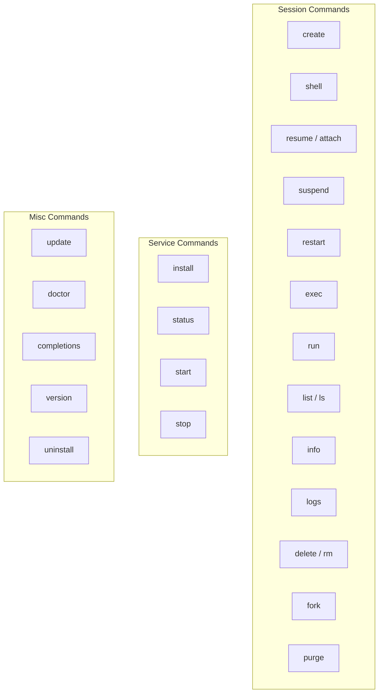
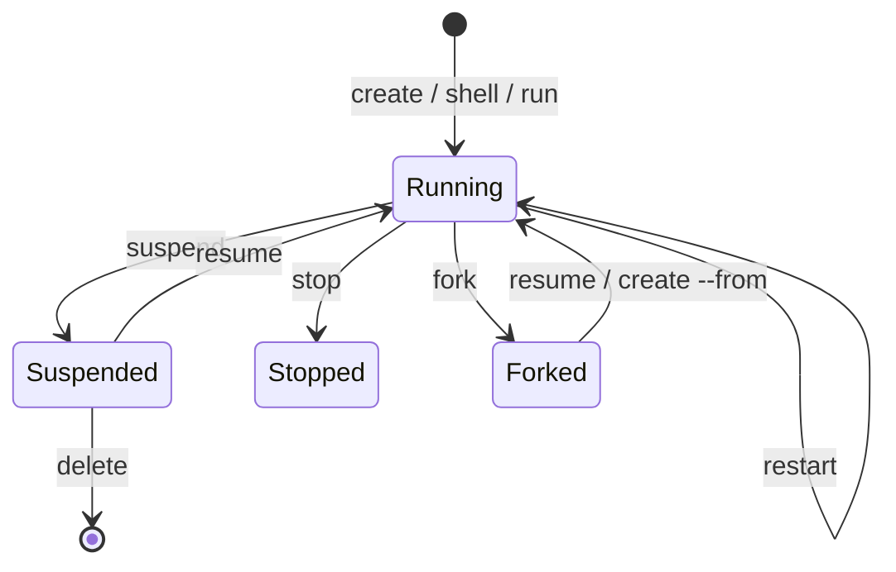

The `capsem` CLI manages sessions, the background service, and system configuration. All session operations route through the service daemon over a Unix Domain Socket.

## Command overview



## Session commands

### create

Create and boot a new session from a profile. Use `-n <name>` for a retained,
named VM that can be stopped, resumed, forked, and inspected later.

```sh
capsem create                          # unnamed session
capsem create -n mybox                 # named retained session
capsem create -n mybox --ram 8 --cpu 4 # custom resources
capsem create --from template          # clone from existing session
capsem create -e API_KEY=sk-...        # with environment variables
```

| Flag | Default | Description |
|------|---------|-------------|
| `-n, --name <NAME>` | -- | Name for the session |
| `--ram <GB>` | 4 | RAM in GB |
| `--cpu <CORES>` | 4 | CPU cores |
| `-e, --env <KEY=VALUE>` | -- | Environment variables (repeatable) |
| `--from <NAME>` | -- | Clone state from an existing retained session/template (alias: `--image`) |

### shell

Open an interactive shell. With no arguments, creates an unnamed session for
the shell and cleans it up when the shell exits.

```sh
capsem shell              # unnamed shell session
capsem shell mybox        # attach to existing session
capsem shell -n mybox     # find by name
capsem shell abc123       # find by ID
```

| Flag | Description |
|------|-------------|
| `-n, --name <NAME>` | Find by name |
| `[SESSION]` | Name or ID of an existing session |

### resume

Resume a suspended session or attach to a running one.

```sh
capsem resume mybox
capsem attach mybox       # alias
```

| Arg | Description |
|-----|-------------|
| `<name>` | Name of the session |

### suspend

Suspend a running retained session to disk. Saves RAM and CPU state.

```sh
capsem suspend mybox
```

| Arg | Description |
|-----|-------------|
| `<SESSION>` | Name or ID of the session |

### restart

Restart a session.

```sh
capsem restart mybox
```

| Arg | Description |
|-----|-------------|
| `<name>` | Name of the session |

### exec

Execute a command in a running session.

```sh
capsem exec mybox "ls -la /root"
capsem exec mybox "pip install numpy" --timeout 120
```

| Arg/Flag | Default | Description |
|----------|---------|-------------|
| `<SESSION>` | -- | Name or ID of the session |
| `<command>` | -- | Command to execute |
| `--timeout <SECS>` | 30 | Timeout in seconds |

### run

Run a command in a fresh one-shot session. The session is provisioned and
destroyed after the command completes.

```sh
capsem run "python3 -c 'print(1+1)'"
capsem run "npm test" --timeout 120
capsem run "pytest" -e API_KEY=sk-...
```

| Arg/Flag | Default | Description |
|----------|---------|-------------|
| `<command>` | -- | Command to execute |
| `--timeout <SECS>` | 60 | Timeout in seconds |
| `-e, --env <KEY=VALUE>` | -- | Environment variables (repeatable) |

### list

List all sessions.

```sh
capsem list
capsem ls                 # alias
capsem list -q            # IDs only (for scripting)
```

| Flag | Description |
|------|-------------|
| `-q, --quiet` | Print only IDs, one per line |

Output columns: NAME, STATUS, RAM, CPUs, UPTIME.

### info

Show detailed information about a session, including telemetry.

```sh
capsem info mybox
capsem info mybox --json  # machine-readable
```

| Arg/Flag | Description |
|----------|-------------|
| `<SESSION>` | Name or ID of the session |
| `--json` | Output as JSON (for scripting) |

The default output shows a rich formatted view with session config, status, and telemetry summary (network requests, model calls, tokens, cost).

### logs

Show serial console and process logs from a session.

```sh
capsem logs mybox
capsem logs mybox --tail 50
```

| Arg/Flag | Description |
|----------|-------------|
| `<SESSION>` | Name or ID of the session |
| `--tail <N>` | Show only the last N lines |

### delete

Delete a session and all its state permanently.

```sh
capsem delete mybox
capsem rm mybox           # alias
```

| Arg | Description |
|-----|-------------|
| `<SESSION>` | Name or ID of the session |

### fork

Fork a session into a retained VM/template. Creates a point-in-time copy of the
disk state.

```sh
capsem fork mybox template
capsem fork mybox template -d "Clean Python env with numpy"
```

| Arg/Flag | Description |
|----------|-------------|
| `<SESSION>` | Name or ID of the session to fork |
| `<name>` | Name for the new session |
| `-d, --description <TEXT>` | Optional description |

The forked session can be booted with `capsem resume <name>` or used as a
template with `capsem create --from <name>`.

### purge

Destroy disposable sessions. Use `--all` to include retained sessions.

```sh
capsem purge              # disposable sessions only
capsem purge --all        # everything (requires confirmation)
```

| Flag | Default | Description |
|------|---------|-------------|
| `--all` | false | Also destroy retained sessions |

## Service commands

The background service (`capsem-service`) runs as a daemon. It auto-starts on login via LaunchAgent (macOS) or systemd (Linux).

| Command | Description |
|---------|-------------|
| `capsem install` | Install as a system service (LaunchAgent / systemd) |
| `capsem status` | Show service installation and runtime status |
| `capsem start` | Start the background service |
| `capsem stop` | Stop the background service |

## Misc commands

### update

Check for updates and install the latest version.

```sh
capsem update
capsem update -y          # skip confirmation
```

### doctor

Run diagnostic tests in a fresh session. Boots a VM, runs the capsem-doctor
test suite, and reports results.

```sh
capsem doctor
capsem doctor --fast      # skip slow network tests
```

### completions

Generate shell completions.

```sh
capsem completions bash > ~/.bash_completion.d/capsem
capsem completions zsh > ~/.zfunc/_capsem
capsem completions fish > ~/.config/fish/completions/capsem.fish
```

### version

Show version and build information.

```sh
capsem version
```

### uninstall

Uninstall capsem completely -- removes service, binaries, and data.

```sh
capsem uninstall
capsem uninstall -y       # skip confirmation
```

## Session lifecycle



| Concept | Description |
|---------|-------------|
| **Profile** | The VM contract: assets, rules, detection, MCP, plugins, VM defaults, name, description, and icon |
| **Named retained VM** | A VM with a stable name and retained state |
| **One-shot run** | A disposable VM used by `capsem run` for one command |
| **Suspended** | RAM + CPU state saved to disk. Resume with `resume` |
| **Forked** | Point-in-time copy. Use as template with `create --from` |

## MCP tools

The same session operations are available to AI agents via the `capsem-mcp` server. See [Guest MCP Endpoint](/architecture/mcp-gateway/) for the full tool registry.
