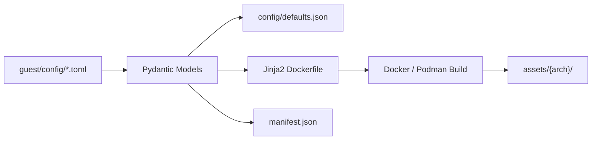
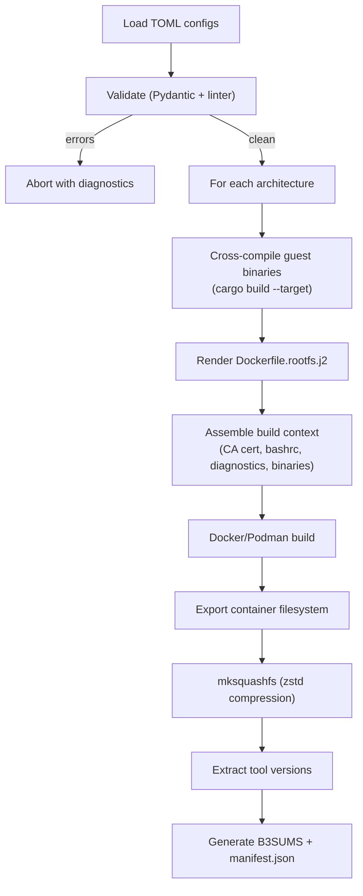
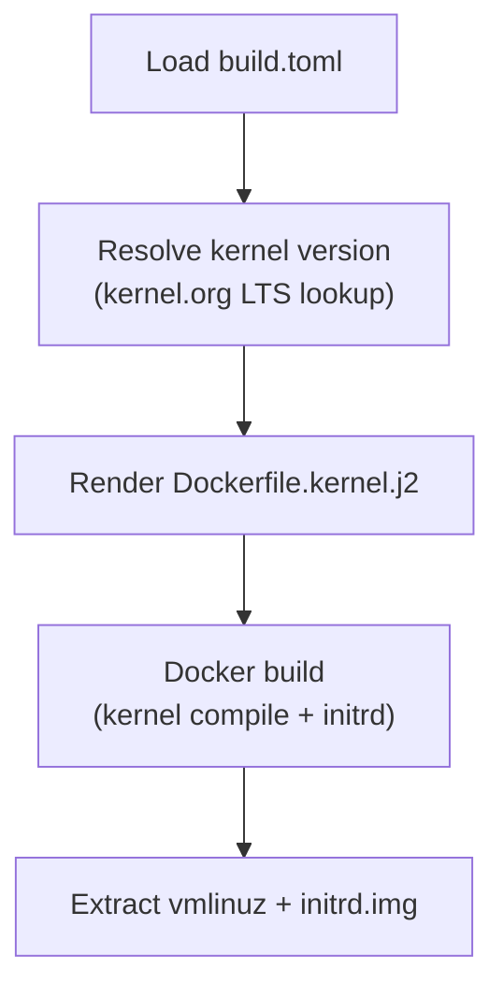
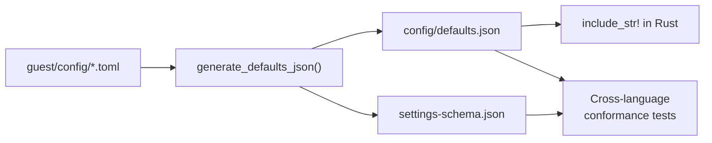

capsem-builder is a Python CLI that reads TOML configs from `guest/config/`, validates them through Pydantic models, renders Jinja2 Dockerfiles, and produces per-architecture VM assets. It also generates the `defaults.json` consumed by the Rust binary at compile time.

## Architecture



TOML configs are the single source of truth. The Pydantic models (`models.py`) validate structure and constraints. From there, three outputs are produced:

1. **defaults.json** -- settings interchange consumed by Rust via `include_str!`, validated against `settings-schema.json`.
2. **Rendered Dockerfiles** -- Jinja2 templates (`Dockerfile.rootfs.j2`, `Dockerfile.kernel.j2`) parameterized per architecture.
3. **manifest.json** -- bill-of-materials with package versions, BLAKE3 hashes, and vulnerability findings.

## TOML Config Structure

All config lives under `guest/config/`. Each file maps to a Pydantic model.

| File | Model | Purpose | Key Fields |
|------|-------|---------|------------|
| `build.toml` | `BuildConfig` | Architectures, compression | `compression`, `compression_level`, `architectures.*` |
| `manifest.toml` | `ImageManifestConfig` | Image identity and changelog | `name`, `version`, `description`, `changelog` |
| `ai/*.toml` | `AiProviderConfig` | AI provider definitions | `api_key`, `network.domains`, `install`, `cli`, `files` |
| `packages/apt.toml` | `PackageSetConfig` | Apt package set | `manager`, `install_cmd`, `packages`, `network` |
| `packages/python.toml` | `PackageSetConfig` | Python package set | `manager`, `install_cmd`, `packages` |
| `mcp/*.toml` | `McpServerConfig` | MCP server definitions | `transport`, `command`, `url`, `args`, `env` |
| `security/web.toml` | `WebSecurityConfig` | Domain allow/block policy | `allow_read`, `allow_write`, `custom_allow`, `search`, `registry`, `repository` |
| `vm/resources.toml` | `VmResourcesConfig` | CPU, RAM, disk limits | `cpu_count`, `ram_gb`, `scratch_disk_size_gb` |
| `vm/environment.toml` | `VmEnvironmentConfig` | Shell, PATH, TLS | `shell.term`, `shell.home`, `shell.path`, `tls.ca_bundle` |
| `kernel/defconfig.*` | (raw) | Kernel configs per arch | Linux kernel defconfig files |

Example `build.toml`:

```toml
[build]
compression = "zstd"
compression_level = 15

[build.architectures.arm64]
base_image = "debian:bookworm-slim"
docker_platform = "linux/arm64"
rust_target = "aarch64-unknown-linux-musl"
kernel_branch = "6.6"
kernel_image = "arch/arm64/boot/Image"
defconfig = "kernel/defconfig.arm64"
node_major = 24
```

Example AI provider (`ai/anthropic.toml`):

```toml
[anthropic]
name = "Anthropic"
description = "Claude Code AI agent"
enabled = true

[anthropic.api_key]
name = "Anthropic API Key"
env_vars = ["ANTHROPIC_API_KEY"]
prefix = "sk-ant-"
docs_url = "https://console.anthropic.com/settings/keys"

[anthropic.network]
domains = ["*.anthropic.com", "*.claude.com"]
allow_get = true
allow_post = true

[anthropic.install]
manager = "npm"
prefix = "/opt/ai-clis"
packages = ["@anthropic-ai/claude-code"]
```

## Validation Pipeline

`capsem-builder validate` runs compiler-style diagnostics with error codes, severity levels, and file:line references. Errors block the build; warnings are informational.

### Error Codes

| Range | Category | Examples |
|-------|----------|----------|
| E001-E002 | TOML parsing | Missing `build.toml`, invalid TOML syntax |
| E003-E005 | Pydantic validation | Schema violations, empty package lists, invalid enum values |
| E006 | Domain validation | URLs in domain fields, ports, path components |
| E008 | Duplicate keys | Same key in multiple files within a directory |
| E009-E010 | File content | Non-absolute paths, invalid JSON in `.json` file settings |
| E100-E103 | Schema / JSON | Generated JSON fails schema validation |
| E200-E202 | Cross-language | Rust/Python conformance mismatches |
| E300-E305 | Artifacts | Missing defconfig, CA cert, capsem-init, diagnostics |
| E400-E402 | Docker | Dockerfile generation failures |

### Warning Codes

| Code | Description |
|------|-------------|
| W001 | Package sets configured but no registry in web security |
| W002 | Development packages (`-dev`, `-devel`) in package lists |
| W003 | Potential secrets detected in file content, headers, or env |
| W004 | Package set with no network config |
| W005 | Overlapping allow and block domain lists |
| W006 | Placeholder file content (TODO, FIXME) |
| W007 | Overly broad wildcard domains (`*`, `*.com`) |
| W008 | Duplicate env_vars across AI providers |
| W009 | Shell metacharacters in install_cmd |
| W010 | PATH missing essential directories (`/usr/bin`, `/bin`) |
| W011 | Wide-open network policy (both reads and writes, no block list) |
| W012 | Unknown Rust target (not a known musl target) |

Diagnostic output format:

```
error: [E006] config/ai/anthropic.toml: Invalid domain pattern 'https://api.anthropic.com'
warning: [W003] config/mcp/capsem.toml: Potential secret in mcp.capsem.headers.Authorization
```

## Multi-Architecture Support

Two architectures are supported. Each is self-contained in `build.toml` and produces an independent asset directory.

| Architecture | Hypervisor | Docker Platform | Rust Target | Kernel Image |
|-------------|------------|-----------------|-------------|--------------|
| arm64 | Apple Virtualization.framework | `linux/arm64` | `aarch64-unknown-linux-musl` | `arch/arm64/boot/Image` |
| x86_64 | KVM | `linux/amd64` | `x86_64-unknown-linux-musl` | `arch/x86_64/boot/bzImage` |

Output layout:

```
assets/
  arm64/
    vmlinuz
    initrd.img
    rootfs.squashfs
    tool-versions.txt
  x86_64/
    vmlinuz
    initrd.img
    rootfs.squashfs
    tool-versions.txt
  manifest.json
  B3SUMS
```

## Build Pipeline



The kernel build follows a parallel path:



Key implementation details:

- **Container runtime auto-detection.** Docker or Podman, whichever is available.
- **CI cache integration.** Docker buildx with GitHub Actions cache (`type=gha`) when `GITHUB_ACTIONS` is set.
- **Kernel version resolution.** Fetches the latest stable version for the configured LTS branch from `kernel.org/releases.json`, falls back to a hardcoded version on network failure.
- **Cross-compilation.** Guest agent binaries are cross-compiled with `cargo build --target {rust_target}` using `rust-lld` as the linker (configured in `.cargo/config.toml`).

## Manifest and BOM

Every build produces `manifest.json` at the asset root. The BOM records:

| Section | Source | Contents |
|---------|--------|----------|
| Packages (dpkg) | `dpkg-query` output | Name, version, architecture |
| Packages (pip) | `pip list --format json` | Name, version |
| Packages (npm) | `npm ls --json --global` | Name, version |
| Assets | `b3sum` output | Filename, BLAKE3 hash, size in bytes |
| Vulnerabilities | Trivy or Grype scan | CVE ID, severity, package, installed/fixed versions |

The `audit` subcommand parses vulnerability scanner output and fails on CRITICAL or HIGH findings.

## CLI Commands

| Command | Description | Key Options |
|---------|-------------|-------------|
| `build` | Render Dockerfiles or build images | `--arch`, `--dry-run`, `--json`, `--template`, `--output`, `--kernel-version` |
| `validate` | Lint and validate guest config | `--artifacts` (check built artifacts too) |
| `inspect` | Show config summary | `--json` |
| `audit` | Parse vulnerability scan results | `--scanner` (trivy/grype), `--input`, `--json` |
| `init` | Scaffold a minimal guest config directory | `--force` |
| `new` | Create a new image config from a base | `--from`, `--non-interactive`, `--force` |
| `add ai-provider` | Add an AI provider template | `--dir`, `--force` |
| `add packages` | Add a package set template | `--dir`, `--manager`, `--force` |
| `add mcp` | Add an MCP server template | `--dir`, `--transport`, `--force` |
| `mcp` | Start MCP stdio server for builder tools | (none) |
| `doctor` | Check build prerequisites | (none) |

Usage:

```bash
# Validate config
uv run capsem-builder validate guest

# Dry-run: render Dockerfiles without building
uv run capsem-builder build --dry-run --json

# Build rootfs for arm64 only
uv run capsem-builder build --arch arm64

# Build kernel for all architectures
uv run capsem-builder build --template kernel

# Scaffold a new image config
uv run capsem-builder new my-image --from guest
```

## Settings JSON Generation

The builder bridges Python config and Rust runtime through a JSON interchange layer.



`generate_defaults_json()` transforms a `GuestImageConfig` into the hierarchical JSON tree consumed by the Rust settings registry. This JSON defines every setting's name, description, type, default value, and metadata (env vars, domain rules, UI hints).

The schema is generated from `SettingsRoot.model_json_schema()` (Pydantic) and written to `config/settings-schema.json`. Cross-language conformance tests verify that:

1. The generated `defaults.json` validates against the JSON schema.
2. Rust's compiled-in defaults match the Python-generated output.
3. Every setting referenced in Rust code exists in the schema.

This ensures the Python build tooling and Rust runtime never drift.
