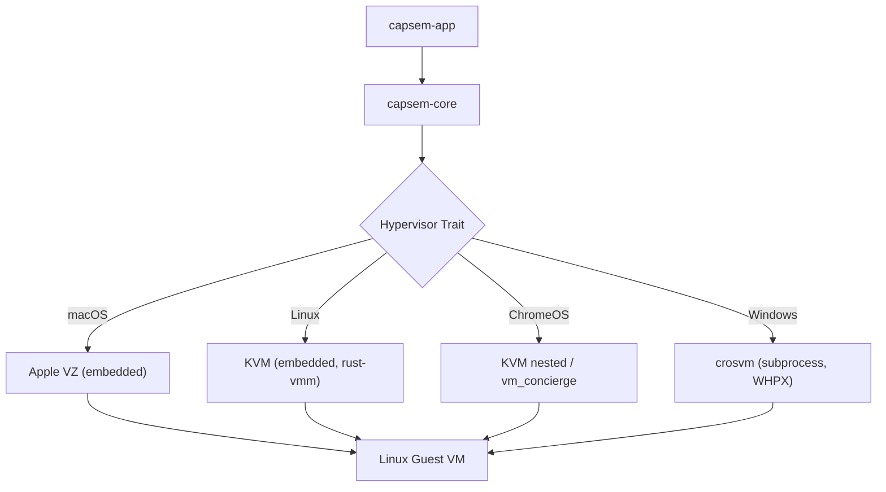

Capsem runs AI agents inside sandboxed Linux VMs. The hypervisor layer abstracts VM lifecycle, device management, and guest-host communication across four platforms.

## Supported Platforms

| Platform | Hypervisor | VMM | Status |
|----------|-----------|-----|--------|
| macOS (Apple Silicon) | Virtualization.framework | Embedded (Apple VZ) | Production |
| Linux (aarch64 / x86_64) | KVM | Embedded (rust-vmm) | Planned |
| ChromeOS | KVM | Embedded (nested) or vm_concierge | Planned |
| Windows (x86_64) | Hyper-V (WHPX) | crosvm (subprocess) | Planned |

The guest VM is always Linux (Debian bookworm, custom hardened kernel). Only the host-side VMM changes per platform.

## Architecture

On macOS and Linux, the VMM is **embedded** in the Capsem binary -- no external process needed. On Windows, crosvm runs as a subprocess.

**Embedded VMM (macOS, Linux):** All VM management logic runs in-process. On macOS, Apple's Virtualization.framework provides the API. On Linux, the `kvm-ioctls` crate talks directly to `/dev/kvm`, with `vm-memory`, `linux-loader`, and `virtio-queue` crates handling the rest. VirtioFS is also embedded using `vhost-user-backend` + `fuse-backend-rs`. Same approach as Firecracker -- single binary, no dependencies beyond the kernel.

**ChromeOS:** Two paths. Initially, Capsem runs inside Crostini and uses nested KVM (same embedded backend as Linux). A future optimization uses ChromeOS's `vm_concierge` D-Bus daemon to create sibling VMs, avoiding double virtualization entirely.

**Subprocess VMM (Windows):** crosvm runs as a child process with WHPX acceleration. Embedded not practical because crosvm's Windows code isn't published as standalone crates.

## Guest-Host Communication

All guest-host communication uses vsock (virtio socket), with four dedicated ports:

| Port | Purpose |
|------|---------|
| 5000 | Control messages (resize, heartbeat, exec) |
| 5001 | Terminal data (PTY I/O) |
| 5002 | MITM proxy (HTTPS connections) |
| 5003 | MCP gateway (tool routing) |

### Vsock Per Platform

- **macOS**: `VZVirtioSocketDevice` with ObjC delegate for connection callbacks
- **Linux / ChromeOS**: `AF_VSOCK` sockets with `vhost_vsock` kernel module
- **Windows**: crosvm's in-process virtio-vsock implementation (no kernel module needed)

The guest agent uses standard `AF_VSOCK` on all platforms -- the vsock device is transparent to guest code.

## Shared Filesystem (VirtioFS)

VirtioFS provides a POSIX-compatible shared mount between host and guest. The guest's `/root` (workspace) is a VirtioFS mount backed by a host directory.

- **macOS**: `VZVirtioFileSystemDevice` (built into Virtualization.framework)
- **Linux / ChromeOS**: Embedded VirtioFS server (`vhost-user-backend` + `fuse-backend-rs` -- same crates the standalone `virtiofsd` is built from, running in-process)
- **Windows**: crosvm `--shared-dir` with WHPX

## Auto-Snapshots

The host takes rolling snapshots of the workspace directory at a configurable interval (default 5 minutes, 12 slots). Snapshots are a **host-side** operation -- the guest has no knowledge of them.

- **macOS**: APFS `clonefile()` -- instant copy-on-write
- **Linux / ChromeOS / Windows**: Hardlink-based incremental -- unchanged files are hardlinked from the previous snapshot, only changed files are copied. Near-instant for typical workloads since few files change between 5-minute intervals.

## Guest Images

Guest images are built for both `aarch64` and `x86_64`. The same kernel config, rootfs packages, init script, and agent binaries are used -- only architecture-specific compiler options differ.

| Component | arm64 | x86_64 |
|-----------|-------|--------|
| Kernel config | `defconfig.arm64` | `defconfig.x86_64` |
| Kernel output | `arch/arm64/boot/Image` | `arch/x86_64/boot/bzImage` |
| Agent target | `aarch64-unknown-linux-musl` | `x86_64-unknown-linux-musl` |

## Prerequisites

### macOS
- Apple Silicon Mac (M1+)
- macOS 13+ (Ventura)
- Xcode command-line tools (for codesigning)

### Linux
- KVM support (`/dev/kvm`)
- `vhost_vsock` kernel module
- No external VMM or virtiofsd needed -- single binary

### ChromeOS
- Crostini enabled
- Nested KVM support (newer AMD/Intel Chromebooks)

### Windows
- Windows 11
- Hyper-V Platform feature enabled
- crosvm binary (bundled with installer)
