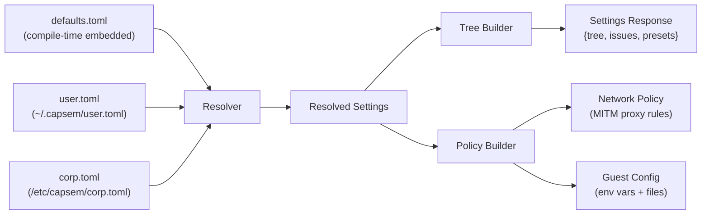
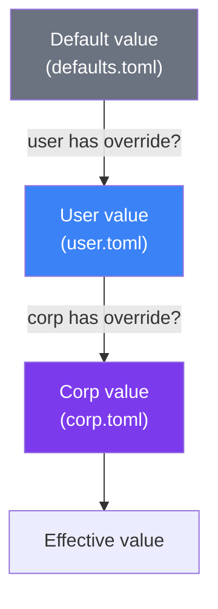
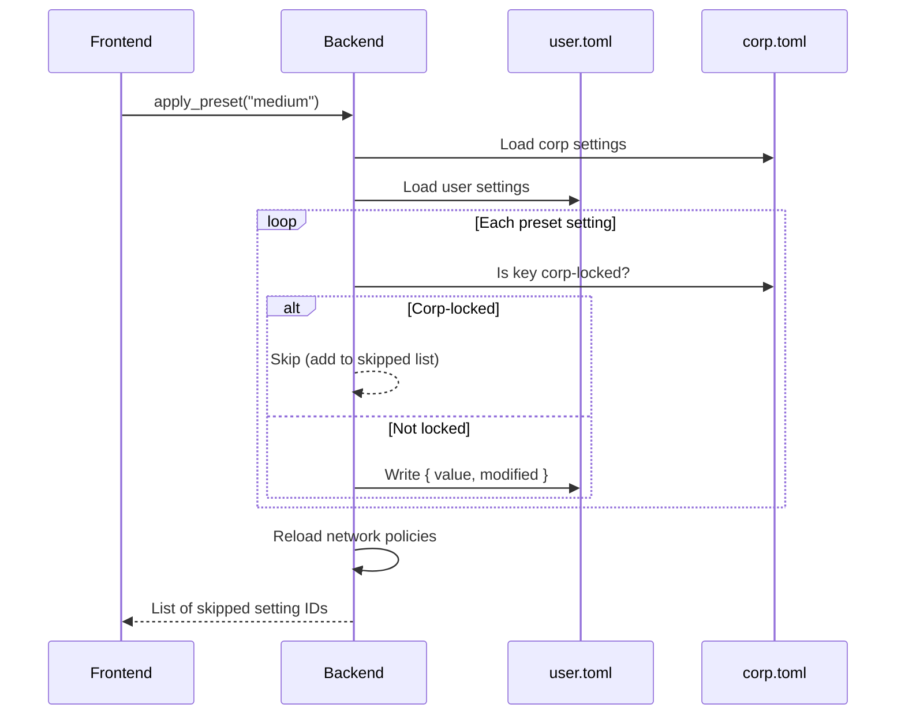
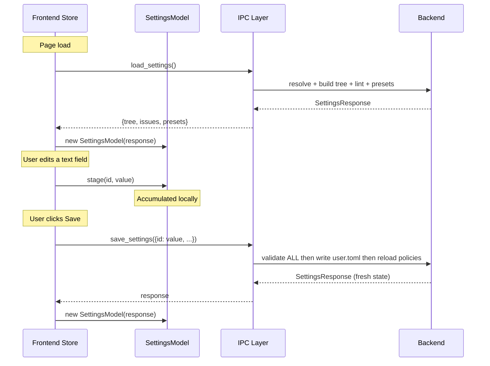
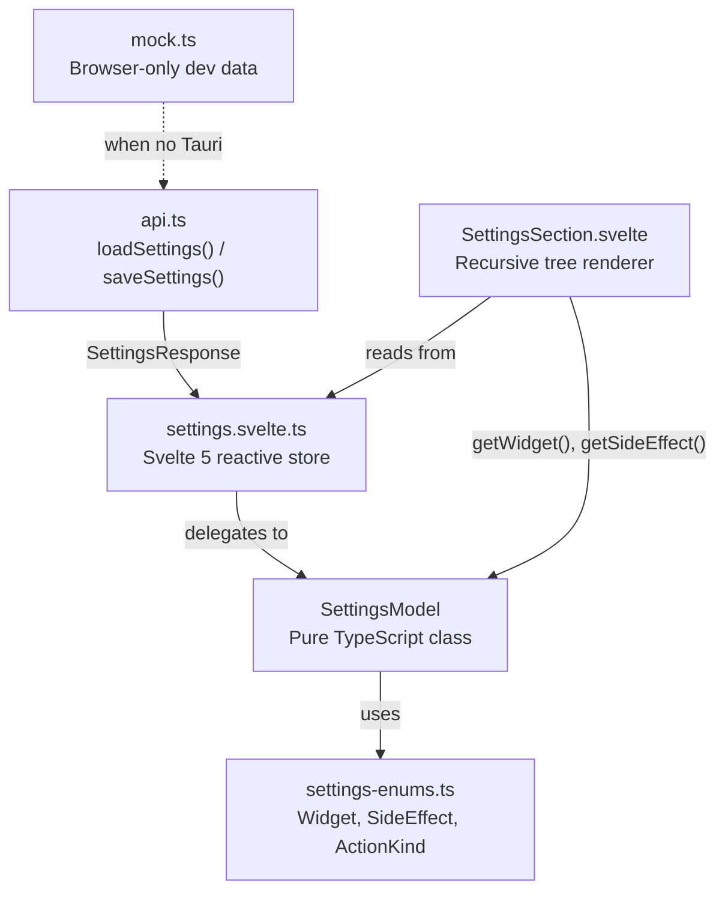
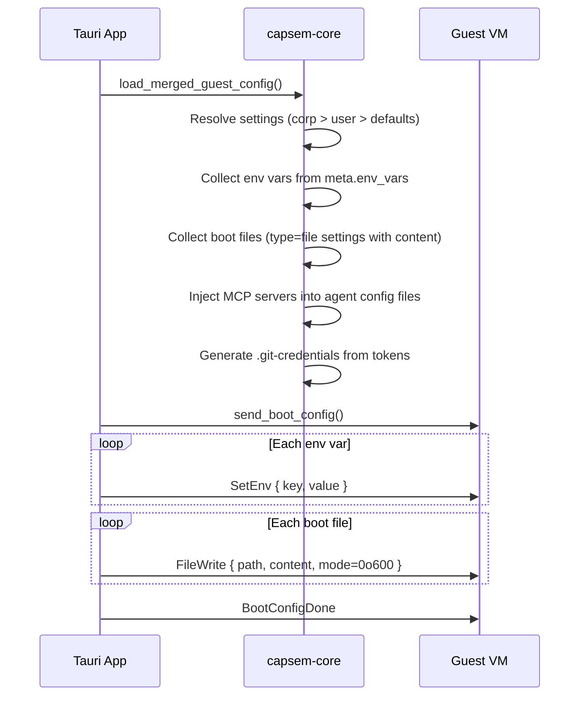
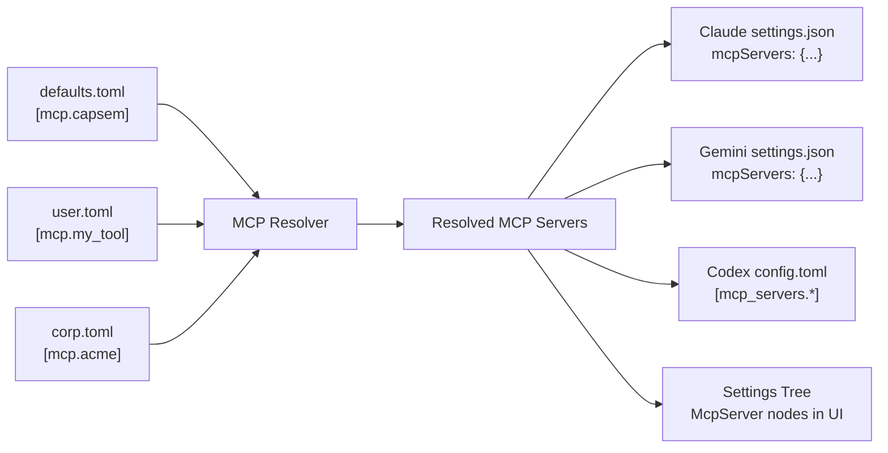

Capsem's settings system controls everything from AI provider access to VM resources. Settings are declared in TOML, merged from three sources with enterprise override, rendered in a dynamic UI, and injected into the guest VM at boot. This page covers the full architecture.

## File Sources

Three TOML files feed the settings system, merged with a strict priority order:



| File | Location | Purpose | Editable |
|---|---|---|---|
| `defaults.toml` | Embedded at compile time | All built-in settings with types and defaults | No (source code) |
| `user.toml` | `~/.capsem/user.toml` | User overrides and custom values | Yes (UI + manual) |
| `corp.toml` | `/etc/capsem/corp.toml` | Enterprise lockdown (MDM-distributed) | IT admin only |

Environment variables `CAPSEM_USER_CONFIG` and `CAPSEM_CORP_CONFIG` can override the default paths for testing.

## Settings Grammar

The settings TOML uses a formal grammar with four node types, distinguished by key presence:

| Discriminant | Node type | Purpose |
|---|---|---|
| has `type` key | **Leaf** | Setting with a stored value |
| has `action` key | **Action** | UI button/widget, no stored value |
| neither | **Group** | Container that organizes children |

A fourth node type, **MCP Server**, lives in a separate `[mcp]` section.

### Setting types

| Type | Value format | Default widget |
|---|---|---|
| `text` | String | Text input (select if `choices` set) |
| `number` | Integer | Number input with min/max |
| `bool` | Boolean | Toggle switch |
| `password` | String | Masked input with reveal |
| `apikey` | String | Masked input + prefix hint |
| `file` | `{ path, content }` | File editor with syntax highlighting |
| `string_list` | `["a", "b"]` | Chip/tag editor |
| `int_list` | `[1, 2, 3]` | Number list |
| `float_list` | `[1.0, 2.5]` | Number list |

### Action nodes

Action nodes declare UI elements (buttons, preset selectors) directly in the TOML grammar instead of hardcoding them in the frontend:

```toml
[settings.security.preset]
name = "Security Preset"
description = "Predefined security configurations"
action = "preset_select"

[settings.app.check_update]
name = "Check for updates"
action = "check_update"

[settings.vm.rerun_wizard]
name = "Setup Wizard"
action = "rerun_wizard"
```

The UI renders these via a finite `ActionKind` enum -- not string comparison.

### Metadata

Each leaf setting can have a `.meta` sub-table with extra fields:

```toml
[settings.ai.anthropic.api_key.meta]
env_vars = ["ANTHROPIC_API_KEY"]
docs_url = "https://console.anthropic.com/settings/keys"
prefix = "sk-ant-"
widget = "password_input"
side_effect = "toggle_theme"   # only on appearance.dark_mode
```

Key metadata fields: `widget` (override default UI widget), `side_effect` (frontend action on change), `hidden` (exclude from UI but still active for policy), `builtin` (non-removable), `env_vars` (inject into guest), `domains` (network policy), `rules` (HTTP method permissions).

## Value Resolution

Settings are resolved per-key with corp taking highest priority:



**Corp override is final.** When corp.toml sets a value, it becomes `corp_locked: true`. The user cannot change it via the UI or presets.

### Enabled resolution

Settings can be conditionally enabled via a parent toggle:

```
effective_enabled = explicit_enabled AND enabled_by_result
```

- **explicit_enabled**: corp `enabled` field > user `enabled` > defaults `enabled` > `true`
- **enabled_by_result**: if no `enabled_by` pointer, `true`. Otherwise, look up the parent toggle's effective boolean value.

Example: when `ai.anthropic.allow` is `false` (corp-locked off), all child settings (`api_key`, `domains`, config files) are `enabled: false` -- greyed out in the UI and excluded from policy.

### Hidden resolution

Any setting can be hidden from the UI while remaining active for policy:

```
effective_hidden = corp_hidden OR user_hidden OR defaults_hidden
```

Hidden settings are filtered from the tree sent to the frontend but still participate in policy building.

## Presets

Security presets (Medium, High) are batch writes to `user.toml`. They are **not** a separate resolution layer.



After preset application, resolution re-runs: `corp > user (with preset values) > defaults`. The UI detects the active preset by comparing effective values against all preset definitions.

## IPC Protocol

The frontend communicates with the backend via two commands. Currently these are Tauri IPC invocations; in a future release they will be HTTPS API endpoints.



### load_settings

Returns the full `SettingsResponse` in one call:

| Field | Type | Content |
|---|---|---|
| `tree` | `SettingsNode[]` | Hierarchical tree: groups, leaves, actions, MCP servers |
| `issues` | `ConfigIssue[]` | Validation warnings (missing API keys, invalid JSON, etc.) |
| `presets` | `SecurityPreset[]` | Available security presets with their setting values |

### save_settings

Accepts a batch of changes as `{ setting_id: value, ... }`. Behavior:

1. **Validate ALL changes upfront** (atomic -- all or nothing)
2. **Reject entire batch** if any change targets a corp-locked setting, uses an unknown ID, or fails validation
3. **Write to user.toml** in a single file operation
4. **Hot-reload policies** so the running MITM proxy picks up changes immediately
5. **Return fresh `SettingsResponse`** reflecting the new state

Bool toggles use `save_settings` immediately (instant policy reload). Text, number, file, and list changes accumulate locally and are sent as a batch when the user clicks Save.

## Frontend Architecture

The frontend separates logic from rendering through three layers:



| Layer | File | Responsibility |
|---|---|---|
| **Enums** | `settings-enums.ts` | Typed enums matching Rust serde output (Widget, SideEffect, ActionKind, SettingType) |
| **Model** | `settings-model.ts` | Pure TypeScript -- parsing, indexing, widget resolution, pending changes, validation. No Svelte dependency. Fully unit-tested. |
| **Store** | `settings.svelte.ts` | Thin Svelte 5 wrapper -- reactive state, IPC calls, delegates to SettingsModel |
| **View** | `SettingsSection.svelte` | Recursive renderer -- dispatches on `node.kind` (group/leaf/action/mcp_server) and `Widget` enum |

The model class is independently testable (43 vitest tests) and can be reused when the frontend migrates to an HTTPS API.

## Boot-Time Config Injection

At VM boot, resolved settings are translated into environment variables and files injected into the guest:



Key behaviors:

- **API keys are always injected** (even if the provider toggle is off) so the user can enable a provider at runtime without rebooting.
- **Provider toggles control network access**, not file injection. The domain policy blocks/allows traffic.
- **File permissions** default to `0o600` (owner-only) for sensitive content like API keys and SSH keys.
- **MCP servers** are injected into each AI agent's config file format (Claude JSON, Gemini JSON, Codex TOML).

## MCP Server Definitions

MCP servers are declared in a separate `[mcp]` section and auto-injected into AI agent config files at boot:



Resolution follows the same `corp > user > defaults` merge (per key). Corp entries are `corp_locked`. Example from defaults.toml:

```toml
[mcp.capsem]
name = "Capsem"
description = "Built-in Capsem MCP server for file and snapshot tools"
transport = "stdio"
command = "/run/capsem-mcp-server"
builtin = true
```

Enterprises can add MCP servers via `corp.toml`:

```toml
[mcp.internal_tools]
name = "Internal Tools"
transport = "stdio"
command = "/opt/acme/mcp-server"
args = ["--config", "/etc/acme.json"]
```

## Corp Lockdown

Enterprise administrators distribute `corp.toml` via MDM. It controls:

| Capability | How |
|---|---|
| **Force a value** | Set the key in corp.toml -- user cannot override |
| **Disable a provider** | Set `ai.anthropic.allow = false` -- all children disabled |
| **Hide a setting** | Set `hidden = true` on the override entry |
| **Block preset application** | Corp-locked settings are skipped during preset apply |
| **Add MCP servers** | Add entries to `[mcp]` section -- user cannot remove |
| **Disable MCP servers** | Set `enabled = false` on a server definition |

Enforcement is **exclusively in the backend**. The frontend disables controls for visual feedback but never validates corp locks itself. The `save_settings` command rejects any batch containing a corp-locked change.

## Future: HTTPS API

The current IPC uses Tauri's `invoke()` mechanism (local function calls between the Rust backend and the webview frontend). In a future release, these will become HTTPS API endpoints:

- `GET /api/settings` -- returns `SettingsResponse`
- `POST /api/settings` -- accepts batch changes, returns `SettingsResponse`
- `POST /api/settings/preset` -- applies a security preset

The `SettingsModel` class and the batch semantics are designed to work identically over HTTP. The `api.ts` wrapper will switch from `tauriInvoke()` to `fetch()` with no changes to the model, store, or rendering layers.
