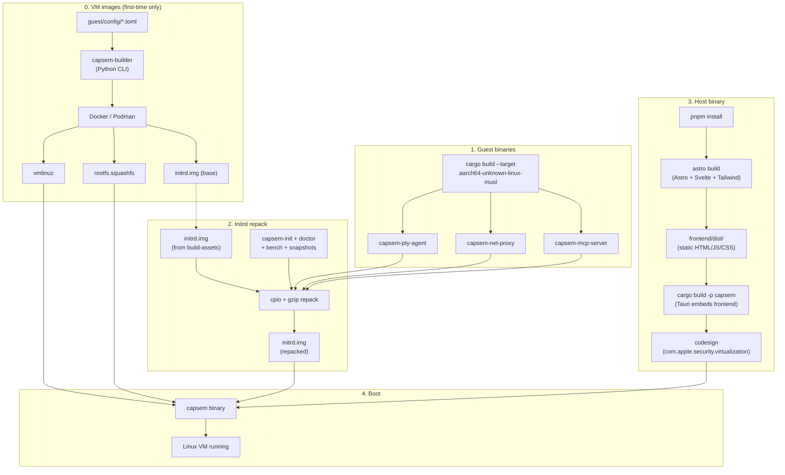
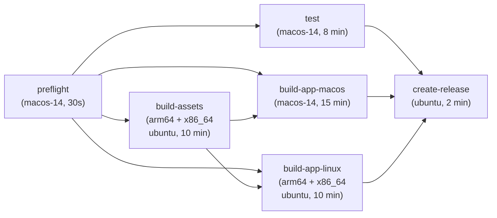

When you run `just run`, Capsem cross-compiles guest binaries, repacks the initrd, builds the host app, codesigns it, and boots a VM -- all in ~10 seconds. This page explains what each stage produces and which tools do the work.

## The build pipeline



## Stage 1: Guest binaries (compilation)

The guest agent crate (`crates/capsem-agent/`) produces three binaries that run inside the Linux VM, statically linked with musl:

| Binary | Purpose | Target |
|--------|---------|--------|
| `capsem-pty-agent` | Bridges terminal I/O over vsock | `aarch64-unknown-linux-musl` / `x86_64-unknown-linux-musl` |
| `capsem-net-proxy` | Relays HTTPS to host MITM proxy over vsock | same |
| `capsem-mcp-server` | MCP tool relay over vsock | same |

On **macOS**, `cross_compile_agent()` delegates to `container_compile_agent()` which builds natively inside a Linux container (podman/docker). Per-arch named volumes (`capsem-agent-target-{arch}`) cache build artifacts. No host cross-compile toolchain needed.

On **Linux** (CI), cargo builds directly with the musl target. The linker config in `.cargo/config.toml` uses `rust-lld`:

```toml
[target.aarch64-unknown-linux-musl]
linker = "rust-lld"

[target.x86_64-unknown-linux-musl]
linker = "rust-lld"
```

### Verifying the full Linux build locally

`just cross-compile [arch]` builds everything in a container: agent binaries, frontend, and the full Tauri app (deb + AppImage). This catches linuxdeploy and system dep issues before CI.

```bash
just cross-compile           # Build for host arch (arm64 on Apple Silicon)
just cross-compile x86_64    # Build x86_64 deb + AppImage
```

## Stage 2: Initrd repack

The initrd is a gzipped cpio archive that the kernel unpacks into RAM at boot. The `_pack-initrd` recipe:

1. Extracts the base initrd (produced by `just build-assets`)
2. Copies in the freshly cross-compiled guest binaries (chmod 555, read-only)
3. Copies in shell scripts: `capsem-init` (PID 1), `capsem-doctor`, `capsem-bench`, `snapshots`
4. Repacks with `cpio + gzip`
5. Regenerates BLAKE3 checksums (`B3SUMS` + `manifest.json`)

This is why `just run` is fast (~10s) -- it only rebuilds what changed, not the full rootfs.

## Stage 3: Host binary

This stage has two parts: the frontend build and the Rust compilation.

### Frontend (`pnpm build`)

The UI lives in `frontend/` and is built by pnpm before Rust compilation starts. The build chain:

1. **pnpm install** -- installs npm dependencies (Astro, Svelte, Tailwind, DaisyUI, xterm.js, LayerChart, sql.js, Tauri API bindings)
2. **astro build** -- compiles `.astro` and `.svelte` files into static HTML/JS/CSS in `frontend/dist/`
3. Tauri's build step copies `frontend/dist/` into the Rust binary as embedded assets

The frontend stack:

| Technology | Role |
|------------|------|
| [Astro 5](https://astro.build) | Static site generator -- page routing, builds the app shell |
| [Svelte 5](https://svelte.dev) | Reactive components -- terminal view, stats charts, settings panels |
| [Tailwind v4](https://tailwindcss.com) + [DaisyUI v5](https://daisyui.com) | Styling -- utility classes + themed component library |
| [xterm.js 6](https://xtermjs.org) | Terminal emulator -- renders the in-VM shell |
| [LayerChart 2](https://layerchart.com) | Charts -- session stats, cost tracking (D3-based Svelte library) |
| [sql.js](https://sql.js.org) | SQLite in the browser -- queries session DBs client-side |

For frontend iteration without booting a VM, use `just ui` (Astro dev server with mock data on port 5173). For the full Tauri app with hot-reload, use `just dev`.

### Rust compilation (`cargo build`)

The Rust workspace compiles into a single `capsem` binary:

| Crate | Role |
|-------|------|
| `capsem-core` | All business logic: VM config, boot, vsock, MITM proxy, MCP gateway, network policy, telemetry |
| `capsem-app` | Thin Tauri shell: IPC commands, CLI, state management |
| `capsem-proto` | Shared protocol types between host and guest |
| `capsem-logger` | Session DB schema and async writer (SQLite) |

On macOS, the binary must be codesigned with the `com.apple.security.virtualization` entitlement or Virtualization.framework crashes. The justfile handles this automatically via the `_sign` recipe.

## Stage 4: Boot

The `capsem` binary loads three assets from `assets/{arch}/`:

| Asset | Produced by | What it is |
|-------|-------------|------------|
| `vmlinuz` | `just build-assets` | Custom Linux kernel (no modules, no IP stack, 7MB) |
| `initrd.img` | `just run` (repacked each time) | Guest binaries + init scripts |
| `rootfs.squashfs` | `just build-assets` | Debian bookworm base + AI CLIs + tools |

Boot sequence: kernel loads initrd into RAM, `capsem-init` (PID 1) sets up overlayfs, air-gapped networking, and launches the PTY agent + net proxy. The host connects over vsock.

## VM image builds (`just build-assets`)

The slow path (~10 min, first-time only). The [capsem-builder](/architecture/build-system/) Python CLI reads TOML configs from `guest/config/` and produces kernel + rootfs via Docker/Podman.

```bash
uv run capsem-builder build guest/ --arch arm64    # build everything
uv run capsem-builder validate guest/               # lint configs
uv run capsem-builder doctor guest/                  # check prerequisites
```

### Container runtime

The builder needs Docker or Podman.

**macOS** -- Both run inside a Linux VM. The default memory (2GB for Podman) is too small. Minimum 4GB, recommended 8GB.

```bash
# Podman setup
brew install podman
podman machine init --memory 8192 --cpus 8
podman machine start

# Fix existing machine
podman machine stop
podman machine set --memory 8192 --cpus 8
podman machine start
```

Docker Desktop: Settings -> Resources -> set Memory to 8GB, CPUs to 8.

**Linux** -- Containers run natively, no memory tuning needed.

```bash
# Debian/Ubuntu
sudo apt install podman

# Fedora/RHEL
sudo dnf install podman
```

## CI release pipeline

When a `vX.Y.Z` tag is pushed, the release workflow runs. Jobs are parallelized to minimize wall-clock time (~18 min vs ~45 min sequential).



| Job | Runner | Produces |
|-----|--------|----------|
| `preflight` | macos-14 | Validates Apple cert, Tauri key, notarization creds |
| `build-assets` | ubuntu arm64 + x86_64 | vmlinuz, initrd.img, rootfs.squashfs per arch |
| `test` | macos-14 | Unit tests + coverage, frontend check, audit |
| `build-app-macos` | macos-14 | DMG, codesigned + notarized, latest.json |
| `build-app-linux` | ubuntu arm64 + x86_64 | deb (both arches), AppImage (x86_64 only), latest.json |
| `create-release` | ubuntu | Merges latest.json, signs manifest, creates GitHub release |

**Key design decisions:**
- `test` runs in parallel with `build-assets` and app builds -- it gates `create-release` but doesn't block compilation
- arm64 Linux produces `.deb` only -- linuxdeploy has no arm64 build
- Each platform's `latest.json` is merged in `create-release` for the Tauri auto-updater

### Local vs CI

`just cross-compile` builds the Linux app inside a container and catches most issues, but the environments differ:

| Aspect | Local (container) | CI (bare runner) |
|--------|-------------------|------------------|
| Base | `rust:bookworm` | `ubuntu-24.04` |
| Node | nodesource script | `actions/setup-node` |
| FUSE | available (podman VM) | not guaranteed |
| Volumes | none (clean build) | none (fresh runner) |

AppImage bundling that works locally can fail in CI due to FUSE differences. Always verify the first CI run after changing Linux packaging.

## Tools summary

Everything below is checked by `bootstrap.sh` and `just doctor`. You don't need to install these manually -- the bootstrap script tells you exactly what's missing.

| Tool | What it does in the build |
|------|--------------------------|
| Rust (stable) | Compiles host + guest binaries |
| `rust-lld` | Linker for musl cross-compilation |
| just | Task runner -- single entry point for all workflows |
| Node.js 24+ / pnpm | Builds the Astro + Svelte frontend |
| Python 3.11+ / uv | Runs capsem-builder (image builds, schema generation) |
| Docker or Podman | Container runtime for kernel + rootfs builds |
| cargo-llvm-cov | Code coverage (`just test`) |
| cargo-audit | Dependency vulnerability scanning |
| cargo-tauri | Tauri CLI for app builds |
| b3sum | BLAKE3 checksums for asset integrity |
| codesign (macOS) | Signs binary with virtualization entitlement |
