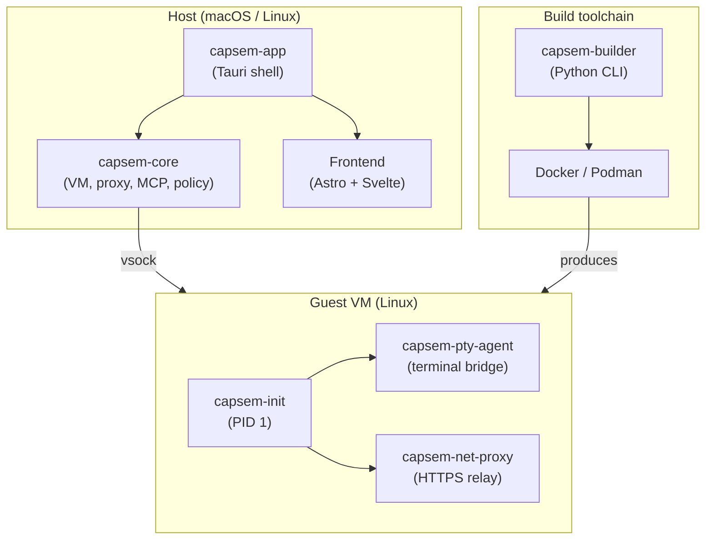

Capsem is a Rust + Tauri desktop app that sandboxes AI agents in air-gapped Linux VMs. The host manages the VM lifecycle, intercepts network traffic, and serves a web frontend. Guest binaries are cross-compiled from the same Rust workspace. A Python build system produces the VM images.

## Architecture overview



## Rust workspace

All Rust code lives in `crates/`. Business logic belongs in `capsem-core`; the other crates are thin shells.

| Crate | Role |
|-------|------|
| `capsem-core` | Shared library -- VM config, boot, vsock, MITM proxy, MCP gateway, network policy, telemetry |
| `capsem-app` | Tauri 2.0 desktop binary -- IPC commands, CLI, state management |
| `capsem-agent` | Guest binaries -- PTY agent, net proxy, MCP server (cross-compiled to Linux musl) |
| `capsem-proto` | Shared protocol types between host and guest (control messages, MCP frames) |
| `capsem-logger` | Session DB schema, async writer, event queries (SQLite) |

## Hypervisor

| Platform | Backend | Notes |
|----------|---------|-------|
| macOS | [Apple Virtualization.framework](https://developer.apple.com/documentation/virtualization) | Requires macOS 13+, Apple Silicon. Binary must be codesigned with `com.apple.security.virtualization`. |
| Linux | [KVM](https://www.linux-kvm.org) via [rust-vmm](https://github.com/rust-vmm) | Requires `/dev/kvm`. Embedded FUSE server for VirtioFS. |

See [Hypervisor Architecture](/architecture/hypervisor/) for boot sequence, VirtioFS, and backend internals.

## Frontend

| Technology | Version | Purpose |
|------------|---------|---------|
| [Astro](https://astro.build) | 5 | Static site generator, page routing |
| [Svelte](https://svelte.dev) | 5 | Reactive UI components |
| [Tailwind CSS](https://tailwindcss.com) | 4 | Utility-first styling |
| [DaisyUI](https://daisyui.com) | 5 | Component library (themes, buttons, modals) |
| [xterm.js](https://xtermjs.org) | 6 | Terminal emulator |
| [LayerChart](https://layerchart.com) | 2 | Svelte chart library (D3-based) |

Development commands:

- `just dev` -- full Tauri app with hot-reload (frontend + Rust)
- `just ui` -- frontend-only dev server (mock mode, no VM needed)

## Guest VM

The guest is a minimal Linux system built from Debian bookworm. It has no real NIC, no systemd, no sshd -- just the Capsem binaries.

- **capsem-init** -- PID 1. Sets up air-gapped networking (dummy NIC, dnsmasq, iptables redirect), mounts overlayfs, launches daemons.
- **capsem-pty-agent** -- Bridges PTY I/O over vsock to the host terminal.
- **capsem-net-proxy** -- Relays HTTPS connections over vsock to the host MITM proxy.

Guest binaries are cross-compiled to `aarch64-unknown-linux-musl` and `x86_64-unknown-linux-musl`, then injected into the initrd at build time. They are deployed read-only (chmod 555).

## Build system

[capsem-builder](https://capsem.org/architecture/build-system/) is a Python CLI that produces VM images from declarative TOML configs in `guest/config/`.

| Component | Technology |
|-----------|-----------|
| CLI framework | [Click](https://click.palletsprojects.com) |
| Config validation | [Pydantic](https://docs.pydantic.dev) |
| Dockerfile generation | [Jinja2](https://jinja.palletsprojects.com) |
| Image builds | Docker or Podman |

```bash
uv run capsem-builder build guest/ --arch arm64   # build rootfs + kernel
uv run capsem-builder validate guest/              # lint configs
uv run capsem-builder doctor guest/                # check prerequisites
```

### Container runtime setup

The builder needs Docker or Podman to produce VM images.

**macOS** -- Both Docker and Podman run inside a Linux VM. The default memory (2GB for Podman) is too small for the rootfs build. Minimum 4GB, recommended 8GB.

Podman:
```bash
brew install podman
podman machine init --memory 8192 --cpus 8
podman machine start
```

To fix an existing machine:
```bash
podman machine stop
podman machine set --memory 8192 --cpus 8
podman machine start
```

Docker Desktop: Settings -> Resources -> set Memory to 8GB, CPUs to 8.

**Linux** -- Containers run natively, no VM memory tuning needed.

```bash
# Debian/Ubuntu
sudo apt install podman

# Fedora/RHEL
sudo dnf install podman
```

## Toolchain

### Task runner

[just](https://just.systems) is the single entry point for all workflows. See `just --list` for all targets.

### Cross-compilation

Guest binaries target `aarch64-unknown-linux-musl` and `x86_64-unknown-linux-musl` using `rust-lld` (from the `llvm-tools` rustup component). The linker config is in `.cargo/config.toml`:

```toml
[target.aarch64-unknown-linux-musl]
linker = "rust-lld"

[target.x86_64-unknown-linux-musl]
linker = "rust-lld"
```

If you see linker errors like `ld: unknown options: --as-needed`, run:

```bash
rustup component add llvm-tools
```

### Cargo tools

| Tool | Purpose |
|------|---------|
| cargo-llvm-cov | Code coverage |
| cargo-audit | Dependency vulnerability scanning |
| cargo-tauri | Tauri CLI for app builds |
| b3sum | BLAKE3 checksums for asset verification |
| cargo-nextest | Test runner (used by `just test`) |

`just doctor` checks all of these. `just _install-tools` auto-installs them.

### Python

Package management via [uv](https://docs.astral.sh/uv/). Dependencies in `pyproject.toml`. Run tools with `uv run`.

### Frontend

Node.js 24+ and [pnpm](https://pnpm.io) for the Astro/Svelte frontend in `frontend/`.

## Testing

Three tiers, each catching different classes of bugs:

| Tier | Command | What it covers |
|------|---------|----------------|
| Unit + coverage | `just test` | Rust unit tests (llvm-cov), cross-compile check, frontend type check + build |
| Smoke | `just run "capsem-doctor"` | Boots VM, runs in-VM diagnostics (VirtioFS, networking, binaries) |
| Full | `just full-test` | All of the above + integration tests + benchmarks (3 VM boots) |

See [capsem-doctor](/testing/capsem-doctor/) for what the in-VM diagnostics validate.
