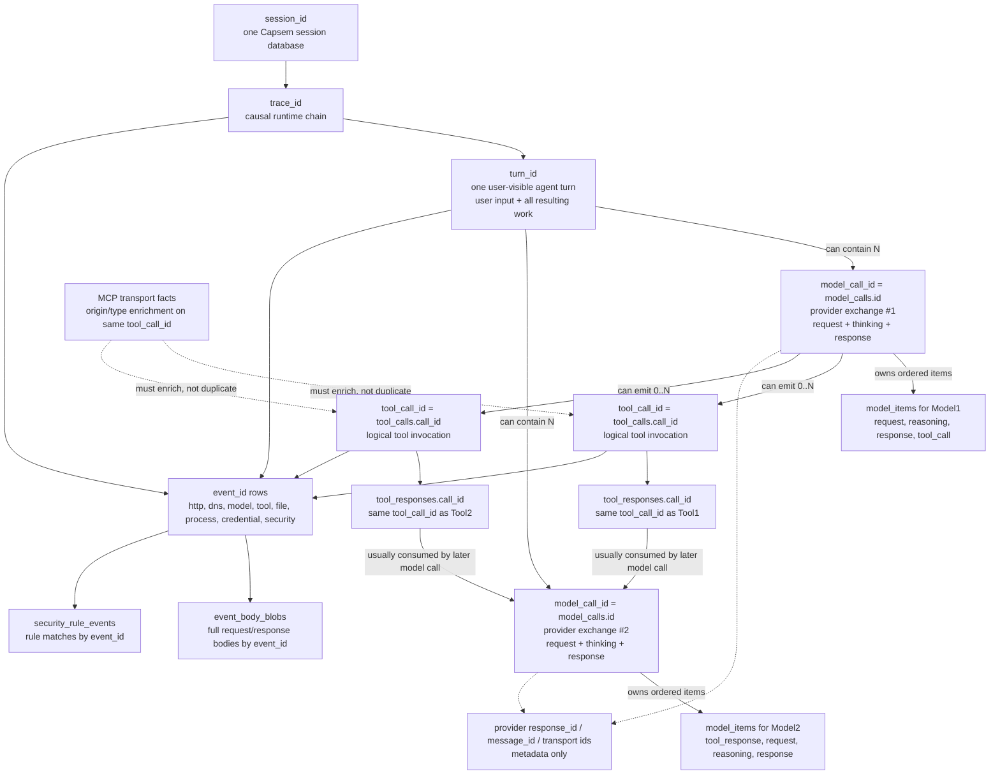

# Session Database Debugging

Every Capsem VM session produces a SQLite database at `~/.capsem/sessions/<id>/session.db` with ledger tables capturing telemetry. A global `~/.capsem/main.db` aggregates stats across sessions.

## Quick inspection

### Listing sessions

```bash
just list-sessions                    # Recent non-vacuumed sessions
just list-sessions -n 20              # Show more
just list-sessions --with-model       # Only sessions with AI model calls
just list-sessions --with-db          # Only sessions with session.db on disk
just list-sessions --with-net         # Only sessions with network events
just list-sessions --with-mcp         # Only sessions with MCP calls
just list-sessions --min-cost 0.01    # Only sessions that cost money
just list-sessions --all              # Include vacuumed sessions
just list-sessions --all --with-model # Combine filters
```

Output columns: ID, Created (MM-DD HH:MM:SS), Duration, Cost, net events, tokens (in+out), tool calls, MCP calls, fs events. Sessions with `*` after the ID still have a `session.db` on disk (queryable).

Stats come from the main.db rollup, so they're always available even after the session DB is vacuumed.

### Deep inspection

```bash
just inspect-session              # Full integrity check on latest session
just inspect-session <id>         # Specific session (use full ID from list)
just inspect-session -n 10        # Show 10 preview rows per table
```

Checks: table existence, row counts, tool lifecycle integrity (orphaned tool_calls/tool_responses), AI provider correlation (net_events vs model_calls), NULL detection in critical fields, and optional MCP transport correlation.

## Session database tables (session.db)

The model/tool contract is intentionally one ledger:

- `model_calls` is one row per model exchange: request sent to the provider and response received from it.
- `model_items` is the ordered item ledger for request, reasoning/thinking, response, tool_call, and tool_response content inside those exchanges.
- `tool_calls` is the canonical user/security tool-call ledger for all origins (`native`, `mcp`, `builtin`, `local`). User-facing tool counts and CEL tool evidence come from this table.
- `tool_responses` records tool result content sent back to a model. A response row must match a `tool_calls.call_id` in the same trace.
- MCP protocol facts are typed security events. MCP-origin `tools/call` activity must appear in `tool_calls` with `origin = 'mcp'`.
- One `model_calls.id` can emit many `tool_calls.call_id` values. The tool response must reuse the same `call_id`; MCP can enrich that same logical call, but it does not create a second product ledger.

### Identity Graph

Use this graph when correlating model, tool, and security rows:



Definitions:

- `event_id` identifies one emitted ledger event row. Security rows, body blobs,
  and event detail routes join back through this id.
- `trace_id` groups runtime work caused by one causal operation across tables:
  HTTP, DNS, model, tool, file, process, credentials, and security.
- `turn_id` groups all work caused by one user-visible agent turn: the user's
  input, every provider exchange needed to answer it, every tool request and
  response, and every emitted HTTP/DNS/file/process/security row caused by it.
- `model_call_id` is the `model_calls.id` value for exactly one provider
  request/response exchange inside a turn. It owns that exchange's request,
  reasoning/thinking, response, model-emitted tool-call items, token counts, and
  provider metadata. It is not the whole user turn; a single `turn_id` can
  contain multiple `model_call_id` values.
- `tool_call_id` identifies one logical tool invocation across model-native
  tools, MCP transport, Capsem built-ins, and local tools. In SQLite it is stored
  as `tool_calls.call_id` and `tool_responses.call_id`.

Provider response ids, message ids, and transport request ids are provider or
transport metadata. They are not Capsem's join contract.

One `turn_id` is the user-input scope. It can contain multiple
`model_call_id` values when an agent calls the model, executes tools, then calls
the model again with tool results. One `model_call_id` is one provider-exchange
scope and carries that exchange's request, reasoning/thinking, response, token
counts, and ordered `model_items`. It can emit zero or more `tool_call_id`
values; this is the canonical one-to-many relationship for model-visible tools.
A tool response must carry the same `tool_call_id` as the tool request.

MCP is not a second user-facing tool ledger. MCP-origin `tools/call` activity
must resolve to a `tool_calls` row with `origin = 'mcp'` or enrich an existing
logical `tool_call_id`. An MCP call observed without a corresponding logical
tool call is an integrity/security finding, not a separate product counter.

Key cardinalities:

- One session has many `trace_id` values.
- One `trace_id` has one or more `turn_id` values.
- One `turn_id` has one or more `model_call_id` values.
- One `model_call_id` has one provider request and one provider response.
- One `model_call_id` has many `model_items` rows: request, reasoning,
  response, tool_call, and tool_response items in observed order.
- One `model_call_id` can emit many `tool_call_id` values.
- One `tool_call_id` has one tool request and zero or more observed response
  rows, all with the same `tool_call_id`.
- One `event_id` identifies one emitted row and joins its security, body, and
  display details.

### net_events -- one row per HTTP request through MITM proxy

```sql
CREATE TABLE net_events (
    id INTEGER PRIMARY KEY AUTOINCREMENT,
    timestamp TEXT NOT NULL,          -- RFC 3339
    domain TEXT NOT NULL,             -- "api.anthropic.com"
    port INTEGER DEFAULT 443,
    decision TEXT NOT NULL,           -- "allowed" or "denied"
    process_name TEXT,                -- "claude", "node", "python3"
    pid INTEGER,
    method TEXT,                      -- "POST", "GET"
    path TEXT,                        -- "/v1/messages"
    query TEXT,                       -- URL query string
    status_code INTEGER,              -- 200, 403, etc.
    bytes_sent INTEGER DEFAULT 0,
    bytes_received INTEGER DEFAULT 0,
    duration_ms INTEGER DEFAULT 0,
    matched_rule TEXT,                -- which policy rule matched
    request_headers TEXT,             -- JSON (allowlisted verbatim, others hashed)
    response_headers TEXT,
    request_body_preview TEXT,        -- compact display field only
    response_body_preview TEXT,
    conn_type TEXT DEFAULT 'https'
);
```

### model_calls -- one row per AI API request+response cycle

```sql
CREATE TABLE model_calls (
    id INTEGER PRIMARY KEY AUTOINCREMENT,
    timestamp TEXT NOT NULL,
    provider TEXT NOT NULL,           -- "anthropic", "openai", "google"
    model TEXT,                       -- "claude-sonnet-4-20250514", "gpt-4o"
    process_name TEXT,
    pid INTEGER,
    method TEXT NOT NULL,             -- "POST"
    path TEXT NOT NULL,               -- "/v1/messages"
    stream INTEGER DEFAULT 0,         -- 1 if SSE streaming
    system_prompt_preview TEXT,
    messages_count INTEGER DEFAULT 0,
    tools_count INTEGER DEFAULT 0,
    request_bytes INTEGER DEFAULT 0,
    request_body_preview TEXT,        -- compact display field only
    message_id TEXT,                  -- "msg_..." (Anthropic), "chatcmpl-..." (OpenAI)
    status_code INTEGER,
    text_content TEXT,                -- full response text
    thinking_content TEXT,            -- thinking/reasoning text
    stop_reason TEXT,                 -- "end_turn", "tool_use", "stop", "STOP"
    input_tokens INTEGER,
    output_tokens INTEGER,
    duration_ms INTEGER DEFAULT 0,
    response_bytes INTEGER DEFAULT 0,
    estimated_cost_usd REAL DEFAULT 0,
    trace_id TEXT,                    -- groups tool call chains across turns
    usage_details TEXT                -- JSON: {"cache_read": N, "thinking": N}
);
```

Only emitted for actual LLM API paths (`/v1/messages`, `/v1/chat/completions`, `/v1beta/models/*/`). Health checks, auth endpoints don't create rows.

### tool_calls -- canonical tool invocation ledger

```sql
CREATE TABLE tool_calls (
    id INTEGER PRIMARY KEY AUTOINCREMENT,
    event_id TEXT NOT NULL,           -- 12 hex chars
    timestamp TEXT NOT NULL,
    model_call_id INTEGER,            -- model_calls.id that emitted the tool call when model-visible
    provider TEXT NOT NULL,
    status TEXT NOT NULL,             -- "requested", "observed", "responded", "error"
    call_index INTEGER NOT NULL,      -- position in response
    call_id TEXT NOT NULL,            -- "toolu_..." (Anthropic), "call_..." (OpenAI)
    tool_name TEXT NOT NULL,
    arguments TEXT,                   -- JSON string
    response_preview TEXT,
    origin TEXT NOT NULL DEFAULT 'native',  -- "native", "mcp", "builtin", or "local"
    server_name TEXT,
    method TEXT,
    request_id TEXT,
    decision TEXT NOT NULL,
    duration_ms INTEGER DEFAULT 0,
    error_message TEXT,
    process_name TEXT,
    bytes_sent INTEGER DEFAULT 0,
    bytes_received INTEGER DEFAULT 0,
    policy_mode TEXT,
    policy_action TEXT,
    policy_rule TEXT,
    policy_reason TEXT,
    trace_id TEXT,
    credential_ref TEXT
);
```

For model-emitted tool calls, `model_call_id` points to the model exchange
whose response emitted that tool call. It is not a trace-level guess.

### tool_responses -- results sent back for tool calls

```sql
CREATE TABLE tool_responses (
    id INTEGER PRIMARY KEY AUTOINCREMENT,
    model_call_id INTEGER NOT NULL,   -- model_calls.id whose request consumed the tool result
    call_id TEXT NOT NULL,            -- matches tool_calls.call_id
    content_preview TEXT,
    is_error INTEGER DEFAULT 0,
    trace_id TEXT,
    credential_ref TEXT
);
```

`tool_responses.model_call_id` points to the later model exchange that carried
the tool result back to the model. The same `call_id` must match a
`tool_calls.call_id` in the same trace.

MCP initialize/list/resource protocol evidence is available through
`security_rule_events.event_json`. Use `tool_calls` for product/user/security
tool activity.

Full HTTP/model/MCP request and response bodies live in `event_body_blobs`,
keyed by `event_id`, `source_table`, and `direction`. When debugging payload
content, query that table first; preview columns are for fast UI scans and are
not the forensic source of truth.

### fs_events -- filesystem changes in guest workspace

```sql
CREATE TABLE fs_events (
    id INTEGER PRIMARY KEY AUTOINCREMENT,
    timestamp TEXT NOT NULL,
    action TEXT NOT NULL,              -- "created", "modified", "deleted"
    path TEXT NOT NULL,                -- relative to workspace root
    size INTEGER                       -- bytes (NULL for deletes)
);
```

## Main database (main.db)

Global rollup at `~/.capsem/main.db`. Key tables:

- **sessions** -- one row per session: id, mode, status, timestamps, aggregated counts (total_requests, allowed/denied, tokens, cost, tool_calls, file_events)
- **ai_usage** -- per-session per-provider aggregates (call_count, tokens, cost, duration)
- **tool_usage** -- per-session per-tool aggregates from the canonical tool ledger
- **mcp_usage** -- per-session MCP transport aggregates when protocol frames are visible

Rollup happens when a session ends.

## Common debugging scenarios

### Missing net_events
- Guest didn't make HTTPS requests, or VM shut down before proxy flushed
- Check: `just run 'curl -s https://api.anthropic.com/ && sleep 1'` then inspect

### model_calls has NULL model or NULL tokens
- **Gzip bug**: response was gzip-compressed and proxy didn't decompress before SSE parsing. Check if `Accept-Encoding: gzip` was sent and `Content-Encoding: gzip` was in response.
- **Non-streaming**: for non-streaming responses, tokens come from response JSON, not SSE. Check if `stream=0`.
- **Provider mismatch**: check if the URL path was detected as the right provider. Model resolution: request body > SSE stream > response JSON > URL path.

### tool_calls without matching tool_responses
- The model invoked a tool but the next turn's tool results weren't captured
- Check if the VM session ended before the tool result was sent back
- `just inspect-session` reports orphaned tool_calls automatically

### Empty fs_events
- `capsem-fs-watch` didn't start (check boot logs for `[capsem-fs-watch] starting`)
- Vsock port 5005 connection failed
- VM shut down before 100ms debouncer flushed (add `sleep 1`)

### Empty tool_calls
- No AI agent invoked tools during the session, or model/MCP tool evidence failed to parse.
- User-facing tool activity must be in `tool_calls` regardless of whether the origin is native model output, MCP, builtin, or local.

### Empty MCP-origin tool_calls
- No visible MCP `tools/call` activity was observed, or the guest MCP endpoint was not started.
- This can be valid for direct model-native tool calls. Check native `tool_calls` before assuming no user tool activity happened.

### Cost is zero
- Model not found in pricing table (`config/data/genai-prices.json`)
- Run `just update-prices` to refresh pricing data

## When to inspect sessions

**Always** run `just inspect-session` after changes to:
- Guest MCP endpoint (tool routing, policy, response format)
- MITM proxy (SSE parsing, body preview, Content-Encoding)
- File monitor (VirtioFS events, debouncer)
- Snapshot system (create, revert, compact, list)
- Telemetry pipeline (model_calls extraction, tool_calls, cost)

The inspect output now includes a tool usage breakdown from `tool_calls` plus MCP transport evidence when present. Check it after MCP changes to verify user tools return `allowed` with reasonable latency and that MCP-origin rows link back to protocol evidence when available.

## Ad-hoc SQL queries

Use `just query-session` to run SQL against session DBs. Auto-selects the latest non-vacuumed session with a DB on disk. Pass a session ID as second argument to target a specific session.

```bash
# Decisions breakdown
just query-session "SELECT decision, COUNT(*) FROM net_events GROUP BY decision"

# Token totals by provider
just query-session "SELECT provider, SUM(input_tokens) as in_tok, SUM(output_tokens) as out_tok, SUM(estimated_cost_usd) as cost FROM model_calls GROUP BY provider"

# Find orphaned tool calls
just query-session "SELECT tc.call_id, tc.tool_name FROM tool_calls tc LEFT JOIN tool_responses tr ON tc.call_id = tr.call_id WHERE tr.id IS NULL"

# MCP-origin user tool usage breakdown (snapshot, http, etc.)
just query-session "SELECT tool_name, decision, COUNT(*) as cnt, ROUND(AVG(duration_ms),1) as avg_ms FROM tool_calls WHERE origin = 'mcp' AND tool_name IS NOT NULL GROUP BY tool_name, decision ORDER BY cnt DESC"

# MCP-origin tool usage breakdown
just query-session "SELECT method, tool_name, decision, COUNT(*) as cnt FROM tool_calls WHERE origin = 'mcp' GROUP BY method, tool_name, decision ORDER BY cnt DESC"

# Check fs_events actions
just query-session "SELECT action, COUNT(*) FROM fs_events GROUP BY action"

# Trace a tool call chain
just query-session "SELECT id, model, stop_reason, trace_id FROM model_calls WHERE trace_id = '<trace_id>' ORDER BY timestamp"

# Query a specific session (use full ID from just list-sessions)
just query-session "SELECT COUNT(*) FROM net_events" 20260327-154418-f907
```

Tip: use `just list-sessions --with-db --with-model` to find sessions worth querying.
