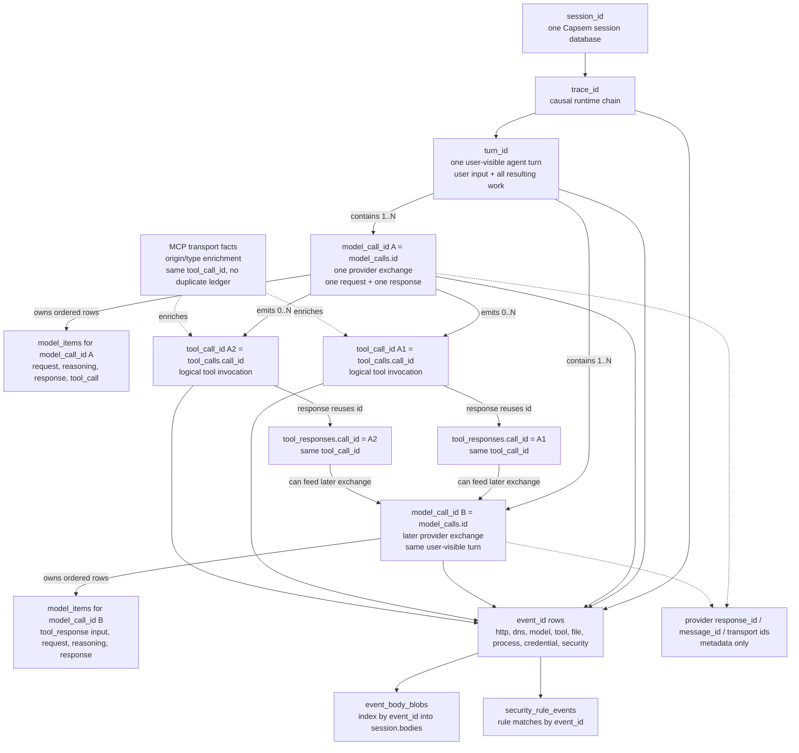

# Session Database Debugging

Every Capsem VM session produces a ledger in its session directory:
`~/.capsem/run/sessions/<id>/` for an ephemeral VM, `~/.capsem/run/persistent/<name>/`
for a named one. The ledger is two files that only make sense together:

- `session.db` -- SQLite, every telemetry table plus the index of captured bodies.
- `session.bodies` -- the append-only body archive: HTTP, model, tool, exec and
  security payloads, deflated in blocks of about 1 MiB. SQLite never holds
  body bytes.

Copy, fork or delete them as a pair; either one alone is useless. A global
`~/.capsem/sessions/main.db` aggregates stats across sessions.

The session ledger has no migrations. A `session.db` written by an older build
fails to open, loudly and by name, rather than being upgraded in place.

## Session identity invariant

`<id>` is the opaque VM/session id used for route paths, DB-handle keys,
session-directory names, `CAPSEM_VM_ID`, and UI tab routing. Human names such
as `co-work1` or `code-vm1` are display aliases only and must live in `name`
fields. User surfaces may accept a name (`capsem resume co-work1`), but they
must translate it to the VM id before calling `/vms/{id}/...`. Never use a
persistent registry name as `SandboxInfo.id`, never look up telemetry routes
with `registry.get(&id)` unless the id has first been resolved to the registry
key, and never key `session_db_handles` by display name.

If a UI shows telemetry for the wrong provider/model, check this boundary
first: `/vms/list` and `/vms/{id}/info` must expose `id = session id` and
`name = display name`, and `/vms/{id}/stats/detail` must open the DB under the
resolved session directory for that id. A session named `co-work1` showing
another session's `ollama` rows while its own DB has AGY/Google rows is a route
identity bug until proven otherwise.

## Quick inspection

### Listing sessions

Python here means the build-system environment:
`uv run --project build_system --frozen python ...` (a bare `python3` may be a
system interpreter without the packages these need).

```bash
python3 build_system/scripts/doctor/list_sessions.py                     # Recent sessions
python3 build_system/scripts/doctor/list_sessions.py -n 20               # Show more
python3 build_system/scripts/doctor/list_sessions.py --with-model        # Only sessions with AI model calls
python3 build_system/scripts/doctor/list_sessions.py --with-db           # Only sessions whose ledger is still on disk
python3 build_system/scripts/doctor/list_sessions.py --with-net          # Only sessions with network events
python3 build_system/scripts/doctor/list_sessions.py --with-tools        # Only sessions with tool calls
python3 build_system/scripts/doctor/list_sessions.py --min-cost 0.01     # Only sessions that cost money
python3 build_system/scripts/doctor/list_sessions.py --with-db --with-model # Combine filters
```

Output columns: ID, Created (MM-DD HH:MM:SS), Duration, Cost, net events, tokens (in+out), tool calls, fs events. Sessions with `*` after the ID still have a `session.db` on disk (queryable).

Stats come from the main.db rollup, so they're available after the session directory is gone.

### Deep inspection

```bash
python3 build_system/scripts/doctor/check_session.py                   # Full integrity check on latest session
python3 build_system/scripts/doctor/check_session.py <id>              # Specific session or named VM
python3 build_system/scripts/doctor/check_session.py --db path/session.db  # A ledger file directly
python3 build_system/scripts/doctor/check_session.py --verify-bodies   # Also read every body back through its hash
python3 build_system/scripts/doctor/check_session.py -n 10             # Show 10 preview rows per table
```

Checks: SQLite page integrity (`PRAGMA quick_check`, first -- a damaged file
ends the report), table existence, row counts, body archive integrity (below),
file-monitor overflow windows, tool lifecycle integrity (orphaned
tool_calls/tool_responses), AI provider correlation (net_events vs
model_calls), and NULL detection in critical fields. It exits 1 when the
ledger is damaged.

Route readiness (`DbHandle::ready`) checks the schema's shape only, once per
`schema_version`, and never scans pages: that scan cost 1.8 s per failed poll
on a million-row ledger (google/capsem#230). Page damage surfaces as a
`malformed` error on the query that reads it, at the ledger copy's
`quick_check`, and here.

The body archive check compares the index with the file without trusting
either: every `event_body_blobs.block_offset` exists in `body_blocks`; every
`body_offset + body_len` fits in its block's `raw_len`; `session.bodies` is at
least as long as the largest `block_offset + disk_len` (a block's committed
extent, headers included) and starts with the archive's file header.
`--verify-bodies` then reads every body, inflating each segment once, and
checks it against `body_hash`.

## Session database tables (session.db)

The model/tool contract is intentionally one ledger:

- `model_calls` is one row per model exchange: request sent to the provider and response received from it.
- `model_items` is the ordered item ledger for request, reasoning/thinking, response, tool_call, and tool_response content inside those exchanges.
- `tool_calls` is the canonical user/security tool-call ledger for all origins (`native`, `mcp`, `builtin`, `local`). User-facing tool counts and CEL tool evidence come from this table.
- `tool_responses` records tool result content sent back to a model. A response row must match a `tool_calls.call_id` in the same trace.
- MCP protocol facts are typed security events. MCP-origin `tools/call` activity must appear in `tool_calls` with `origin = 'mcp'`.
- One `model_calls.id` can emit many `tool_calls.call_id` values. The tool response must reuse the same `call_id`; MCP can enrich that same logical call, but it does not create a second product ledger.

### Identity Graph

Use this graph when correlating model, tool, and security rows:


```mermaid
flowchart TD
    Session["session_id<br/>one Capsem session database"]
    Trace["trace_id<br/>causal runtime chain"]
    Turn["turn_id<br/>one user-visible agent turn<br/>user input + all resulting work"]

    ModelA["model_call_id A = model_calls.id<br/>one provider exchange<br/>one request + one response"]
    ModelB["model_call_id B = model_calls.id<br/>later provider exchange<br/>same user-visible turn"]
    ModelAItems["model_items for model_call_id A<br/>request, reasoning, response, tool_call"]
    ModelBItems["model_items for model_call_id B<br/>tool_response input, request, reasoning, response"]

    ToolA1["tool_call_id A1 = tool_calls.call_id<br/>logical tool invocation"]
    ToolA2["tool_call_id A2 = tool_calls.call_id<br/>logical tool invocation"]
    ToolA1Response["tool_responses.call_id = A1<br/>same tool_call_id"]
    ToolA2Response["tool_responses.call_id = A2<br/>same tool_call_id"]
    McpFacts["MCP transport facts<br/>origin/type enrichment<br/>same tool_call_id, no duplicate ledger"]

    EventRows["event_id rows<br/>http, dns, model, tool, file, process, credential, security"]
    BodyBlobs["event_body_blobs<br/>index by event_id into session.bodies"]
    SecurityRows["security_rule_events<br/>rule matches by event_id"]
    ProviderIds["provider response_id / message_id / transport ids<br/>metadata only"]

    Session --> Trace
    Trace --> Turn
    Turn -->|"contains 1..N"| ModelA
    Turn -->|"contains 1..N"| ModelB

    ModelA -->|"owns ordered rows"| ModelAItems
    ModelB -->|"owns ordered rows"| ModelBItems
    ModelA -->|"emits 0..N"| ToolA1
    ModelA -->|"emits 0..N"| ToolA2

    ToolA1 -->|"response reuses id"| ToolA1Response
    ToolA2 -->|"response reuses id"| ToolA2Response
    McpFacts -.->|"enriches"| ToolA1
    McpFacts -.->|"enriches"| ToolA2
    ToolA1Response -->|"can feed later exchange"| ModelB
    ToolA2Response -->|"can feed later exchange"| ModelB

    Trace --> EventRows
    Turn --> EventRows
    ModelA --> EventRows
    ModelB --> EventRows
    ToolA1 --> EventRows
    ToolA2 --> EventRows
    EventRows --> BodyBlobs
    EventRows --> SecurityRows
    ModelA -.-> ProviderIds
    ModelB -.-> ProviderIds
```

Definitions:

- `event_id` identifies one emitted ledger event row. Security rows, body blobs,
  and event detail routes join back through this id.
- `trace_id` groups runtime work caused by one causal operation across tables:
  HTTP, DNS, model, tool, file, process, credentials, and security.
- `turn_id` groups all work caused by one user-visible agent turn: the user's
  input, every provider exchange needed to answer it, every tool request and
  response, and every emitted HTTP/DNS/file/process/security row caused by it.
- `model_call_id` is the `model_calls.id` value for exactly one provider
  request/response exchange inside a turn. It owns that exchange's request,
  reasoning/thinking, response, model-emitted tool-call items, token counts, and
  provider metadata. It is not the whole user turn; a single `turn_id` can
  contain multiple `model_call_id` values.
- `tool_call_id` identifies one logical tool invocation across model-native
  tools, MCP transport, Capsem built-ins, and local tools. In SQLite it is stored
  as `tool_calls.call_id` and `tool_responses.call_id`.

Provider response ids, message ids, and transport request ids are provider or
transport metadata. They are not Capsem's join contract.

One `turn_id` is the user-input scope. It can contain multiple
`model_call_id` values when an agent calls the model, executes tools, then calls
the model again with tool results. One `model_call_id` is one provider-exchange
scope and carries that exchange's request, reasoning/thinking, response, token
counts, and ordered `model_items`. It can emit zero or more `tool_call_id`
values; this is the canonical one-to-many relationship for model-visible tools.
Stated as the debugging invariant: one `model_call_id` can emit N
`tool_call_id` values, and each emitted tool response must reuse that
`tool_call_id`.
A tool response must carry the same `tool_call_id` as the tool request.

MCP is not a second user-facing tool ledger. MCP-origin `tools/call` activity
must resolve to a `tool_calls` row with `origin = 'mcp'` or enrich an existing
logical `tool_call_id`. An MCP call observed without a corresponding logical
tool call is an integrity/security finding, not a separate product counter.

Key cardinalities:

- One session has many `trace_id` values.
- One `trace_id` has one or more `turn_id` values.
- One `turn_id` has one or more `model_call_id` values.
- One `model_call_id` has one provider request and one provider response.
- One `model_call_id` has many `model_items` rows: request, reasoning,
  response, tool_call, and tool_response items in observed order.
- One `model_call_id` can emit many `tool_call_id` values.
- One `tool_call_id` has one tool request and zero or more observed response
  rows, all with the same `tool_call_id`.
- One `event_id` identifies one emitted row and joins its security, body, and
  display details.

### net_events -- one row per HTTP request through MITM proxy

```sql
CREATE TABLE net_events (
    id INTEGER PRIMARY KEY AUTOINCREMENT,
    timestamp TEXT NOT NULL,          -- RFC 3339
    domain TEXT NOT NULL,             -- "api.anthropic.com"
    port INTEGER DEFAULT 443,
    decision TEXT NOT NULL,           -- "allowed" or "denied"
    process_name TEXT,                -- "claude", "node", "python3"
    pid INTEGER,
    method TEXT,                      -- "POST", "GET"
    path TEXT,                        -- "/v1/messages"
    query TEXT,                       -- URL query string
    status_code INTEGER,              -- 200, 403, etc.
    bytes_sent INTEGER DEFAULT 0,
    bytes_received INTEGER DEFAULT 0,
    duration_ms INTEGER DEFAULT 0,
    matched_rule TEXT,                -- which policy rule matched
    request_headers TEXT,             -- JSON (allowlisted verbatim, others hashed)
    response_headers TEXT,
    request_body_preview TEXT,        -- compact display field only
    response_body_preview TEXT,
    conn_type TEXT DEFAULT 'https'
);
```

### model_calls -- one row per AI API request+response cycle

```sql
CREATE TABLE model_calls (
    id INTEGER PRIMARY KEY AUTOINCREMENT,
    timestamp TEXT NOT NULL,
    provider TEXT NOT NULL,           -- "anthropic", "openai", "google"
    model TEXT,                       -- "claude-sonnet-4-20250514", "gpt-4o"
    process_name TEXT,
    pid INTEGER,
    method TEXT NOT NULL,             -- "POST"
    path TEXT NOT NULL,               -- "/v1/messages"
    stream INTEGER DEFAULT 0,         -- 1 if SSE streaming
    system_prompt_preview TEXT,
    messages_count INTEGER DEFAULT 0,
    tools_count INTEGER DEFAULT 0,
    request_bytes INTEGER DEFAULT 0,
    request_body_preview TEXT,        -- compact display field only
    message_id TEXT,                  -- "msg_..." (Anthropic), "chatcmpl-..." (OpenAI)
    status_code INTEGER,
    text_content TEXT,                -- full response text
    thinking_content TEXT,            -- thinking/reasoning text
    stop_reason TEXT,                 -- "end_turn", "tool_use", "stop", "STOP"
    input_tokens INTEGER,
    output_tokens INTEGER,
    duration_ms INTEGER DEFAULT 0,
    response_bytes INTEGER DEFAULT 0,
    estimated_cost_usd REAL DEFAULT 0,
    trace_id TEXT,                    -- groups tool call chains across turns
    usage_details TEXT                -- JSON: {"cache_read": N, "thinking": N}
);
```

Only emitted for actual LLM API paths (`/v1/messages`, `/v1/chat/completions`, `/v1beta/models/*/`). Health checks, auth endpoints don't create rows.

### tool_calls -- canonical tool invocation ledger

```sql
CREATE TABLE tool_calls (
    id INTEGER PRIMARY KEY AUTOINCREMENT,
    event_id TEXT NOT NULL,           -- 12 hex chars
    timestamp TEXT NOT NULL,
    model_call_id INTEGER,            -- model_calls.id that emitted the tool call when model-visible
    provider TEXT NOT NULL,
    status TEXT NOT NULL,             -- "requested", "observed", "responded", "error"
    call_index INTEGER NOT NULL,      -- position in response
    call_id TEXT NOT NULL,            -- "toolu_..." (Anthropic), "call_..." (OpenAI)
    tool_name TEXT NOT NULL,
    arguments TEXT,                   -- JSON string
    response_preview TEXT,
    origin TEXT NOT NULL DEFAULT 'native',  -- "native", "mcp", "builtin", or "local"
    server_name TEXT,
    method TEXT,
    request_id TEXT,
    decision TEXT NOT NULL,
    duration_ms INTEGER DEFAULT 0,
    error_message TEXT,
    process_name TEXT,
    bytes_sent INTEGER DEFAULT 0,
    bytes_received INTEGER DEFAULT 0,
    policy_mode TEXT,
    policy_action TEXT,
    policy_rule TEXT,
    policy_reason TEXT,
    trace_id TEXT,
    credential_ref TEXT
);
```

For model-emitted tool calls, `model_call_id` points to the model exchange
whose response emitted that tool call. It is not a trace-level guess.

### tool_responses -- results sent back for tool calls

```sql
CREATE TABLE tool_responses (
    id INTEGER PRIMARY KEY AUTOINCREMENT,
    model_call_id INTEGER NOT NULL,   -- model_calls.id whose request consumed the tool result
    call_id TEXT NOT NULL,            -- matches tool_calls.call_id
    content_preview TEXT,
    is_error INTEGER DEFAULT 0,
    trace_id TEXT,
    credential_ref TEXT
);
```

`tool_responses.model_call_id` points to the later model exchange that carried
the tool result back to the model. The same `call_id` must match a
`tool_calls.call_id` in the same trace.

MCP initialize/list/resource protocol evidence is in the forensic payload of
the matching `security_rule_events` row. That payload is archive-backed, not a
column: read it with
`DbHandle::read_body(event_id, "security_rule_events", BodyDirection::Payload)`,
or join `event_body_blobs` on `source_table = 'security_rule_events'` and
`direction = 'payload'` to see what is stored. Decisions and asks archive the
same way under `security_decision_events` and `security_ask_events`, and all
three name the same event, so a payload read always names its table. Use
`tool_calls` for product/user/security tool activity.

### Bodies: event_body_blobs, body_blocks and session.bodies

Full bodies -- HTTP and model requests and responses, tool results, exec
stdout/stderr, security rule payloads -- live in `session.bodies`, not in
SQLite. `session.db` holds the index:

```sql
CREATE TABLE body_blocks (             -- one row per archive block, upserted per segment
    block_offset INTEGER PRIMARY KEY,  -- byte offset of the block header in session.bodies
    raw_len INTEGER NOT NULL,          -- inflated size of the committed segments
    disk_len INTEGER NOT NULL,         -- committed extent in the file, headers included
    sealed_at TEXT NOT NULL            -- when the last segment was written; retention cuts by this
);

CREATE TABLE event_body_blobs (        -- one row per archived body; no bytes
    id INTEGER PRIMARY KEY AUTOINCREMENT,
    event_id TEXT NOT NULL,            -- 12 hex, the row in source_table
    event_type TEXT NOT NULL,
    source_table TEXT NOT NULL,        -- net_events, model_calls, tool_calls, tool_responses,
                                       -- exec_events, security_rule_events
    direction TEXT NOT NULL,           -- request, response, payload, stdout, stderr
    content_type TEXT,
    original_bytes INTEGER NOT NULL,   -- what the boundary saw
    stored_bytes INTEGER NOT NULL,     -- what was archived (10 MiB cap per direction)
    truncated INTEGER NOT NULL,        -- 1 when stored_bytes < original_bytes
    body_hash TEXT NOT NULL,           -- blake3 of the ARCHIVED bytes
    block_offset INTEGER NOT NULL REFERENCES body_blocks(block_offset),
    body_offset INTEGER NOT NULL,      -- start inside the block's inflated bytes
    body_len INTEGER NOT NULL,         -- always = stored_bytes
    trace_id TEXT, turn_id TEXT, created_at TEXT NOT NULL,
    UNIQUE(event_id, source_table, direction)
);
```

A body is found by one index lookup, one seek, one inflate of its block and a
slice. Every read verifies the block's own blake3 and then the body's
`body_hash`; bytes that do not match the row that named them are refused, never
served. There is no `body` column any more: SQL tells you *what* was captured
and how big it was, not the bytes.

To get the bytes:

- In Rust, `DbHandle::read_body(event_id, source_table, direction)` for one
  body and `DbHandle::read_bodies(event_id)` for every body of an event
  (`read_bodies_for_events` for a page, with a byte budget). Route and helper
  code never opens the archive itself.
- Over HTTP, `GET /vms/{id}/bodies/{event_id}` returns every body of one event,
  1 MiB each by default (`?max_bytes=` up to 16 MiB). `truncated` says the
  capture was cut; `truncated_for_transport` says this response was.
- The whole session as a WARC 1.1 file: `GET /vms/{id}/bodies/export.warc.gz`.
  One `resource` record per body, id `urn:capsem:{session}:{source_table}:{event_id}:{direction}`,
  bracketed by two `warcinfo` records; the closing one counts skipped bodies by
  reason, and a file without it is an export that did not finish. Readable by
  `warcio`/`pywb` with no Capsem code.
- Offline, from a copy of a session: `tests/helpers/body_archive.py` (the one
  allowlisted Python reader of the format).

Preview columns (`*_preview`) are compact display copies for list views. They
are not the forensic source of truth: when a preview and the archive disagree,
the archive is the ledger.

Retention (`vm.resources.retention_days`, default 30): at service start,
failed-session directories older than the period are deleted; when a
persistent VM stops, blocks sealed before the cutoff are dropped, the archive
is compacted and the index rows are rewritten. Ephemeral sessions are deleted
whole and never trimmed.

Guest exec output reaches the ledger already cut to 1 KiB of stdout per
command, so an `exec_events` body holds at most that much while `stdout_bytes`
records the true size (google/capsem#220).

### fs_events -- filesystem changes in guest workspace

```sql
CREATE TABLE fs_events (
    id INTEGER PRIMARY KEY AUTOINCREMENT,
    timestamp TEXT NOT NULL,
    action TEXT NOT NULL,              -- "created", "modified", "deleted", "overflow"
    path TEXT NOT NULL,                -- relative to workspace root
    size INTEGER,                      -- bytes (NULL for deletes and dirs)
    kind TEXT NOT NULL DEFAULT 'file'  -- "file", "dir", "symlink", "other"
);
```

`kind` says what the path is. Security rules read it as `file.kind`, and a
directory event reports no size (the directory inode's size is not a file
size). A symlink is recorded as a symlink and never followed or descended.

An `overflow` row names no path: it is the marker the monitor writes when one
scan produced more changes than it emits in a single window. The events it
stands for are not lost -- the baseline is rewound so the next scan derives
them again -- and `size` carries how many were held back. A gap in the record
is evidence, so it is a row rather than a log line.

Every path under the workspace is recorded, directories included. There is no
exclusion list: `.git/hooks`, `.git/config`, `node_modules`, `.venv` and
`target` are where a compromise persists, so a ledger that omitted them read as
a clean session for a backdoored workspace. Cost is paid by the monitor's
adaptive poll interval (`poll_interval_for_scan` in
`crates/capsem-core/src/fs_monitor.rs`: ten scan-durations, floored at 500ms and
capped at 10s), never by dropping events. `tests/citadel/test_fs_monitor_has_no_exclusions.py`
holds the rule.

## Main database (main.db)

Global rollup at `~/.capsem/sessions/main.db`. Key tables:

- **sessions** -- one row per session: id, mode, status, timestamps, aggregated counts (total_requests, allowed/denied, tokens, cost, tool_calls, file_events)
- **ai_usage** -- per-session per-provider aggregates (call_count, tokens, cost, duration)
- **tool_usage** -- per-session per-tool aggregates from the canonical tool ledger
- **mcp_usage** -- per-session MCP transport aggregates when protocol frames are visible

Rollup happens when a session ends.

## Common debugging scenarios

### Missing net_events
- Guest didn't make HTTPS requests, or VM shut down before proxy flushed
- Check: `just exec 'curl -s https://api.anthropic.com/ && sleep 1'` then inspect

### model_calls has NULL model or NULL tokens
- **Gzip bug**: response was gzip-compressed and proxy didn't decompress before SSE parsing. Check if `Accept-Encoding: gzip` was sent and `Content-Encoding: gzip` was in response.
- **Non-streaming**: for non-streaming responses, tokens come from response JSON, not SSE. Check if `stream=0`.
- **Provider mismatch**: check if the URL path was detected as the right provider. Model resolution: request body > SSE stream > response JSON > URL path.

### tool_calls without matching tool_responses
- The model invoked a tool but the next turn's tool results weren't captured
- Check if the VM session ended before the tool result was sent back
- `python3 build_system/scripts/doctor/check_session.py` reports orphaned tool_calls automatically

### Empty fs_events
- The host file monitor (`crates/capsem-core/src/fs_monitor.rs`) polls the
  VirtioFS workspace; there is no guest watcher. Check the process log for the
  monitor starting on the session's workspace directory.
- The VM stopped before the next scan. The interval adapts to scan cost
  (500ms to 10s), so a write in the last second before shutdown may not have
  been seen.

### A file event seems late or missing
- Look for `action = 'overflow'` rows: one scan saw more changes than a window
  emits and held the rest for the next scan. `size` is how many were held.
  `check_session.py` reports them.
- Nothing under the workspace is excluded. If `.git/`, `node_modules/` or
  `target` paths are absent, the monitor did not see them; it did not filter
  them.

### Bodies missing
- Check `body_blocks` first. No rows means no block was ever sealed: the
  session stored no bodies, or the archive writer was disabled at open.
- An index row that names a block past the end of `session.bodies` is refused
  at open by design: the writer stores no further bodies for that session and
  logs `session body index names bytes past the end of the archive`, and the
  stale rows fail their hash check rather than answer with another block's
  bytes. It means the index and the file no longer describe the same archive,
  most likely a crash during retention compaction, or `session.db` copied
  without its `session.bodies`.
- `check_session.py --verify-bodies` names every row that does not read back.
- A persistent VM trims bodies older than `vm.resources.retention_days` when it
  stops; a body older than that is gone by design, and its index row with it.
- Exec output is cut to 1 KiB before the ledger sees it; a short stdout body
  with a large `stdout_bytes` is that, not archive damage.

### Empty tool_calls
- No AI agent invoked tools during the session, or model/MCP tool evidence failed to parse.
- User-facing tool activity must be in `tool_calls` regardless of whether the origin is native model output, MCP, builtin, or local.

### Empty MCP-origin tool_calls
- No visible MCP `tools/call` activity was observed, or the guest MCP endpoint was not started.
- This can be valid for direct model-native tool calls. Check native `tool_calls` before assuming no user tool activity happened.

### Cost is zero
- Model not found in pricing table (`config/data/genai-prices.json`)
- Download the reviewed upstream pricing JSON and invoke
  `python3 build_system/scripts/build/update_genai_prices.py <source.json> config/data/genai-prices.json`.

## When to inspect sessions

**Always** run `python3 build_system/scripts/doctor/check_session.py` after changes to:
- Guest MCP endpoint (tool routing, policy, response format)
- MITM proxy (SSE parsing, body preview, Content-Encoding)
- File monitor (VirtioFS poll loop, kinds, overflow windows)
- Body archive or its index (`session.bodies`, `event_body_blobs`, `body_blocks`, retention) -- add `--verify-bodies`
- Telemetry pipeline (model_calls extraction, tool_calls, cost)

The inspect output now includes a tool usage breakdown from `tool_calls` plus MCP transport evidence when present. Check it after MCP changes to verify user tools return `allowed` with reasonable latency and that MCP-origin rows link back to protocol evidence when available.

## Ad-hoc SQL queries

Use `sqlite3 "$HOME/.capsem/run/sessions/<id>/session.db"` to run SQL against a session DB (a named VM's is under `run/persistent/<name>/`). Open it read-only (`-readonly`) while the VM runs: the owning `capsem-process` is the only writer. SQL answers what was captured and where; the bytes of a body are in `session.bodies` (see Bodies above).

```bash
# Decisions breakdown
sqlite3 "$HOME/.capsem/run/sessions/<id>/session.db" "SELECT decision, COUNT(*) FROM net_events GROUP BY decision"

# Token totals by provider
sqlite3 "$HOME/.capsem/run/sessions/<id>/session.db" "SELECT provider, SUM(input_tokens) as in_tok, SUM(output_tokens) as out_tok, SUM(estimated_cost_usd) as cost FROM model_calls GROUP BY provider"

# Find orphaned tool calls
sqlite3 "$HOME/.capsem/run/sessions/<id>/session.db" "SELECT tc.call_id, tc.tool_name FROM tool_calls tc LEFT JOIN tool_responses tr ON tc.call_id = tr.call_id WHERE tr.id IS NULL"

# MCP-origin user tool usage breakdown (http, external servers, etc.)
sqlite3 "$HOME/.capsem/run/sessions/<id>/session.db" "SELECT tool_name, decision, COUNT(*) as cnt, ROUND(AVG(duration_ms),1) as avg_ms FROM tool_calls WHERE origin = 'mcp' AND tool_name IS NOT NULL GROUP BY tool_name, decision ORDER BY cnt DESC"

# MCP-origin tool usage breakdown
sqlite3 "$HOME/.capsem/run/sessions/<id>/session.db" "SELECT method, tool_name, decision, COUNT(*) as cnt FROM tool_calls WHERE origin = 'mcp' GROUP BY method, tool_name, decision ORDER BY cnt DESC"

# Check fs_events actions
sqlite3 "$HOME/.capsem/run/sessions/<id>/session.db" "SELECT action, COUNT(*) FROM fs_events GROUP BY action"

# Trace a tool call chain
sqlite3 "$HOME/.capsem/run/sessions/<id>/session.db" "SELECT id, model, stop_reason, trace_id FROM model_calls WHERE trace_id = '<trace_id>' ORDER BY timestamp"

# What bodies an event has, and how big they were
sqlite3 "$HOME/.capsem/run/sessions/<id>/session.db" "SELECT source_table, direction, content_type, original_bytes, stored_bytes, truncated FROM event_body_blobs WHERE event_id = '<event_id>'"

# Archive health at a glance: blocks, bytes, and any body pointing at an unrecorded block
sqlite3 "$HOME/.capsem/run/sessions/<id>/session.db" "SELECT COUNT(*), SUM(raw_len), SUM(disk_len), MIN(sealed_at) FROM body_blocks; SELECT COUNT(*) FROM event_body_blobs b LEFT JOIN body_blocks k USING (block_offset) WHERE k.block_offset IS NULL"

# File-monitor overflow windows and what kinds of paths changed
sqlite3 "$HOME/.capsem/run/sessions/<id>/session.db" "SELECT kind, action, COUNT(*) FROM fs_events GROUP BY kind, action"
```

Tip: use `python3 build_system/scripts/doctor/list_sessions.py --with-db --with-model` to find sessions worth querying.
