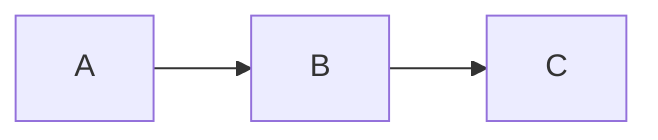

# Documentation Site

The product website uses [Astro Starlight](https://starlight.astro.build/) (Astro 6 + Tailwind v4). Docs live in `site/src/content/docs/` as markdown/MDX files.

## Dev workflow

```bash
cd site && pnpm run dev     # localhost:4321
cd site && pnpm run build   # Production build
```

## Writing style

Tight and to the point, like a manual. One topic per page. No filler, no marketing language. Tables over prose when listing configs or test cases. Code examples only when they clarify usage. Diagrams in mermaid.

## Frontmatter

Every doc page must include `title` and `description`. Starlight handles `lastUpdated` from git history automatically. No `layout:` field -- Starlight provides its own.

```markdown
---
title: Page Title
description: One-line summary for SEO and sidebar tooltips.
sidebar:
  order: 10
---
```

## Site structure

```
site/src/content/docs/
  getting-started.md
  architecture/
    hypervisor.md         Hypervisor abstraction, Apple VZ + KVM backends (5 mermaid diagrams)
    settings.md           Settings grammar, value resolution, presets, IPC, boot injection
    build-system.md       capsem-builder architecture, TOML configs, Jinja, multi-arch
    custom-images.md      Corporate image customization guide
    settings-schema.md    Two-node schema, JSON Schema, Pydantic, cross-language conformance
  security/
    overview.md           Security model overview
    network-isolation.md  Air-gapped networking, domain policy
    virtualization.md     VM isolation guarantees
    build-verification.md Build reproducibility, checksums
    kernel-hardening.md   Custom kernel, allnoconfig, minimal attack surface
  testing/
    capsem-doctor.md      In-VM diagnostic suite
    benchmarks.md         Performance benchmarks
  development/
    getting-started.md    Dev environment setup (stub)
    skills.md             AI agent skills system
  releases/
    0-8.md through 0-12.md   One page per minor version
```

## Sidebar

Configured in `site/astro.config.mjs` under `starlight({ sidebar: [...] })`. Uses `autogenerate: { directory: '<category>' }` for each section. Page ordering within a section uses `sidebar: { order: N }` in frontmatter.

## Adding a new doc page

1. Create `site/src/content/docs/<category>/<topic>.md` with frontmatter
2. It auto-appears in the sidebar via `autogenerate`
3. Set `sidebar: { order: N }` to control position (lower = higher in list)

## Adding a new category

1. Create the directory under `site/src/content/docs/`
2. Add a sidebar entry in `site/astro.config.mjs`:
   ```js
   { label: 'Category Name', autogenerate: { directory: 'category-slug' } }
   ```

## Release pages

- Path: `site/src/content/docs/releases/<major>-<minor>.md` (hyphens, not dots)
- Each page consolidates all patch releases for that minor version
- Higher `sidebar.order` = newer = listed first (reverse-chrono)
- When bumping to a new minor, create a new page

## Mermaid diagrams

The site uses `astro-mermaid` for rendering. Use fenced code blocks:

````markdown

````

## Astro reference

Read `references/astro.md` for Astro framework patterns (components, content collections, SSR, CLI). From the official Astro team.

## Theme

Custom CSS in `site/src/styles/custom.css`. Accent colors and fonts. Logo at `site/src/assets/logo.svg`.

## Drafts

`tmp/build_sprint/custom-images.md` -- 443-line draft for the custom images doc. Covers quick start, config reference, CLI reference, manifest, corporate deployment, troubleshooting.

## Keep docs in sync

When features change (settings, CLI flags, MCP tools, security invariants, benchmarks), update the corresponding doc page. When cutting a new minor release, create a new release page. Most pages are still stubs -- fill them in as features stabilize.
