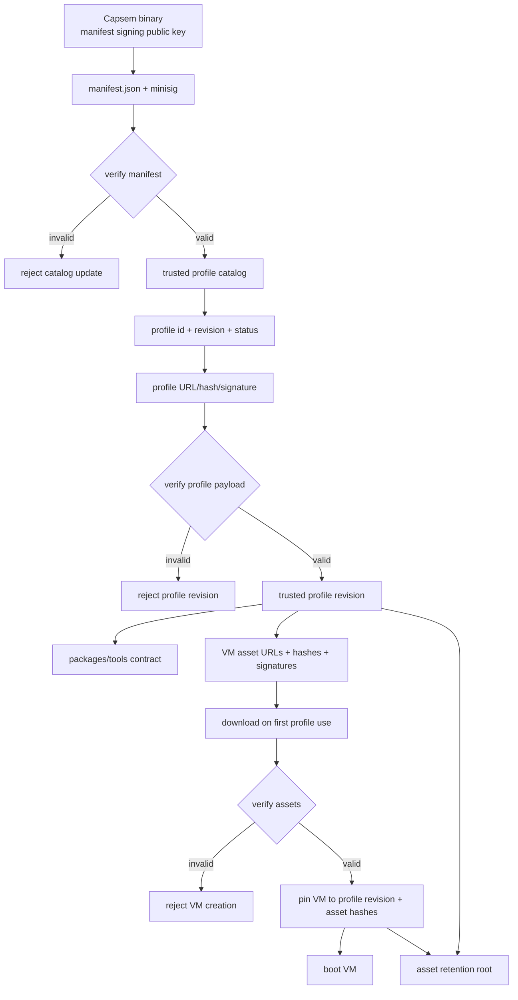

# S07a - Profile Manifest, Packages, And Assets

## Goal

Make the signed manifest the profile catalog and make profiles the unit that
drives package/tool assumptions, VM asset download, retention, and lifecycle
state.

This sprint bridges the already-landed Profile V2 resolver work and the public
API/UI layers. It exists so enterprise deployments can publish multiple profile
revisions, each with its own package/tool contract and VM asset locations,
without coupling those assets to a single global "current image" or to the
Capsem binary version.

## Product Contract

- The Capsem binary owns the trust root: the baked-in manifest signing public
  key and the minimum compatibility floor it can enforce.
- The signed manifest owns the profile catalog:
  `profile_id`, `revision`, status, compatibility, profile payload identity,
  profile payload location, and profile payload signature/hash.
- The signed profile payload owns VM/session configuration and declares the
  packages/tools it expects inside the guest plus the VM assets needed to make
  those expectations true.
- VM creation pins the resolved `profile_id`, `revision`, package contract, and
  exact asset hashes. Existing VMs do not move when a profile revision changes
  unless the user explicitly rebases/migrates them.
- Asset cleanup preserves files referenced by existing VM pins and by installed
  active/deprecated profile revisions. Removed/revoked profile revisions do not
  keep assets alive unless an existing VM still pins them.

## Manifest Contract

Add a manifest section that lists profile records. Shape can evolve during
implementation, but the required semantics are:

```json
{
  "format": 3,
  "profiles": {
    "everyday-work": {
      "current_revision": "2026.0520.1",
      "revisions": {
        "2026.0520.1": {
          "status": "active",
          "min_binary": "1.0.0",
          "max_binary": null,
          "profile_url": "https://assets.capsem.dev/profiles/everyday-work/2026.0520.1/profile.toml",
          "profile_hash": "blake3:...",
          "profile_signature_url": "https://assets.capsem.dev/profiles/everyday-work/2026.0520.1/profile.toml.minisig"
        }
      }
    }
  }
}
```

Required rules:

- `profile_id` is globally stable and unique inside the manifest.
- `revision` is immutable. Updating a profile creates a new revision.
- `current_revision` selects the default revision for new installs/updates.
- Status is explicit:
  - `active`: install/update and allow new VMs.
  - `deprecated`: keep installed, warn, allow existing VMs, avoid as default.
  - `removed`: stop offering/installing; local cleanup may remove when unpinned.
  - `revoked`: block new use and surface a high-severity warning for existing
    VMs pinned to it.
- Profile payload identity is verified before the profile is installed or used.

## Profile Contract Additions

Extend profile TOML with a package/tool contract and asset declarations.

Package/tool contract:

```toml
[packages]
python = "3.12.3"
node = "22.1.0"
uv = "0.4.30"

[packages.python_modules]
requests = "2.32.3"
numpy = "1.26.4"

[packages.node_packages]
playwright = "1.44.0"

[tools]
capsem_doctor = ">=1.0.0"
browser = ">=0.1.0"
```

VM assets:

```toml
[vm.assets]
kernel_url = "https://assets.capsem.dev/vm/default/2026.0520.1/vmlinuz"
kernel_hash = "blake3:..."
kernel_signature_url = "https://assets.capsem.dev/vm/default/2026.0520.1/vmlinuz.minisig"

initrd_url = "https://assets.capsem.dev/vm/default/2026.0520.1/initrd.img"
initrd_hash = "blake3:..."
initrd_signature_url = "https://assets.capsem.dev/vm/default/2026.0520.1/initrd.img.minisig"

rootfs_url = "https://assets.capsem.dev/vm/default/2026.0520.1/rootfs.squashfs"
rootfs_hash = "blake3:..."
rootfs_signature_url = "https://assets.capsem.dev/vm/default/2026.0520.1/rootfs.squashfs.minisig"
guest_abi = "capsem-guest-v2"
```

Implementation may normalize the repeated asset fields into typed tables, but
the shipped schema must preserve these invariants:

- Profiles declare the guest package/tool versions their rules, skills, MCP
  connectors, and UI affordances assume.
- Profiles declare the VM assets and verification metadata that satisfy the
  package/tool contract.
- Profiles may inherit package/tool declarations from a parent and override them
  deterministically through the existing resolver pipeline.
- Effective settings and debug/status surfaces expose the package/tool contract
  and resolved asset identity.

## Trust Chain

Reference chain: `Capsem binary trust root -> signed manifest -> profile
id/revision/status -> verified profile payload -> package/tool contract + VM
asset declarations -> downloaded assets verified by signature/hash -> VM pinned
to profile revision + asset hashes -> boot`.



## Architectural Gap Audit

These decisions must be closed before implementation can be called airtight:

- **Manifest v2 to v3 transition.** Existing asset-only manifests must either
  load through an explicit legacy/dev path or fail with a typed "manifest format
  unsupported" error. Release mode must not silently reinterpret a v2 manifest
  as an empty profile catalog.
- **Rollback protection.** A previously installed profile revision must not be
  replaced by an older revision unless an operator explicitly asks for rollback.
  Store the last trusted manifest identity and reject stale signed catalogs when
  they would downgrade an installed active profile.
- **Key identity and rotation.** Define whether profile payload signatures use
  the manifest signing key or a manifest-listed profile signing key id. If
  separate keys exist, the manifest must bind key id, algorithm, and allowed
  profile ids/revisions so a valid signature for one publisher cannot authorize
  another profile.
- **Canonical hash/signature formats.** Choose one canonical on-disk form
  (`blake3:<hex>` etc.) and reject ambiguous or truncated hashes. Profile and
  asset verification must happen before files move into the install location.
- **Atomic and concurrent downloads.** First-use downloads must use temp files,
  per-profile/per-asset locks, verification-before-rename, and retry-safe
  cleanup. Two simultaneous VM creates for the same profile revision must share
  the work or one must wait; they must not corrupt partial files.
- **Per-arch asset declarations.** Profiles need asset declarations per
  supported arch, not a single global URL set. Unsupported host arch fails
  before download with a typed error.
- **Profile inheritance for packages/assets.** Package/tool declarations and
  `vm.assets` must have deterministic parent/child merge semantics, conflict
  diagnostics, and provenance in effective settings.
- **Existing VM migration.** VMs created before S07a need a compatibility
  record: either a synthetic legacy profile revision pin or an explicit
  "unbound legacy VM" status. Resume must not silently bind them to today's
  catalog default.
- **Revocation semantics.** Revoked revisions block new VM creation. Existing VM
  behavior must be explicit: fail closed by default, or allow only with an
  operator override that is logged and visible in status/debug.
- **Asset retention races.** Cleanup must account for running VMs, persistent VM
  pins, installed profile revisions, and downloads in progress. It must never
  remove an asset between readiness check and process spawn.
- **Dev/offline/corp modes.** Dev local assets and air-gapped corp deployments
  need explicit modes, not accidental bypasses. Each mode must preserve the
  trust-chain vocabulary in status/debug.
- **In-guest package proof.** The package/tool contract is not proven by profile
  parsing alone. Add a VM/doctor probe that verifies the booted guest contains
  the declared package/tool versions and records mismatches as diagnostic
  failures.

## Service / Resolver Scope

- Add manifest parsing for profile catalog records and revision status.
- Add manifest format migration/compatibility handling for existing v2
  asset-only manifests.
- Add profile payload download/install/update logic.
- Extend profile schema and effective settings with packages/tools and VM asset
  declarations.
- Resolve the selected profile before provisioning a VM, then ensure that
  profile revision's assets are present. Missing assets download at first use.
- Replace global current-asset selection for profile-backed VMs with
  profile-driven asset resolution.
- Add atomic download, per-asset locking, verification-before-rename, retry, and
  cancellation-safe partial-file cleanup.
- Preserve the dev-mode local-asset path for developer builds, but make the
  release/install path profile-driven.
- Extend persistent VM registry with `profile_id`, `profile_revision`, package
  contract hash, and pinned asset hashes.
- Add existing-VM compatibility handling for pre-S07a VM records.
- Add explicit rebase/migrate semantics later; do not silently move existing
  VMs across profile revisions in this sprint.

## API / UX Hand-Offs

This sprint creates the contract consumed by later sprints:

- S07 exposes installed/catalog profiles, revisions, status, packages/tools,
  asset readiness, and profile-backed VM create/fork options over UDS.
- S08 mirrors that surface over HTTP and streams asset download/readiness
  progress for profile-backed VM creation.
- S09 updates CLI profile and VM creation commands to select a profile
  explicitly and to show profile revision/package/asset readiness.
- S11 status/debug explains profile catalog state, installed revision, package
  contract, asset verification, VM pins, and drift/revocation warnings.
- S16 UI lets users pick a profile/revision when creating a VM, shows package
  and asset readiness, and blocks/labels deprecated or revoked profiles.
- S19 docs explain corporate profile catalog deployment and asset lifecycle.

## Tasks

- [ ] Design manifest v3 profile catalog schema.
- [ ] Add parser/validator tests for profile ids, immutable revisions, statuses,
      profile payload locations, hashes, signatures, and binary compatibility.
- [ ] Extend profile TOML schema with packages/tools and VM asset declarations.
- [ ] Add resolver tests for inherited package/tool contracts and asset
      declarations.
- [ ] Add profile payload install/update/delete/revoke logic from manifest
      records.
- [ ] Add profile-driven asset resolution and first-use download.
- [ ] Add atomic first-use download locking and verification-before-rename for
      profile payloads and VM assets.
- [ ] Add cleanup retention for installed profile revisions plus existing VM
      pins.
- [ ] Add persistent VM profile/revision/package/asset pin metadata.
- [ ] Add existing-VM compatibility handling for pre-S07a registry records.
- [ ] Add functional tests for create VM with selected profile revision,
      first-use download, resume after profile update, deprecated profile, and
      revoked profile fail-closed behavior.
- [ ] Add concurrency tests for duplicate first-use downloads and cleanup while
      VM creation is in progress.
- [ ] Add in-guest package/tool contract verification through capsem-doctor or a
      focused VM probe.
- [ ] Update debug/status fixtures with profile catalog and asset readiness.

## Coverage Ledger

- Unit/contract: manifest v3 parser/validator, profile package/tool parser,
  asset declaration parser, resolver inheritance/override behavior, per-arch
  asset selection, rollback/stale-manifest rejection, signature-key identity,
  canonical hash format, and v2 manifest compatibility/fail-closed behavior.
- Functional: profile install/update/remove/revoke from manifest; selected
  profile VM creation pins revision and assets; resume preserves VM pins after a
  profile update; pre-S07a VM registry entries render explicit compatibility
  state instead of rebinding to the current default.
- Adversarial: bad profile id/revision, downgrade attempts, bad signature/hash,
  incompatible binary, revoked profile, missing asset, asset hash mismatch,
  malformed package version, unsupported host arch, profile payload signed by an
  unauthorized key, profile/asset URL scheme rejection, path traversal in
  payload locations, interrupted downloads, and stale partial files.
- E2E/VM or integration: service-level VM create with profile-backed first-use
  asset download; resume an existing VM after catalog update; capsem-doctor or
  equivalent in-guest probe verifies declared package/tool versions match the
  booted VM.
- Telemetry/observability: status/debug report catalog state, installed
  revisions, package contract, asset readiness, VM pin drift/revocation, last
  manifest identity, verification failures, and operator override events.
- Performance: first-use download is not on hot list/status paths; list/status
  must use cached readiness. Resolver overhead for package/tool inheritance is
  bounded by existing profile-chain depth. Concurrent readiness checks must not
  perform duplicate network downloads for the same asset hash.
- Missing/deferred: explicit VM rebase/migration UX is deferred until profile
  create/update surfaces are stable; this sprint only pins and reports.
