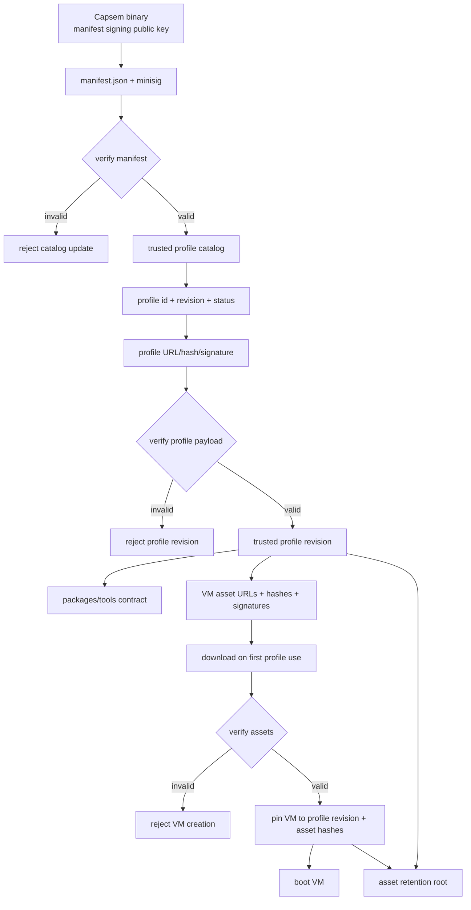

# S07a - Profile Manifest, Packages, And Assets

## Goal

Make the signed manifest the profile catalog and make profiles the unit that
drives package/tool assumptions, VM asset download, retention, and lifecycle
state.

This sprint bridges the already-landed Profile V2 resolver work and the public
API/UI layers. It exists so enterprise deployments can publish multiple profile
revisions, each with its own package/tool contract and VM asset locations,
without coupling those assets to a single global "current image" or to the
Capsem binary version.

## Current Status

Rescue is complete; this sprint is now in push mode.

Landed:

- Canonical `ProfileManifest` catalog parser using `format = 1`.
- `active`, `deprecated`, and `revoked` status enum coverage with no `removed`;
  typed lifecycle gates now define install/update, new-VM, and existing-VM
  behavior in both Rust and Pydantic admin models.
- Closed `capsem.profile.v2` JSON Schema artifact, Rust schema validation, and
  Pydantic v2 admin models.
- Typed profile package/tool contracts and per-arch VM asset declarations.
- Profile-driven service VM asset resolution/download and boot-time hash
  verification via `capsem-process`.
- Removal of old asset-only manifest runtime authority, including
  `assets.manifest.*` service settings and setup-time signed asset manifest
  checks.
- Durable session telemetry identity: `session.db` records `vm_id`,
  `profile_id`, and `user_id`; service passes identity into
  `capsem-process`; `/info` exposes the recorded identity.
- VM metadata now carries an explicit profile pin with `profile_id`, optional
  `profile_revision`, package-contract hash, and pinned boot asset identity.
- Core manifest install guard verifies active status, BLAKE3 payload hash,
  Profile V2 schema validity, and manifest/payload id+revision parity before a
  profile payload can be installed; the Pydantic admin models mirror the same
  guard.
- Verified Profile V2 payloads can now be converted into the runtime resolver
  profile shape and installed into the corp profile root while preserving the
  exact signed payload under `.catalog/profiles/<id>/<revision>/profile.json`.
- Profile materialization writes `.catalog/profiles/<id>/current.json` so
  status/debug and VM pinning can read the installed revision and payload hash
  without inferring them from filenames.
- VM profile pins now prefer the installed profile revision sidecar over caller
  hints and include the installed profile payload hash when a catalog-installed
  revision exists.
- Core catalog reconciliation now installs/updates complete `active` revisions,
  re-installs incomplete active local state, keeps installed `deprecated`
  revisions for existing VMs, and removes the launchable profile plus current
  state for installed `revoked` revisions.
- Service route `POST /profiles/catalog/reconcile` now applies that lifecycle
  reconciler from the UDS/gateway surface and returns typed per-revision
  outcomes plus summary counts for installed, unchanged, deprecated, revoked,
  and error states.
- Native CLI route `capsem profile reconcile-catalog --manifest <path>
  --pubkey <path> [--json]` now calls the same service reconciler and prints a
  compact lifecycle summary or the raw JSON result.
- Catalog reconciliation now removes launchable installed profile state when a
  local installed profile id is absent from the signed manifest, reporting the
  lifecycle outcome as `absent_removed` while preserving the archived payload
  for the retention/VM-pin cleanup slice.
- Asset retention now has a typed preservation set for installed current
  profile payload assets plus persistent VM profile pins, with cleanup proof
  that unreferenced hash-named assets are removed while both retention roots
  survive.
- `POST /setup/assets/cleanup` now wires production cleanup through the
  profile-aware retention set, removes unreferenced hash-named and legacy
  asset files without old manifest authority, and fails closed while asset
  downloads/checks are in progress.
- Profile payload signature verification now reuses the existing minisign
  verifier through a profile-specific wrapper with tamper tests.
- Installable profile payload fetch now reads catalog payload/signature
  locations, verifies minisign first, then enforces hash/schema/id/revision
  checks before returning a verified payload.

Push order from here:

0. [x] Expose telemetry identity for every session: `vm_id`, `profile_id`, and
   `user_id` must be persisted beside session telemetry, surfaced through
   detail/status paths, and covered by focused tests.
1. [~] Install/update/delete/revoke profile payloads from catalog records.
   Landed: core install guard, runtime profile conversion, corp-root
   materialization, installed-revision payload storage, and a typed core
   lifecycle reconciler for active/deprecated/revoked records. UDS/gateway
   `POST /profiles/catalog/reconcile` now runs manifest-wide current-revision
   install/update plus deprecated/revoked local-state handling, and `capsem
   profile reconcile-catalog` gives operators a native CLI entry point. Absent
   installed profile ids now lose launchable current state during reconcile.
   Remaining: manifest source fetch/scheduling, richer catalog/revision CLI
   verbs, and UI clients.
2. [~] Persist explicit VM `profile_id`, `profile_revision`, package contract
   hash, profile payload hash, and pinned asset metadata. Landed:
   registry/runtime/API profile pins with catalog-installed revision and
   payload-hash capture when `.catalog/profiles/<id>/current.json` is present.
   Remaining: make `profile_revision` mandatory once profile payload
   install/update resolves signed catalog records on every VM-create path.
3. [~] Add retention/cleanup for installed profile revisions, in-progress
   downloads, and existing VM pins. Landed: retention filename extraction from
   installed current profile payloads and persistent VM profile pins, plus
   cleanup proof for the combined preservation set. `POST
   /setup/assets/cleanup` now uses that retention set, does not depend on the
   old asset manifest, removes unreferenced hash-named/legacy asset files, and
   refuses cleanup while the asset supervisor is checking/updating. Remaining:
   cross-process/per-asset download locks and VM-create/download race coverage.
4. Surface unsupported/unbound state for pre-S07a VM records.
5. Update status/debug with catalog state, installed revisions, package
   contracts, asset verification, VM pins, drift, and revocation warnings.

Winter readiness check: S07a is not done while any VM can boot from assets that
are not traceable back to a signed catalog record and a verified profile
payload. Deprecated revisions may shelter existing VMs; revoked revisions do not
open the gate.

## Product Contract

- The Capsem binary owns the trust root: the baked-in manifest signing public
  key and the minimum compatibility floor it can enforce.
- The signed manifest owns the profile catalog:
  `profile_id`, `revision`, status, compatibility, profile payload identity,
  profile payload location, and profile payload signature/hash.
- The signed profile payload owns VM/session configuration and declares the
  packages/tools it expects inside the guest plus the VM assets needed to make
  those expectations true.
- VM creation pins the resolved `profile_id`, `revision`, package contract, and
  exact asset hashes. Existing VMs do not move when a profile revision changes
  unless the user explicitly rebases/migrates them.
- Asset cleanup preserves files referenced by existing VM pins and by installed
  active/deprecated profile revisions. Revoked revisions and absent catalog
  revisions do not keep assets alive unless an existing VM still pins them.

## Manifest Contract

The signed manifest is the profile catalog. It lists profile records; VM assets
are declared by the verified profile payloads referenced from those records.
Shape can evolve during implementation, but the required semantics are:

```json
{
  "format": 1,
  "profiles": {
    "everyday-work": {
      "current_revision": "2026.0520.1",
      "revisions": {
        "2026.0520.1": {
          "status": "active",
          "min_binary": "1.0.0",
          "max_binary": null,
          "profile_url": "https://assets.capsem.dev/profiles/everyday-work/2026.0520.1/profile.toml",
          "profile_hash": "blake3:...",
          "profile_signature_url": "https://assets.capsem.dev/profiles/everyday-work/2026.0520.1/profile.toml.minisig"
        }
      }
    }
  }
}
```

Required rules:

- `profile_id` is globally stable and unique inside the manifest.
- `revision` is immutable. Updating a profile creates a new revision.
- `current_revision` selects the default revision for new installs/updates.
- Status is the typed `ProfileRevisionStatus` enum everywhere: manifest
  records, Rust models, Pydantic admin models, UDS/HTTP payloads, CLI output,
  UI models, status/debug reports, docs examples, and tests. The only allowed
  values are:
  - `active`: install/update and allow new VMs.
  - `deprecated`: keep installed, warn, allow existing VMs, avoid as default.
  - `revoked`: block install/update and block VM launch. Surface a
    high-severity warning for existing VMs pinned to it.
- There is no `removed` status. A revision absent from the manifest is absent;
  a listed revision that must not be installed or launched is `revoked`.
- Unknown status strings are rejected. Do not model status as a loose string or
  boolean flags such as `is_active` / `is_revoked`.
- Profile payload identity is verified before the profile is installed or used.

## Normative Profile Payload Schema

S07a must ship a concrete, standard schema artifact for profile payloads:
`schemas/capsem.profile.v2.schema.json`, written as JSON Schema Draft 2020-12.
TOML remains the admin-authored syntax, but validation is defined over the
parsed TOML data model. Do not invent a private schema language.

A planning draft lives at
`sprints/policy-settings-profiles/schemas/capsem.profile.v2.schema.json`; S07a
implementation should either promote it into the production schema location or
replace it with an equivalent Draft 2020-12 artifact before code lands.

Required tooling baseline:

- Rust: add standard JSON Schema validation tooling, such as the `jsonschema`
  crate. If implementation chooses Rust-derived schema generation, use
  `schemars` or an equivalent maintained generator and diff the generated
  output against the committed schema artifact.
- Python/admin CLI: use Pydantic v2 `BaseModel` types for every profile,
  manifest, package, tool, asset, verification report, and command output
  shape. Models must set `extra="forbid"` and use typed validators for semantic
  checks.
- Python/admin CLI JSON I/O may only enter through Pydantic
  `model_validate_json()` or `TypeAdapter.validate_json()` and may only leave
  through `model_dump_json()`. Do not use `json.loads`, ad hoc dict mutation, or
  the Python `jsonschema` package in admin workflows.
- TOML authoring remains supported by parsing TOML once, immediately converting
  that parsed value into the matching Pydantic model, and discarding the
  intermediate dict. If a workflow needs the stricter JSON path, encode the
  parsed TOML value to canonical JSON bytes and validate those bytes through
  Pydantic `validate_json()`.
- Docs/editors/CI: publish the same JSON Schema artifact for documentation,
  editor validation, and golden fixture checks.
- Semantic checks that JSON Schema cannot express cleanly remain explicit code:
  manifest/profile id parity, signature authorization, rollback protection,
  package-manager-specific version resolution, URL allowlists by operating
  mode, and parent revision availability.

The JSON Schema artifact must be closed by default:

```json
{
  "$schema": "https://json-schema.org/draft/2020-12/schema",
  "$id": "https://schemas.capsem.dev/capsem.profile.v2.schema.json",
  "title": "Capsem Profile Payload v2",
  "type": "object",
  "additionalProperties": false,
  "required": [
    "schema",
    "version",
    "id",
    "revision",
    "name",
    "description",
    "best_for",
    "profile_type",
    "compatibility",
    "vm",
    "packages",
    "tools",
    "security"
  ],
  "properties": {
    "schema": { "const": "capsem.profile.v2" },
    "version": { "const": 2 },
    "id": { "type": "string", "pattern": "^[a-z0-9][a-z0-9-]{2,63}$" },
    "revision": {
      "type": "string",
      "pattern": "^[0-9]{4}\\.[0-9]{4}\\.[0-9]+$"
    },
    "profile_type": { "enum": ["everyday-work", "coding"] },
    "compatibility": { "$ref": "#/$defs/compatibility" },
    "packages": { "$ref": "#/$defs/packages" },
    "tools": { "$ref": "#/$defs/tools" },
    "vm": { "$ref": "#/$defs/vm" }
  },
  "$defs": {
    "hash": {
      "type": "string",
      "pattern": "^blake3:[0-9a-f]{64}$"
    },
    "asset": {
      "type": "object",
      "additionalProperties": false,
      "required": ["url", "hash", "signature_url", "size", "content_type"],
      "properties": {
        "url": { "type": "string", "format": "uri" },
        "hash": { "$ref": "#/$defs/hash" },
        "signature_url": { "type": "string", "format": "uri" },
        "size": { "type": "integer", "minimum": 1 },
        "content_type": { "type": "string" }
      }
    }
  }
}
```

The committed schema must fully enumerate `$defs` for identity, compatibility,
VM resources, packages, tools, per-arch assets, and the existing S04 security
rule sections. Open-ended package maps may use JSON Schema `patternProperties`
with `additionalProperties: false`; unrestricted `object` holes are not
allowed in the published schema.

Published profile payloads must use this top-level TOML shape:

```toml
schema = "capsem.profile.v2"
version = 2
id = "everyday-work"
revision = "2026.0520.1"
name = "Everyday Work"
description = "Balanced defaults for day-to-day work."
best_for = "Balanced defaults for day-to-day work."
profile_type = "everyday-work"
icon_svg = "<svg ...>...</svg>"
extends_profile_id = "base-everyday"
extends_profile_revision = "2026.0520.1"

[compatibility]
min_binary = "1.0.0"
max_binary = ""
guest_abi = "capsem-guest-v2"

[vm]
cpus = 4
memory_mib = 8192
disk_mib = 32768

[packages.runtimes]
python = "3.12.3"
node = "22.1.0"
uv = "0.4.30"

[packages.python_modules]
requests = "2.32.3"
numpy = "1.26.4"

[packages.node_packages]
playwright = "1.44.0"

[packages.system]
distro = "debian"
release = "bookworm"

[packages.system.apt]
ca-certificates = "20230311"
curl = "7.88.1-10+deb12u12"

[tools.capsem_doctor]
version = ">=1.0.0"
required = true
source = "guest"

[tools.browser]
version = ">=0.1.0"
required = true
source = "guest"

[security.capabilities]
credential_brokerage = "ask"
pii_detection = "ask"
mcp_rag = "allow"
mcp_tools = "allow"
network_egress = "ask"
file_boundaries = "ask"
audit = "audit"

[vm.assets.arm64.kernel]
url = "https://assets.capsem.dev/vm/everyday-work/2026.0520.1/arm64/vmlinuz"
hash = "blake3:..."
signature_url = "https://assets.capsem.dev/vm/everyday-work/2026.0520.1/arm64/vmlinuz.minisig"
size = 12345678
content_type = "application/octet-stream"

[vm.assets.arm64.initrd]
url = "https://assets.capsem.dev/vm/everyday-work/2026.0520.1/arm64/initrd.img"
hash = "blake3:..."
signature_url = "https://assets.capsem.dev/vm/everyday-work/2026.0520.1/arm64/initrd.img.minisig"
size = 12345678
content_type = "application/octet-stream"

[vm.assets.arm64.rootfs]
url = "https://assets.capsem.dev/vm/everyday-work/2026.0520.1/arm64/rootfs.squashfs"
hash = "blake3:..."
signature_url = "https://assets.capsem.dev/vm/everyday-work/2026.0520.1/arm64/rootfs.squashfs.minisig"
size = 12345678
content_type = "application/vnd.squashfs"

[vm.assets.x86_64.kernel]
url = "https://assets.capsem.dev/vm/everyday-work/2026.0520.1/x86_64/vmlinuz"
hash = "blake3:..."
signature_url = "https://assets.capsem.dev/vm/everyday-work/2026.0520.1/x86_64/vmlinuz.minisig"
size = 12345678
content_type = "application/octet-stream"

[vm.assets.x86_64.initrd]
url = "https://assets.capsem.dev/vm/everyday-work/2026.0520.1/x86_64/initrd.img"
hash = "blake3:..."
signature_url = "https://assets.capsem.dev/vm/everyday-work/2026.0520.1/x86_64/initrd.img.minisig"
size = 12345678
content_type = "application/octet-stream"

[vm.assets.x86_64.rootfs]
url = "https://assets.capsem.dev/vm/everyday-work/2026.0520.1/x86_64/rootfs.squashfs"
hash = "blake3:..."
signature_url = "https://assets.capsem.dev/vm/everyday-work/2026.0520.1/x86_64/rootfs.squashfs.minisig"
size = 12345678
content_type = "application/vnd.squashfs"
```

Required validation rules:

- Unknown fields and unknown tables are rejected by JSON Schema. No open-ended
  maps are accepted except explicitly typed package-manager maps such as
  `packages.system.apt`, `packages.python_modules`, and
  `packages.node_packages`.
- `schema` must equal `capsem.profile.v2`; `version` must equal `2`.
- `id` must match the manifest `profile_id`. `revision` must match the
  manifest revision record and is immutable after signing.
- `revision` uses the catalog revision grammar
  `[0-9]{4}\.[0-9]{4}\.[0-9]+` until a later sprint deliberately changes it.
- Catalog-published profiles that inherit from a parent must include both
  `extends_profile_id` and `extends_profile_revision`. Local draft/user
  profiles that are not yet pinned may use an explicit draft mode in
  `capsem-admin`, but published payload validation requires both fields.
- `compatibility.min_binary` is required. `compatibility.max_binary` may be an
  empty string to mean unbounded; `null` is not valid TOML.
- Package versions are strings constrained by JSON Schema patterns where the
  grammar is regular enough, then parsed by package-type-specific validators:
  SemVer for Node/tool versions where applicable, PEP 440 for Python packages,
  Debian version syntax for apt packages, and a documented exact string escape
  only for package managers without a stable grammar.
- `tools.<tool>.version` is required and may be an exact version or a
  comparator range. `required` defaults to `true` only if omitted by generated
  built-in profiles; corp/user-authored profiles must write it explicitly.
- `vm.assets.<arch>` is required for every supported release arch unless the
  manifest marks the profile as arch-limited. Each arch table must contain
  exactly `kernel`, `initrd`, and `rootfs` asset records.
- Asset records require `url`, `hash`, `signature_url`, `size`, and
  `content_type`. `hash` must use the canonical `blake3:<hex>` form.
- Asset URLs must use an allowlisted scheme for the operating mode
  (`https`, signed local file paths, or explicit air-gapped file roots). Path
  traversal is rejected before any file access.
- Existing profile sections from S04 (`general`, `appearance`, `ai`, `mcp`,
  `skills`, `security`) remain part of the same schema and keep their existing
  validation rules.

The shipped schema must preserve these invariants:

- Profiles declare the guest package/tool versions their rules, skills, MCP
  connectors, and UI affordances assume.
- Profiles declare the VM assets and verification metadata that satisfy the
  package/tool contract.
- Profiles may inherit package/tool declarations from a parent and override them
  deterministically through the existing resolver pipeline.
- Effective settings and debug/status surfaces expose the package/tool contract
  and resolved asset identity.

## Trust Chain

Reference chain: `Capsem binary trust root -> signed manifest -> profile
id/revision/status -> verified profile payload -> package/tool contract + VM
asset declarations -> downloaded assets verified by signature/hash -> VM pinned
to profile revision + asset hashes -> boot`.



## Architectural Gap Audit

These decisions must be closed before implementation can be called airtight:

- **Remove asset-only manifest authority.** The release/install path must not
  load the old asset-only manifest as runtime authority. Profile-backed VM
  creation reads the signed profile catalog and verified profile payloads; stale
  asset-only manifests fail closed if presented to the profile-catalog path.
- **Rollback protection.** A previously installed profile revision must not be
  replaced by an older revision unless an operator explicitly asks for rollback.
  Store the last trusted manifest identity and reject stale signed catalogs when
  they would downgrade an installed active profile.
- **Key identity and rotation.** Define whether profile payload signatures use
  the manifest signing key or a manifest-listed profile signing key id. If
  separate keys exist, the manifest must bind key id, algorithm, and allowed
  profile ids/revisions so a valid signature for one publisher cannot authorize
  another profile.
- **Canonical hash/signature formats.** Choose one canonical on-disk form
  (`blake3:<hex>` etc.) and reject ambiguous or truncated hashes. Profile and
  asset verification must happen before files move into the install location.
- **Atomic and concurrent downloads.** First-use downloads must use temp files,
  per-profile/per-asset locks, verification-before-rename, and retry-safe
  cleanup. Two simultaneous VM creates for the same profile revision must share
  the work or one must wait; they must not corrupt partial files.
- **Per-arch asset declarations.** Profiles need asset declarations per
  supported arch, not a single global URL set. Unsupported host arch fails
  before download with a typed error.
- **Profile inheritance for packages/assets.** Package/tool declarations and
  `vm.assets` must have deterministic parent/child merge semantics, conflict
  diagnostics, and provenance in effective settings.
- **Existing VM migration.** VMs created before S07a need a compatibility
  record: either a synthetic legacy profile revision pin or an explicit
  "unbound legacy VM" status. Resume must not silently bind them to today's
  catalog default.
- **Revocation semantics.** Revoked revisions block new VM creation. Existing VM
  behavior must be explicit: fail closed by default, or allow only with an
  operator override that is logged and visible in status/debug.
- **Asset retention races.** Cleanup must account for running VMs, persistent VM
  pins, installed profile revisions, and downloads in progress. It must never
  remove an asset between readiness check and process spawn.
- **Dev/offline/corp modes.** Dev local assets and air-gapped corp deployments
  need explicit modes, not accidental bypasses. Each mode must preserve the
  trust-chain vocabulary in status/debug.
- **In-guest package proof.** The package/tool contract is not proven by profile
  parsing alone. Add a VM/doctor probe that verifies the booted guest contains
  the declared package/tool versions and records mismatches as diagnostic
  failures.

## Service / Resolver Scope

- Add manifest parsing for profile catalog records and revision status.
- Remove asset-only manifest handling from the profile-backed release/runtime
  path; do not add migration or compatibility behavior for old manifests.
  Landed: service startup, setup welcome, asset health, service settings, and
  process boot hash verification no longer load or configure old asset
  manifests.
- Add profile payload download/install/update logic.
- Extend profile schema and effective settings with packages/tools and VM asset
  declarations.
- Resolve the selected profile before provisioning a VM, then ensure that
  profile revision's assets are present. Missing assets download at first use.
- Replace global current-asset selection for profile-backed VMs with
  profile-driven asset resolution.
- Add atomic download, per-asset locking, verification-before-rename, retry, and
  cancellation-safe partial-file cleanup.
- Make release/install asset resolution profile-driven. Developer fixture paths
  may remain only as explicit test/dev conveniences, never as release fallback.
- Extend persistent VM registry with `profile_id`, `profile_revision`, package
  contract hash, and pinned asset hashes.
- Block unpinned pre-S07a VM records from the profile-backed path with an
  explicit unsupported/unbound status; do not silently synthesize a profile pin.
- Add explicit rebase/migrate semantics later; do not silently move existing
  VMs across profile revisions in this sprint.

## API / UX Hand-Offs

This sprint creates the contract consumed by later sprints:

- S07 exposes installed/catalog profiles, revisions, status, packages/tools,
  asset readiness, and profile-backed VM create/fork options over UDS.
- S07b provides `capsem-admin`, the corp/admin CLI that creates and validates
  profiles, derives image build plans from profiles, verifies built images, and
  generates/checks/signs manifests.
- S08 mirrors that surface over HTTP and streams asset download/readiness
  progress for profile-backed VM creation.
- S09 updates CLI profile and VM creation commands to select a profile
  explicitly and to show profile revision/package/asset readiness.
- S11 status/debug explains profile catalog state, installed revision, package
  contract, asset verification, VM pins, and drift/revocation warnings.
- S16 UI lets users pick a profile/revision when creating a VM, shows package
  and asset readiness, and blocks/labels deprecated or revoked profiles.
- S19 docs explain corporate profile catalog deployment and asset lifecycle.

## Tasks

- [~] Design the canonical profile catalog manifest schema. Initial
      `capsem-core::profile_manifest::ProfileManifest` parser/model landed for
      profile ids, immutable revisions, `ProfileRevisionStatus`, payload
      locations, and canonical profile hashes.
- [~] Add parser/validator tests for profile ids, immutable revisions, statuses,
      profile payload locations, hashes, signatures, and binary compatibility.
      Initial focused tests cover status enum acceptance/rejection, active-only
      current revisions, missing current revision, bad hash, and format
      fail-closed behavior.
- [x] Commit `schemas/capsem.profile.v2.schema.json` as JSON Schema Draft
      2020-12, with closed-field validation and golden valid/invalid fixtures.
      Landed production schema plus fixtures under `schemas/fixtures/` and a
      Rust `jsonschema` gate that compiles the schema, accepts the valid golden
      profile, and rejects extra-field, bad-hash, and missing-tool-version
      fixtures.
- [~] Add Rust and Python validation paths that parse TOML to the JSON-compatible
      data model. Python must immediately validate into Pydantic models,
      preferring `TypeAdapter.validate_json()` / `model_validate_json()` when
      JSON bytes are available; Rust validates against the standard JSON Schema
      artifact before semantic trust-chain checks. Initial Python
      `capsem.builder.profiles` Pydantic v2 models landed for profile payloads
      and profile manifest, with `extra="forbid"`, Pydantic-only JSON
      input/output helpers, TOML parse-then-Pydantic-JSON validation, status
      enum coverage, and active-current manifest validation. Initial Rust
      `capsem_core::profile_payload_schema` helpers landed for validating
      profile payload JSON and TOML against the production schema artifact.
- [~] Extend profile TOML schema with typed packages/tools and per-arch VM
      asset declarations. Initial Rust `Profile`/`VmProfileSettings` fields,
      validators, descriptors, and VM-effective serialization landed for
      package maps, tool contracts, per-arch `kernel`/`initrd`/`rootfs` asset
      records, canonical `blake3:<64 lowercase hex>` hashes, and
      `https://`/`file://` path-traversal rejection.
- [~] Add resolver tests for inherited package/tool contracts and asset
      declarations. Initial focused resolver coverage proves runtime/package
      maps, tool contracts, and per-arch assets merge by key through the
      existing ancestor-chain resolver.
- [~] Add profile payload install/update/delete/revoke logic from manifest
      records. Core reconciliation now installs or updates complete `active`
      revisions from signed payload locations, re-installs incomplete local
      active state, keeps installed `deprecated` revisions, and removes
      the launchable profile plus current state for installed `revoked`
      revisions. Service `POST /profiles/catalog/reconcile` now applies the
      reconciler across catalog current revisions and non-active records,
      returning a typed outcome summary. The native CLI can now call this route
      through `capsem profile reconcile-catalog --manifest <path> --pubkey
      <path> [--json]`. Absent installed profile ids are now removed from
      launchable current state and reported as `absent_removed`. Remaining:
      manifest source fetch/scheduling, richer catalog/revision CLI verbs, and
      UI clients.
- [~] Add profile-driven asset resolution and first-use download. Service
      startup now builds an `AssetRequirement` from the default profile's
      `vm.assets.<arch>` declaration, rejects old manifest-backed release
      startup, downloads missing VM assets from profile URLs, and forwards
      expected profile hashes into `capsem-process`.
- [~] Add atomic first-use download locking and verification-before-rename for
      profile payloads and VM assets. Initial VM-asset path has supervisor
      serialization, temp-file cleanup, streaming hash verification, and rename
      after hash match; remaining work adds cross-process/per-asset locks and
      profile payload downloads.
- [~] Add cleanup retention for installed profile revisions plus existing VM
      pins. Landed: installed current profile payloads now produce
      hash-derived VM asset filenames for retention; persistent VM retention
      now also reads `profile_pin.base_assets`; `cleanup_retention_asset_filenames`
      combines both roots and is covered through real asset cleanup. `POST
      /setup/assets/cleanup` now calls a manifest-free cleanup helper with that
      retention set and refuses to run while assets are checking/updating.
      Remaining: cross-process/per-asset download locks and VM-create/download
      race coverage.
- [~] Add persistent VM profile/revision/package/asset pin metadata. VM base
      asset hashes are now derived from profile asset declarations instead of
      the asset manifest; registry/runtime/API metadata now carries
      `profile_id`, catalog-installed `profile_revision`, installed
      `profile_payload_hash`, package-contract hash, and pinned boot assets
      when a verified installed revision exists. Remaining work makes
      catalog-backed revision pins mandatory on every VM-create path.
- [ ] Add explicit unsupported/unbound handling for pre-S07a registry records.
- [ ] Add functional tests for create VM with selected profile revision,
      first-use download, resume after profile update, deprecated profile, and
      revoked profile fail-closed behavior.
- [ ] Add concurrency tests for duplicate first-use downloads and cleanup while
      VM creation is in progress.
- [ ] Add in-guest package/tool contract verification through capsem-doctor or a
      focused VM probe.
- [ ] Update debug/status fixtures with profile catalog and asset readiness.

## Coverage Ledger

- Unit/contract: initial profile manifest parser/status validator landed with
  `cargo test -p capsem-core profile_manifest` (9 tests passed). The first
  profile contract slice landed with `cargo test -p capsem-core
  settings_profiles` (122 tests passed), including package/tool/asset TOML
  parsing, missing tool-version rejection, canonical asset-hash rejection,
  asset path-traversal rejection, descriptor coverage, and inherited
  package/tool/asset merge behavior; it now also rejects legacy
  `[assets.manifest]` service settings. Formal schema coverage landed with
  `cargo test -p capsem-core --test profile_schema` (3 tests passed), compiling
  the Draft 2020-12 artifact and checking valid/invalid golden fixtures.
  Rust schema helper coverage now runs `cargo test -p capsem-core --test
  profile_schema` (6 tests passed), covering schema compilation, valid/invalid
  JSON fixtures, JSON helper validation, and TOML-to-schema validation. Core
  catalog reconciliation coverage now runs `cargo test -p capsem-core
  settings_profiles --lib` (130 tests passed), including active install,
  incomplete active re-install, complete active no-op, deprecated keep, and
  revoked launchable profile plus current-state removal. Python admin model
  coverage landed with `uv run python -m pytest
  tests/test_profiles.py` (8 tests passed), covering Pydantic-only JSON
  round-trips, TOML parse-then-Pydantic validation, invalid fixture rejection,
  `ProfileRevisionStatus = active|deprecated|revoked` with no `removed`, and
  active-current manifest validation. Runtime asset supervisor coverage now runs
  `cargo test -p capsem-service asset_supervisor --lib` (7 tests passed),
  covering profile URL download, missing assets, retryable failures, and
  background reconciliation; `cargo test -p capsem-service` (253 tests passed)
  covers startup fail-closed behavior, service asset status without legacy
  manifest fields, profile-derived saved-VM base hashes, installed profile
  revision sidecar/payload-hash pinning, service API profile catalog
  reconcile install/revoke/absent-removal summaries, and debug/status shape.
  Focused reconciliation coverage now includes `cargo test -p capsem-core
  reconcile_ --lib` (6 tests passed) and `cargo test -p capsem-service
  handle_reconcile_profile_catalog` (3 service tests passed). Full package
  checks after the slice passed with `cargo test -p capsem-service` (108
  library + 145 service tests) and `cargo test -p capsem` (241 tests). The
  CLI coverage includes parser and compact-summary rendering for `profile
  reconcile-catalog --manifest --pubkey [--json]`. Retention-source coverage
  now includes `cargo test -p capsem-core installed_profile_asset_filenames
  --lib` (2 tests), `cargo test -p capsem-core settings_profiles --lib` (133
  tests), and `cargo test -p capsem-service saved_vm_assets` (2 tests),
  including a real cleanup proof for installed-profile plus VM-pin retention.
  Production cleanup coverage now adds `cargo test -p capsem-core cleanup_
  --lib` (7 tests) and `cargo test -p capsem-service handle_asset_cleanup`
  (2 service tests), proving the manifest-free cleanup helper preserves
  metadata/temp files, removes legacy/hash-named stale assets, the service
  endpoint preserves installed-profile plus saved-VM retention, and cleanup
  returns `409 Conflict` while assets are still updating.
  Remaining:
  cross-language schema fixture parity, rollback/stale
  catalog rejection, signature-key identity, full package version grammar
  validation, profile payload downloads, and per-asset cross-process locks.
- Functional: profile install/update/remove/revoke from manifest; selected
  profile VM creation pins explicit profile revision and assets; resume
  preserves VM pins after a profile update; unpinned pre-S07a VM registry
  entries render explicit unsupported/unbound state instead of rebinding to the
  current default.
- Adversarial: bad profile id/revision, unknown fields/tables, wrong schema
  id/version, manifest/payload id mismatch, missing parent revision for a
  catalog-published inherited profile, downgrade attempts, bad signature/hash,
  incompatible binary, revoked profile, missing asset, asset hash mismatch,
  malformed package version, unsupported host arch, profile payload signed by an
  unauthorized key, profile/asset URL scheme rejection, path traversal in
  payload locations, interrupted downloads, and stale partial files.
- E2E/VM or integration: service-level VM create with profile-backed first-use
  asset download; resume an existing VM after catalog update; capsem-doctor or
  equivalent in-guest probe verifies declared package/tool versions match the
  booted VM.
- Telemetry/observability: status/debug report catalog state, installed
  revisions, package contract, asset readiness, VM pin drift/revocation, last
  manifest identity, verification failures, and operator override events.
- Performance: first-use download is not on hot list/status paths; list/status
  must use cached readiness. Resolver overhead for package/tool inheritance is
  bounded by existing profile-chain depth. Concurrent readiness checks must not
  perform duplicate network downloads for the same asset hash.
- Missing/deferred: explicit VM rebase/migration UX is deferred until profile
  create/update surfaces are stable; this sprint only pins and reports.
