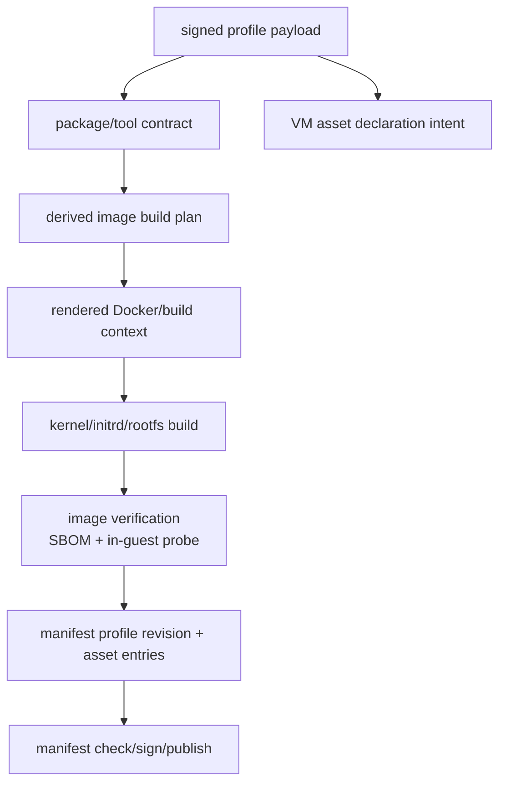

# S07b - Capsem Admin Tooling And Profile-Derived Images

## Goal

Unify the Python settings/profile/image/manifest tooling into a proper
`capsem-admin` Python CLI package, installed by bootstrap and shipped in release
packages.

The source of truth becomes the signed profile payload. Image build inputs,
package lists, tool versions, asset declarations, and manifest entries are
derived from profiles. Hand-edited image settings are removed as an authority.
No backwards compatibility layer is provided for the old `guest/config`-driven
admin workflow.

## Status

Started on 2026-05-20 after S07d closed the Service Settings V2 schema/admin
contract.

First slice landed on 2026-05-20:

- `capsem-admin profile schema` prints the Profile V2 JSON Schema from the
  existing Pydantic `ProfilePayloadV2` model.
- `capsem-admin profile validate <profile.json|profile.toml> [--json]`
  validates Profile V2 payloads through Pydantic JSON/TOML helpers and emits a
  typed JSON report with profile id and revision for CI.
- Verification: `uv run python -m pytest tests/test_admin_cli.py
  tests/test_profiles.py -q` passed with 24 tests; installed console-script
  smoke for `capsem-admin profile schema`, `profile validate`, and `profile
  validate --json` passed against `schemas/fixtures/profile-v2-valid.json`.

Second slice landed on 2026-05-20:

- Profile V2 now has a typed top-level `editable` block for section-level edit
  gates: `general`, `appearance`, `ai`, `mcpServers`, `skills`, `packages`,
  `tools`, `vm`, `security_capabilities`, and `security_rules`.
- Service mutation routes enforce section locks for Profile V2 skills, MCP
  servers, policy rules, settings-save rule updates, and whole-profile `PUT`
  attempts that try to smuggle changes into locked sections. Whole-profile
  updates also reject changes to the `editable` map itself so callers cannot
  unlock a section and mutate it in a later request.
- Profile forks copy the `editable` block so corp/root profiles can allow
  user-added skills or MCP servers while blocking AI providers or rules in the
  forked user profile.
- `ServiceState::current_service_settings()` now falls back to the startup
  settings snapshot when `service.toml` is absent or unreadable instead of
  silently losing profile roots to default settings.
- Verification: `cargo test -p capsem-service profile --bin capsem-service`
  passed with 64 tests; `cargo test -p capsem-core profile_parse --lib` passed
  with 4 tests; `cargo test -p capsem-core profile_payload --lib` passed with
  11 tests; `uv run python -m pytest tests/test_profiles.py
  tests/test_admin_cli.py -q` passed with 26 tests.

Third slice landed on 2026-05-20:

- `capsem-admin profile init <profile-id>` now emits a valid Profile V2 JSON or TOML
  draft from the Pydantic model, with optional `--revision`, `--name`,
  `--description`, `--best-for`, `--profile-type`, `--format`, `--out`, and
  `--force`.
- Drafts include both release architectures by default, placeholder signed VM
  asset URLs/hashes, package/tool contract defaults, security capability
  defaults, and the section-level `editable` map. JSON output uses
  `model_dump_json()`, and tests reparse the draft through
  `model_validate_json()`.
- Verification: `uv run python -m pytest tests/test_profiles.py
  tests/test_admin_cli.py -q` passed with 36 tests; installed console-script
  smoke for `capsem-admin profile init corp-dev --revision 2026.0520.9`
  produced a valid draft accepted by `capsem-admin profile validate`.

Fourth slice landed on 2026-05-20:

- `capsem-admin image plan <profile>` now derives a typed
  `capsem.image-plan.v1` artifact from Profile V2 instead of `guest/config`.
- The plan records profile id/revision/name, guest ABI, VM resources, selected
  arches, declared per-arch VM assets, package/tool contracts, and a BLAKE3
  package-contract hash. `--arch all` is the default; `--arch arm64` and
  `--arch x86_64` narrow the plan for local or CI shards.
- Planning fails closed if the selected architecture has no declared VM assets
  in the profile, which prevents accidental all-arch release plans from
  silently dropping an architecture.
- Verification: `uv run python -m pytest tests/test_image_plan.py
  tests/test_admin_cli.py -q` passed with 26 tests; installed console-script
  smoke proved JSON and TOML profile inputs produce valid image plans.

Fifth slice landed on 2026-05-20:

- `capsem-admin image verify <profile> --assets-dir <dir>` now emits a typed
  `capsem.image-verification.v1` report from the same profile-derived image
  plan.
- The first verifier slice checks local kernel/initrd/rootfs assets under
  `<assets-dir>/<arch>/<asset filename>` for existence, declared byte size, and
  BLAKE3 hash. `--arch all` remains the default, and `--arch arm64` /
  `--arch x86_64` narrow verification for local debugging or CI shards.
- Verification fails closed with a non-zero process exit on missing,
  size-mismatched, or hash-mismatched assets while still emitting machine
  readable JSON for CI.
- Remaining image verification scope still includes profile package/tool
  contract proof, SBOM checks, and in-guest probes against a built image.
- Verification: `uv run python -m pytest tests/test_image_verify.py
  tests/test_image_plan.py tests/test_admin_cli.py -q` passed with 32 tests.

Sixth slice landed on 2026-05-20:

- `capsem-admin manifest check <manifest> --fast` now emits a typed
  `capsem.manifest-check.v1` report for the Profile V2 catalog manifest.
- The fast checker validates the manifest through Pydantic, checks remote
  HTTP(S) profile payload and signature URLs with `HEAD`, and checks local
  `file://` profile payloads by BLAKE3 hash plus profile id/revision parity.
- The checker exits non-zero on missing local signatures, local profile hash
  drift, remote HTTP errors, unsupported URL schemes, unexpected profile
  content types, or invalid local profile payloads. `--download` remains
  explicit but unimplemented until the full byte/signature verifier lands.
- Verification: `uv run python -m pytest tests/test_manifest_check.py -q`
  passed with 4 tests.

Seventh slice landed on 2026-05-20:

- `capsem-admin manifest check <manifest> --download` now fetches every
  manifest-referenced profile payload/signature and every profile-declared VM
  asset/signature into either `--download-dir` or a generated temp directory.
- Download mode verifies profile payload BLAKE3 hashes, profile id/revision
  parity, local or HTTP(S) byte retrieval, non-empty signature payloads, and
  profile-declared VM asset size plus BLAKE3 hash for kernel/initrd/rootfs.
- Fast mode remains `HEAD`/metadata-only. Download mode uses GET and records
  downloaded paths in the typed `capsem.manifest-check.v1` report.
- Remaining manifest scope still includes cryptographic profile/asset
  signature verification, manifest generation, and manifest signing.
- Verification: `uv run python -m pytest tests/test_manifest_check.py
  tests/test_profiles.py tests/test_manifest.py tests/test_service_settings.py
  tests/test_image_plan.py tests/test_image_verify.py tests/test_admin_cli.py
  -q` passed with 117 tests.

Eighth slice landed on 2026-05-20:

- `capsem-admin manifest generate --profiles <dir>` now creates a typed
  Profile V2 catalog manifest from local JSON/TOML profile payloads.
- Generation validates every profile through Pydantic, hashes the exact payload
  bytes that will be published, derives profile payload URLs and `.minisig`
  URLs, rejects duplicate profile id/revision pairs, and selects the newest
  active revision using numeric revision ordering.
- `--base-url` switches generated URLs from local `file://` paths to hosted
  catalog URLs while preserving relative profile paths. `--status
  profile@revision=active|deprecated|revoked` and `--current profile=revision`
  provide explicit lifecycle overrides.
- The generated manifest is immediately checkable by
  `capsem-admin manifest check --fast`.
- Remaining manifest scope still includes cryptographic profile/asset
  signature verification and manifest signing.
- Verification: `uv run python -m pytest tests/test_manifest_generate.py -q`
  passed with 4 tests.

Ninth slice landed on 2026-05-20:

- `capsem-admin manifest sign <manifest> --key <secret>` now signs Profile V2
  catalog manifests with the repo-standard `minisign` tool and emits a typed
  `capsem.manifest-sign.v1` report with `--json`.
- `capsem-admin manifest verify-signature <manifest> --signature <sig>
  --pubkey <pubkey>` verifies the signed manifest and emits typed
  `capsem.manifest-signature-verification.v1` output.
- `capsem-admin manifest check --download --pubkey <pubkey>` now verifies
  downloaded profile payload signatures and VM asset signatures after
  payload/asset byte, size, hash, and id/revision checks pass.
- Missing `minisign` fails closed with a typed `signature_tool_missing` check
  result for download verification or a clear CLI error for signing.
- Linux support is explicit: corp/admin hosts install the distro `minisign`
  package before signing or cryptographic verification.
- Verification: `uv run python -m pytest tests/test_manifest_crypto.py
  tests/test_manifest_generate.py tests/test_manifest_check.py
  tests/test_profiles.py tests/test_manifest.py tests/test_service_settings.py
  tests/test_image_plan.py tests/test_image_verify.py tests/test_admin_cli.py
  -q` passed with 124 tests, including real throwaway minisign key generation,
  profile/asset signing, manifest signing, valid verification, and bad-signature
  rejection.

Tenth slice landed on 2026-05-20:

- Developer bootstrap now proves `capsem-admin` after `uv sync` by running
  `uv run capsem-admin --version`.
- Bootstrap tests now pin the `pyproject.toml` script entry point, the ordering
  of `uv sync` before the entrypoint smoke, and the real `uv run capsem-admin
  --version` path.
- Development docs now state that `uv sync` installs both `capsem-builder` and
  `capsem-admin` in the editable environment and that bootstrap verifies the
  admin entrypoint.
- Verification: `uv run python -m pytest tests/capsem-bootstrap/test_dev_setup.py
  -q` passed with 8 tests and 1 existing setup-sentinel skip.

Eleventh slice landed on 2026-05-20:

- Release package assembly now treats `capsem-admin` as a two-part packaged
  payload: a relocatable `capsem-admin` wrapper plus `capsem-admin-python/`
  containing the installed Python package/dependencies.
- `scripts/prepare-admin-cli.sh` builds that payload with `uv`, records the
  Python minor version used for native wheels, self-tests the wrapper with that
  interpreter, and refuses missing/too-old/mismatched Python instead of falling
  into system-Python tracebacks.
- macOS `.pkg`, Linux `.deb`, postinstall, and release workflow paths now fail
  closed if the admin wrapper or Python payload is missing.
- Verification: `uv run python -m pytest tests/test_package_scripts.py
  tests/test_verify_deb_payload.py tests/test_release_workflow_policy.py -q`
  passed with 37 tests; `uv run python -m pytest tests/test_repack_deb.py -q`
  skipped 7 Linux-only `dpkg-deb` tests on this macOS host; a real
  `scripts/prepare-admin-cli.sh` temp-payload smoke plus wrapper `--version`
  succeeded with the uv interpreter.

Twelfth slice landed on 2026-05-20:

- `capsem-admin image build-workspace <profile> --out <dir>` now materializes a
  profile-derived build workspace without reading repo `guest/config`.
- The workspace writes the source profile TOML, typed image plan JSON,
  `config/build.toml`, `config/manifest.toml`, `config/vm/resources.toml`, and
  generated package TOML for apt, Python, and npm contracts when present.
- The output report is a typed `capsem.image-workspace.v1` Pydantic model with
  profile id/revision, selected arches, package-contract hash, generated file
  sizes, and generated file BLAKE3 hashes.
- Generated TOML is parsed back through the existing builder `load_guest_config`
  models in tests, proving the profile-derived workspace is a valid bridge for
  the current Docker templates while the full `image build`/SBOM/in-guest
  verification work remains open.
- Verification: `uv run python -m pytest tests/test_image_workspace.py
  tests/test_image_plan.py tests/test_admin_cli.py -q` passed with 30 tests.

Thirteenth slice landed on 2026-05-20:

- Release CI SBOM attestation now subjects both OS package families:
  `release-artifacts/*.pkg` and `release-artifacts/*.deb`.
- Release policy tests now inspect the `Attest SBOM` step and require SPDX 2.3,
  the published `capsem-sbom.spdx.json` predicate, and both package subject
  globs.
- Build-verification docs now explicitly state the existing `cargo-sbom`
  artifact is the Rust host workspace SBOM. Profile-derived guest package/tool
  SBOMs remain part of the S07b image verification work and are not implied by
  the host SBOM attestation.
- Verification: `uv run python -m pytest tests/test_release_workflow_policy.py
  -q` passed with 26 tests; docs build passed with `pnpm run build`.

Fourteenth slice landed on 2026-05-20:

- `capsem-admin image build <profile>` now exists as the public profile-derived
  image build entrypoint.
- The command materializes the generated Profile V2 build workspace, parses it
  back through `load_guest_config`, and routes selected arches/templates into
  the existing `build_image` / `build_all_architectures` Docker builder.
- `--arch all` remains the default; `--arch arm64` and `--arch x86_64` narrow
  CI/local shards. `--template rootfs|kernel`, `--kernel-version`,
  `--workspace-dir`, `--out`, `--dry-run`, `--force`, and `--json` are
  supported.
- Output is a typed `capsem.image-build.v1` report embedding the
  `capsem.image-workspace.v1` report, so CI can prove which profile revision,
  package-contract hash, generated files, and arches drove the build.
- Verification: `uv run python -m pytest tests/test_image_workspace.py
  tests/test_image_plan.py tests/test_admin_cli.py -q` passed with 33 tests;
  installed CLI smoke proved `capsem-admin image build --dry-run --json` from a
  generated TOML profile.

Fifteenth through seventeenth slices landed on 2026-05-20:

- Profile V2 now requires a `ui` enum (`everyday` or `coding`) across Python,
  JSON Schema, Rust parsing, fixtures, and generated built-in profile drafts.
- `capsem-admin profile init-builtins --guest-dir guest` generates the
  `everyday-work` and `coding` base profiles from the current typed guest
  config, preserving floating package intent as `*` in the profile contract.
- Live VM asset build lanes now require a Profile V2 payload:
  `scripts/build-assets.sh --profile`, Justfile `build-assets`/`build-kernel`/`build-rootfs`,
  and PR install CI route through `capsem-admin image build` instead of an
  unprofiled `capsem-builder build guest/` path.
- Verification covered generated profile validation, dry-run image build,
  focused Python/Rust profile gates, compile checks, docs build, and static
  live-caller checks for the removed unprofiled build lane.

Eighteenth slice landed on 2026-05-21:

- `capsem-admin image verify <profile> --assets-dir <dir> --inventory
  <inventory.json>` now accepts a typed `capsem.image-inventory.v1` proof
  artifact.
- The verifier checks profile-declared apt packages, Python modules, node
  packages, and required tools against the image inventory. Exact versions must
  match; profile version `*` accepts any installed version while still requiring
  the package or tool to be present.
- The typed `capsem.image-verification.v1` report now includes
  `inventory_checked`, optional `inventory_path`, and per-package/tool contract
  rows with `missing` and `version_mismatch` failures. Optional profile tools
  remain informational until a profile marks them `required = true`.
- Verification: `uv run python -m pytest tests/test_image_verify.py -q` passed
  with 10 tests. Remaining image proof is guest SBOM/probe generation and
  boot-time runtime truth, not the contract comparison surface.

Nineteenth slice landed on 2026-05-21:

- Rootfs builds now extract `image-inventory.json` from the freshly built
  container before the temporary image is removed.
- The extraction script records installed apt packages from `dpkg-query`,
  Python modules from `pip list --format=json`, global node packages from
  `npm ls -g --depth=0 --json`, and tool versions from the same configured
  version commands used by `tool-versions.txt`.
- The host validates the extracted bytes through
  `ImageInventory.model_validate_json()` and writes the canonical Pydantic
  `model_dump_json()` output. `capsem-doctor --version` now exits before
  running pytest so required guest-tool inventory can prove its presence.
- Verification: `uv run python -m pytest tests/test_docker.py
  tests/test_image_verify.py tests/test_image_workspace.py tests/test_admin_cli.py
  -q` passed with 171 tests; `uv run python -m compileall src/capsem` passed.
  Remaining image proof is SBOM/signature linkage and in-guest boot probes.

Twentieth slice landed on 2026-05-21:

- Image verification now treats package/tool inventory as an architecture-
  scoped proof, matching the actual rootfs build output layout.
- `capsem-admin image verify <profile> --assets-dir <dir>` auto-discovers
  `<assets-dir>/<arch>/image-inventory.json` for every selected architecture
  and emits `inventories[]` rows with `arch`, `path`, package contract rows,
  and required-tool contract rows.
- `--inventory FILE` is allowed only with a single `--arch`; all-arch callers
  must either use the standard auto-discovered asset layout or pass an
  inventory directory containing `<arch>/image-inventory.json`. This avoids
  accidentally proving an arm64 build with x86_64 inventory data.
- Missing inventory for any selected architecture now fails closed with a
  per-arch `inventories[]` row carrying `failure = "missing"`; image
  verification no longer silently downgrades to asset-only proof.
- Verification: `uv run python -m pytest tests/test_image_verify.py -q` passed
  with 13 tests. Docs now show `image-inventory.json` beside
  `tool-versions.txt` in every arch asset directory.

Twenty-first slice landed on 2026-05-21:

- `capsem-admin image verify` now accepts one or more `--doctor-bundle <tar>`
  arguments produced by `capsem-doctor --bundle` after a real VM boot.
- The verifier reads the bundled `pytest-junit.xml` through `tarfile` without
  extracting archive contents, emits typed `capsem_doctor_bundle` probe rows,
  and fails image verification when the in-VM diagnostics report failures or
  errors.
- Verification: `uv run python -m pytest tests/test_image_verify.py -q` passed
  with 17 tests. Docs now describe doctor bundles as in-VM image probe evidence.

Twenty-second slice landed on 2026-05-21:

- `capsem-admin image sbom <profile> --assets-dir <dir>` now generates SPDX 2.3
  guest-image SBOM JSON from typed `image-inventory.json` artifacts.
- Single-arch mode writes the SPDX document to stdout; all-arch mode requires
  `--out-dir` and writes `<out-dir>/<arch>/guest-sbom.spdx.json`.
- SPDX document names and namespaces include the profile id, profile revision,
  architecture, and package-contract hash. apt, Python, and node package rows
  carry package-manager purl external references; tool rows remain SPDX package
  rows with Capsem inventory comments.
- Verification: `uv run python -m pytest tests/test_image_sbom.py -q` passed
  with 5 tests.

Twenty-third slice landed on 2026-05-21:

- The profile-backed E2E boot proof now has a release-image verification gate:
  reconcile profile assets, boot the image through `capsem doctor --fast
  --bundle`, require the generated `doctor-latest.tar`, and feed that bundle
  plus the host-arch `image-inventory.json` through
  `capsem-admin image verify --doctor-bundle`.
- `CAPSEM_REQUIRE_ARTIFACTS=1` now requires
  `assets/<arch>/image-inventory.json` so CI/release artifact-gated tests cannot
  silently skip the package/tool contract proof. `_check-assets` now treats a
  missing host-arch image inventory as a rebuild trigger alongside the bootable
  VM files.
- Verification: `uv run python -m pytest
  tests/capsem-e2e/test_profile_asset_boot.py -q` passed locally with one boot
  test and one asset-dependent skip; `uv run python -m pytest
  tests/test_image_verify.py tests/test_image_sbom.py tests/test_leak_detection.py
  -q` passed.

Twenty-fourth slice landed on 2026-05-21:

- `capsem-admin policy validate|schema` now validates strict
  `capsem.policy-pack.v1` envelopes with typed Pydantic models and exports the
  committed Draft 2020-12 JSON Schema artifact.
- `capsem-admin detection validate|schema` now validates strict
  `capsem.detection-pack.v1` JSON/TOML/YAML envelopes with typed Pydantic
  models and exports the committed Draft 2020-12 JSON Schema artifact.
- The policy model enforces `rewrite` payload semantics, event-family scoped
  rules, pack status/owner enums, duplicate rule-id rejection, and closed
  fields. The detection model rejects enforcement decisions through closed
  fields, requires payload-backed sources, and requires field mappings for Sigma
  sources.
- This slice intentionally leaves `detection compile|check` and pySigma/Rust
  parity fixtures for the next policy/detection admin slice.
- Verification: `uv run python -m pytest tests/test_security_packs.py
  tests/test_admin_cli.py tests/test_profiles.py tests/test_service_settings.py
  -q` passed with 65 tests.

Twenty-fifth slice landed on 2026-05-21:

- `capsem-admin detection compile <pack> --out detection.ir.json --json` now
  parses Sigma YAML through pySigma and emits a typed
  `capsem.detection.ir.v1` artifact with committed Draft 2020-12 schema.
- The supported authoring subset is intentionally narrow: first-party
  `capsem` logsource categories, one named Sigma selection, AND-linked fields,
  OR-linked exact values, explicit normalized field mappings, and typed
  severity/confidence/finding metadata. Unsupported Sigma conditions,
  modifiers, wildcard values, keyword detections, external-only sources, and
  unmapped fields fail closed.
- `capsem-admin detection check <pack> --events events.jsonl --json` evaluates
  normalized `SecurityEvent` JSONL fixtures through the compiled IR and emits a
  typed `capsem.detection-check.v1` report with findings, diagnostics, counts,
  and timing.
- Verification: `uv run python -m pytest tests/test_security_packs.py -q`
  passed with 15 tests; `uv run python -m pytest tests/test_security_packs.py
  tests/test_admin_cli.py tests/test_profiles.py tests/test_service_settings.py
  -q` passed with 71 tests.

Twenty-sixth slice landed on 2026-05-21:

- `capsem-core::security_packs` now provides the Rust Detection IR V1 contract:
  strict serde structs, Draft 2020-12 schema validation against the committed
  `capsem.detection.ir.v1` schema, normalized `SecurityEvent` parsing, and a
  first exact-match evaluator for `equals_any` matchers.
- The Rust test fixture is pinned to the Python compiler output:
  `schemas/fixtures/detection-ir-v1-valid.json` must equal
  `capsem-admin detection compile` output for the default Sigma fixture before
  the Rust parser/evaluator tests pass.
- Adversarial parity coverage rejects invalid Detection IR schema payloads and
  unknown matcher fields through strict serde, keeping the runtime contract
  closed before S08b wires the engine.
- Verification: `cargo test -p capsem-core --test security_packs` passed with
  5 tests; `uv run python -m pytest tests/test_security_packs.py -q` passed
  with 16 tests; `uv run python -m pytest tests/test_security_packs.py
  tests/test_admin_cli.py tests/test_profiles.py tests/test_service_settings.py
  -q` passed with 72 tests; `cargo test -p capsem-core --test profile_schema`
  passed with 6 tests; `cargo clippy -p capsem-core --test security_packs --
  -D warnings` passed.

## Why This Sprint Exists

S07a defines the product trust model: the signed manifest lists profile
revisions, and each signed profile declares the package/tool contract and VM
assets it needs. [S07d](S07d-service-settings-schema-admin-contract.md) defines
the equivalent admin contract for service settings. S07b provides the operator
tooling that makes both models practical:

- Corp admins can validate service settings without raw dict/TOML spelunking.
- Corp admins can create and validate profile payloads.
- Corp admins can derive image build plans from profile payloads.
- Corp admins can build images, verify the built guest satisfies the profile,
  and generate/check signed manifests.
- Bootstrap and release packages install the same admin CLI users see in docs.
- Fast checks can validate manifest/profile/asset reachability without
  downloading every asset, while full checks download and verify every byte.

## Product Contract

- `capsem-admin` is the public Python admin CLI and package identity. It is
  packaged with `uv`, installed by bootstrap, and included in macOS/Linux
  release payloads.
- `capsem-admin` consumes the S07d service-settings schema and Pydantic models.
  It must not parse service settings as untyped raw JSON/TOML beyond the
  immediate Pydantic validation boundary.
- The existing Python builder modules may be reused internally, but public
  workflows move under `capsem-admin`. Do not preserve a legacy public
  `capsem-builder` compatibility CLI unless the user explicitly reopens that
  decision.
- `guest/config` TOML is no longer the source of truth for release image
  settings. Generated build workspaces may contain derived files, but those
  files are cache/build artifacts and must not be hand edited.
- Profile payloads drive package/tool selection, VM resource expectations,
  per-arch asset declarations, image version metadata, and manifest entries.
- A manifest generated by `capsem-admin` must be checkable by the same tool
  before publication and by service/runtime code after publication.

## CLI Shape

Exact command names can change during implementation, but the shipped CLI must
cover these operator flows:

```sh
capsem-admin profile init <profile-id>
capsem-admin profile validate profile.toml
capsem-admin profile schema --out schemas/capsem.profile.v2.schema.json
capsem-admin profile derive-image profile.toml --out build/profile-image/

capsem-admin settings init --out service.toml
capsem-admin settings validate service.toml
capsem-admin settings schema --out schemas/capsem.service-settings.v2.schema.json
capsem-admin settings doctor service.toml

capsem-admin image plan profile.toml
capsem-admin image build profile.toml --out assets/
capsem-admin image verify profile.toml --assets-dir assets/

capsem-admin manifest generate --profiles profiles/ --assets-dir assets/ --out manifest.json
capsem-admin manifest check manifest.json --fast
capsem-admin manifest check manifest.json --download
capsem-admin manifest sign manifest.json --key private/manifest.key

capsem-admin policy validate policy-pack.toml
capsem-admin policy schema --out schemas/capsem.policy.v2.schema.json
capsem-admin detection validate detection-pack.yml
capsem-admin detection schema --out schemas/capsem.detection.v2.schema.json
```

Required semantics:

- `--arch` is optional everywhere. The default is `all`, which builds/checks all
  supported release arches (`arm64` and `x86_64` today). Passing
  `--arch arm64` or `--arch x86_64` narrows the operation for local debugging
  and CI shards.
- `profile validate` parses TOML into the JSON-compatible data model, validates
  it immediately into Pydantic v2 models, and runs semantic checks:
  package-version grammar checks, manifest/payload id+revision parity when a
  manifest record is supplied, and per-arch asset record completeness. JSON
  inputs must use Pydantic `model_validate_json()` or
  `TypeAdapter.validate_json()`.
- `profile schema` prints or refreshes the committed JSON Schema artifact used
  by docs, editors, CI, Rust validation, and Python/admin validation. It must
  come from the Pydantic model JSON Schema export path or an equivalent checked
  generation path, not a private schema dialect.
- `--fast` performs profile payload checks and HTTP `HEAD`/metadata checks for
  remote assets: URL exists, size matches where advertised, content type is
  acceptable, signature URLs exist, and cache validators are sane. It does not
  claim asset bytes are valid.
- `--download` downloads every referenced profile payload and VM asset to a
  temp directory, verifies signatures/hashes, and proves the manifest is
  self-contained for the selected architecture set.
- Local/file and air-gapped corp modes are first-class: the same commands work
  against local paths and produce the same verification report shape.
- Every command supports machine-readable JSON output for CI and human-readable
  output for admins.
- Python implementation code must use Pydantic v2 models end to end for profile
  payloads, manifest records, asset records, package/tool contracts, build
  plans, policy packs, detection packs/findings/check reports, doctor checks,
  verification reports, and command JSON output. Raw dict manipulation is not
  an internal API. JSON input must use
  `model_validate_json()` or `TypeAdapter.validate_json()`; JSON output must use
  `model_dump_json()`. TOML input may create one temporary parsed value only to
  construct the Pydantic model immediately.
- Policy/detection commands consume S08a's V1 contract: policy packs are
  `capsem.policy-pack.v1` with real-CEL validation, detection packs are
  `capsem.detection-pack.v1`, and compiled detection output is
  `capsem.detection.ir.v1`. Release cannot claim detection admin support until
  those formats are represented by Pydantic models, schema export, validation,
  fixture evaluation, and JSON reports.

## Source-Of-Truth Flow



`guest/config` may appear only below `derived image build plan` as generated
intermediate output for existing templates. It is not an input authority after
this sprint.

## Tooling Scope

- Add `capsem-admin` package/entry point in `pyproject.toml` or split the admin
  tooling into a dedicated uv-managed `capsem-admin` distribution if the repo
  packaging layout requires it.
- Move admin CLI surface into `src/capsem/admin/` or an equivalent package
  boundary that separates public admin workflows from internal builder helpers.
- Reuse or refactor existing builder modules:
  - `src/capsem/builder/models.py`
  - `src/capsem/builder/config.py`
  - `src/capsem/builder/docker.py`
  - `src/capsem/builder/doctor.py`
  - `src/capsem/builder/manifest.py`
  - `src/capsem/builder/manifest_version.py`
  - `scripts/gen_manifest.py`
  - `scripts/create_hash_assets.py`
  - `scripts/build-assets.sh`
  - `scripts/verify-local-manifest-signature.sh`
  - `scripts/sync-dev-assets.sh`
- Move Justfile-facing build primitives to `capsem-admin`:
  `build-assets`, `build-kernel`, `build-rootfs`, `_pack-initrd` manifest
  regeneration, hash alias creation, local manifest signature verification, and
  guest-agent build/repack hooks must call the admin library/CLI rather than
  loose scripts or `capsem-builder`.
- Convert manifest generation/check/sign helpers from loose scripts into
  importable library functions with CLI coverage.
- Replace builder doctor output and fix hints:
  `capsem-builder doctor`, `capsem-builder init guest/`, and guest-config-as-
  source checks become `capsem-admin doctor` checks that validate toolchain,
  Docker/Colima resources, rust cross targets, b3sum/minisign, profile-derived
  build plans, required guest artifacts, and local/remote manifest signing
  readiness.
- Add profile-to-image derivation:
  profile TOML -> typed profile model -> package/tool contract -> builder
  context -> rendered Dockerfile/build plan.
- Add schema-aware profile tooling:
  `profile init` must create a valid `capsem.profile.v2` draft, `profile
  validate` must fail closed on unknown or underspecified fields through JSON
  Schema Draft 2020-12 validation, and `profile schema` must export the
  standard schema artifact for docs, editors, CI, Rust, and Python tooling.
- Add Pydantic model layer:
  profile, manifest, asset, package/tool, build-plan, doctor, and report
  modules must be represented as `BaseModel` classes with `ConfigDict(extra=
  "forbid")`, typed fields, model validators, stable error paths, and unit
  tests. Do not pass untyped nested dicts between admin modules. JSON tests must
  exercise `model_validate_json()` / `TypeAdapter.validate_json()` and
  `model_dump_json()`, not `json.loads` / `json.dumps`.
- Add policy/detection admin model layer after S08a:
  policy packs (`capsem.policy-pack.v1`), detection packs
  (`capsem.detection-pack.v1`), compiled detection IR
  (`capsem.detection.ir.v1`), Sigma-compatible imports, finding schemas,
  validation/check reports, and schema artifacts must be typed Pydantic models
  with stable error paths and no raw JSON/dict plumbing.
- Remove hand-edited image settings as accepted input for release builds. Tests
  must fail if a release build reads package/tool/image settings from
  `guest/config` instead of the selected profile.
- Install `capsem-admin` through bootstrap and package it in `.pkg`/`.deb`
  release payloads.

## Existing Surfaces To Absorb

Read the current Justfile, scripts, and builder doctor before implementation.
At minimum, S07b must either move these surfaces behind `capsem-admin` or write
down why they remain lower-level private helpers:

- `Justfile`:
  - `build-assets` defaults to all arches when `arch` is omitted.
  - `build-kernel` / `build-rootfs` are CI-facing single-arch primitives.
  - `_pack-initrd` cross-compiles guest agents, repacks initrd atomically,
    regenerates `B3SUMS`, regenerates `manifest.json`, creates hash aliases,
    syncs/signs dev assets, and verifies the local manifest signature.
  - install/package recipes sign/copy manifests and verify installed manifest
    presence.
- `scripts/build-assets.sh`:
  - no `--arch` means both `arm64` and `x86_64`.
  - single `--arch` narrows to one arch.
  - runs kernel/rootfs builds and calls Python checksum/manifest generation.
- Manifest and asset scripts:
  - `scripts/gen_manifest.py`
  - `scripts/create_hash_assets.py`
  - `scripts/sync-dev-assets.sh`
  - `scripts/verify-local-manifest-signature.sh`
  - `scripts/prepare-install-assets.sh`
- Verification/preflight scripts:
  - `scripts/validate-rootfs.sh`
  - `scripts/verify_deb_payload.py`
  - `scripts/check-release-workflow.sh`
  - `scripts/preflight.sh`
  - `scripts/capture-install-status.py`
- Builder doctor:
  - container runtime/resources/clock checks;
  - Rust toolchain and cross-target checks;
  - `b3sum`/minisign readiness;
  - required guest artifact/source-file checks;
  - current guest-config checks, which must be replaced by profile-derived
    build-plan checks.

The goal is not to make every helper a top-level public command. The goal is to
make `capsem-admin` the public/admin entrypoint and to move shared behavior into
importable Python modules with test coverage.

## Image Verification Scope

`capsem-admin image verify` must prove the image is correct for the profile:

- Manifest asset hashes match files on disk.
- Signatures verify before publication.
- Kernel/initrd/rootfs are present for every declared arch.
- Generated SBOM/package inventory satisfies the profile package/tool contract.
- Python packages, node packages, system packages, and Capsem guest tools match
  declared versions or constraints.
- `capsem-doctor` or an equivalent in-guest probe verifies runtime truth after
  boot for at least one profile-backed image.
- Verification output identifies the profile id/revision, image build id,
  asset hashes, package contract hash, and guest ABI.

## Manifest Admin Scope

`capsem-admin manifest check` must support two levels:

- **Fast check:** parse schema, verify manifest signature when present, verify
  profile payload signatures/hashes when local or cacheable, and issue HTTP
  `HEAD` requests for remote profile/asset/signature URLs.
- **Full download check:** download every referenced payload/asset for selected
  arches, verify hashes/signatures, validate package/tool contract metadata,
  and produce a publish-ready verification report.

The checker must fail closed for:

- missing profile payload;
- malformed profile id/revision/status;
- bad signature/hash;
- URL scheme not on the allowlist;
- path traversal in local payload paths;
- missing per-arch asset;
- size mismatch between manifest and server metadata;
- revoked profile marked as current;
- stale manifest rollback relative to a provided previous manifest;
- duplicate profile ids or duplicate revisions.

## Bootstrap And Release Scope

- `bootstrap.sh` installs local admin tooling with the developer editable uv
  workflow (`uv sync` / `uv pip install -e .` as appropriate for the final
  layout). It does not use release packages.
- Enterprise/corp operator docs install the released `capsem-admin` package
  from PyPI and use that CLI for profile/catalog/image workflows. Development
  docs explain the editable bootstrap path and internal package structure
  separately so corp docs do not teach dev-only install commands.
- Release packages include the admin CLI and any required Python runtime/wheel
  payload according to the packaging policy chosen for this repo.
- `just test` / release gates prove the packaged `capsem-admin` binary can run
  `profile validate`, `manifest check --fast`, and `image verify` from the
  installed layout.
- Docs use `capsem-admin`, not raw `uv run capsem-builder` or standalone Python
  scripts, for corp-admin workflows. Docs must distinguish PyPI-based corp
  usage from local editable development usage.

## Tasks

- [~] Design `capsem-admin` command tree and JSON report schema. Profile
      init, profile/settings validation/schema, and settings doctor report
      shapes have landed.
- [ ] Add `capsem.profile.v2` JSON Schema Draft 2020-12 export and golden
      fixtures.
- [ ] Add standard schema tooling dependencies: Rust JSON Schema validation/
      generation tooling chosen in S07a, and no Python `jsonschema` dependency
      in admin workflows unless a later sprint explicitly reopens that choice.
- [~] Add Pydantic v2 models for profile payloads, manifest records, package/
      tool contracts, assets, build plans, doctor checks, verification reports,
      and command JSON output. Profile payloads, profile manifests, package/
      tool contracts, assets, settings doctor, validation reports, and profile
      init drafts have landed; build-plan, image-workspace, and local asset
      image-verify reports plus typed package/tool image-inventory contract
      rows have landed; fast manifest-check reports have landed;
      manifest-generate, profile-manifest generation has landed;
      minisign-backed manifest signing, manifest signature verification, and
      profile/asset signature verification have landed; guest SBOM/probe
      image proof and richer doctor reports remain. Full manifest byte/hash
      download checks have landed.
- [x] Add Pydantic v2 models and schema/export commands for policy packs and
      detection packs once S08a chooses real CEL and the Sigma-compatible
      detection format.
- [x] Add `capsem-admin` package/distribution entry point and bootstrap install
      wiring.
- [x] Update Justfile recipes and shell scripts to use `capsem-admin`, with
      `--arch all` as the default and single-arch overrides for CI shards.
      Public `capsem-admin image build` exists; Justfile,
      `scripts/build-assets.sh`, and PR install CI now require/generated-pass a
      Profile V2 payload and route kernel/rootfs builds through
      `capsem-admin image build`.
- [ ] Replace builder doctor with admin doctor checks and remove guest config as
      input authority.
- [~] Refactor manifest generation/check/sign scripts into importable Python
      library modules. Manifest generate plus fast/download check modules have
      landed; minisign-backed signing and verification have landed.
- [x] Add profile TOML parser/adapter for admin tooling bound to
      `capsem.profile.v2.schema.json` through shared valid/invalid fixtures and
      Rust/Python conformance tests.
- [x] Implement profile-to-image build-plan derivation.
- [ ] Replace raw dict/list plumbing in admin workflows with Pydantic model
      parsing, validation, normalized accessors, `model_validate_json()` /
      `TypeAdapter.validate_json()` input, and `model_dump_json()` output.
- [x] Remove hand-edited image settings as release-build authority. Profile-
      derived build workspace materialization, public `image build` routing,
      guest-config-derived built-in `everyday-work`/`coding` profile
      generation, and profile-required local/release asset build recipes have
      landed. The remaining `guest/config` reader is now transitional profile
      generation input, not a release build lane.
- [x] Implement fast manifest checks using HTTP `HEAD`/metadata and local path
      checks.
- [x] Implement full manifest download/verify checks. Full byte download,
      profile-payload and VM-asset hash/size verification, and minisign
      profile/asset signature verification have landed.
- [~] Implement image verification against profile package/tool contract. Local
      profile-declared asset existence/size/hash verification and typed
      package/tool inventory extraction plus required per-architecture contract
      comparison have landed; release host SBOM attestation covers `.pkg` and
      `.deb`; typed guest SPDX SBOM generation, `capsem-doctor --bundle`
      probe ingestion, and the profile-backed release-image boot gate have
      landed.
- [x] Add packaged-install proof for `capsem-admin` in bootstrap and release
      tests. Developer bootstrap proof and OS package layout/release-policy
      proof have landed.
- [ ] Update docs and release gates to use `capsem-admin`, including separate
      enterprise PyPI install/usage docs and developer editable-install/
      internals docs.
- [~] Add `capsem-admin policy validate|schema` and
      `capsem-admin detection validate|schema|compile|check` release/docs proof
      before S19 documents enforcement/detection formats as supported corp
      workflows. Validate/schema plus pySigma-backed detection compile/check
      and Rust Detection IR parity fixtures have landed; release/docs proof
      remains.

## Coverage Ledger

- Unit/contract: CLI parser golden tests, including omitted `--arch` defaulting
  to `all` and single-arch narrowing; JSON report schema tests;
  `capsem.profile.v2` JSON Schema Draft 2020-12 golden tests; profile adapter
  conformance with the shared schema artifact; Pydantic model validation tests
  for profiles, manifests, assets, package/tool contracts, build plans, doctor
  checks, and reports; explicit JSON I/O tests for `model_validate_json()` /
  `TypeAdapter.validate_json()` and `model_dump_json()`; profile manifest
  generate/check/sign tests; profile-to-image build plan tests;
  guest-config-to-profile generation tests; image inventory package/tool
  extraction, per-architecture auto-discovery, contract comparison tests, and
  doctor-bundle probe parser tests; SPDX guest SBOM model/CLI tests;
  policy/detection pack Pydantic/schema tests; Detection IR schema tests;
  pySigma-backed Sigma import/compile tests; detection check report tests;
  Rust Detection IR serde/schema/evaluator parity tests; admin doctor checks;
  no-hand-edited-settings guard tests.
- Functional: `capsem-admin profile init`; `profile validate`; `profile
  schema`; `profile init-builtins`; `image plan`; `image verify`;
  `image sbom`; `manifest generate`; `manifest check --fast`;
  `manifest check --download`;
  `policy validate`; `policy schema`; `detection validate`;
  `detection schema`; `detection compile`; `detection check`;
  Rust `capsem-core` Detection IR parse/evaluate;
  profile-required `scripts/build-assets.sh --profile`; Justfile
  `build-assets`/`build-kernel`/`build-rootfs` routing through
  `capsem-admin image build`; bootstrap-installed CLI smoke.
- Adversarial: malformed profile, missing package version, unsupported package
  manager, unknown profile field/table, wrong schema id/version,
  manifest/payload id or revision mismatch, missing per-arch asset table, URL
  scheme rejection, HTTP `HEAD` 404/405/timeout, size mismatch, missing
  signature URL, hash mismatch after download, image inventory missing package
  or required tool, missing selected-arch image inventory, image inventory
  version mismatch, failing doctor bundle, missing doctor-bundle JUnit result,
  ambiguous all-arch single-file inventory input, duplicate profile revision,
  revoked current profile, path traversal, stale manifest rollback, and
  untyped/raw dict or `json.loads`/`json.dumps` bypass attempts in admin module
  tests, policy rewrite without payload, detection pack enforcement-decision
  attempts, duplicate policy/detection ids, missing Sigma field mappings,
  unsupported Sigma conditions, unsupported Sigma modifiers, and unsupported
  Sigma wildcard/string placeholder values; invalid Detection IR schema
  payloads and unknown Rust IR matcher fields.
- E2E/VM or integration: build or fixture-build profile-derived images for all
  supported release arches by default; the profile-backed host-arch E2E gate
  reconciles selected assets, boots through Capsem, captures
  `capsem-doctor --bundle`, and verifies the bundle plus typed image inventory
  through `capsem-admin image verify`.
- Telemetry/observability: command JSON reports include profile id/revision,
  manifest identity, asset hashes, package contract hash, check mode, timings,
  and failure category; detection check reports include event/rule/match counts,
  findings, diagnostics, and timing.
- Performance: fast manifest check uses bounded concurrency and never downloads
  full assets; full download check streams to disk and verifies incrementally.
- Missing/deferred: full Docker image build may stay in release gates if too
  expensive for every PR; keep a lightweight fixture-build test in PR gates.
  S08b still owns production runtime engine integration, threaded scheduling,
  and telemetry/sink wiring.
