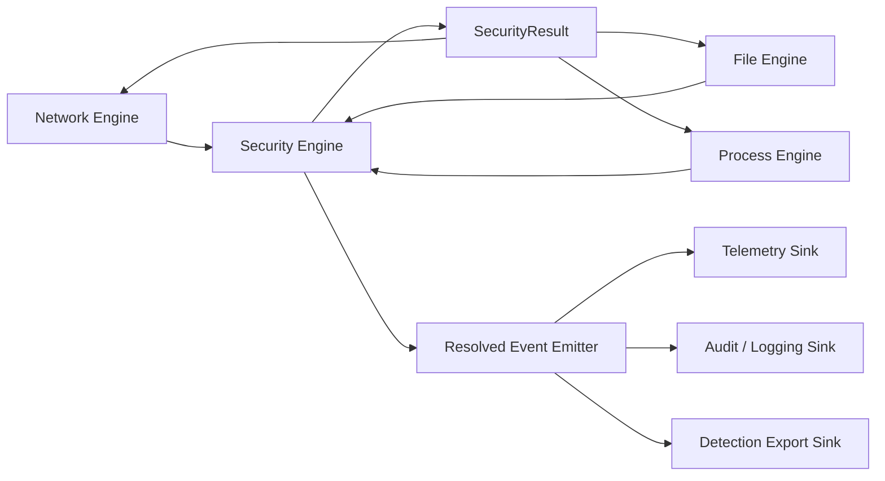

# S08b - Bedrock Engine

## Status

In progress. Inserted during the 2026-05-19 architecture regroup after S08a.
First implementation slice added `crates/capsem-security-engine` with the
shared normalized event/result/action contract, detection finding shape,
resolved-event steps, quota dimensions, and reserved throttle action.
The latest implementation slice added the first `SecurityEngine` core pipeline
shell: preprocessor callbacks, enforcement evaluation, Security Engine-owned
confirm resolution, detection evaluation before resolved-event emission,
postprocessors, final action projection, and fail-closed error results for
phase failures.
The following slice added the first real CEL enforcement adapter using the
`cel` crate. Enforcement rules now compile before install, evaluate against the
normalized `SecurityEvent` envelope, preserve rule and pack identity on matched
decisions/steps, and reject malformed CEL before it can poison the running
engine.
The next slice put runtime detection on the same CEL substrate:
`CelDetectionRule` compiles through the same `cel` crate, emits typed
`DetectionFinding` records with Sigma metadata when matched, and attaches those
findings to the event/resolved event before any emitter sink can run.
The following slice bridged S08a's `capsem.detection.ir.v1` artifact to that
runtime path. Detection IR rules now lower into `CelDetectionRule`s with
explicit event-family and field-path allowlists, so supported Sigma-derived
matchers run through real CEL while unsupported field shapes fail closed before
runtime install.
The next slice added match-stat recording hooks to the Security Engine. When
enforcement or detection rules match, the engine can notify a
`RuleMatchRecorder`; `RuntimeRuleRegistry` implements that contract so future
`/enforcement/stats` and `/detection/stats` routes read counters populated by
the same runtime path that made the decision/finding.
The latest profile-seeding slice made the service runtime registry consume the
default effective profile's enforcement rules at startup. Runtime rule metadata
now includes deterministic priority, registry projections sort by
`(priority, id)`, service APIs preserve/report priority, profile rule
conditions are wrapped with their typed callback guard, and generated DNS rules
use canonical `dns.request.qname` CEL paths. Profile-scoped seed rules remain
per-profile service state and are deliberately excluded from the global
runtime-rule broadcast snapshot that is pushed to every running VM.
The latest confirm-lifecycle slice made missing confirm resolvers fail closed
inside the Security Engine: an `ask` decision now records an applied confirm
step and becomes a terminal block with the original rule/pack attribution. The
process exec path now observes that resolved block instead of leaking an
unresolved ask into job completion or logs.
The latest structural slice extracted file activity normalization into the
first `capsem-file-engine` crate. Current file monitor and MCP file restore/
delete producers now call that crate directly, while the old
`capsem-core::file_security_events` module is removed.
The following structural slice extracted process exec normalization and inline
evaluation into the first `capsem-process-engine` crate. `capsem-process` and
session reconstruction now call that crate directly, while MITM re-exports the
same runtime Security Engine trait for existing runtime-rule wiring and the old
`capsem-core::process_security_events` module is removed.
The latest structural slice added the first `capsem-network-engine` crate and
moved pure domain/HTTP network policy primitives there. Process runtime,
`capsem-core` builtin MCP tools, and the standalone builtin MCP server now call
the Network Engine crate directly instead of reaching through
`capsem-core::net::domain_policy`.
The next Network Engine parser slice moved the DNS wire parser, fixtures, and
property tests into `capsem-network-engine`. DNS handler code, process dispatch,
the fixture generator, and fuzz targets now consume
`capsem_network_engine::dns_parser` directly.

The next required runtime slice is canonical policy context injection. The
shared `capsem-proto` policy context schema now defines the typed object model,
and the real CEL engine exists, but authored rules must not see or rely on
`event.*`. S08b must inject direct, typed policy roots such as `http`, `dns`,
`mcp`, `model`, `file`, `process`, `profile`, and `common`, with paths like
`http.request.host.contains("google")` and
`http.request.header("authorization").exists()`. The internal
`SecurityEvent` envelope remains the audit/journal/sink contract; it is not the
rule-authoring ABI.

S08a fixes the input contract for this sprint: enforcement and detection are
separate profile-owned rule families with separate public route groups.
Enforcement uses real CEL via the Rust `cel` crate family. Sigma is a detection
authoring/import format, not an enforcement language. Detection compiles into
the S08b runtime predicate plan and emits typed findings on
`ResolvedSecurityEvent` before sink fan-out.

S08a second decision slice names the concrete contracts S08b must implement:
`SecurityEvent`, `ResolvedSecurityEvent`, `DetectionFinding`,
`capsem.policy-pack.v1`, `capsem.detection-pack.v1`, and
`capsem.detection.ir.v1`.

S07b has now landed the first offline admin contract proof:
`capsem-admin detection compile` emits `capsem.detection.ir.v1`, Python golden
tests pin the compiler output, and `capsem-core::security_packs` validates,
parses, and evaluates the same Detection IR fixture. S08b must not treat
`capsem-admin` as runtime authority. The service/security engine owns runtime
validation, compilation, hot reload, listing, stats, enforcement backtest,
detection backtest, and detection hunt when Capsem is installed.

[S08 Side Sprint - Canonical AI Interaction Evidence](S08-side-canonical-ai-interaction-evidence.md)
is a pre-S08b substrate dependency for model/MCP policy quality. It does not
add another numbered tracker item, but S08b's model and MCP event subjects must
be projected from its canonical AI evidence layer instead of from thin
provider-specific parser summaries. OpenAI, Anthropic, and Google/Gemini are
first-slice providers; Bedrock is not a first-slice requirement.

S08b uses [The Ledger of the Realm](ENGINEERING-REALM-LEDGER.md) as its quality
vocabulary. Security-event contracts are Winterfell-grade when they are strict,
typed, deterministic, and replayable. Stateful accounting and persistence are
Lannister-grade when ledgers are queryable, enum-backed, invariant-tested, and
not hidden behind opaque JSON blobs. Public endpoints are Baratheon-grade when
malformed input, injection, locked mutation, and unsupported-shape cases fail
closed with typed diagnostics.

[Policy Settings Profiles Swarm](swarm.md) captured the canonical CEL authoring
namespace finding. The P0 accepted requirement is: reject `event.*` everywhere,
define the policy context object model as a typed shared contract, and make the
high-level DSL mirror that same object model instead of a separate stringly
language.

## Placement

Runs after [S08a - Rule Abstraction And Detection Architecture](S08a-rule-abstraction-detection-architecture.md)
and before the release usability lift in S09/S11/S16/S19/S18.

Reason: CLI, UI, status/debug, docs, and release verification must not freeze
around the current mixed transport/enforcement/telemetry paths.

This sprint is the bedrock contract freeze. The release is not allowed to move
forward with "engine split later" as debt. S08b must leave behind typed,
implemented, and tested boundaries for Network Engine, File Engine, Process
Engine, Security Engine, and Resolved Event Emitter; runtime rule routes and
policy roots must be stable enough that S09 CLI, S16 UI, S19 docs, S18 release
verification, and later extension sprints can build on them
without renaming the core terms.

## Goal

Split Capsem's runtime activity handling into encapsulated engines with crisp
contracts:

- **Network Engine** owns network transport mechanics: vsock, TLS/HTTP, DNS,
  MCP framing, model stream parsing, canonical AI interaction evidence
  projection for guest-originated model/MCP traffic, upstream transmission, and
  protocol-specific response application.
- **File Engine** owns file/snapshot mechanics: host file IPC, MCP file tools,
  workspace/fs monitoring, auto-snapshots, manual snapshots, snapshot diff,
  revert/restore, quarantine, path normalization, file identity, and file event
  normalization.
- **Process Engine** owns process/audit mechanics: guest exec/audit streams,
  process identity, parent/child relationships, command lines, working
  directories, exit status, process-to-file/network attribution, and process
  activity normalization.
- **Security Engine** owns security meaning: normalized activity events,
  preprocessors, real-CEL enforcement rules, runtime detection rules,
  ask/confirm, Sigma-compatible detection import, backtest, detection hunt,
  postprocessors, final security actions, and the resolved-event journal.
- **Resolved Event Emitter** owns fan-out to telemetry, audit/logging, detection
  export, and any future enterprise sink.

Done means those contracts are usable, not just described. At closeout, every
shipped runtime event family must either flow through the normalized Security
Engine path and emitter-owned projections, or be explicitly disabled/not
claimed. Direct subsystem authority writes, parallel policy engines, and raw
`event.*` rule authoring are release blockers.

## Problem Statement

The current runtime grew around separate paths:

- HTTP(S) has a hook pipeline with enforcement and telemetry hooks.
- DNS has direct enforcement and telemetry logic.
- MCP has its own enforcement/telemetry path.
- Model stream interpretation rides inside HTTP chunk hooks.
- File writes/deletes, fs watcher events, snapshot/revert actions, auditd
  records, exec chains, and process attribution mostly write telemetry directly
  or live outside the enforcement/detection path.
That makes it impossible to guarantee one complete resolved event containing:

- preprocessor actions;
- enforcement matches;
- ask/confirm challenge and outcome;
- detection results;
- postprocessor actions;
- final action applied by the transport/file engine;
- sink/emitter delivery status.

It also blurs ownership. Transport code should parse and transmit. File code
should manipulate files and snapshots. Security code should decide and explain.
Sinks should persist/export, not decide.

The database shape has the same problem. `session.db` currently has many
domain-specific event tables (`net_events`, `dns_events`, `mcp_calls`,
`model_calls`, `fs_events`, `snapshot_events`, `exec_events`, `audit_events`)
that were added as each subsystem grew. Those tables are useful query surfaces,
but they are not a coherent security-event journal. S08b must decide which
tables become canonical authority, which become projections, and how old direct
writes are routed through the emitter.

## Target Architecture



The engines exchange typed values only:

```rust
enum SecurityEvent {
    Network(NetworkSecurityEvent),
    Dns(DnsSecurityEvent),
    Mcp(McpSecurityEvent),
    Model(ModelSecurityEvent),
    File(FileSecurityEvent),
    Process(ProcessSecurityEvent),
    Snapshot(SnapshotSecurityEvent),
    VmLifecycle(VmLifecycleSecurityEvent),
    Profile(ProfileSecurityEvent),
}

struct SecurityResult {
    event_id: EventId,
    action: SecurityAction,
    resolved_event: ResolvedSecurityEvent,
}

enum SecurityAction {
    Continue,
    Ask(AskPlan),
    Rewrite(RewritePatch),
    Block(BlockResponse),
    Throttle(ThrottlePlan),
    Quarantine(QuarantinePlan),
    Restore(RestorePlan),
    DropConnection(DropReason),
    ObserveOnly,
    Error(SecurityError),
}
```

Model/MCP subjects are evidence-backed. The Network Engine may keep
provider-specific wire parsing close to OpenAI/Anthropic/Google/Gemini code,
but the Security Engine consumes the canonical `ModelInteractionEvidence`
projection described in the side sprint. CEL, Sigma-derived detection,
backtest, status, OTel, and later timeline code must not depend on provider-specific
raw JSON paths for normal policy fields.

Policy rule authoring is also evidence-backed, but it is not authored against
the raw event envelope. The Security Engine builds a typed policy context from
normalized evidence and injects direct CEL roots:

```cel
http.request.host.contains("google")
http.request.url.contains("google")
http.request.path.startsWith("/admin")
http.request.header("authorization").exists()
http.request.body.text.contains("secret")
mcp.request.tool_name == "filesystem.read_file"
model.request.provider == "gemini"
file.activity.path_class == "workspace"
```

`capsem-proto` owns the shared object typing for that policy context. The first
schema slice has landed with current Rust names such as `PolicyContext`, an
explicit `POLICY_CONTEXT_SCHEMA_VERSION`, and a root `schema_version` field. It
does not carry CEL/evaluator logic. `capsem-security-engine` owns CEL context
injection, method helpers, compile-time reference validation, and rule
evaluation. `capsem-core` owns projection from runtime/security events and
Detection IR lowering onto the same canonical roots. Current code must reject
authored `event.*` rules so `SecurityEvent` does not become a public policy ABI.

Accounting ownership is separate from correlation. A host/service AI call can
carry `vm_id`, `session_id`, `profile_id`, or `purpose` so status/debug and
forensics can explain why the call happened, but it must also carry
an explicit attribution owner. Host-originated prompts such as VM naming,
session summarization, support-bundle summaries, and workbench/admin helpers
must resolve to host/service counters, host telemetry, and host quota
dimensions. They must not increment VM model-call counts, VM MCP/tool counts,
VM token/cost totals, VM health, or VM quota dimensions unless the originating
event came from that VM runtime path.

`Ask` is not a transport action. It is a Security Engine decision/action. The
Security Engine owns ask/confirm so the resolved event can include the
challenge, answer, timeout/default, and final action in one journal. The UI/CLI
prompt implementation is behind a `ConfirmService` trait, but the lifecycle
belongs to the Security Engine.

`Throttle` is a forward-compatibility action for [S22](S22-rate-limits-budgets-and-quotas.md).
S08b does not implement rate limiting, budgets, or centralized quota providers.
It only reserves the typed action and resolved-event evidence slot so a future
rate-limit/budget engine or plugin-backed provider can delay, deny, or
explain quota decisions without rewriting transport/file/process engines.

Enforcement and detection content is profile-owned. The Security Engine receives the
VM-effective enforcement and detection packs resolved from a signed profile revision;
runtime additions/updates/deletes are service-owned overlays with provenance,
scope, stats, and audit. It does not discover loose rules from telemetry or
transport internals.

## Extension Seams

S08b reserves extension seams without implementing later products:

- `ask` is a Security Engine decision. S15 owns the production UI/CLI prompter
  if shipped profiles expose ask.
- `throttle` is a typed action placeholder. S22 owns quotas, rate limits, and
  budgets.
- Plugin transform records, event hashes, and declarative mutation slots are
  kept in the event model. S13/S23 own remote/WASM plugin products and their
  authoring APIs.

The bedrock rule is simple: extensions consume `SecurityEvent` and
`ResolvedSecurityEvent`; they do not introduce a second transport hook,
policy ABI, or persistence authority.

## Runtime Rule Registry And Backtest

S08b replaces the generic `/rules/*` runtime shape with two route groups:

```text
/enforcement/*
/detection/*
```

They may share parser and CEL infrastructure internally, but they are not the
same product surface.

Enforcement routes:

- `POST /enforcement/validate`
- `POST /enforcement/compile`
- `POST /enforcement/backtest`
- `GET /enforcement`
- `POST /enforcement`
- `PUT /enforcement/{id}`
- `DELETE /enforcement/{id}`
- `GET /enforcement/stats`

Detection routes:

- `POST /detection/validate`
- `POST /detection/compile`
- `POST /detection/backtest`
- `GET /detection`
- `POST /detection`
- `PUT /detection/{id}`
- `DELETE /detection/{id}`
- `GET /detection/stats`
- `POST /detection/hunt`
- `POST /sessions/{id}/detection/hunt`

Runtime add/update/delete must validate and compile first, then atomically
swap an `Arc<CompiledRulePlan>` or equivalent. Invalid input never poisons the
running plan. Listing and stats expose rule id, pack id, source profile/scope,
origin (`profile`, `user`, `corp`, `runtime`), enabled state, compile status,
match count, last matched event, last matched timestamp, and last compile/runtime
error.

Backtest is first-class for both enforcement and detection. It evaluates
candidate rules over normalized event corpora or selected resolved-event
journals without installing the rules. Backtest responses include aggregate
counts plus event-level rows; default output returns up to 100 matched events
and deduplicates by a simple evidence signature so operators see diversity
rather than 100 identical matches. Rows include exact event refs
(`corpus`, `session_id`, `event_id`, `sequence`, timestamp), rule id, pack id,
actual decision/finding, expected label if present, full matched field values,
and pass/fail/mismatch outcome. Local backtest and hunt do not redact evidence
by default; redaction is an export/support-bundle concern.

Detection hunt is forensic and detection-only. It runs installed or candidate
detection rules against historical resolved events and returns full local
evidence with finding context.

Implementation status as of the current service-route slices:

- Landed: `capsem-service` handlers for enforcement/detection validate,
  compile, local inline backtest, local inline detection hunt,
  live add/update/delete/list, and stats, backed by the
  `capsem-security-engine` runtime registry and real CEL compile checks.
- Landed: shared typed `capsem-proto::policy_context` schema with
  `POLICY_CONTEXT_SCHEMA_VERSION`, root `schema_version`, common/HTTP/DNS/MCP/
  model/file/process/profile roots, deterministic headers, explicit body state,
  and tests for JSON/MessagePack roundtrip, unknown-field rejection,
  case-insensitive header lookup, redacted/missing body semantics, and no
  current `V1` type suffixes.
- Landed: `capsem-security-engine` now builds a canonical policy context from
  normalized security events, injects direct CEL roots (`common`, `http`, `dns`,
  `mcp`, `model`, `file`, `process`, `profile`), supports
  `http.request.header(name).exists()`, and rejects authored `event.*` at
  compile time. `capsem-core` Detection IR lowering now emits canonical roots
  instead of `event.subject.*`.
- Landed: normalized HTTP events now carry the first request-side policy
  surface needed by the DSL: scheme, host, port, path, query, URL,
  deterministic headers, and typed body state/text. Runtime CEL tests cover
  `http.request.host.contains(...)`, `http.request.url.contains(...)`,
  `http.request.path.startsWith(...)`, `http.request.header(...).exists()`,
  and `http.request.body.text.contains(...)`; Detection IR lowering covers
  URL/path/body text onto the same canonical roots.
- Landed: the remaining legacy named-policy runtime has been removed. Deleted
  the `net::policy` evaluator, `policy_confirm` shim, model policy helper,
  Policy Hook Spec0 API/artifact, policy benchmark, policy-only DNS/MCP/MITM
  tests, and `policy_hook_events` session table/write path. HTTP, MCP, DNS,
  model, file, and process enforcement must be wired back only through the
  canonical engine path.
- Guardrail: malformed CEL fails before registry mutation; list/stats expose
  rule id, pack id, origin/scope, enabled state, compile status, generation,
  compiled plan id, match count, and last matched event/timestamp.
- Backtest scope now landed: candidate CEL rules over supplied typed
  `SecurityEvent` corpora with shared `BacktestResult` rows, event refs,
  matched subject evidence, and evidence-signature dedupe.
- Detection hunt scope now landed: multiple candidate detection rules over a
  supplied typed `SecurityEvent` corpus, returning the same shared result row
  shape as backtest.
- Landed: historical resolved-event/session journal source selection for
  `/sessions/{id}/detection/hunt`, with hand-built `session.db`
  reconstruction across HTTP, DNS, MCP, model, file, process, snapshot, VM,
  and profile events. Backtest/hunt evidence rows now expose canonical common,
  HTTP, MCP, model tool-call/tool-result, file, process, profile, and snapshot
  policy paths instead of opaque subject blobs.
- Landed: HTTP gateway security-route proof for enforcement/detection compile,
  validate, backtest, live create/update/delete/list/stats, inline detection
  hunt, and `POST /sessions/{id}/detection/hunt` preserving forensic
  matched-field rows.
- Landed: frontend Policy settings exposure for live runtime enforcement and
  detection overlays. Operators can list enforcement/detection rules, see
  priority, origin/scope attribution, pack ids, match counts, compile/enabled
  state, and condition text, validate/install runtime overlay rules, and delete
  only runtime-scoped overlays while profile/user/corp-owned rows remain
  read-only.
- Still open: persisted rule-plan recovery, interactive confirm UX, S12
  telemetry/export projection, S08d performance proof, and remaining VM/runtime
  cutover breadth.

For the bedrock release, persisted recovery and the shipped CLI/UI route
contract are release-blocking if operators can mutate runtime overlays.
Interactive confirm is release-blocking only for profiles/rules that expose
`decision = "ask"` as a user-facing capability; otherwise ask-capable rules must
be disabled or documented as unavailable for the cut. S12 export polish remains
post-bedrock, but status/log/debug truth for shipped event families is required.

## Bedrock Release Gate

S08b is complete only when:

- Network Engine routes HTTP, DNS, MCP, and model traffic through typed
  Security Engine requests/responses and applies only validated actions or
  mutations.
- File Engine owns file IPC, MCP file-tool mechanics, snapshots, restore/revert,
  quarantine, and observe-only file behavior for shipped file paths, with file
  and snapshot events normalized before policy/detection/logging.
- Process Engine owns exec/audit/process attribution and emits normalized
  process events with parent/child identity and process-to-file/network links.
- Security Engine owns preprocessors, CEL enforcement, ask/confirm lifecycle,
  detection before sinks, postprocessors, final decision projection, match
  counters, backtest, hunt, and runtime registry mutation.
- Resolved Event Emitter writes the canonical journal first and owns domain
  projections/logging so no shipped event family bypasses resolved-event truth.
- Canonical policy roots in `capsem-proto` and CEL injection in
  `capsem-security-engine` cover shipped HTTP, DNS, MCP, model, file, process,
  profile, and common fields; authored `event.*` remains rejected.
- UDS/HTTP endpoints, S09 CLI, S16 UI, S19 docs, and S18 tests consume these
  same contracts. No surface invents a second rule/profile/event vocabulary.

## Session Database Architecture

`session.db` should move to a resolved-event journal plus query projections.

The canonical write path is:

```text
Security Engine
-> ResolvedSecurityEvent
-> Resolved Event Emitter
-> session.db canonical journal
-> optional domain projections
```

The canonical tables should represent normalized security truth:

- `security_events`: one row per resolved event, keyed by stable `event_id`.
  Carries timestamp, event family/kind, source engine, VM/profile/user identity,
  trace/stream/parent ids, sequence number, final action, enforceability,
  profile revision, redaction state, label/mutation/finding counts, attribution
  scope, origin kind, and accounting owner. It intentionally avoids opaque JSON
  payload storage for the hot journal path.
- `security_event_steps`: ordered journal entries for preprocessors,
  enforcement matches, ask/confirm, detection matches, postprocessors, and
  emitter delivery results.
- `detection_findings`: finding rows keyed by finding id and linked to
  `event_id`, with rule id, rule pack, severity, confidence, and mapped Sigma
  metadata.
- `detection_finding_tags`: one row per finding tag so hunting and timeline
  filters do not need to parse a JSON array.
- `security_event_links`: correlation edges between events, such as DNS ->
  network, model -> tool call -> MCP, process -> file, process -> network, and
  snapshot -> fs events.
- Attribution is compact columns on `security_events` recording attribution
  scope/owner (`host`, `vm`,
  `profile`, `session`, `unknown`), source engine, origin kind, and the
  accounting owner used for counters/quotas. This is distinct from correlation
  ids so host-owned AI events can link to VM/session context without charging
  VM health.
- `session_identity` remains one-row session identity unless S08b proves that
  duplicating VM/profile/user ids onto every canonical event is required for
  export or cold-query performance.

Existing domain tables become projections/read models unless S08b chooses to
retire one explicitly:

- `net_events`, `dns_events`, `mcp_calls`, `model_calls`;
- `fs_events`, `snapshot_events`;
- `exec_events`, `audit_events`.

Projection rule: after cutover, these tables are written by the emitter from a
`ResolvedSecurityEvent`, not directly by network/file/process internals. They
may stay for UI, timeline, support bundle, and compatibility with existing
reader queries, but they are no longer the source of security truth.

Timeline/workbench tables are deferred to [S16a](S16a-unified-timeline-and-agent-workbench.md).
S08b only has to leave enough event ids, links, and journal facts for that
read model to be built without changing the engine contract.

Migration must be staged:

1. Add canonical journal tables and writer APIs.
2. Dual-write canonical events plus existing projections from the emitter.
3. Move debug/report readers to prefer canonical events.
4. Keep projection tables for fast domain-specific queries until replacement
   views or indexes are proven.
5. Remove direct subsystem writes and test that migrated event families cannot
   bypass the emitter.

## File Engine Scope

The File Engine replaces the vague "file activity adapter" concept. It is a
first-class engine with its own crate boundary, tests, and contract. It owns
file and snapshot mechanics, not generic process semantics.

It owns mechanics for:

- service/process file IPC: write/read/delete requests before they reach the
  guest;
- MCP file tools and checkpoint/revert workflows that manipulate workspace
  files;
- filesystem watcher events from host-visible workspaces;
- auto-snapshot lifecycle and manual snapshot metadata;
- restore, revert, quarantine, and cleanup mechanics;
- path normalization and file identity materialization;
- best-effort hash/size/mode capture before and after writes when available.

It feeds the Security Engine with:

- `FileSecurityEvent` for read/create/write/modify/delete/rename/chmod/chown;
- `SnapshotSecurityEvent` for snapshot create/restore/revert/delete;
- enforceability metadata: `inline`, `pre_apply`, `post_observe`,
  `restore_capable`, or `observe_only`.

The File Engine may consume process attribution from the Process Engine when it
is available, but it does not own audit parsing, process lineage, or raw exec
events.

The File Engine applies only the final `SecurityAction` returned by the Security
Engine. It does not decide policy or detection meaning.

## Process Engine Scope

The Process Engine is first-class. It owns guest process and audit mechanics,
not file mutation mechanics.

It owns mechanics for:

- guest auditd/audit-log streaming and parsing;
- exec/process event normalization;
- PID/PPID/session/TTY/cwd/exe/argv identity;
- parent/child lineage and command-chain reconstruction;
- process exit status and failure attribution;
- process-to-file, process-to-network, and process-to-MCP correlation where the
  source data exists;
- attribution handoff to Network Engine and File Engine event builders;
- observe-only process events that cannot be blocked inline.

It feeds the Security Engine with:

- `ProcessSecurityEvent` for exec/spawn/exit/process-failure behavior;
- process attribution records that other engines can attach to their own
  `SecurityEvent`s;
- enforceability metadata: most audit-derived process events are
  `observe_only`, while host-initiated exec/file-control requests may be
  `inline` or `pre_apply`.

The Process Engine applies only final `SecurityAction`s that are meaningful for
process mechanics, such as `Continue`, `Block`, `DropConnection`, or future
kill/suspend actions if explicitly added. It does not own policy, detection, or
telemetry persistence.

## Network Engine Scope

The Network Engine owns:

- vsock accept/dispatch for network ports;
- TLS termination, HTTP request/response parsing, body streaming, decompression
  handoff, upstream dials, and response synthesis;
- DNS request decode, upstream resolution, synthetic answers, NXDOMAIN/refused
  responses, and caching rules;
- MCP frame decoding/encoding and JSON-RPC response shaping;
- provider-specific model request/response stream parsing for OpenAI,
  Anthropic, and Google/Gemini;
- canonical AI interaction evidence projection for guest-originated model
  requests/responses, model tool calls/results, and MCP execution linkage;
- model stream parsing as transport semantics, not security meaning;
- per-stream ordering and backpressure.

It emits typed `SecurityEvent`s, receives `SecurityResult`, and applies
`SecurityAction` to the wire. It does not write policy telemetry directly.

## Security Engine Scope

The Security Engine owns:

- normalized event schema and versioning;
- stable event identity and idempotency keys;
- preprocessor order and mutation journal;
- synchronous enforcement policy evaluated by a real CEL implementation;
- ask/confirm lifecycle;
- detection evaluation after preprocessors/enforcement/confirm and before
  emission, using the S08a-approved Sigma import/compile path;
- profile-owned enforcement and detection pack loading, validation, and version
  identity;
- service-owned live enforcement and detection registries with atomic compiled
  plan swaps;
- enforcement and detection backtest over normalized event corpora;
- detection hunt over historical resolved-event journals;
- per-rule stats and match counters;
- postprocessor enrichment;
- final resolved-event construction;
- handoff to the Resolved Event Emitter.

Sigma, as decided by S08a, is a detection input/adapter inside this engine. It
is not the Security Engine itself, not an enforcement language, and not a
transport concern. S08b should implement the supported Sigma subset as a
deterministic lowering into the same CEL-backed predicate plan wherever the
mapping is exact. If a Sigma construct cannot lower to the supported normalized
event predicate model, validation fails closed with typed diagnostics. The ADR
must preserve semantics: enforcement CEL can emit enforcement actions
(`allow`, `block`, `ask`, `rewrite`, quarantine if modeled), while
Sigma-derived CEL can only emit detection findings.

S08b implementation starts with typed contracts before engine rewiring:

1. Add shared Rust model types for `SecurityEvent`, `ResolvedSecurityEvent`,
   `EnforcementResult`, `ConfirmResult`, `DetectionFinding`, and pack identity.
2. Add event-family subject structs for DNS, HTTP, MCP, model, file, process,
   credential, VM/profile, and snapshot events.
3. Add real CEL compile/evaluate adapter behind a trait, with legacy evaluator
   retained only behind migration tests until removal.
4. Add detection IR loader/evaluator behind a trait that can consume S08a's
   Sigma-compatible compiled form or the Sigma-to-CEL lowered form selected by
   the ADR.
5. Add runtime `/enforcement/*` and `/detection/*` registry/backtest/stats/hunt
   contracts before public HTTP/CLI/UI work consumes them.
6. Add emitter tests proving all sinks receive the same resolved event id and
   finding ids.

## Crate And Module Separation

Expected split:

- `crates/capsem-security-engine`: `SecurityEvent`, `SecurityResult`,
  `SecurityAction`, normalized event schema, profile-owned rule pack identity,
  runtime enforcement/detection registries, real CEL enforcement,
  Sigma-compatible detection import/lowering, backtest, detection hunt,
  ask/confirm orchestration, postprocessors, resolved-event builder, and engine
  contract tests.
- `crates/capsem-network-engine`: network transport/parsing/transmission layer
  that depends on the security-engine contract but not on logger schema details.
  The first committed slice owns domain/HTTP network policy primitives; later
  structural slices move MITM/DNS/MCP/model transport behind the same boundary.
  The DNS wire parser is now also owned by this crate.
- `crates/capsem-file-engine`: file/snapshot/process activity layer that depends
  on the security-engine contract and owns file/snapshot mechanics.
- `crates/capsem-process-engine`: process/audit activity layer that depends on
  the security-engine contract and provides process attribution to other engines.
- `crates/capsem-event-emitter` or a focused module under
  `capsem-security-engine`: resolved-event fan-out, sink traits, delivery
  journal, bounded queues, and sink failure semantics.
- `crates/capsem-session-store` or a focused logger module: canonical
  `session.db` resolved-event journal schema, projection writers, migrations,
  and query contracts.

Final crate names can change during implementation, but the dependency rule
cannot: transport/file/process engines may depend on the security contract; the
security engine must not depend on Hyper, rustls, DNS wire encoders, FUSE,
notify, audit-log tailing, MCP file tools, or SQLite writer internals.

## Thread Pool And Ordering Model

- Network runtime: async I/O, HTTP/DNS/MCP transport, upstream traffic.
- File blocking pool: filesystem operations, snapshot/revert/quarantine work,
  hash capture, and other blocking file calls.
- Process/audit pool: audit parsing, process lineage reconstruction, and
  bounded correlation work.
- Security event pool: CPU-bound preprocessors, CEL/policy evaluation,
  detection/Sigma matching, postprocessors.
- Confirm tasks: bounded async ask/confirm with timeout/default-deny semantics.
- Emitter queue: bounded fan-out to sinks with delivery metrics.
- DB writer: existing dedicated SQLite writer thread remains the persistence
  owner.

Ordering rule:

- preserve order within one connection/stream/file operation chain;
- parallelize across independent streams, DNS queries, MCP calls, and file
  activity events;
- sinks dedupe by stable `event_id`;
- retries are idempotent.

Each event carries at least:

- `event_id`;
- `parent_event_id`;
- `stream_id` or `activity_id`;
- `sequence_no`;
- `vm_id`;
- `profile_id`;
- `user_id`;
- `trace_id`;
- `source_engine`;
- `enforceability`.
- quota dimensions needed by future S22 work: event family/type, profile
  revision, provider/model, MCP server/tool, HTTP host/method/path class, DNS
  domain class, estimated tokens/cost, request/byte counts, and correlation ids
  when known.

## Sub-Sprints

### S08b.0 - Inventory And Boundary ADR

- Inventory current HTTP, DNS, MCP, model, file IPC, fs monitor, snapshot, MCP
  file-tool, auditd, exec, and process attribution paths.
- Write an ADR that freezes engine responsibilities and allowed dependencies.
- Identify direct telemetry writes that must move behind the emitter.

### S08b.1 - Contract Crate Skeleton

- Introduce the normalized security event/result/action types.
- Add event identity helpers and schema-versioning hooks.
- Add golden fixtures for network, DNS, MCP, model, file, process, snapshot,
  VM lifecycle, and profile events.
- Add profile-owned enforcement-pack and detection-pack identity types, including
  rule-pack ids, revisions, hashes/signatures, and VM-effective pins.

### S08b.2 - Security Engine Core

- Implement the engine pipeline:
  preprocessors -> enforcement -> ask/confirm -> detection -> postprocessors ->
  resolved event -> emitter.
- Replace the current CEL-like evaluator dependency with S08a's selected real
  CEL implementation and type mapping.
- Add S08a's selected Sigma-compatible detection import/lowering path behind
  the detection phase.
- Add runtime enforcement/detection registries with compile-first atomic
  hot-swap semantics.
- Add enforcement and detection backtest. Default results return at most 100
  matched event rows, deduped by simple evidence signature, with full local
  evidence.
- Add detection hunt over historical resolved-event journals.
- Add match stats and last-match/last-error accounting for list/stats routes.
- Keep existing rule behavior equivalent while changing the path.
- Add unit/contract tests for ordering, fail-closed enforcement, confirm
  timeout, detection annotation, backtest rows, evidence deduplication, stats,
  hunt, and emission.

### S08b.3 - Network Engine Cutover

- Move HTTP/DNS/MCP/model paths behind the Network Engine contract.
- Replace direct enforcement/telemetry calls with `SecurityEvent` submission and
  `SecurityAction` application.
- Preserve streaming behavior without buffering whole responses by default.

### S08b.4 - File Engine Cutover

- Route host file IPC, MCP file tools, fs monitor events, and
  snapshot/revert/quarantine operations through File Engine
  events.
- Model inline blockable versus observe-only file behavior explicitly.
- Ensure snapshot/revert actions emit resolved events and can be used by
  detection/remediation policy.

### S08b.5 - Process Engine Cutover

- Route guest auditd, exec history, process lineage, exit status, and
  process-to-file/network attribution through Process Engine events.
- Keep raw process behavior separate from File Engine unless it maps to a
  concrete file operation.
- Prove process attribution can enrich file/network/model events without
  creating circular dependencies between engines.

### S08b.6 - Emitter And Sink Unification

- Move telemetry/audit/logging/detection export behind a resolved-event emitter.
- Define required versus best-effort sinks.
- Add delivery journal, bounded queues, metrics, and idempotent sink writes.
- Add canonical `session.db` resolved-event journal tables and projection
  writers.
- Start dual-writing canonical events plus existing domain projections from the
  emitter.

### S08b.7 - Session DB Reader And Debug Migration

- Move debug/report readers to prefer canonical `security_events`,
  `security_event_steps`, `detection_findings`, and `security_event_links`.
- Keep existing domain tables as projections for fast domain views until
  replacement indexes/views are proven.
- Add regression tests proving direct network/file/process writes cannot bypass
  the emitter for migrated event families.

### S08b.8 - Status, Debug, And Operator Proof

- Make status/debug explain engine health, queue depth, last sink errors, rule
  matches, detection results, and file/snapshot remediation.
- Add inspect-session/debug-report coverage for resolved events.

### S08b.9 - Performance And VM Gate

- Benchmark hot-path event processing and streaming overhead.
- Run chained VM tests covering network, DNS, MCP/model, file writes/deletes,
  snapshot/revert, process/audit attribution, detection annotation, telemetry,
  and audit/logging.

## Testing Matrix

- Unit/contract: event schema fixtures; result/action enum behavior; dependency
  boundary tests; event identity/idempotency tests; real CEL parser/evaluator
  tests; Sigma validation/import/compile tests; profile-owned rule-pack identity
  tests; canonical session DB schema and projection writer tests.
- Functional: Network Engine, File Engine, and Process Engine submit events to
  the Security Engine and apply returned actions correctly.
- Adversarial: malformed events, bad paths, traversal attempts, sink failures,
  duplicate event IDs, confirm timeouts, detection errors, blocked events still
  emitted.
- E2E/VM: boot VM, execute network/DNS/MCP/file/snapshot chains, verify final
  resolved events contain enforcement, confirm, detection, postprocessor, and
  sink delivery facts.
- Telemetry/audit: session DB rows are produced only through the emitter path
  for migrated event families; no direct hot-path SQLite writes remain;
  canonical events and domain projections agree; host-attributed AI events with
  VM/session correlation are present in the resolved-event journal but absent
  from VM-owned model/MCP/token/cost counters.
- Performance: event-engine overhead budget, streaming chunk overhead, security
  pool saturation, emitter backpressure, and file snapshot/hash cost.

## Done Means

- Network Engine, File Engine, and Process Engine have separate contracts and
  test suites.
- Security Engine is the only owner of policy, ask/confirm, detection,
  postprocessing, and resolved-event construction.
- Enforcement uses real CEL, not the current homegrown CEL-like subset.
- Detection uses the S08a-approved real Sigma-compatible path and is owned by
  signed profile rule packs.
- Telemetry/audit/logging/detection export receive resolved events from the
  emitter, not from transport/file internals.
- Host AI attribution is explicit in security events, quota dimensions,
  resolved-event logging, and metrics. Host-originated AI calls linked to a VM
  or session charge host/service counters only.
- `session.db` has a canonical resolved-event journal; existing domain tables
  are projections/read models or are explicitly retired.
- File writes, deletes, snapshots, restores, observe-only file behavior, exec
  chains, and process/audit attribution are represented in the same security
  event model as network activity without collapsing file and process mechanics
  into one engine.
- S09/S11/S16/S19/S18 specs consume the new engine contracts for the bedrock
  release.

## Next Sprints

- [S09 - CLI Integration](S09-cli-integration.md): make the bedrock operable
  from `capsem` without raw HTTP/UDS/SQL.
- [S11 - Status, Debug, Provenance](S11-status-debug-provenance.md): make
  logs/status/debug explain profile, rule, engine, and resolved-event truth.
- [S16 - Profile UI](S16-profile-ui.md): make the profile and runtime rule
  endpoint contract usable in the UI.
- [S19 - Documentation And Site](S19-documentation-and-site.md): document the
  shipped contract and its deliberate deferrals.
- [S18 - Full Verification And Release Gate](S18-full-verification-release-gate.md):
  prove install, VM, CLI, UI, docs, engine, logs/status/debug, and benchmarks
  together.

Deferred improvement sprints:

- [S10 - Credential Brokerage](S10-credential-brokerage.md)
- [S13 - Remote Enforcement Plugin](S13-remote-policy-plugin.md)
- [S15 - Confirm UX](S15-confirm-ux.md), only release-blocking if ask ships
- [S16a - Unified Timeline And Agent Workbench](S16a-unified-timeline-and-agent-workbench.md)
- [S17 - Security Capabilities UI](S17-security-capabilities-ui.md)
- [S19a - Marketing Site Refresh](S19a-marketing-site-refresh.md)
- [S19b - Reporting Setup](S19b-reporting-setup.md)
- [S20 - OpenAPI To MCP](S20-openapi-to-mcp.md)
- [S21 - Local LLM](S21-local-llm.md)
- [S22 - Rate Limits, Budgets, And Quotas](S22-rate-limits-budgets-and-quotas.md)
- [S23 - Post-Bedrock Improvements](S23-post-bedrock-improvements.md)
