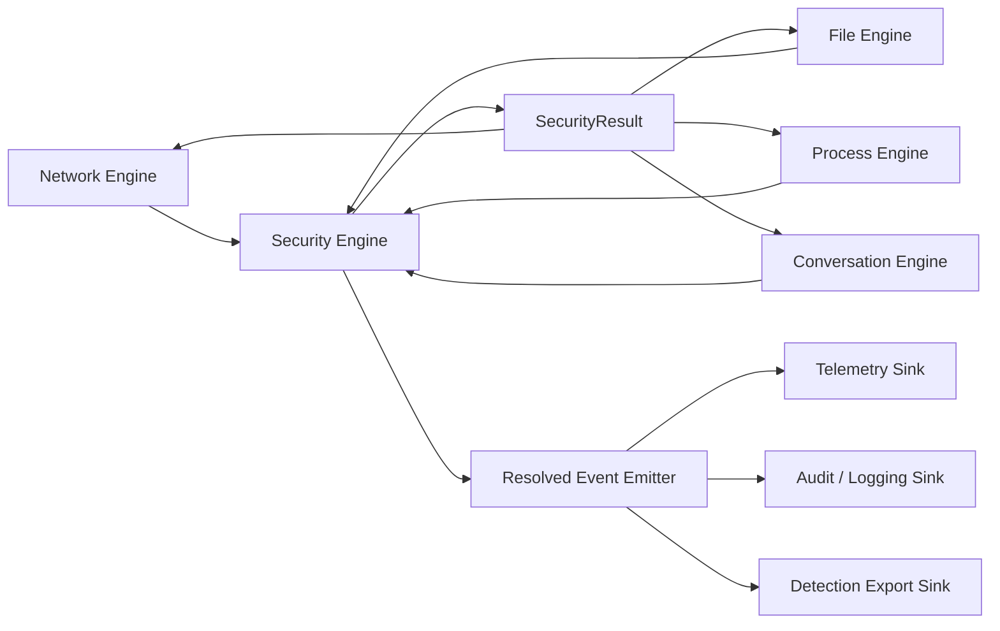

# S08b - Security Event Engine, Network Engine, File Engine, And Process Engine

## Status

Not started. Inserted during the 2026-05-19 architecture regroup after S08a.

S08a first decision slice now fixes the input contract for this sprint:
policy and detection are separate profile-owned rule families; policy
enforcement uses real CEL via the Rust `cel` crate family; Sigma is a detection
authoring/import format; detection compiles to Capsem normalized detection IR
and emits typed findings on `ResolvedSecurityEvent` before sink fan-out.

S08a second decision slice names the concrete contracts S08b must implement:
`SecurityEvent`, `ResolvedSecurityEvent`, `DetectionFinding`,
`capsem.policy-pack.v1`, `capsem.detection-pack.v1`, and
`capsem.detection.ir.v1`.

S07b has now landed the first cross-runtime Detection IR contract proof:
`capsem-admin detection compile` emits `capsem.detection.ir.v1`, Python golden
tests pin the compiler output, and `capsem-core::security_packs` validates,
parses, and evaluates the same Detection IR fixture. S08b should build the
runtime Security Engine on that module instead of inventing a second IR parser.

## Placement

Runs after [S08a - Rule Abstraction And Detection Architecture](S08a-rule-abstraction-detection-architecture.md)
and before S09/S11/S12/S13/S14/S15/S16/S16a.

S16a consumes this sprint's Conversation Engine and unified timeline API for
the user-facing agent workbench.

Reason: CLI, status/debug, telemetry, plugins, rules UI, Confirm UX, Profile UI,
and documentation must not freeze around the current mixed transport/policy/
telemetry paths.

## Goal

Split Capsem's runtime activity handling into encapsulated engines with crisp
contracts:

- **Network Engine** owns network transport mechanics: vsock, TLS/HTTP, DNS,
  MCP framing, model stream parsing, upstream transmission, and protocol-specific
  response application.
- **File Engine** owns file/snapshot mechanics: host file IPC, MCP file tools,
  workspace/fs monitoring, auto-snapshots, manual snapshots, snapshot diff,
  revert/restore, quarantine, path normalization, file identity, and file event
  normalization.
- **Process Engine** owns process/audit mechanics: guest exec/audit streams,
  process identity, parent/child relationships, command lines, working
  directories, exit status, process-to-file/network attribution, and process
  activity normalization.
- **Conversation Engine** owns user/agent conversation mechanics: SDK-backed
  Codex/Claude session adapters, assistant/user/tool message capture, terminal
  transcript correlation, conversation turns, artifacts, and conversation
  timeline normalization.
- **Security Engine** owns security meaning: normalized activity events,
  preprocessors, real-CEL enforcement rules, ask/confirm, Sigma-compatible
  detection IR, postprocessors, final security actions, and the resolved-event
  journal.
- **Resolved Event Emitter** owns fan-out to telemetry, audit/logging, detection
  export, and any future enterprise sink.

## Problem Statement

The current runtime grew around separate paths:

- HTTP(S) has a hook pipeline with policy and telemetry hooks.
- DNS has direct policy and telemetry logic.
- MCP has its own policy/telemetry path.
- Model stream interpretation rides inside HTTP chunk hooks.
- File writes/deletes, fs watcher events, snapshot/revert actions, auditd
  records, exec chains, and process attribution mostly write telemetry directly
  or live outside the policy/detection path.
- User-facing agent work is not represented in a strong enough timeline. Today
  we have raw PTY transcript files, model/tool telemetry, and a legacy timeline
  union, but the timeline lacks first-class ids such as conversation id, turn id,
  message id, process id, activity id, artifact id, finding id, and structured
  event links.

That makes it impossible to guarantee one complete resolved event containing:

- preprocessor actions;
- enforcement matches;
- ask/confirm challenge and outcome;
- detection results;
- postprocessor actions;
- final action applied by the transport/file engine;
- sink/emitter delivery status.

It also blurs ownership. Transport code should parse and transmit. File code
should manipulate files and snapshots. Security code should decide and explain.
Sinks should persist/export, not decide.

The database shape has the same problem. `session.db` currently has many
domain-specific event tables (`net_events`, `dns_events`, `mcp_calls`,
`model_calls`, `fs_events`, `snapshot_events`, `exec_events`, `audit_events`,
`policy_hook_events`) that were added as each subsystem grew. Those tables are
useful query surfaces, but they are not a coherent security-event journal. S08b
must decide which tables become canonical authority, which become projections,
and how old direct writes are routed through the emitter.

## Target Architecture



The engines exchange typed values only:

```rust
enum SecurityEvent {
    Network(NetworkSecurityEvent),
    Dns(DnsSecurityEvent),
    Mcp(McpSecurityEvent),
    Model(ModelSecurityEvent),
    File(FileSecurityEvent),
    Process(ProcessSecurityEvent),
    Conversation(ConversationSecurityEvent),
    Snapshot(SnapshotSecurityEvent),
    VmLifecycle(VmLifecycleSecurityEvent),
    Profile(ProfileSecurityEvent),
}

struct SecurityResult {
    event_id: EventId,
    action: SecurityAction,
    resolved_event: ResolvedSecurityEvent,
}

enum SecurityAction {
    Continue,
    Rewrite(RewritePatch),
    Block(BlockResponse),
    Quarantine(QuarantinePlan),
    Restore(RestorePlan),
    DropConnection(DropReason),
    ObserveOnly,
    Error(SecurityError),
}
```

`Ask` is not a transport action. The Security Engine owns ask/confirm so the
resolved event can include the challenge, answer, timeout/default, and final
action in one journal. The UI/CLI prompt implementation is behind a
`ConfirmService` trait, but the lifecycle belongs to the Security Engine.

Policy and detection content is profile-owned. The Security Engine receives the
VM-effective policy and detection packs resolved from a signed profile revision;
it does not discover loose rules from telemetry, local mutable state, or
transport internals.

## Session Database Architecture

`session.db` should move to a resolved-event journal plus query projections.

The canonical write path is:

```text
Security Engine
-> ResolvedSecurityEvent
-> Resolved Event Emitter
-> session.db canonical journal
-> optional domain projections
```

The canonical tables should represent normalized security truth:

- `security_events`: one row per resolved event, keyed by stable `event_id`.
  Carries timestamp, event family/kind, source engine, VM/profile/user identity,
  trace/stream/parent ids, sequence number, final action, enforceability,
  profile revision, policy-pack identity, detection-pack identity, and compact
  resolved JSON.
- `security_event_steps`: ordered journal entries for preprocessors,
  enforcement matches, ask/confirm, detection matches, postprocessors, and
  emitter delivery results.
- `detection_findings`: finding rows keyed by finding id and linked to
  `event_id`, with rule id, rule pack, severity, confidence, tags, mapped Sigma
  metadata, and export status.
- `security_event_links`: correlation edges between events, such as DNS ->
  network, model -> tool call -> MCP, process -> file, process -> network, and
  snapshot -> fs events.
- `timeline_threads`: logical conversation/session/activity records, including
  SDK/agent kind (`codex`, `claude`, terminal-only, MCP-driven), title, VM id,
  profile id, user id, created/updated times, and retention/redaction policy.
- `timeline_elements`: ordered structured JSON elements keyed by `event_id`,
  `conversation_id`, `turn_id`, `message_id`, `process_id`, `activity_id`, and
  other correlation ids where applicable. Elements carry role/kind, content/ref,
  source adapter, timestamps, token/cost metadata, and redaction/classification
  state.
- `timeline_artifacts`: files, patches, snapshots, commands, links, and
  generated outputs associated with timeline elements and/or security events.
- `session_identity` remains one-row session identity unless S08b proves that
  duplicating VM/profile/user ids onto every canonical event is required for
  export or cold-query performance.

Existing domain tables become projections/read models unless S08b chooses to
retire one explicitly:

- `net_events`, `dns_events`, `mcp_calls`, `model_calls`;
- `fs_events`, `snapshot_events`;
- `exec_events`, `audit_events`;
- `policy_hook_events` until policy/confirm journals fully replace it.

Projection rule: after cutover, these tables are written by the emitter from a
`ResolvedSecurityEvent`, not directly by network/file/process internals. They
may stay for UI, timeline, support bundle, and compatibility with existing
reader queries, but they are no longer the source of security truth.

Timeline tables are not just projections. They are the user-facing structured
read model backed by canonical resolved events plus first-party conversation
adapter input. A raw PTY transcript remains a forensic artifact; it is not the
timeline by itself.

Migration must be staged:

1. Add canonical journal tables and writer APIs.
2. Dual-write canonical events plus existing projections from the emitter.
3. Move timeline/debug/report readers to prefer canonical events.
4. Keep projection tables for fast domain-specific queries until replacement
   views or indexes are proven.
5. Remove direct subsystem writes and test that migrated event families cannot
   bypass the emitter.

## File Engine Scope

The File Engine replaces the vague "file activity adapter" concept. It is a
first-class engine with its own crate boundary, tests, and contract. It owns
file and snapshot mechanics, not generic process semantics.

It owns mechanics for:

- service/process file IPC: write/read/delete requests before they reach the
  guest;
- MCP file tools and checkpoint/revert workflows that manipulate workspace
  files;
- filesystem watcher events from host-visible workspaces;
- auto-snapshot lifecycle and manual snapshot metadata;
- restore, revert, quarantine, and cleanup mechanics;
- path normalization and file identity materialization;
- best-effort hash/size/mode capture before and after writes when available.

It feeds the Security Engine with:

- `FileSecurityEvent` for read/create/write/modify/delete/rename/chmod/chown;
- `SnapshotSecurityEvent` for snapshot create/restore/revert/delete;
- enforceability metadata: `inline`, `pre_apply`, `post_observe`,
  `restore_capable`, or `observe_only`.

The File Engine may consume process attribution from the Process Engine when it
is available, but it does not own audit parsing, process lineage, or raw exec
events.

The File Engine applies only the final `SecurityAction` returned by the Security
Engine. It does not decide policy or detection meaning.

## Process Engine Scope

The Process Engine is first-class. It owns guest process and audit mechanics,
not file mutation mechanics.

It owns mechanics for:

- guest auditd/audit-log streaming and parsing;
- exec/process event normalization;
- PID/PPID/session/TTY/cwd/exe/argv identity;
- parent/child lineage and command-chain reconstruction;
- process exit status and failure attribution;
- process-to-file, process-to-network, and process-to-MCP correlation where the
  source data exists;
- attribution handoff to Network Engine and File Engine event builders;
- observe-only process events that cannot be blocked inline.

It feeds the Security Engine with:

- `ProcessSecurityEvent` for exec/spawn/exit/process-failure behavior;
- process attribution records that other engines can attach to their own
  `SecurityEvent`s;
- enforceability metadata: most audit-derived process events are
  `observe_only`, while host-initiated exec/file-control requests may be
  `inline` or `pre_apply`.

The Process Engine applies only final `SecurityAction`s that are meaningful for
process mechanics, such as `Continue`, `Block`, `DropConnection`, or future
kill/suspend actions if explicitly added. It does not own policy, detection, or
telemetry persistence.

## Conversation Engine Scope

The Conversation Engine is first-class because everyday Capsem work happens
through agents, not just through raw terminals.

It owns mechanics for:

- Codex SDK and Claude SDK session adapters, if those SDKs are adopted;
- terminal-only fallback capture using `pty.log` plus command/process
  attribution;
- conversation/activity identity, turn ordering, message roles, and timeline
  grouping keys;
- tool-call/message/artifact correlation across model, MCP, file, process, and
  network events;
- redaction/classification of conversation content before durable storage;
- search indexing inputs for the unified timeline UI;
- conversation retention/export rules derived from profile/service settings.

It feeds the Security Engine with:

- `ConversationSecurityEvent` for user prompts, assistant responses, tool
  proposals, tool results, generated files/patches, and user approvals;
- correlation links to model/MCP/file/process/network events;
- enforceability metadata. Most conversation timeline elements are
  observe/enrich, while tool proposals or approvals may be inline if the SDK
  integration offers a pre-apply hook.

The Conversation Engine does not replace Network/Model/MCP telemetry. It
provides the user-facing narrative that links those lower-level events into a
reviewable session.

## Network Engine Scope

The Network Engine owns:

- vsock accept/dispatch for network ports;
- TLS termination, HTTP request/response parsing, body streaming, decompression
  handoff, upstream dials, and response synthesis;
- DNS request decode, upstream resolution, synthetic answers, NXDOMAIN/refused
  responses, and caching rules;
- MCP frame decoding/encoding and JSON-RPC response shaping;
- model stream parsing as transport semantics, not security meaning;
- per-stream ordering and backpressure.

It emits typed `SecurityEvent`s, receives `SecurityResult`, and applies
`SecurityAction` to the wire. It does not write policy telemetry directly.

## Security Engine Scope

The Security Engine owns:

- normalized event schema and versioning;
- stable event identity and idempotency keys;
- preprocessor plugin order and mutation journal;
- synchronous enforcement policy evaluated by a real CEL implementation;
- ask/confirm lifecycle;
- detection evaluation after preprocessors/enforcement/confirm and before
  emission, using a real Sigma-compatible representation/engine or the
  S08a-approved Sigma import/compile path;
- profile-owned policy and detection pack loading, validation, and version
  identity;
- postprocessor enrichment;
- final resolved-event construction;
- handoff to the Resolved Event Emitter.

Sigma, as decided by S08a, is a detection input/adapter inside this engine. It
is not the Security Engine itself, not an enforcement language, and not a
transport concern. The current Capsem CEL-like shortcut is not a final rule
language; S08b consumes S08a's real CEL decision.

Open S08b design question before implementation: decide whether the supported
Sigma detection subset should compile down to CEL instead of a separate runtime
Detection IR evaluator. The working hypothesis to evaluate is that Capsem's
normalized Sigma categories, field mappings, exact matches, lists, conjunctions,
and disjunctions are a strict subset of CEL predicates over `SecurityEvent`, so
a deterministic Sigma-to-CEL compiler/functor could produce CEL expressions and
let one CEL matching pass evaluate both enforcement predicates and detection
predicates. The ADR must still preserve semantics: policy CEL can emit
enforcement actions (`allow`, `block`, `ask`, `rewrite`), while Sigma-derived
CEL can only emit detection findings. Do not wire the runtime until this
Sigma-to-CEL question has an ADR answer with compiler limits, diagnostics,
golden tests, and performance implications.

S08b implementation starts with typed contracts before engine rewiring:

1. Add shared Rust model types for `SecurityEvent`, `ResolvedSecurityEvent`,
   `PolicyResult`, `ConfirmResult`, `DetectionFinding`, and pack identity.
2. Add event-family subject structs for DNS, HTTP, MCP, model, file, process,
   credential, VM/profile, and conversation events.
3. Add real CEL compile/evaluate adapter behind a trait, with legacy evaluator
   retained only behind migration tests until removal.
4. Add detection IR loader/evaluator behind a trait that can consume S08a's
   Sigma-compatible compiled form.
5. Add emitter tests proving all sinks receive the same resolved event id and
   finding ids.

## Crate And Module Separation

Expected split:

- `crates/capsem-security-engine`: `SecurityEvent`, `SecurityResult`,
  `SecurityAction`, normalized event schema, profile-owned rule pack identity,
  preprocessors, real CEL enforcement, Sigma-compatible detection, ask/confirm
  orchestration, postprocessors, resolved-event builder, and engine contract
  tests.
- `crates/capsem-network-engine`: network transport/parsing/transmission layer
  that depends on the security-engine contract but not on logger schema details.
- `crates/capsem-file-engine`: file/snapshot/process activity layer that depends
  on the security-engine contract and owns file/snapshot mechanics.
- `crates/capsem-process-engine`: process/audit activity layer that depends on
  the security-engine contract and provides process attribution to other engines.
- `crates/capsem-conversation-engine`: SDK-backed and terminal-backed
  conversation capture, timeline normalization, search input generation, and
  conversation/security event correlation.
- `crates/capsem-event-emitter` or a focused module under
  `capsem-security-engine`: resolved-event fan-out, sink traits, delivery
  journal, bounded queues, and sink failure semantics.
- `crates/capsem-session-store` or a focused logger module: canonical
  `session.db` resolved-event journal schema, projection writers, migrations,
  and query contracts.

Final crate names can change during implementation, but the dependency rule
cannot: transport/file/process engines may depend on the security contract; the
security engine must not depend on Hyper, rustls, DNS wire encoders, FUSE,
notify, audit-log tailing, MCP file tools, or SQLite writer internals.

## Thread Pool And Ordering Model

- Network runtime: async I/O, HTTP/DNS/MCP transport, upstream traffic.
- File blocking pool: filesystem operations, snapshot/revert/quarantine work,
  hash capture, and other blocking file calls.
- Process/audit pool: audit parsing, process lineage reconstruction, and
  bounded correlation work.
- Conversation pool: SDK event intake, transcript normalization, redaction, and
  indexing work; never blocks network/file/process hot paths.
- Security event pool: CPU-bound preprocessors, CEL/policy evaluation,
  detection/Sigma matching, postprocessors.
- Confirm tasks: bounded async ask/confirm with timeout/default-deny semantics.
- Emitter queue: bounded fan-out to sinks with delivery metrics.
- DB writer: existing dedicated SQLite writer thread remains the persistence
  owner.

Ordering rule:

- preserve order within one connection/stream/file operation chain;
- parallelize across independent streams, DNS queries, MCP calls, and file
  activity events;
- sinks dedupe by stable `event_id`;
- retries are idempotent.

Each event carries at least:

- `event_id`;
- `parent_event_id`;
- `stream_id` or `activity_id`;
- `sequence_no`;
- `vm_id`;
- `profile_id`;
- `user_id`;
- `trace_id`;
- `source_engine`;
- `enforceability`.

## Sub-Sprints

### S08b.0 - Inventory And Boundary ADR

- Inventory current HTTP, DNS, MCP, model, file IPC, fs monitor, snapshot, MCP
  file-tool, auditd, exec, process attribution, PTY transcript, terminal
  history, timeline, and model/tool conversation paths.
- Write an ADR that freezes engine responsibilities and allowed dependencies.
- Identify direct telemetry writes that must move behind the emitter.

### S08b.1 - Contract Crate Skeleton

- Introduce the normalized security event/result/action types.
- Add event identity helpers and schema-versioning hooks.
- Add golden fixtures for network, DNS, MCP, model, file, process, snapshot,
  conversation, VM lifecycle, and profile events.
- Add profile-owned policy-pack and detection-pack identity types, including
  rule-pack ids, revisions, hashes/signatures, and VM-effective pins.

### S08b.2 - Security Engine Core

- Implement the engine pipeline:
  preprocessors -> enforcement -> ask/confirm -> detection -> postprocessors ->
  resolved event -> emitter.
- Replace the current CEL-like evaluator dependency with S08a's selected real
  CEL implementation and type mapping.
- Add S08a's selected Sigma-compatible detection path behind the detection
  phase.
- Keep existing rule behavior equivalent while changing the path.
- Add unit/contract tests for ordering, fail-closed enforcement, confirm
  timeout, detection annotation, and emission.

### S08b.3 - Network Engine Cutover

- Move HTTP/DNS/MCP/model paths behind the Network Engine contract.
- Replace direct policy/telemetry calls with `SecurityEvent` submission and
  `SecurityAction` application.
- Preserve streaming behavior without buffering whole responses by default.

### S08b.4 - File Engine Cutover

- Route host file IPC, MCP file tools, fs monitor events, and
  snapshot/revert/quarantine operations through File Engine
  events.
- Model inline blockable versus observe-only file behavior explicitly.
- Ensure snapshot/revert actions emit resolved events and can be used by
  detection/remediation policy.

### S08b.5 - Process Engine Cutover

- Route guest auditd, exec history, process lineage, exit status, and
  process-to-file/network attribution through Process Engine events.
- Keep raw process behavior separate from File Engine unless it maps to a
  concrete file operation.
- Prove process attribution can enrich file/network/model events without
  creating circular dependencies between engines.

### S08b.6 - Conversation Engine And Timeline Cutover

- Define Codex SDK and Claude SDK adapter contracts, plus terminal-only fallback
  capture.
- Convert raw PTY transcript/model/tool events into ordered timeline elements
  where SDK events are unavailable.
- Add timeline thread, element, artifact, and search-index writer paths.
- Link timeline elements to canonical security events through
  `security_event_links`.
- Prove redaction/retention policy is applied before durable timeline writes.

### S08b.7 - Emitter And Sink Unification

- Move telemetry/audit/logging/detection export behind a resolved-event emitter.
- Define required versus best-effort sinks.
- Add delivery journal, bounded queues, metrics, and idempotent sink writes.
- Add canonical `session.db` resolved-event journal tables and projection
  writers.
- Start dual-writing canonical events plus existing domain projections from the
  emitter.

### S08b.8 - Session DB Reader And Unified Timeline Migration

- Move timeline/debug/report readers to prefer canonical `security_events`,
  `security_event_steps`, `detection_findings`, and `security_event_links`.
- Replace the legacy `/timeline/{id}` union with one structured timeline API:
  `/timeline/{id}` returns a paginated JSON envelope containing typed timeline
  block elements.
- Support stable pagination arguments such as `cursor`, `limit`, `direction`,
  `anchor_event_id`, `since`, and `until`, and return pagination metadata such
  as `next_cursor`, `prev_cursor`, `has_more`, and a read watermark.
- The endpoint may support coarse indexed bounds such as `layers` or time range
  when needed to avoid pathological reads, but arbitrary filtering and
  presentation grouping are not the server's primary responsibility.
- Keep `/timeline/{id}` as the single endpoint; conversation, forensic,
  finding, and artifact views are client-side filters/rendering modes over the
  same typed timeline block stream.
- Define one stable JSON block shape per timeline element family so S16a can
  render each block type without ad hoc string parsing.
- Keep existing domain tables as projections for fast domain views until
  replacement indexes/views are proven.
- Add regression tests proving direct network/file/process writes cannot bypass
  the emitter for migrated event families.

### S08b.9 - Status, Debug, And Operator Proof

- Make status/debug explain engine health, queue depth, last sink errors, rule
  matches, detection results, file/snapshot remediation, and conversation
  journal health.
- Add inspect-session/debug-report coverage for resolved events.

### S08b.10 - Performance And VM Gate

- Benchmark hot-path event processing and streaming overhead.
- Run chained VM tests covering network, DNS, MCP/model, file writes/deletes,
  snapshot/revert, process/audit attribution, SDK/terminal conversation-grouped
  timeline, detection annotation, telemetry, and audit/logging.

## Testing Matrix

- Unit/contract: event schema fixtures; result/action enum behavior; dependency
  boundary tests; event identity/idempotency tests; real CEL parser/evaluator
  tests; Sigma validation/import/compile tests; profile-owned rule-pack identity
  tests; canonical session DB schema and projection writer tests; timeline
  thread/element/artifact schema tests.
- Functional: Network Engine, File Engine, and Process Engine submit events to
  the Security Engine and apply returned actions correctly.
- Adversarial: malformed events, bad paths, traversal attempts, sink failures,
  duplicate event IDs, confirm timeouts, detection errors, blocked events still
  emitted.
- E2E/VM: boot VM, execute network/DNS/MCP/file/snapshot chains, verify final
  resolved events contain enforcement, confirm, detection, postprocessor, and
  sink delivery facts; run Codex/Claude SDK or terminal fallback workflow and
  verify `/timeline/{id}` paginates typed blocks and each block links back to
  canonical events.
- Telemetry/audit: session DB rows are produced only through the emitter path
  for migrated event families; no direct hot-path SQLite writes remain;
  canonical events and domain projections agree.
- Performance: event-engine overhead budget, streaming chunk overhead, security
  pool saturation, emitter backpressure, file snapshot/hash cost, timeline
  ingestion cost, and search/index query latency.

## Done Means

- Network Engine, File Engine, and Process Engine have separate contracts and
  test suites.
- Security Engine is the only owner of policy, ask/confirm, detection,
  postprocessing, and resolved-event construction.
- Enforcement uses real CEL, not the current homegrown CEL-like subset.
- Detection uses the S08a-approved real Sigma-compatible path and is owned by
  signed profile rule packs.
- Telemetry/audit/logging/detection export receive resolved events from the
  emitter, not from transport/file internals.
- `session.db` has a canonical resolved-event journal; existing domain tables
  are projections/read models or are explicitly retired.
- File writes, deletes, snapshots, restores, observe-only file behavior, exec
  chains, and process/audit attribution are represented in the same security
  event model as network activity without collapsing file and process mechanics
  into one engine.
- Codex/Claude SDK-backed work and terminal-only fallback work produce
  structured timeline elements linked to canonical security events.
- S09/S11/S12/S13/S14/S15/S16/S16a/S19 specs are updated to consume the new
  engine contracts.
- S16a has a stable structured `/timeline/{id}` API with cursor pagination and
  typed block semantics for the everyday-work UI.
