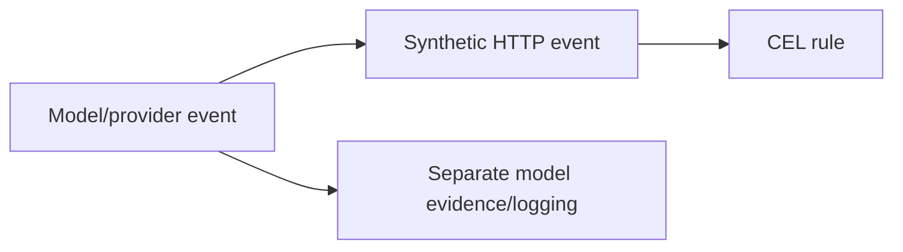

# Security Event CEL Sprint

## Goal

Make CEL enforcement operate directly on Capsem's canonical `SecurityEvent`
structure for model, MCP, network, file, process, and future engine events.

The security system must have one live rule-evaluation path for both
detection and enforcement:

1. Parse and normalize in the producing engine.
2. Emit a canonical `SecurityEvent`.
3. Run pre-transform on that parsed event.
4. Evaluate detection and enforcement CEL rules against that same event shape.
5. Log and persist the same event/evidence model.

## Non-Negotiable Invariant

No model or MCP enforcement rule may be lowered into synthetic HTTP fields.

No `SecurityEvent` family is second-class. The canonical CEL surface must cover
detection and enforcement for every event type Capsem emits: network/HTTP, DNS,
MCP, model, file, process, credential, VM, profile, conversation, snapshot, and
future typed events.

Rules such as `model.name.startsWith("gemini")`, `model.response.text`,
`model.tool_calls`, and `mcp.name` must evaluate against canonical event
fields, not compatibility projections like `http.response.body.text`.

## Current Suspect

The current codebase appears to expose canonical model/MCP fields in the
security event projection, but some live policy paths still compile model rules
into HTTP request/response predicates:

- `/Users/elie/.codex/worktrees/5fcb/capsem/crates/capsem-process/src/security_engine/`
- `/Users/elie/.codex/worktrees/5fcb/capsem/crates/capsem-process/src/mcp_runtime.rs`
- `/Users/elie/.codex/worktrees/5fcb/capsem/crates/capsem-core/src/net/mitm_proxy/mod.rs`
- `/Users/elie/.codex/worktrees/5fcb/capsem/crates/capsem-core/src/net/mitm_proxy/telemetry_hook.rs`
- `/Users/elie/.codex/worktrees/5fcb/capsem/crates/capsem-proto/src/policy_context.rs`
- `/Users/elie/.codex/worktrees/5fcb/capsem/crates/capsem-security-engine/src/lib.rs`

This sprint verifies that diagnosis and then removes the second path.

## Status

| Slice | Name | Status | Exit Criteria |
| --- | --- | --- | --- |
| T0 | Event-Flow Map | Done | Every live enforcement callback is mapped to the event shape it evaluates. |
| T1 | Canonical Projection Contract | Done | Detection and enforcement CEL bindings are defined from every canonical `SecurityEvent` family. |
| T2 | Live Enforcement Rewire | Done | MITM/provider callbacks evaluate canonical model request/response/tool events; framed MCP request/response now evaluates canonical MCP events. |
| T3 | Rule Compilation Cleanup | Done | Model/MCP rules are no longer rewritten into HTTP request/response predicates. |
| T4 | Regression Tests | In Progress | Tests fail if model rules only work through HTTP-body compatibility fields. |
| T5 | Integration Proof | Not Started | End-to-end proof shows canonical events drive block/detect/log behavior. |
| T6 | Benchmark Proof | In Progress | Fast and full benchmark gates cover CEL, Sigma/Detection IR, hunt, and live callback overhead. |
| T7 | Typed Event Identity Contract | Done | Producers, callbacks, CEL guards, and SQLite storage consume `SecurityEventType`. |

## Architecture Target

The old shape to remove:

## Parallel Work Contract

Other agents may add fields to `SecurityEvent` in parallel. This sprint should
consume canonical fields through the shared projection layer and avoid local
ad-hoc bindings in MITM, MCP runtime, or provider-specific code.

If a required field is missing, add it to the canonical event/projection
contract first, then use it from enforcement.

## Release Hold

This sprint is not complete until a model-response rule can block on canonical
`model.*` fields without relying on any `http.*` predicate, and a regression
test proves that path.

Benchmark release hold:

- The fast microbench gate must include the security-engine CEL Criterion
  bench and the security-engine Detection IR Criterion bench.
- The full artifact gate must run `just benchmark` before any public or
  bank-facing performance claim.
- `just benchmark-compare` must be used when comparing committed artifacts.
- Benchmark coverage must include detection and enforcement, not only one side
  of the security engine.
- Any benchmark claim must state which path and event families were measured:
  projection, enforcement CEL, detection CEL, Sigma/Detection IR lowering, hunt,
  MITM callback, model parser, or VM-originated end to end.

## Milestone Notes

- T1 projection contract now covers HTTP, DNS, MCP, model, file, process,
  credential, VM, profile, conversation, and snapshot roots for both detection
  and enforcement CEL.
- T6 fast Criterion coverage has been extended for all-family projection,
  mixed-family detection/enforcement evaluation, Detection IR lowering, and
  indexed model tool-call/result field paths. Full `just benchmark` remains a
  release gate before performance claims.
- T3 removed the process-runtime `model.* -> http.*` condition lowering and the
  MITM HTTP-response `tool.arguments.*` rewrite compatibility path. Model rules
  now compile only against canonical `model.*` event guards; T2 still needs to
  wire the live provider callbacks that emit those canonical events.
- T2 now wires canonical `model.request` enforcement in the MITM path after
  true HTTP request enforcement and before upstream dispatch. A fixture-backed
  regression proves `common.event_type == 'model.request'` plus
  `model.request.*` CEL can block inline without relying on HTTP body fields.
- T2 also wires canonical `model.response` enforcement before guest delivery,
  using the provider parser output and exposing parsed response text through
  `model.response.body.text`.
- T2 proves provider-emitted tool-call blocking from that canonical
  `model.response` event using `model.request.tool_calls[...]`.
- T2 also proves request-side model tool-result blocking before upstream
  dispatch from the canonical `model.request` event using
  `model.response.tool_results[...]`.
- T4 now includes the first semantic object-search regression: canonical policy
  objects support direct `contains()`, `match()`, and `matches()` over HTTP,
  DNS, file path/content, MCP arguments, model tool-call arguments, and model
  response text, so authors can write
  `mcp.request.arguments.contains("email")` instead of closure-heavy CEL
  traversal.
- The framed MCP path no longer uses the local MCP decision provider, MCP
  condition mini-parser, or builtin domain-policy environment authority for
  live policy decisions. It builds `mcp.request` and `mcp.response` security
  events and lets the shared SecurityEngine/CEL path decide.
- Default HTTP, DNS, and MCP settings rules now have priority proof:
  priority-0 specific allow rules compile and beat catch-all block rules at
  `RULE_CATCH_ALL_PRIORITY`, while non-matching events fall through to those
  defaults.
- The process-side SecurityEngine glue is now under
  `crates/capsem-process/src/security_engine/` with separate modules for rule
  compilation, match recording, guest config, and MCP settings extraction.
  `mcp_runtime.rs` is back to MCP runtime/server wiring only.
- Rust Sigma/Detection IR ownership moved into
  `capsem-security-engine::detection_ir`. `capsem-core::security_packs` is now
  only a compatibility re-export, while the tight Detection IR tests and
  Criterion matching/lowering harness live next to the SecurityEngine.
- Runtime enforcement backtest, detection backtest, detection hunt,
  evidence-signature, and matched-field extraction now live in
  `capsem-security-engine`; service endpoints validate route payloads and call
  the shared engine API.
- `SecurityEventCommon.event_type` is now typed as
  `capsem_security_engine::SecurityEventType`. Callback validation, runtime
  rule guards, constructors, profile schema, and new `security_events` SQLite
  tables consume the same closed contract instead of parallel string lists.
- T0/T0a mapped the current enforcement and detection surfaces. HTTP, DNS,
  MCP, model, and process have live inline enforcement callbacks; file emits
  canonical ledger events for session detection; credential, VM, profile,
  conversation, and snapshot are supported by contract/session reconstruction
  but still need live producers.
