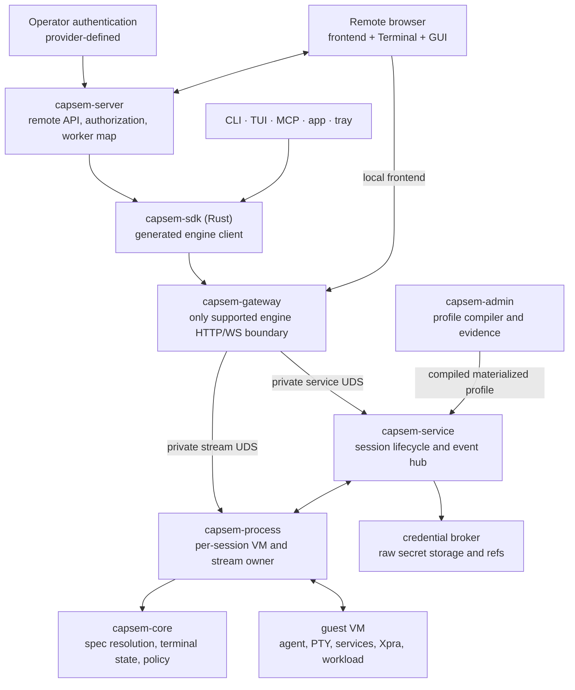

# Capsem v0.7 remote session architecture

Status: draft for architecture review

Target: Capsem 0.7 on branch `v0.7`

Companion contracts:

- `sprints/v0.7/session-spec.schema.json`
- `sprints/v0.7/profile.schema.json`
- `sprints/v0.7/protocol.schema.json`
- `sprints/v0.7/capsem-server.openapi.yaml`
- `sprints/v0.7/capsem-server-admin.openapi.yaml`

The two OpenAPI files are T0 review snapshots, not implementation authorities.
When `capsem-server` lands, its typed route registry generates both documents;
the server-served documents and generator CLI are authoritative, and the
snapshots become generated outputs that must never be edited by hand.
They describe the intended v0.7 end-state. During staged delivery the generated
document contains only routes/protocol variants implemented in that tranche:
T3S does not advertise terminal history, GUI, or credential routes before
T4/T5/T6a add them.

## 1. Decision summary

Capsem 0.7 should add a generic, profile-compiled session contract to the
existing VM engine and expose that engine remotely through a separate binary
named `capsem-server`.

The split is deliberate:

- Capsem core understands profiles, session inputs, commands, files, rewrites,
  brokered credential grants, rules, supervised guest services, terminal state, GUI
  surfaces, and session events.
- `capsem-server` understands authenticated remote callers, tenants,
  authorization, remote session ids, worker routing, raw credential intake,
  filtered APIs, and frontend hosting.
- `capsem-server` exposes two non-overlapping API namespaces: bearer-authenticated
  user routes under `/v1/user/{user_id}` and shared-key administration routes
  under `/v1/admin`. A credential valid for one namespace is invalid for the
  other.
- `capsem-server` constructs each Axum router and its OpenAPI document from one
  typed route registry. There is no separately maintained production YAML.
- `capsem-gateway` is the one supported engine boundary. The TUI, CLI, app,
  tray, MCP, and `capsem-server` all use a generated Rust `capsem-sdk` over the
  gateway HTTP/WebSocket API; only the gateway may reach service/process UDS.
- The gateway route registry generates its OpenAPI, the Rust SDK, and the
  public-surface inventory. Hand-maintained route lists and regex extraction
  cease to be authorities.
- Capsem core does not acquire users, tenants, OAuth consent flows, Firebase,
  IAP, or a provider-specific control plane.
- `capsem-admin` remains the only first-party and corporate profile compiler.
  It extends the existing check/materialize/build rail; it does not create a
  second configuration root or an alternate image builder.
- Terminal, GUI, TUI, local frontend, and remote frontend consume one typed
  session-event model. Large terminal and GUI byte streams stay on their
  existing dedicated transports.

The required product outcome is one remotely created Capsem session with a
usable Terminal view and, when selected by the profile, a usable GUI canvas.
Both surfaces share the same session id, profile revision, filesystem,
credentials, security rules, detection, event stream, lifecycle, and live
statistics.

## 2. Scope and non-goals

### In scope

- A strict `SessionSpec` with argv-list `cmd`, `fortune`, non-secret `env`,
  file blobs, ordered rewrites, credential grant requests and targets, supervised
  services, and rule/detection additions.
- A profile-owned default launch contract compiled by `capsem-admin`.
- Correct terminal resume with bounded disk-backed server-side scrollback,
  active viewport checkpoints, lazy history, title/bell/notification events,
  and a single input/resize lease. The shipped retention default is selected
  from measured memory, disk, and concurrency budgets rather than promised in
  this design.
- Productizing the current Xpra GUI spike inside the normal frontend.
- A shared typed event plane from each process through service, gateway,
  `capsem-server`, TUI, and frontend.
- Separate user and administration OpenAPI contracts in `capsem-server`.
- Code-generated, runtime-served OpenAPI documents and generated review/client
  artifacts with a mandatory generate-and-compare drift gate.
- User-scoped session access under `/v1/user/{user_id}` and administration
  inventory for users, sessions, profiles, and workers under `/v1/admin`.
- Brokered OAuth token delivery plumbing to terminal commands, GUI
  applications, profile adapters, and supervised services.
- Multi-user isolation at `capsem-server` without adding users to core.

### Out of scope

- Choosing an operator's authentication product or deployment topology.
- Implementing Google OAuth consent pages in Capsem core.
- Making the local gateway itself a multi-user control plane.
- Replacing Xpra with VNC, noVNC, a browser desktop, or another GUI transport.
- Treating terminal transcripts as the interactive resume source.
- Shipping provider names, CLI choices, credentials, or runtime policy from
  the Python image-builder backend.
- Replaying the complete retained scrollback whenever a terminal window opens.
- Shipping the Gmail CLI, Drive CLI, or Drive FUSE product integrations in the
  v0.7 engine release; those consume the v0.7 broker/session contract in a
  separately gated follow-on release.

## 3. What exists and what changes

| Area | Present on this branch | v0.7 change |
|---|---|---|
| Profiles | `code`, `co-work`, and `gui` under `config/profiles`; Admin check/materialize/build/release | Add a typed `[session]` source contract and generated compiled session plan |
| Session creation | `/vms/create` selects profile and accepts resources, persistence, and ordinary `env` | Accept strict `SessionSpec`; resolve profile defaults and policy before boot |
| Commands | Run/exec use shell strings; GUI launch was diagnostic | Profile and session `cmd` are argv arrays; guest launch envelope is engine-owned |
| Files | Runtime files API and boot file delivery exist | Add bounded create-time `{path, blob_base64}` files and atomic ordered rewrites |
| Credentials | Process-global broker keyed by `(provider, credential:blake3:*)` with no owner, lifetime, or TTL; fail-open durable write | Split into content-addressed material plus owned grants; engine becomes sole writer with transactional fail-closed capture; add alias, scope, exact target, expiry, revocation, rotation, and rematerialization |
| Rules | Profile/corp rules and common security engine exist | Add allowlisted session rule/detection additions; corporate locks cannot weaken |
| Terminal | Raw PTY live stream plus a 64 KiB replay ring | Parse once with `vt100`; append immutable rows to a bounded log with a periodic index; checkpoint only mutable viewport/parser state |
| Events | Gateway-local string broadcaster synthesizes lifecycle transitions | Process-originated typed `SessionEvent`, authoritative service fan-out and replay |
| GUI | Xpra over fixed vsock 14500 and `/gui/{id}` works for an arm64 spike | Profile-driven launch, surface metadata, main-window selection, embedded frontend |
| Stats | Logger-backed routes exist; the GUI spike populated rows while toolbar stayed stale | DB owner emits a committed stats generation; clients invalidate/refetch live totals |
| Engine clients | Gateway routes plus duplicated/private service clients and hand-maintained route inventory | Gateway becomes the sole supported boundary; generated Rust SDK is shared by every in-tree client |
| Remote access | Local gateway and standalone diagnostic Xpra page | Thin `capsem-server` lands after the event backbone, then grows with terminal and GUI work |

### Current GUI proof retained

The existing `gui` profile already provides useful source and transport work:

- arm64 Debian image construction through `capsem-admin`;
- Claude Desktop and Xpra packages;
- Xdummy/X11 without a desktop environment or window manager;
- Git preinstalled;
- unprivileged `capsem-gui` uid/gid 1000;
- Chromium sandbox allowlisting;
- Capsem CA installed into the GUI user's Chromium NSS trust store;
- GNOME Keyring/Secret Service initialization through
  `/usr/local/bin/capsem-gui-session`;
- fixed Xpra AF_VSOCK port 14500;
- authenticated gateway `/gui/{id}` to mode-0600 process UDS;
- 64 MiB WebSocket message limit and 32 MiB relay chunks;
- a real 1200x800 Claude window decoded through the browser path.

The spike also found real gaps: Claude exposes both tray and main surfaces,
the main surface may be off-canvas, the normal frontend does not embed the
client, x86_64 is not built, and sustained responsive 4K has not been proven.
The guest Claude tray surface is unrelated to the host `capsem-tray` process.
A headless worker must not run the host tray to serve GUI sessions.

## 4. Proposed architecture



### 4.1 Guest VM

The guest owns workload execution, not remote identity.

`capsem-agent` receives a resolved, bounded boot plan over the existing control
vsock. Before the workload starts it:

1. creates declared non-secret files;
2. resolves credential targets through host-approved materialization messages;
3. applies all rewrites atomically in declaration order;
4. starts declared session services and waits for readiness;
5. starts the primary terminal or GUI workload;
6. publishes typed service, terminal, and GUI metadata over control vsock.

The guest must never receive the remote user's tenant or authorization roles.
It receives only the effective session configuration and the secret material
explicitly approved for a declared target.

### 4.2 `capsem-core`

Core owns reusable, testable rules and types:

- `SessionSpec`, `ResolvedSessionSpec`, override resolution, and validation;
- typed file/rewrite/credential/service launch plans;
- effective rule-set resolution;
- terminal row-log/index types, mutable viewport checkpoint codec/store,
  history paging, and terminal events;
- `SessionEvent` payload types shared through `capsem-proto`;
- safe path, size, ownership, and command validation helpers.

Disk encoding and filesystem I/O use `spawn_blocking`; live stream work never
waits on checkpoint I/O. Core does not own service routes or authenticated
remote users.

### 4.3 `capsem-service`

The service remains the authoritative lifecycle API. It:

- loads only Admin-materialized profiles;
- resolves source profile defaults, corporate constraints, and `SessionSpec`;
- is the sole writer of the credential broker: it accepts raw material on one
  route, captures it, and issues the grant (see §12.1);
- validates credential grants and target variants without serializing raw
  values into any other response, event, or projection;
- records the resolved profile revision and safe spec summary with the session;
- starts `capsem-process` with an environment-cleared, bounded launch plan;
- subscribes to every process's typed event stream over the existing per-VM
  UDS direction;
- fans out typed events over a new service UDS `/events` route;
- reports terminal, GUI, credential target, and session-service readiness;
- queries telemetry through the `capsem-logger` DB object only.

The service must not open SQLite directly or maintain a route-owned telemetry
projection cache. The logger DB owner emits a committed generation after a
batch becomes query-visible; the service forwards `StatsChanged` and clients
then refetch the existing stats route.

### 4.4 `capsem-process`

One process still owns one VM. It:

- boots and connects the existing vsock channels;
- feeds coalesced PTY output and resize events into one core `TerminalState`;
- broadcasts unchanged live bytes;
- owns row-log/index publication, the checkpoint timer, and ordered final flush;
- enforces the single terminal input/resize lease across all clients;
- relays Xpra bytes without parsing them;
- receives GUI surface metadata through the guest control channel;
- retains a bounded recent event replay window;
- serves private mode-0600 `/terminal` and `/gui` WebSocket UDS endpoints;
- answers the service's long-lived `SubscribeSessionEvents` IPC request.

The process never connects back to `service.sock` and never learns a remote
user. The service opens the process UDS, preserving the current privilege
direction.

### 4.5 `capsem-gateway` and `capsem-sdk`

The gateway becomes the sole supported engine boundary. No product client may
open `service.sock`, a process UDS, or reconstruct those paths. It preserves:

- service HTTP proxying;
- `/terminal/{id}` WebSocket to the private process terminal UDS;
- `/gui/{id}` binary Xpra WebSocket and subprotocol;
- gateway authentication, body limits, ID validation, and local CORS rules.

Its `/events` implementation changes from a gateway-local string broadcaster
to an authenticated, ordering-preserving proxy of the service event stream.
It does not synthesize product state or cache session events.

The gateway's typed route registry is canonical for control HTTP and its native
`/events`, `/terminal/{id}`, and `/gui/{id}` WebSockets. From that registry the
build generates:

- the gateway OpenAPI document, including structured WebSocket protocol refs;
- `config/public-surface.toml` as a reviewable generated inventory, never a
  hand-edited authority;
- a versioned Rust crate, `crates/capsem-sdk`, containing DTOs, HTTP methods,
  WebSocket connectors, authentication, error mapping, and compatibility
  negotiation.

This deliberately replaces the current split: `scripts/check_public_surface.py`
regex-parses only `capsem-service::build_service_router`, while gateway-native
stream routes live in `capsem-gateway` and its proxy table is private. That
shape cannot describe or generate a complete engine client and has already
allowed `/events`, `/terminal/{id}`, and `/gui/{id}` to sit outside the public
inventory.

The SDK exposes no service-UDS transport. The gateway alone owns the private
adapter to `capsem-service` and `capsem-process`. In-tree Rust consumers use the
SDK; a TypeScript SDK may later be generated from the same contract. Source
guards reject raw production route registration in both service and gateway,
and generate-and-compare gates reject route, OpenAPI, SDK, or inventory drift.

`capsem-sdk` is a normal versioned workspace library, not a copied `proxy.rs`.
Its checked-in generated client module is reproducible from the registry by a
workspace-only generator target owned by the crate; handwritten transport,
retry/backpressure policy, and ergonomic helpers wrap that generated module.
The gate writes regeneration output under `target/` and compares it byte-for-
byte. Generator paths and commands live in `config/gate.toml`; generation never
runs from a build script, touches the network, or silently rewrites source.
Wire enums are re-exported from `capsem-proto`; the SDK generator does not emit
a second Rust definition of terminal or event messages.

### 4.6 Frontend and TUI

The frontend becomes origin-independent. Locally it uses the generated gateway
client; remotely it uses the generated user client served by `capsem-server`.
A session page exposes:

- Terminal;
- GUI when the compiled profile declares it;
- Files;
- live stats and policy state;
- service/mount and credential-target readiness;
- surface/title/notification state.

The GUI view embeds the Xpra client, selects the main non-tray surface, and
places it inside the available canvas. It never chooses the guest command.

The TUI, CLI/direct shell path, app, tray, and MCP all use `capsem-sdk`. They
adopt the same versioned terminal attach/history protocol and `SessionEvent`
definitions and must not retain a private service client or conflicting
live-only terminal implementation.

### 4.7 `capsem-server`

`capsem-server` is a new workspace crate and installed binary. It is not an
automatic tray companion. Operators start it explicitly as the remote service.

It owns:

- frontend static assets and origin-relative configuration;
- the versioned `/v1/user/{user_id}` HTTP and WebSocket API;
- the separate versioned `/v1/admin` administration API;
- integration with deployment-provided authentication middleware;
- exact authenticated-subject to `{user_id}` matching on every user route;
- shared-key authentication on every administration route;
- principal/tenant to session authorization;
- server-minted opaque session ids mapped to worker and engine session ids;
- worker selection and compatibility checks;
- authenticating raw credential intake and forwarding it to the engine over the
  gateway; the server never writes the broker store and holds no captured
  material;
- filtered info, status, stats, enforcement, detection, files, events,
  terminal, and GUI proxying;
- per-user notification cursors and terminal control authorization;
- quotas, rate limits, request ids, and remote audit attribution.

All control calls and streams go through `capsem-sdk` to `capsem-gateway`.
`capsem-server` never opens service/process UDS and never embeds another route
table. The gateway token may be held in `capsem-server` memory but is never
returned to a browser. The server filters authoritative gateway events by
tenant before publishing them.

`GET /v1/user/{user_id}/info` reports the server API version, engine version,
compatibility, feature flags, and that user's safe view. `GET /v1/admin/info`
reports administration API compatibility and a non-secret key fingerprint.
Neither endpoint exposes host paths, process UDS paths, manifest internals,
asset locations, broker references, the gateway token, raw administration key,
or another user's private session data.

The administration shared key is supplied to `capsem-server` at startup as a
file, for example `--admin-key-file /run/secrets/capsem-admin.key`. The raw key
must not be passed in argv, a URL, or a loggable configuration value. The file
must be a regular owner-readable file with no group/other permissions and at
least 32 random bytes. Startup fails closed if the administration API is
enabled without a valid key. After loading, the server retains only the
verification material and a short non-secret fingerprint. Administration
clients send the key in `X-Capsem-Admin-Key`; bearer identity never authorizes
an administration route, and the shared key never authorizes a user route.

#### OpenAPI generation

`capsem-server` must not build an Axum router and then describe it again in a
YAML file. The crate adds `utoipa` plus `utoipa-axum` and exposes two builders:

```text
user_api(state)  -> (Axum Router, user OpenAPI)
admin_api(state) -> (Axum Router, administration OpenAPI)
```

Every HTTP handler is registered through `utoipa_axum::OpenApiRouter`; request,
response, path, and query types derive the same Serde and OpenAPI schema
metadata used by the handler. WebSocket operations carry their protocol and
message-schema extensions in that same registration. A source contract rejects
raw `axum::Router::route` registration inside `capsem-server`, so an endpoint
cannot run without appearing in one generated document.

The two documents are built separately, not filtered from a combined document.
The user document contains only `bearerAuth`; the administration document
contains only `adminKey`. A startup assertion rejects duplicate operation ids,
unresolved schemas, a route outside its namespace, or a security scheme from
the other router. Documents are generated once at startup, canonicalized and
pre-serialized; serving them performs no schema reconstruction.

The same in-process generator backs all three consumers:

- authenticated `GET /v1/user/{user_id}/openapi.json`;
- shared-key `GET /v1/admin/openapi.json`;
- `capsem-server openapi user|admin --format json|yaml` for review snapshots,
  client generation, packaging, and hermetic gates.

After the thin-server tranche, the reviewed snapshots move to generated documentation artifacts.
The fast gate regenerates both into `target/`, canonical-compares them with the
checked-in generated artifacts, and fails with the regeneration command on any
difference. It never silently rewrites source. Frontend API types are generated
from the user document; administration types are a separate artifact and must
not be bundled into the ordinary user frontend.

For initial single-host deployment, the server can use an embedded control
store for remote-id/authorization mappings. The storage interface must not
assume one host: a multi-worker deployment needs an external transactional
implementation. This control store is not the telemetry ledger and must not
copy `session.db` data.

## 5. Session contract

The normative request schema is `sprints/v0.7/session-spec.schema.json`.

```json
{
  "profile_id": "gui",
  "profile_revision": "2026.07.17.3",
  "cmd": ["/usr/bin/claude-desktop", "--project", "/workspace"],
  "fortune": "Drive and Gmail are available after their readiness checks pass.",
  "env": {"PROJECT": "acme"},
  "files": [
    {
      "path": "/workspace/context.json",
      "blob_base64": "eyJwcm9qZWN0IjoiYWNtZSJ9",
      "mode": 420,
      "owner": "capsem-gui",
      "group": "capsem-gui"
    }
  ],
  "rewrites": [
    {
      "id": "claude-oauth",
      "path": "/home/capsem-gui/.claude.json",
      "edits": [
        {
          "pattern": "\"oauthToken\"\\s*:\\s*\"[^\"]*\"",
          "replacement": "\"oauthToken\":\"{{credential.google}}\"",
          "required": true,
          "min_matches": 1,
          "max_matches": 1
        }
      ]
    }
  ],
  "credentials": [
    {
      "alias": "google",
      "provider": "google",
      "scopes": ["https://www.googleapis.com/auth/drive.file"],
      "targets": [{"target": "rewrite", "rewrite_id": "claude-oauth"}]
    }
  ],
  "services": [],
  "rules": {"enforcement": [], "detection": []}
}
```

### Required semantics

- `SessionSpec` does not create a second display-name field. Remote session
  responses lift the engine registry's existing `name` and `created_at`; the
  opaque remote `id` remains the lookup key. `started_at` is not invented:
  lifecycle status continues to expose the existing uptime/creation facts
  until the engine owns a durable wall-clock start timestamp.
- `cmd` is always argv. No shell parsing, interpolation, or string command is
  permitted in this contract.
- `fortune` is the USENIX-compatible name for the session greeting.
- `env` is non-secret and carries no heuristic secret detector. Value-shape
  guessing is removed as theater: it produces a UX cliff on legitimate opaque
  values (build ids, base64 config blobs) while stopping nothing deliberate.
  The real control is the compiled profile's typed `env` override policy, which
  bounds which names a caller may set at all. Credentials use broker grants and
  never travel as `env` strings.
- Each runtime file has an absolute guest path and base64 blob. The proposed
  limits are 8 MiB decoded per file, 32 MiB total, 128 files, with atomic
  replace semantics and explicit ownership.
- Rewrites execute in list order before services and the primary workload.
  Each file is read and validated once, all match counts are checked, and one
  atomic replacement is published. A failure leaves the original unchanged.
- The implementation uses Rust's bounded regex engine. Patterns, files,
  outputs, edit counts, and match counts are all capped.
- Credential aliases bind refs to explicit targets. Making a credential
  available to the GUI does not make it available to Terminal, exec, MCP, or a
  service.
- Profile contracts and session bindings use the same closed
  `CredentialTargetKind` enum: `terminal_env`, `gui_env`, `exec_env`, `file`,
  `rewrite`, `keyring`, or `service`. There is no `{kind: env, surface: ...}`
  translation. Target-specific fields (`name`, `path`, `rewrite_id`,
  `service_id`) are validated by the corresponding enum variant. Authorization
  compares the exact variant, so a `gui_env` grant cannot satisfy
  `terminal_env`.
- `CredentialProvider` is the existing closed Rust enum (`anthropic`, `google`,
  `openai`, `github`, `mcp`) and generates both schemas. Adding a provider is a
  deliberate core/package compatibility change, not a Python registry entry or
  an arbitrary request string.
- A `SessionSpec` credential entry is a **grant request**: it declares the
  profile alias, provider, requested scopes, and exact targets. It carries
  neither raw material, a material ref, nor a grant id, and therefore grants no
  authority by itself. The credential-binding endpoint captures raw material;
  the engine stores it under a private content-addressed ref and creates the
  session-bound grant. Runtime resolution is only `resolve(grant_id, target)`,
  which fails closed unless that internal grant is live, unexpired, unrevoked,
  belongs to the session, and lists the exact target variant. §12.1 owns the
  model.
- Session rules select profile-declared rule ids. The remote API does not
  accept arbitrary inline CEL/Sigma documents. Session additions may restrict
  or detect; they may not weaken locked corporate rules.
- A profile revision pin is optional but, when supplied, mismatch fails before
  VM allocation.

### Resolution precedence

```text
compiled profile defaults
  + corporate locks and limits
  + validated session overrides/additions
  + current broker bindings
  = immutable ResolvedSessionSpec for this terminal epoch/boot
```

One function in core owns this precedence. Routes, frontend, Admin, process,
and guest do not reimplement it.

## 6. `capsem-admin` profile compiler

### 6.1 Source format

The profile remains `config/profiles/<id>/profile.toml`. v0.7 adds one
`[session]` section; it does not add a new top-level config directory or a
separate hand-authored `session.json`.

```toml
[session]
surface = "gui"
run_as = "capsem-gui"
launcher = "/usr/local/bin/capsem-gui-session"
cmd = ["/usr/bin/claude-desktop"]
terminal_side_shell = false
fortune = "Claude Desktop is available in the GUI tab."

[session.overrides]
cmd = { mode = "deny" }
fortune = { mode = "allow" }
env = { mode = "allow", names = ["PROJECT"] }
files = { mode = "allow", path_prefixes = ["/workspace"], credential_bearing = "deny" }
rewrites = { mode = "allow", path_prefixes = ["/home/capsem-gui", "/workspace"], credential_bearing = "deny" }
credentials = { mode = "allow", ids = ["google"] }
services = { mode = "deny" }
rules = { mode = "allow" }

[[session.credentials]]
alias = "google"
provider = "google"
required = false
required_scopes = []
allowed_targets = ["rewrite", "keyring", "service"]

[[session.services]]
id = "drive"
kind = "fuse"
cmd = ["/usr/bin/rclone", "mount", "google-drive:", "/mnt/drive"]
run_as = "capsem-gui"
before_primary = true
restart = "on_failure"

[session.services.mount]
target = "/mnt/drive"
owner = "capsem-gui"
group = "capsem-gui"
writeback = "writes"

[session.services.readiness]
kind = "mountpoint"
path = "/mnt/drive"
timeout_ms = 30000
```

The normative post-TOML-parse source shape is
`sprints/v0.7/profile.schema.json`. Static profile file defaults refer to
profile-owned source files; runtime caller files use base64 in `SessionSpec`.
This preserves ledgering and avoids embedding large static blobs twice.

Every override is a typed policy object. Its `mode` is the closed Rust
`OverrideMode::{Deny, Allow}` enum, serialized as `deny` or `allow`; it is not a
free-form policy string. Constraint fields are part of the v0.7 compiled format
now: environment names/value pattern, guest path prefixes, credential-bearing
path policy, or declared ids as appropriate. Omitted constraints mean the
whole typed field subject to global security limits. Unknown modes or
constraints fail closed. This leaves room to narrow grants without changing
the pinned compiled-artifact shape later.

### 6.2 Compiler pipeline

`capsem-admin profile check`, `profile materialize`, and `image build` gain a
shared compiler library. A proposed separate public `profile compile` command
is unnecessary: compilation is a required stage inside all three existing
rails.

1. Parse `profile.toml` into strict `ProfileConfigFile` types.
2. Resolve profile-owned sibling files under the existing config root.
3. Validate `[session]`, override policy, credential aliases, rule ids,
   rewrite references, service dependencies, and path/size limits.
4. Normalize the plan deterministically and compute its BLAKE3 identity.
5. During **`image build` only**, inspect each declared architecture's rootfs
   **staging tree, before it is packed into `rootfs.erofs`**, for `cmd[0]`,
   `launcher`, service `cmd[0]` (each existing and executable), the `run_as`
   user/group resolving in `/etc/passwd`/`/etc/group`, and FUSE support when a
   `fuse` service is declared. These are `stat` calls on a directory, so no host
   erofs reader is required and `profile check` on macOS never needs one.
   Record every result as build evidence beside the OBOM so `profile check` and
   `profile materialize` verify against the recorded ledger instead of reading
   an image. Two checks from earlier drafts are dropped: "writable target
   parents" is runtime overlay state and is misleading to assert against a
   build tree, and "required adapters" was never defined.
6. Dry-run non-secret rewrites against the same staging tree where a target
   exists, **running each rewrite twice and comparing**. Rotation
   rematerializes a target against an already-rewritten file, so idempotence is
   a correctness requirement rather than a desirable property; proving it here
   makes it a compile-time guarantee instead of a runtime hope. Required
   rewrites that depend on first-run files must declare a creation
   adapter/readiness condition instead of being silently skipped.
7. Compile profile and corporate rules through the existing security engine.
8. Emit deterministic `session.compiled.json` under
   `target/config/profiles/<id>/`, add its hash/size to the materialized profile,
   and include it in profile evidence and release-manifest identity.
9. Runtime service loads the compiled artifact only and refuses a stale digest,
   unsupported compiled format, or incompatible minimum binary version.

### 6.3 Add, change, remove

Add:

- profile `[session]` typed structures in `capsem-core`;
- compiler validation and deterministic artifact generation in `capsem-admin`;
- built-rootfs inspection hooks in the Admin-owned image rail;
- a materialized `files.compiled_session` descriptor;
- profile summaries for supported surfaces and credential contracts.

Change:

- the existing `code` and `co-work` profiles gain explicit `[session]` defaults
  and deny-by-default typed override policies in T1, alongside `gui`;
- `profile check` validates session semantics as well as existing files/rules;
- `profile materialize` emits and pins the compiled plan;
- `image build` proves commands, identities, services, and adapters for every
  profile architecture;
- OBOM/build evidence identifies the compiled profile plan and relevant guest
  packages.

Remove or forbid:

- diagnostic launch commands as product configuration;
- runtime guessing of a GUI binary from `build.sh`, package names, or tips;
- provider registries in the Python builder;
- raw credentials or per-user state in profiles, root seeds, build hooks, or
  compiled artifacts;
- hand-editing generated profile hashes.

## 7. VM and guest changes

### Add

- Versioned resolved boot-plan messages in `capsem-proto`.
- Guest materializer for files, regex rewrites, credential targets, and
  supervised services.
- Guest service supervisor with readiness, restart, stop timeout, and ordered
  unmount.
- GUI supervisor that starts Xpra, then the profile launcher, then `cmd` under
  `run_as`; readiness requires the selected main surface, not merely Xpra.
- Guest-local Xpra hook/helper reporting stable surface id, title, role/type,
  geometry, mapped/hidden state, and urgency/attention over control vsock.
- Terminal callback messages for title/icon/cwd, bells, notifications, and
  application-requested resize.
- Mount/service states: pending, starting, ready, degraded, syncing,
  credential-expired, stopped, failed.

### Change

- Terminal profiles attach the effective `cmd` to the primary PTY.
- GUI profiles launch the effective `cmd` through the declared generic adapter;
  a side shell is a separate terminal channel configuration, not another VM.
- Readiness becomes phase-aware: boot, materialization, services, workload,
  surfaces, then ready.
- Suspend/stop drains PTY output, commits terminal row-log/index state, and
  checkpoints mutable terminal state before VM/process teardown; supervised
  services unmount before the guest freezes.
- Credential rotation rematerializes only the declared target. Services may
  reload or restart; non-reloadable GUI apps report restart-required.

### Remove

- The raw 64 KiB terminal replay ring as the source of reconnect state.
- Frontend or diagnostic ownership of the GUI command.
- Any expectation that the terminal root environment automatically reaches the
  `capsem-gui` user or Secret Service.
- Readiness based only on socket existence or Xpra listener startup.

## 8. Terminal state, history, sound, and notifications

`capsem-core` gains `TerminalState` backed by workspace-pinned `vt100 0.16.2`.
`capsem-tui` consumes the workspace dependency instead of its own independent
pin. `vt100` is only the escape interpreter and mutable viewport; it supplies
neither stable row identity nor serialization. Capsem owns persistence.

### 8.1 Immutable row log and periodic index

For each `{session_id, terminal_id, epoch}`, finalized primary-screen logical
rows are appended once to a host-owned log. Each receives a monotonically
increasing `RowId` that is never reused or changed. A row records text/cells,
its creation width, soft-wrap markers, and the terminal sequence at which it
was finalized. The active mutable primary viewport is separate and is not
given stable row ids until rows leave it.

`terminal_id` is **reserved in v0.7, not used**. It is a `capsem-proto` newtype
over `u16` with `TerminalId::PRIMARY = 0`, never `Option<u16>` — two spellings
of "primary" is how a reserved field rots. It is carried now only where a later
change would otherwise force a migration: the row-log key and segment paths, the
mutable checkpoint body, and the terminal WebSocket message enums (`#[serde(
default)]`, so a peer that omits it decodes as `PRIMARY`). Segment paths include
it so a second terminal never requires relocating existing segments.

It is deliberately **not** added to vsock 5001, which is a raw byte stream today
with no framing. Multi-terminal does not need multiplexing; it needs connection
identification, which that port already does at accept time. A future second
terminal opens its own connection, so pre-framing the hot PTY path buys nothing.
It is likewise not added to any URL: query parameters cost nothing to add later.

Every reader **validates rather than ignores**: a non-`PRIMARY` value is a
protocol error, with a test that sends one and asserts the rejection. A reserved
field that readers silently drop is worse than no field, because the day it is
enabled some call sites route to the wrong terminal and the bytes still look
plausible. Correspondingly the compiler rejects `terminal_side_shell = true`
with "not supported in this compiled format version" (§6.2 step 9 already owns
that refusal), so the declaration syntax is reviewed and settled while enabling
it stays a compiler and connection change rather than a schema change that
invalidates pinned profile digests.

A periodic sparse index maps row-id ranges to immutable log segment/offsets.
History paging is therefore a bounded range read with no parser mutation and
no contention between viewers. Retention keeps the newest configured number of
complete rows; compaction removes oldest whole segments, advances
`oldest_available_row_id`, and never renumbers survivors. The log and index use
atomic segment publication and integrity checks. They are not stored inside a
64 MiB checkpoint and do not duplicate `vt100`'s internal ring as an API
authority.

`HistoryBefore { epoch, before_row_id, limit }` returns rows oldest-to-newest,
plus `oldest_available_row_id`, `newest_available_row_id`, and an explicit
retention-gap marker. The default page is 256 rows; the server caps a page at
512 rows and 2 MiB. `before_row_id` is exclusive; omitted means page backward
from the newest finalized row. Opening a terminal never transfers the complete
retained history.

### 8.2 Mutable checkpoint

The checkpoint is a recovery optimization, not the history contract. It stores
the active primary viewport, cursor, parser/input modes, current dimensions,
alternate-screen state, title/cwd metadata, generation/live/event watermarks,
and the exact row-log/index watermark. It contains no retained history rows.

The host-only file lives under the session directory, outside the VirtioFS
`guest/` share, mode 0600. It uses a magic header, format version, MessagePack
body, integrity digest, and a 64 MiB hard serialized limit. The process marks
mutable state dirty after output or resize and requests a write at most once
per second. Only one `spawn_blocking` write is in flight; atomic generation
publication guarantees an older checkpoint cannot replace a newer one.
Controlled suspend, stop, and shutdown drain PTY output, commit row-log/index
state, then force a final checkpoint.

A corrupt, oversized, unsupported, or watermark-inconsistent checkpoint fails
visibly and starts a fresh terminal epoch; committed log segments remain
available as transcript history but are not attached to the new interactive
epoch. On an unclean process crash, committed rows are never lost, while
mutable viewport changes since the last checkpoint may be lost by at most one
checkpoint interval. `pty.log` remains audit evidence, not normal resume input.

### 8.3 Attach, alternate screen, and resize

Attach is atomic with live subscription. It sends current active viewport and
modes, canonical dimensions, epoch/generation/live/event watermarks,
oldest/newest available row ids, and only enough recent finalized rows to fill
local context. Falling behind produces `ResnapshotRequired`, not silent loss
or lifetime replay.

Alternate-screen applications (`vim`, `less`, full-screen `tmux`) never append
their screen contents to primary scrollback. Entering alternate screen retains
the primary viewport/cursor in mutable checkpoint state; exiting discards the
alternate grid and restores primary state. Enter/exit emits a typed screen-mode
event. An orderly pause/resume while alternate screen is active restores that
grid exactly from the checkpoint. Bell, title, cwd, and notification events
continue while alternate screen is active.

The one input/resize lease owns the canonical PTY rows and columns. A controller
resize updates the guest PTY and parser. Finalized rows keep their original
width and wrap metadata and are never retroactively reflowed. Read-only viewers
cannot resize the session: they render the canonical grid with local scrolling,
scaling, or letterboxing. A lease transfer sends the canonical dimensions and
only the new controller's subsequent resize changes them. Thus viewer browser
size never mutates shared history. `vt100` resize semantics (including wrap
marker clearing or visible-grid truncation) apply only to the mutable canonical
viewport and are captured by the next checkpoint.

Typed terminal events come from two mechanisms, and the split is not cosmetic.
`vt100 0.16.2` supplies first-class callbacks for only four of them:

- `audible_bell` and `visual_bell`;
- `set_window_title` and `set_window_icon_name`;
- `resize` (application-requested).

Desktop notifications (OSC 9, OSC 777) and current-working-directory (OSC 7)
have **no callback in this crate**; they arrive through `unhandled_osc` and
require a Capsem-owned OSC dispatcher with its own allowlist, length bounds,
and sanitizer. Implementers should not go looking for callbacks that do not
exist. `copy_to_clipboard`/`paste_from_clipboard` callbacks do exist and stay
wired to the disabled-or-separately-permissioned clipboard policy.

**The event plane owns live delivery of bells, titles, notifications, and cwd;
the terminal protocol carries them only as history attached to rows.** Without
that split a client holding both sockets receives every edge twice. A frontend
with the Terminal closed still needs these, which is the deciding argument for
the event plane rather than the terminal WebSocket. Historical edges replayed on
attach never fire as new host notifications. Terminal BEL is a local sound
choice, not recorded audio. GUI PCM audio remains an optional live Xpra
capability and is never written into terminal state.

One process-enforced lease owns terminal input and resize. Other authorized
viewers are read-only. A warm VM restore continues the epoch; a cold boot/new
primary command creates a new epoch. Session deletion removes checkpoints;
row logs, and indexes. Workspace snapshots and forks do not inherit or rewind
interactive terminal state by default.

## 9. GUI product path

The data path remains:

```text
browser Xpra client
  -> capsem-server authorization and WS proxy
  -> capsem-gateway /gui/{opaque_session_id}
  -> process /gui UDS
  -> AF_VSOCK 14500
  -> Xpra
  -> profile launcher
  -> effective cmd
```

Xpra remains authoritative for pixels, input, clipboard policy, and optional
audio. The gateway and `capsem-server` remain byte-transparent. Low-volume
surface metadata uses the existing control vsock 5000; no new vsock port is
needed.

Main-surface selection has **exactly one implementation**. Earlier drafts placed
it in both the guest (because §7 makes readiness depend on the selected main
surface) and the frontend (because §4.6 makes the canvas depend on it); two
implementations of one rule in two languages diverge, and the failure mode is
readiness reporting ready while the canvas shows a tray icon — the exact defect
the spike found. The host side computes it once and publishes `main_surface_id`
on `GuiSurfaceEvent`; guest readiness and the frontend canvas both consume that
field and neither re-derives it. Whether the selector sits in the guest helper
or in `capsem-process` is part of open decision §19.3.

The selection rule itself is unchanged: prefer a mapped, normal/toplevel,
non-tray surface; dialogs remain associated with their parent; tray-only
surfaces never become the primary canvas. The frontend still owns presentation —
geometry is clamped to the browser canvas and a new main surface is placed
visibly even when the application reports stale coordinates.

The 64 MiB maximum and 32 MiB relay chunks are retained: 32 MiB covers one
3840x2160 RGBA frame. Product acceptance still needs measured sustained 4K
latency, memory, backpressure, and disconnect recovery on Apple VZ and KVM.

## 10. Shared event and transport design

| Payload | Guest/process transport | Host/client transport | Owner |
|---|---|---|---|
| PTY output/input | raw bytes, vsock 5001 | gateway `/terminal/{id}`; SDK/server WS | process + core terminal state |
| PTY resize/control | typed frames, vsock 5000 | gateway terminal protocol | agent/process |
| Viewport/history | no guest hop | gateway snapshot/history messages | core/process |
| GUI pixels/input/audio | Xpra bytes, vsock 14500 | gateway `/gui/{id}`; SDK/server WS | Xpra |
| GUI surface metadata | typed frames, vsock 5000 | `SessionEvent` | guest helper/process/service |
| Lifecycle, readiness, title, bell, notifications, stats generations | process UDS subscription | gateway `/events`; SDK/server WS | `capsem-proto` + service hub |

`capsem-proto` adds:

- `SessionEventEnvelope {session_id, stream_epoch, source, sequence,
  timestamp_us, payload}`;
- terminal client/server attach, snapshot, history, live, lease, and resnapshot
  message enums;
- `ServiceToProcess::SubscribeSessionEvents {after_sequence, stream_epoch}`;
- `ProcessToService::SessionEvent`;
- typed GUI surface and service-readiness payloads.

These are compiled contracts, not prose labels. Closed Serde enums in
`capsem-proto` are authoritative and derive JSON Schema into
`sprints/v0.7/protocol.schema.json` during T0/T3. Terminal and event WebSockets use
MessagePack frames; the schema describes the decoded envelope. The gateway and
`capsem-server` OpenAPI documents embed structured `x-capsem-websocket` objects
whose `clientMessages`/`serverMessages` are local component `$ref`s generated
from those enums. The Rust SDK is generated from the same registry. Unknown
message variants fail closed with a protocol-version error; no contract field
is a string naming a Rust type.

Event ordering is session-scoped, and resumption uses two different mechanisms
because the two hops have different shapes.

**Single-session hop (process to service).** `after_sequence` is correct and
stays: one session, one sequence, one subscriber. It gains `stream_epoch`, which
the process bumps whenever it restarts or the VM cold-boots. Without it a
restarted counter silently replays old history as new — the same failure the
terminal `epoch` already prevents, so this is one concept applied twice rather
than a second recovery vocabulary.

**Multi-session client stream (`/events`, and the per-user remote stream).**
A bare `after_sequence` is meaningless here: a user with three sessions is
receiving three independent sequence spaces interleaved on one socket, and a
single integer cannot express "session A through 412, session B through 39".
These streams use an **opaque cursor**:

- the server emits `cursor` on each envelope and on the idle heartbeat, and a
  client reconnects with `?cursor=<opaque>`;
- it encodes `{version, per-session (stream_epoch, sequence)}` and clients treat
  it as a blob, so the internal representation can change without a contract
  change — which matters because this contract is generated and versioned;
- it is **integrity-tagged against the authenticated subject and verified on
  reconnect**. A cursor that decodes to session ids is a capability if it is
  unauthenticated, which would be a direct path around §13's rule that a tenant
  cannot learn another tenant's session exists;
- the encoded session count is bounded; past the cap the cursor degrades to a
  full resnapshot, which is correct and keeps the token small;
- a gap the replay window cannot satisfy returns `ResnapshotRequired` **for the
  affected sessions only**, reusing the verb the terminal protocol already
  defines rather than tearing down the whole stream.

The service hub does not block a VM on a slow subscriber. The same opaque-cursor
primitive backs list pagination in §11.2, so there is one implementation and one
test surface rather than two paging schemes.

`StatsChanged { read_cache_epoch }` carries the existing
`capsem_logger::DbHandle::read_cache_epoch()` value after the DB owner calls
`invalidate_read_cache()` and the batch is query-visible. It does not create a
second generation counter or route-owned projection. Clients ignore epochs
not newer than the last observed value and otherwise fetch `/vms/{id}/stats` or
`/v1/user/{user_id}/sessions/{id}/stats`.

## 11. Planned API changes

Every engine method/path begins in the typed gateway registry. That registry
generates OpenAPI, `capsem-sdk`, and `config/public-surface.toml`; the latter is
a compare-only review artifact. The current regex over only
`capsem-service/src/main.rs` is removed because it cannot see gateway-native
`/events`, `/terminal/{id}`, or `/gui/{id}`. Production source guards reject
raw service/gateway route registration outside the registry.

### 11.1 Engine/service and gateway API

| Method/path | State | Contract change |
|---|---|---|
| `POST /vms/create` | changed | Add optional strict `session` object matching `SessionSpec` and an internal idempotency key persisted atomically with allocation; existing resource/persistence fields remain outside the spec during migration |
| `GET /vms/{id}/info` | changed | Add profile revision, safe resolved-spec summary, terminal/gui capabilities, credential aliases without refs, and declared services; no hot telemetry aggregation |
| `GET /vms/{id}/status` | changed | Add readiness phase, terminal/gui state, service/mount health, credential target state, event sequence, and available actions |
| `GET /profiles/list` | changed | Add profile revision, surfaces, default-command availability, credential contracts, and minimum compatible binary |
| `GET /profiles/{profile_id}/info` | changed | Add compiled session-plan identity and safe static capability summary |
| `PUT /vms/{id}/credentials/{alias}` | new | Capture raw material for one compiled alias and atomically issue its session-bound grant. Material refs and grant ids are private engine state and are never accepted from callers (see §12.1) |
| `DELETE /vms/{id}/credentials/{alias}` | new | Revoke the grant and rematerialize/restart only affected targets |
| private service `GET /events?after_sequence=N&stream_epoch=E` | new | Gateway-only upstream for authoritative single-session typed event replay/live stream; not a client boundary |
| gateway `GET /events?cursor=<opaque>` | changed | Proxy service events across sessions under the §10 opaque cursor; remove gateway-local synthesized product broadcaster |
| gateway `GET /terminal/{id}` | protocol changed | Versioned attach/snapshot/history/live/lease protocol instead of raw replay plus ad-hoc resize text |
| gateway `GET /gui/{id}` | unchanged bytes | Preserve Xpra binary subprotocol and limits; surface metadata arrives on `/events` |
| `GET /vms/{id}/stats` | behavior retained | Logger-owned live totals; `StatsChanged` makes UI invalidation reliable |

The existing file, lifecycle, stats-detail, enforcement, detection, security,
and ledger routes remain engine routes. `capsem-server` maps only a reviewed
subset rather than exposing the entire local administrative API remotely.
All tabled client-visible engine routes are reached through `capsem-gateway`
and `capsem-sdk`; matching private service paths are gateway implementation
details, not a second supported API.

### 11.2 `capsem-server` user API

The T0 review snapshot is `sprints/v0.7/capsem-server.openapi.yaml`. The implemented
contract is generated from and served by the running user router. It defines:

| Method/path | Purpose |
|---|---|
| `GET /healthz` | Minimal unauthenticated process health |
| `GET /v1/user/{user_id}/info` | Safe server/engine compatibility, features, and authenticated-user view |
| `GET /v1/user/{user_id}/openapi.json` | Authoritative user OpenAPI generated from the running router |
| `GET /v1/user/{user_id}/profiles` | Profiles authorized for this user |
| `GET /v1/user/{user_id}/sessions` | Cursor-paginated sessions owned by this user only, carrying opaque `id`, existing engine `name`, and `created_at` for display/sort |
| `POST /v1/user/{user_id}/sessions` | Create synchronously from optional display `name`, `SessionSpec`, and persistence mode; honours `Idempotency-Key` |
| `GET /v1/user/{user_id}/sessions/{id}` | Safe info including engine `name`/`created_at`, lifecycle, readiness, surfaces, services, and links |
| `DELETE /v1/user/{user_id}/sessions/{id}` | Delete synchronously, including terminal state |
| `POST /v1/user/{user_id}/sessions/{id}/start` | Start synchronously |
| `POST /v1/user/{user_id}/sessions/{id}/stop` | Ordered synchronous stop |
| `POST /v1/user/{user_id}/sessions/{id}/pause` | Suspend after checkpoint/service quiescence |
| `POST /v1/user/{user_id}/sessions/{id}/resume` | Warm resume |
| `GET /v1/user/{user_id}/sessions/{id}/stats` | Live compact logger-backed totals |
| `GET /v1/user/{user_id}/sessions/{id}/enforcement/status` | Existing safe enforcement status projection |
| `GET /v1/user/{user_id}/sessions/{id}/detection/status` | Existing safe detection status projection |
| `PUT /v1/user/{user_id}/sessions/{id}/credentials/{alias}` | Authenticate the caller and forward raw OAuth material to the engine intake route; the server captures nothing itself |
| `DELETE /v1/user/{user_id}/sessions/{id}/credentials/{alias}` | Revoke the grant and rematerialize affected targets |
| `GET /v1/user/{user_id}/sessions/{id}/files` | Authorized file listing |
| `GET/POST /v1/user/{user_id}/sessions/{id}/files/content` | Existing download/atomic-upload method semantics |
| WS `/v1/user/{user_id}/sessions/{id}/terminal` | Versioned terminal protocol |
| WS `/v1/user/{user_id}/sessions/{id}/gui` | Binary Xpra stream |
| WS `/v1/user/{user_id}/events` | This user's typed session events and replay |

Unauthorized and nonexistent session ids intentionally return the same 404.
The session id is never itself an authorization capability. The authenticated
bearer subject must exactly match `{user_id}` before any lookup.

**Pagination.** Every list route takes `?cursor=<opaque>` and returns
`next_cursor` (absent means end). List and event cursors share one versioned,
integrity-tagged envelope implementation but have distinct cursor kinds and
payloads; a cursor minted for one route or stream is rejected by another.
Lists are ordered `created_at` newest-first with opaque `id` as the
stable tie-breaker; a cursor over an unstable sort skips and repeats rows under
concurrent creation, which is what makes `created_at` load-bearing
infrastructure here rather than a display nicety. Default and maximum page sizes
live in `config/gate.toml` with the other budgets. This reverses an earlier
draft that declined pagination: `GET /v1/admin/sessions` is the unbounded
cross-user inventory, and adding an envelope later to a generated versioned
contract is a breaking change.

**Idempotency.** `POST /v1/user/{user_id}/sessions` accepts an
`Idempotency-Key` header. Before calling the engine, `capsem-server` allocates
both the opaque `remote_session_id` and a stable internal `engine_request_id`.
The control store holds `{user_subject, key} -> {remote_session_id,
engine_request_id, request_digest, status}` under a TTL; a replay with the same
key and digest returns the original `200` and the original session, a same-key
different-digest request is `422`, and the key is scoped to the subject so it
cannot probe another tenant. The key is **reserved before the engine call**
(inserted `pending`, finalized after), and the SDK forwards
`engine_request_id` as the engine create idempotency key. The engine persists
that key atomically with session allocation and returns the existing session on
replay. A crash after engine creation but before control-store finalization is
therefore recoverable by reconciling the pending row against the engine key.
No other route needs the header: lifecycle
actions are naturally re-runnable, and delete is idempotent when "already gone"
returns the same result as "deleted".

The contract still adds no asynchronous operation wrappers, synthetic aggregate
policy endpoint, or replacement upload method. Lifecycle actions, deletion, and
upload preserve the current gateway semantics.

### 11.3 `capsem-server` administration API

The T0 review snapshot is `sprints/v0.7/capsem-server-admin.openapi.yaml`. The
implemented contract is generated from and served by the running
administration router. It uses the `X-Capsem-Admin-Key` shared key and defines
a distinct read-only inventory:

| Method/path | Purpose |
|---|---|
| `GET /v1/admin/info` | Administration API/engine compatibility and non-secret key fingerprint |
| `GET /v1/admin/openapi.json` | Authoritative administration OpenAPI generated from the running router |
| `GET /v1/admin/users` | Cursor-paginated known users with safe counts |
| `GET /v1/admin/users/{user_id}` | Inspect one known user without credentials or private content |
| `GET /v1/admin/users/{user_id}/sessions` | Cursor-paginated sessions for that user; every row includes `user_id` |
| `GET /v1/admin/sessions` | Cursor-paginated cross-user inventory; every row includes `user_id` |
| `GET /v1/admin/sessions/{session_id}` | Inspect one session with owner and worker attribution |
| `GET /v1/admin/profiles` | List compiled profiles available to the server |
| `GET /v1/admin/workers` | List workers, health, compatibility, and safe capacity summaries |

This administration API lists the rest of the control-plane inventory needed
to operate the service without exposing terminal contents, files, OAuth
material, broker references, gateway tokens, host paths, or raw ledger data.
Administration lifecycle mutations are not added in v0.7 merely because the
shared key exists; each future mutation needs an explicit authorization and
audit contract.

### 11.4 Exact remote-to-engine delta

The remote API is a scoped translation layer, not a renamed copy of every
gateway route. The complete v0.7 mapping is:

| Remote method/path | Existing or planned engine source | Delta owned by `capsem-server` |
|---|---|---|
| `GET /healthz` | None | Server-process health only |
| `GET /v1/user/{user_id}/info` | `GET /version` and compatibility state | Add safe user view; remove host details |
| `GET /v1/user/{user_id}/openapi.json` | User router's generated document | Serve the exact document used to build this router |
| `GET /v1/user/{user_id}/profiles` | `GET /profiles/list` | Filter profiles by user authorization |
| `GET /v1/user/{user_id}/sessions` | gateway `GET /vms/list` via SDK | Filter by control-store ownership; lift existing `name` and `created_at`; apply the opaque cursor |
| `POST /v1/user/{user_id}/sessions` | gateway `POST /vms/create` via SDK | Reserve `Idempotency-Key`, preallocate remote and engine request ids, forward optional provision `name` plus strict `session` object, and reconcile retries by engine request id; keep synchronous `200` |
| `GET /v1/user/{user_id}/sessions/{id}` | `GET /vms/{id}/info` plus `GET /vms/{id}/status` | Resolve remote id and return a safe aggregation |
| `DELETE /v1/user/{user_id}/sessions/{id}` | `DELETE /vms/{id}/delete` | Authorize owner and delete synchronously |
| `POST .../{id}/start` | `POST /vms/{id}/start` | Authorize owner; otherwise unchanged |
| `POST .../{id}/stop` | `POST /vms/{id}/stop` | Authorize owner; otherwise unchanged |
| `POST .../{id}/pause` | `POST /vms/{id}/pause` | Authorize owner; otherwise unchanged |
| `POST .../{id}/resume` | `POST /vms/{id}/resume` | Authorize owner; otherwise unchanged |
| `GET .../{id}/stats` | `GET /vms/{id}/stats` | Authorize owner; preserve logger-owned response |
| `GET .../{id}/enforcement/status` | `GET /vms/{id}/enforcement/status` | Authorize owner; otherwise unchanged |
| `GET .../{id}/detection/status` | `GET /vms/{id}/detection/status` | Authorize owner; otherwise unchanged |
| `PUT/DELETE .../{id}/credentials/{alias}` | New engine routes in section 11.1 | Authenticate the subject, resolve the remote id, forward the body unmodified; capture and grant issuance happen in the engine |
| `GET .../{id}/files` | `GET /vms/{id}/files/list` | Rename only; authorize owner |
| `GET/POST .../{id}/files/content` | `GET/POST /vms/{id}/files/content` | Preserve raw bytes, 10 MiB cap, and POST upload |
| WS `.../{id}/terminal` | gateway WS `/terminal/{id}` | Resolve remote id, authorize attach/input, preserve terminal protocol |
| WS `.../{id}/gui` | gateway WS `/gui/{id}` | Resolve remote id, authorize viewer capabilities, preserve Xpra bytes |
| WS `/v1/user/{user_id}/events` | SDK/gateway `/events` | Filter typed events to sessions owned by the user; re-mint and subject-tag the opaque cursor so no engine sequence crosses the boundary |
| `GET /v1/admin/info` | `GET /version` and compatibility state | Add safe admin compatibility and key fingerprint |
| `GET /v1/admin/openapi.json` | Administration router's generated document | Serve the exact document used to build this router |
| `GET /v1/admin/users[/{user_id}]` | Server control store | New inventory; no gateway equivalent |
| `GET /v1/admin/users/{user_id}/sessions` | Server control store plus safe VM reads | New owner-filtered admin inventory; include `user_id` per row |
| `GET /v1/admin/sessions[/{session_id}]` | Server control store plus safe VM reads | New cross-user inventory; include `user_id` and `worker_id` per row |
| `GET /v1/admin/profiles` | `GET /profiles/list` on registered workers | Merge by compiled profile identity and report compatibility |
| `GET /v1/admin/workers` | Server worker registry | New inventory; no gateway equivalent |

No other gateway route becomes remote in v0.7. In particular, the public
contracts do not expose the gateway token, update/apply, host logs, panics,
triage, purge/run, global stats, VM exec/logs/history/timeline/snapshots/save/
fork, stats detail, `security/*`, `detection/latest`, `enforcement/latest`, or
profile mutation/reload/validation/assets/skills/plugins/MCP routes. Adding any
one of those later requires an explicit OpenAPI and authorization change.

## 12. OAuth and Google access

v0.7 delivers the generic credential-broker/session plumbing in T6a. The Gmail
CLI, Drive CLI, and Drive FUSE material below define the first consumer release
and its acceptance contract; they do not block the v0.7 engine/server release.

### 12.1 Broker model and ownership

OAuth consent and refresh orchestration are not Capsem-engine concerns. The
broker itself, however, is being reshaped, because today's design cannot answer
the questions v0.7 asks of it.

#### Why the current broker does not extend

`CredentialStore` is a process-global singleton keyed by
`(provider, credential:blake3:*)` — a global bag of secrets with no owner and no
lifetime. Its plaintext cache has no TTL, `capture()` downgrades a failed
durable write to a warning and returns success, and its `durable_lock` is a
process-local mutex over a shared file. Every v0.7 question — who owns this,
what may use it, when does it expire, what happens on revoke — is unanswerable
because the key carries no identity. That is why the earlier split-process
sketch fell apart rather than because the split itself was wrong.

#### Two layers

**Material.** Unchanged and correct: content-addressed, write-once, opaque
`credential:blake3:*`. Content addressing gives deduplication. The ref remains
private broker state: it is a correlation and lookup handle, so it is not safe
for public responses, ordinary logs, events, or telemetry.

**Grants.** New. `{grant_id, session_id, alias, provider, credential_ref,
scopes, expires_at, targets[], verified_provider_subject?, created_at,
revoked_at}`.
Resolution is `resolve(grant_id, target)` and fails closed unless the grant is
live, unexpired, unrevoked, and lists that exact target variant.

Five separate requirements then collapse into one mechanism:

| Requirement | Mechanism |
|---|---|
| §5: GUI access is not Terminal access | Enforced at the resolve call, not by upstream convention |
| §7: rotation rematerializes one target | New grant replaces the alias; old material becomes unreferenced |
| §13: forks strip bindings | Do not copy grants |
| §13: wrong-account rotation rejected | A provider adapter compares verified provider subjects when that provider supports verification |
| Revocation | One row write; every later resolve fails |

Grant expiry also drives cache eviction, which is what gives the plaintext cache
the TTL it currently lacks. `resolve` returns a zeroizing wrapper rather than a
bare `String`.

#### One writer: the engine

**This reverses the earlier decision that raw material never enters the engine.**
The reversal is deliberate and rests on three points:

1. The boundary was notional. The engine already holds plaintext later, when it
   materializes a credential into a guest file, keyring entry, or rewrite. A
   rule that keeps the token out of the engine at intake but hands it over at
   materialization protects nothing.
2. Two writers over one file is the worse failure. `capsem-server` capturing
   into its own process cache while the engine resolves from the shared file
   means a failed durable write is reported to the caller as success, and the
   session then materializes with a missing credential. Capture must be
   transactional with grant issuance, which requires one writer.
3. §1 already makes the gateway the sole engine boundary, so raw material has
   exactly one path: `capsem-server` → gateway → service.

So `capsem-server` authenticates, resolves the remote id, and forwards the
credential input without persisting or interpreting it. The engine captures
the material and issues the grant in one
transaction, fail-closed. The boundary that actually matters is preserved and is
now testable as a single property: **raw material appears on exactly one route,
is never logged, and is reachable only through a live grant.**

- Ledger, logs, status, checkpoints, command lines, argv, env, persistent VM
  registry, and event payloads carry the ref or redacted metadata, never the
  material.
- The gateway forwards that one route with tightened body limits and explicit
  no-body-logging; it is the only route where a logged request body is a breach.
- Rotation replaces the grant and rematerializes affected targets. Consent and
  refresh implementations remain replaceable without changing core.

#### Refresh tokens

The optional refresh-token field is **removed from the v0.7 contract**. Open
decision §19.5 has not settled whether `capsem-server` may own renewal, and
shipping a field for an undecided capability means either silently discarding a
secret the caller believes was stored, or half-implementing it. Deployments send
access tokens; the field returns if and when §19.5 resolves in favour of it.

### 12.2 Scopes

The profile declares required scopes and the caller supplies the granted set.
Creation or binding fails when required scopes are missing. Scopes are exact
strings and are not inferred from a token.

Useful Google examples, selected by capability rather than baked into core:

- Gmail read: `https://www.googleapis.com/auth/gmail.readonly`
- Gmail mutate labels/messages: `https://www.googleapis.com/auth/gmail.modify`
- Gmail send: `https://www.googleapis.com/auth/gmail.send`
- Drive read: `https://www.googleapis.com/auth/drive.readonly`
- Drive files created/opened by the app: `https://www.googleapis.com/auth/drive.file`
- Broad Drive access, only when required: `https://www.googleapis.com/auth/drive`

The UI must show the requested and granted scope set before session creation.
Core validates strings and target grants but does not know a provider consent
screen.

### 12.3 Gmail CLI

A Gmail CLI is a profile package and adapter, not a core feature. The profile
owns the pinned package, configuration template, rewrite/keyring/env target,
network rules, and functional proof. Both Terminal and GUI can use the same
account only when both surfaces are explicit targets.

Acceptance covers account discovery, list/read, attachment download, draft,
send, label mutation, and delete according to policy. Read-only and mutating
operations must be distinguishable in security facts. A direct CLI still
passes through Capsem's HTTPS inspection and ledger path; a future MCP adapter
uses the same credential and policy contracts.

### 12.4 Drive CLI

Drive CLI is the first follow-on delivery tranche because it proves credentials,
networking, rules, file transfer, and ledgers without mount caching. Acceptance
covers list/search/metadata, download, upload, folder creation, move/rename,
delete, and explicit export formats for Google-native documents. Workspace
file events should correlate with Drive HTTP activity through trace ids where
the protocol permits.

### 12.5 Drive FUSE

Drive FUSE is a supervised guest service, not a one-shot command. The profile
owns the selected pinned client, such as rclone plus fuse3, and its base
adapter. `SessionSpec` supplies only approved runtime bindings and overrides.

The service contract defines:

- mount path, identity, permissions, and shared mount namespace;
- argv-list daemon command with no token in process arguments;
- mode-0600 credential/config target;
- readiness and timeout;
- cache path/limit and writeback mode;
- restart, rotation, stop, unmount, suspend, and resume behavior.

The mount must be ready before the primary workload when `before_primary` is
true and visible to both root Terminal and uid 1000 GUI according to declared
permissions. `allow_other`, if used, is profile-owned and Admin-validated.

FUSE needs its own service/mount events because cached reads, buffered writes,
and remote sync completion are not equivalent to ordinary local file events.
The UI reports starting, ready, degraded, syncing, credential-expired, stopped,
or failed. A local close is not reported as remote durability until the FUSE
adapter confirms it.

## 13. Security considerations

### Multi-user boundary

- User and administration routers use separate authentication middleware.
  Bearer credentials are rejected on `/v1/admin`; the shared administration
  key is rejected on `/v1/user/{user_id}`.
- Every user route verifies that the authenticated subject exactly matches the
  path `{user_id}`. A caller cannot choose another user id to widen a list.
- Administration list responses carry `user_id` on every session row so
  ownership never depends on request context or a second lookup.
- The administration key is loaded from a protected file, compared in constant
  time, redacted from all telemetry, and represented only by a short
  fingerprint in safe status. Rotation replaces the file and reloads the
  verifier without accepting both keys indefinitely.
- Every `capsem-server` HTTP request, WebSocket upgrade, event replay, terminal
  lease request, file operation, and lifecycle action authorizes the current
  principal against the server's session mapping.
- Remote ids are server-minted opaque values mapped to worker and engine ids.
  Neither display names nor raw engine paths cross the public boundary.
- Events are filtered before serialization. A tenant cannot learn that another
  tenant's session exists through status codes, ids, timing detail, or event
  sequence gaps.
- The gateway remains private. Browsers never receive its host-wide token.
- Worker registration and routing require mutually authenticated transport in
  a multi-host deployment; local UDS permissions are sufficient only for a
  colocated single-host deployment.
- Quotas cover sessions, VM resources, file bytes, terminal viewers, GUI
  viewers, credential rotations, and event replay.

### Credential and OAuth safety

- Raw credentials are accepted on exactly one engine route
  (`PUT /vms/{id}/credentials/{alias}`) and nowhere else. `capsem-server` and
  the gateway forward that body without inspecting, caching, or logging it, and
  neither writes the broker store.
- Capture and grant issuance are one transaction that fails closed. A durable
  write failure is an error returned to the caller, never a warning behind a
  success response.
- Raw values are forbidden in `SessionSpec`, profile source, compiled profile,
  env, argv, events, stats, terminal row logs and checkpoints, process logs,
  session DB projections, and persistent registry.
- Runtime access is `resolve(grant_id, target)` only. There is no resolve-by-ref
  path that skips grant liveness, expiry, revocation, and exact target checks.
- Credential-bearing files are mode 0600, outside browser file preview, and
  rewritten atomically without logging before/after content.
- Forks strip credential grants by default and require explicit re-grant.
- Tenant ownership remains in `capsem-server` and is inherited through the
  authorized session lookup; core does not acquire a user model. When a
  provider adapter can verify account identity, rotation compares its
  `verified_provider_subject` with the existing grant and rejects a mismatch.
  Caller-supplied subject strings are never an authorization input.

### Input and execution safety

- Strict schemas deny unknown fields and bound every collection and string.
- Guest paths reject NUL, traversal, protected paths, escaping symlinks, device
  nodes, and host-only session paths.
- `cmd` and service commands are argv arrays and must pass compiled profile
  override policy; no implicit shell is inserted.
- Regex uses a non-backtracking engine with pattern, input, output, match, and
  operation caps.
- Readiness commands are profile-authored; remote callers cannot supply
  arbitrary readiness exec.
- File writes and rewrites are atomic and fail closed.

### Terminal, GUI, and events

- Terminal row logs and checkpoints may contain secrets printed by the
  workload. They are host-only mode 0600 and require the same authorization as
  the live terminal.
- Terminal notifications are sanitized, length-bounded, and rate-limited.
  Historical edges never trigger live notifications.
- OSC clipboard remains separately permissioned; links remain non-clickable by
  default.
- GUI clipboard and audio are explicit per-viewer capabilities. Surface titles
  and notifications are untrusted guest strings.
- All new process UDS sockets remain mode 0600. Guest-controlled I/O cannot
  terminate the host process with `process::exit`.

### Telemetry boundary

If terminal, GUI, mount, or remote authorization events become durable ledger
rows, `capsem-logger` owns storage, batching, flush visibility, rehydration, and
queries. Service, gateway, frontend, `capsem-server`, and tests do not open
SQLite or create telemetry projection caches.

## 14. Performance and capacity

### Terminal

- Parse once per terminal after the existing 8 ms/64 KiB coalescing path, not
  once per viewer.
- Live bytes are broadcast immediately and never wait for disk.
- Retain a measured, configurable number of immutable complete rows in
  segmented log storage with a sparse index; the separate mutable checkpoint
  has a 64 MiB serialized cap. Benchmarks evaluate candidates including 1,000,
  5,000, and 10,000 rows; this design does not promise one before measurement.
- Initial attach sends the active viewport plus enough local context, normally
  well below 1 MiB.
- History pages default to 256 rows and cap at 512 rows/2 MiB.
- Build the sparse history index off the live path. Checkpoint mutable state at
  most once per second when dirty; one blocking write in flight.
- A lagged client resnapshots current state instead of replaying the lifetime
  transcript.
- **Resident memory per terminal is a first-class budget, because it is the
  binding constraint on concurrent sessions per host — not OpenAPI generation
  time.** `vt100::Cell` is exactly 32 bytes (the crate statically asserts it), so
  a parser configured with a 10,000-row internal ring costs roughly 25 MiB at 80
  columns, 38 MiB at 120, and 61 MiB at 200, per terminal, before `Vec`
  overhead. Because §8.1 gives Capsem its own segmented row log, retention is
  decoupled from parser memory: `Parser::new(rows, cols, scrollback_len)` takes
  a **small** `scrollback_len` sized to the active viewport plus modest local
  context, while the configured retention budget is served from disk-backed
  segments. Set that budget, the parser constant, the resident ceiling per
  terminal, and the per-host concurrent-terminal figure from measured
  baselines in `config/gate.toml`.

### GUI

- Preserve byte-transparent Xpra forwarding and zero-copy buffer transfer where
  the current relay permits.
- Retain 64 MiB max WebSocket messages and 32 MiB relay chunks.
- Surface/events never carry pixels or audio.
- Apply bounded queues and backpressure separately in each direction; a slow
  viewer cannot grow process memory without bound.
- Record encode/decode latency, relay throughput, dropped/merged surface events,
  RSS, and disconnect recovery for 1200x800 and sustained 4K.

### Events and stats

- Events are low-volume typed control data with bounded replay and subscriber
  queues.
- Coalesce repetitive progress and stats generations; never coalesce lifecycle,
  authorization, notification, or surface create/destroy edges.
- Stats are queried from the DB owner after commit generation; there is no
  per-route mirror.

### `capsem-server`

- Generate and canonicalize both OpenAPI documents once at startup; serving a
  document is a pre-serialized immutable response, not a per-request derive.
- Record document generation time, serialized bytes, and schema/component
  counts in the benchmark report. Budgets live once in `config/gate.toml` and
  are established from measured baselines, not copied into tests.
- Stream terminal/GUI bodies without buffering entire messages beyond the
  existing caps.
- Apply per-principal and per-tenant connection quotas before opening a worker
  stream.
- Cache only immutable profile summaries by compiled digest. Session lifecycle,
  stats, enforcement, detection, and events remain authoritative engine reads.
- Worker selection is outside Tokio-blocking work; durable control-store calls
  use async drivers or `spawn_blocking` for an embedded store.

## 15. Component change map

| Component | Required change |
|---|---|
| `crates/capsem-core` | Session/profile types and resolution; terminal row log/index/checkpoint/history and reserved `TerminalId`; path/rewrite/service validation; credential grant store, transactional capture, and `resolve(grant_id, target)` |
| `crates/capsem-proto` | Boot plan, terminal protocol, `SessionEvent`, process event subscription, GUI/service event payloads |
| `crates/capsem-sdk` | New generated Rust gateway client/types; HTTP/WS auth, compatibility, errors, terminal/event connections; no UDS transport |
| `crates/capsem-admin` | Parse/compile `[session]`; inspect each rootfs; emit/pin `session.compiled.json`; evidence |
| `crates/capsem-service` | New create resolution, sole-writer credential capture/grant routes, safe info/status fields, service event hub, process subscriptions |
| `crates/capsem-process` | TerminalState integration, checkpoint lifecycle, lease, event replay, GUI metadata, guest boot plan |
| `crates/capsem-agent` | Materializer, rewrite engine, service/FUSE supervisor, GUI launch and Xpra metadata helper |
| `crates/capsem-gateway` | Canonical typed engine route registry and OpenAPI; sole service/process UDS adapter; proxy authoritative `/events`; relay terminal protocol; preserve GUI stream |
| `crates/capsem`, `crates/capsem-tui`, app/tray/MCP | Replace private/duplicated clients with `capsem-sdk`; shared terminal/event contracts |
| `frontend` | Origin-relative client generated from the user OpenAPI; embedded GUI, terminal history, events/notifications, live stats invalidation, service readiness; never bundle the administration client/key |
| `crates/capsem-server` | New explicit remote binary; `utoipa-axum` typed user/admin router builders and generator CLI; runtime OpenAPI endpoints; separate auth middleware; protected admin-key loader; subject-tagged opaque cursors; idempotency-key reservation; API/authz/control store/worker client/frontend host/WS proxies. Captures no credential material |
| `config/profiles/*` | Add `[session]` to v0.7 profiles; selected Gmail/Drive/FUSE package adapters land only in the follow-on release |
| package/install rails | Include `capsem-server`, its generated API artifacts, version/help/openapi probes, SBOM evidence, and exact-package verification; do not auto-register it with the local desktop service/tray |
| `config/public-surface.toml` | Generated compare-only inventory from the gateway registry; remove regex extraction and hand updates |
| `src/capsem/gate`, `config/gate.toml` | Compose OpenAPI generation/drift, hermetic server integration, benchmark, Winterfell, IronBank, installed-package, and glow-up proof into the existing single plan |
| `tests/capsem-server`, `tests/ironbank` | Hermetic remote API functional/adversarial suite and installed black-box field ledger |

## 16. Testing plan

Use the smallest focused test during each tranche, `just smoke` for integrated
developer feedback, and one final `just test` only when the complete forward
state is ready. The document/spec tranche does not justify a five-hour gate.

| Category | Required proof |
|---|---|
| Schema/contract | Valid/invalid SessionSpec, profile, and protocol fixtures; closed provider/target/mode enums; constrained overrides; unknown fields, sizes, paths, argv, aliases, refs, and conditional service requirements. No test asserts heuristic secret-shape rejection in `env`; the `env` name policy is what is proved |
| Generated contracts | One typed declaration builds each route/document/SDK; no raw Axum route escape; canonical generate-and-compare for gateway/user/admin OpenAPI, Rust SDK, protocol schema, and public-surface inventory; runtime documents equal CLI output; every example and `$ref` validates |
| Compiler | Deterministic output/digest; source/materialized separation; stale artifact refusal; both arches; missing binary/user/launcher/FUSE/rewrite target failures |
| Core unit | Precedence, constrained overrides, corporate locks, rewrite atomicity/idempotence, grant liveness/expiry/revocation/exact-target enforcement, transactional capture failing closed, immutable row ids/compaction/index, reserved `TerminalId` rejecting non-`PRIMARY`, alt screen, resize, events, checkpoint corruption and bounds |
| Process functional | Snapshot/live atomicity, lazy indexed history, lag/resnapshot, canonical resize/read-only viewers, one control lease, final log/index/checkpoint ordering, event replay/reconnect |
| Guest functional | Files/rewrites before workload; service readiness/restart/unmount; GUI identity/keyring; no argv/env secret leakage |
| Service/gateway/SDK | Immediate-after-create readiness ownership; safe info/status; the single raw-intake route forwarded without body logging; authoritative event proxy; every in-tree client crosses only the gateway; generated SDK exercises every operation and WS schema |
| Frontend/TUI | Terminal reconnect/scrollback/title/bell; GUI main-window selection and resize; Terminal/GUI same session; live stats refresh |
| `capsem-server` | Hermetic local service/gateway/mock-auth topology; tenant isolation on every HTTP/WS route; path user-id/subject mismatch; user list cannot cross owners; admin all-session and per-user lists always include `user_id`; missing/wrong admin key; bearer-on-admin and admin-key-on-user rejection; key reload and leak scan; unauthorized-as-not-found; event filtering; remote ids; token never exposed; quotas and disconnect cleanup |
| Cursors and idempotency | Cursor round-trip across reconnect and paging; a cursor minted for one subject rejected for another; forged/truncated/replayed cursors rejected; bounded session count degrading to resnapshot; per-session `ResnapshotRequired` without tearing down the stream; stable ordering under concurrent creation; idempotent replay returning the original session; same-key/different-digest `422`; crash between reservation and finalize leaving no orphan VM |
| OAuth and grants | Hermetic mock provider through `capsem-mock-server`; capture, grant, rotate, expire, revoke, wrong-account rejection, scope mismatch; resolve rejected for a target not on the grant; capture fails closed on durable-write failure; raw material present on exactly one route and absent from every log, event, ledger, row log, and checkpoint |
| Gmail/Drive CLI | Functional read and mutation outcomes, file transfer bytes, policy decisions, and exact ledger/UI fields |
| Drive FUSE | Mount/read/write/sync/unmount, expiry/rotation, cache semantics, suspend/resume, Terminal+GUI visibility, and correlated mount/network/file evidence |
| GUI hypervisor | Apple VZ and KVM; 1200x800 and sustained 4K; 64 MiB/32 MiB bounds; input, clipboard policy, optional audio, reconnect |
| Adversarial | Oversize bodies, traversal/symlink escape, regex abuse, command override denial, event lag, notification flood, cross-tenant ids, stale refs |
| Bootstrap | A clean `bootstrap.sh -y` environment can generate gateway OpenAPI/SDK/protocol/inventory, build `capsem-server`, run both remote OpenAPI modes without network access, and pass generated-artifact checks before Docker, VM, or package work |
| Winterfell | The exact installed binary/profile/asset cohort starts `capsem-server`, creates and resumes a user-owned persistent session, preserves file/terminal state and owner mapping, and remains visible through both user and admin APIs after restart |
| Performance | Terminal parse/checkpoint/attach/history budgets; GUI throughput/RSS/latency; event fan-out and server proxy backpressure; one-time OpenAPI generation/size; user/admin list latency and memory at configured cardinalities; no terminal/GUI throughput regression |
| Install/glow-up | Exact `.deb`/`.pkg` contains `capsem-server`; version/help/generator work; runtime documents match installed generator output; fresh install, accepted upgrade, channel switch, rejected upgrade, and preserved old state all pass without auto-starting the server |
| IronBank | One deterministic hermetic credential and remote-session stimulus asserted through generated schema, client result, ownership/auth decisions, rules, ledger, logs, UDS, HTTP, events, stats, and UI JSON; unknown fields fail |
| Gate composition | `_test-fast` owns early drift proof; functional owns VM/server tests and benchmarks; glow-up owns exact-package/Winterfell transitions; local `just test` and both release lanes compose the same fragments with no workflow-only substitute |

Focused gates by tranche include `cargo test -p <affected-crate>`, the relevant
frontend test command, Admin/profile fixture tests, and targeted VM tests. The
final integrated candidate must pass both-architecture profile proof,
capsem-doctor, IronBank, exact package installation, and the complete `just
test` release gate.

### 16.1 Hermetic `capsem-server` proof and gate wiring

All remote tests run without public DNS or internet access. They use temporary
`CAPSEM_HOME`/`CAPSEM_RUN_DIR`, random loopback listeners, private UDS paths, a
mode-0600 temporary administration key, deterministic locally signed bearer
identities, and `capsem-mock-server` for OAuth/upstream behavior. Tests never
reuse the developer's running service, gateway, server, key, control store, or
browser session. Readiness is server-owned; fixtures do not hide races with
sleeps or client retry loops.

The implementation must wire the proof into the existing gate graph as follows:

| Existing rail | Required v0.7 addition | Failure caught there |
|---|---|---|
| Native red/green | `cargo test -p capsem-sdk -p capsem-gateway -p capsem-server` over the typed engine registry, generated SDK calls/WS codecs, both remote router builders, auth middleware, generated documents, canonical serialization, and source guards | Route/client/schema/auth drift before any integration process starts |
| `_test-fast` | A gate-owned generate-and-compare action for gateway/user/admin OpenAPI, Rust SDK, protocol schema, public-surface inventory, and frontend clients, after bootstrap prerequisites and before Docker/artifacts | Stale checked-in API/client output, raw unregistered route, broken `$ref`, mixed security scheme, or non-deterministic generation |
| Candidate `bootstrap` | Extend `tests/capsem-bootstrap/` and doctor inputs so a clean checkout can generate the gateway contract/SDK and build the binary and run `capsem-server openapi user\|admin` hermetically | Missing tool/dependency/configuration that would otherwise fail deep in the gate |
| Broad functional (`-n 4`) | Add `tests/capsem-server/` to the normal pytest root; run real server/service/gateway processes with isolated homes and multiple users; deny direct service/process sockets to client fixtures | Cross-user leaks, lifecycle/readiness races, WebSocket filtering, a bypass around the gateway-only boundary, orphan cleanup, and differences between generated contract and HTTP behavior |
| Profile compatibility axis | Repeat session create, terminal attach, GUI capability discovery, credential target readiness, and generated profile visibility for every selected profile | A remote API that works only for the base profile |
| Winterfell | Add `capsem-server` to installed artifact roots and extend `scripts/run-installed-winterfell.py` with a remote persistence test | Installed-cohort mismatch, lost control-store ownership, or broken resume after service/server restart |
| IronBank | Add a black-box field-ledger test under `tests/ironbank/` using only public schemas/routes and hermetic fixtures | A superficially successful API response whose policy, logs, DB facts, counters, UDS result, or UI JSON is wrong or leaks a secret |
| Benchmark rail | Extend the serial recorded benchmark and route-contention report; derive every cardinality and threshold from `config/gate.toml` | OpenAPI/startup/list/proxy latency, RSS, allocation, or throughput regression hidden by functional success |
| Exact native install | Add `capsem-server` to `[package.proof].binaries`, installed layout/SBOM checks, and generator probes; leave it explicitly operator-started | Package omitted or wrong-version binary, absent generated contracts, accidental service registration, or incomplete SBOM |
| Local/release glow-up | Extend `local-release-glowup.py`, macOS package proof, and installed reports to start the exact installed server, fetch both documents, compare with its CLI output, exercise user/admin isolation, and stop it cleanly for fresh/upgrade/channel-switch/rejection paths | Source-built substitution, stale installed spec, migration loss, cross-auth confusion, or orphan process after transition |
| Final `just test` and release lanes | Compose the additions through existing `fast`, `functional`, and `glowup` fragments; add graph/order/parity contracts | A test that exists only in CI YAML, a nested gate invocation, a skipped release lane, or expensive work beginning before drift/bootstrap failure |

The generated-document test is stronger than a snapshot test alone. It obtains
the `(Router, OpenAPI)` pair from each production builder, proves the exact
method/path inventory and security scheme, invokes representative success and
every declared error class through the real router, and validates returned
bodies against that generated document. The black-box installed test then
fetches the documents from the running package, so a test-only generator cannot
make a drifted runtime look green.

## 17. Delivery tranches

### T0 — contracts

- Land SessionSpec/profile/protocol schemas, typed Rust model plan, gateway and
  remote API approval, SDK generation contract, and test fixtures.
- Exit: review agrees on ownership, limits, endpoints, and compatibility.

### T1 — profile compiler and resolution

- Extend profile types and Admin rails; emit compiled artifact; add safe profile
  capabilities; resolve SessionSpec without booting.
- Exit: deterministic both-arch Admin proof and strict negative fixtures.

### T2 — guest materialization and launch

- Add files, rewrites, credential targets, service supervisor, argv `cmd`,
  `fortune`, and readiness phases.
- Exit: real terminal and GUI sessions launch from profile defaults with no
  diagnostic command.

### T3 — event backbone and live stats

- Replace the regex/hand route inventory with the typed gateway registry;
  generate gateway OpenAPI, `capsem-sdk`, protocol schemas, and the review-only
  public-surface inventory. Move all in-tree clients onto the SDK.
- Add `SessionEvent`, process replay/subscription, service hub, gateway proxy,
  existing logger `read_cache_epoch`, and frontend/TUI consumers.
- Exit: lifecycle, surface, notification, service, and stats changes remain live
  with neither Terminal nor GUI open, and no product client reaches a private
  service/process UDS.

### T3S — thin `capsem-server` remote-boundary proof

- Land the binary immediately after T3 against today's gateway/SDK: generated
  user/admin contracts, bearer/admin-key separation, opaque remote ids,
  ownership/control store, create/list/info/lifecycle/stats, raw current
  terminal WebSocket proxy, and hermetic two-tenant tests.
- Package and bootstrap it now; do not wait for terminal history or GUI surface
  selection. Its handlers consume `capsem-sdk` only.
- Exit: auth, tenant isolation, opaque-id resolution, WS proxying, generated
  contract/runtime equality, and restart-safe owner mapping are retired risks.

### T4 — terminal resume

- Move vt100 into core; add immutable row log/periodic index, mutable checkpoint,
  alt-screen and canonical-resize semantics, history/lease, and all clients.
  Upgrade the already-running `capsem-server` terminal WS to the generated
  structured protocol in the same tranche.
- Exit: stable bounded scrollback at the measured default, active/alternate modes, lazy attach, warm
  resume, corrupt checkpoint, multi-size read-only viewers, and notification
  history pass locally and through the remote boundary.

### T5 — GUI productization

- Add profile launch, guest surface helper, main-window selection, embedded
  frontend, `capsem-server` GUI authorization/proxy, x86_64 image rail, and
  performance metrics.
- Exit: usable Terminal+GUI on the same session through Apple VZ and KVM.

### T6a — credential broker/session plumbing

- Replace the global secret bag with the two-layer material/grant store; make
  the engine the sole writer with transactional, fail-closed capture; add
  closed provider/target enums, exact grant enforcement,
  binding/rotation/revocation, rematerialization, zeroizing resolve with
  expiry-driven eviction, the single raw-intake route, and terminal/GUI/service
  readiness state.
- Exit: hermetic mock-provider least-privilege flows and complete leak/ledger
  proof across local SDK and remote user/admin boundaries, including proof that
  raw material exists on one route only and that a failed durable write is
  never reported as success.

### Follow-on release — Gmail, Drive CLI, and Drive FUSE

- Consume T6a with selected packages/profile adapters: Gmail CLI, Drive CLI,
  then FUSE supervision/cache/sync and UI state. No core credential-contract
  widening is permitted merely to ship a provider application.
- Exit: the §12 functional flows pass their own complete package/profile,
  Winterfell, IronBank, performance, installation, and glow-up release gates.

Each tranche extends the same installed `capsem-server`; there is no final
big-bang server tranche. By T5 two tenants concurrently exercise Terminal and
GUI with no cross-tenant information, event, file, token, or input leakage
through fresh install, restart, resume, and upgrade.

## 18. Trade-offs

| Choice | Benefit | Cost / mitigation |
|---|---|---|
| Separate `capsem-server` | Core remains reusable and user-agnostic | Another binary and compatibility contract; explicit user/admin info negotiation |
| Separate user/admin namespaces and credentials | User scope is mechanically narrow and operations can inventory all owners | Two OpenAPI contracts and auth paths; route-prefix and credential-confusion tests guard the boundary |
| Code-generated OpenAPI from each Axum router | Running routes, schemas, security, clients, and docs share one source | Adds derive/registration metadata and generator gates; runtime schema validation plus installed black-box proof catches annotation mistakes |
| Gateway-only engine boundary plus generated Rust SDK | TUI, CLI, MCP, app, tray, and server exercise one maintained API and transport | Gateway becomes critical infrastructure; hermetic SDK parity, backpressure, and installed boundary tests are mandatory |
| Extend `profile.toml` | One profile source of truth | Larger profile type; strict Admin compiler and schema keep it reviewable |
| Compiled runtime plan | No runtime guessing; digestable evidence | Generated artifact lifecycle; materialization refuses stale output |
| Two-layer material/grant broker | Ownership, expiry, revocation, fork stripping, and exact-target enforcement all fall out of one mechanism | A grant table and lifecycle to maintain; resolve gains liveness checks on a warm path |
| Engine as sole broker writer, raw material forwarded through the gateway | Capture and grant issuance are one transaction that fails closed; no shared-file concurrency; one auditable ingress route | Gives up "raw token never enters the engine", which was notional since materialization already hands the engine plaintext; that one route needs tightened limits and no-body-logging proof |
| Server-side vt100 plus Capsem-owned row log | Deterministic reconnect and stable history ids independent of parser internals | Rows exist in the immutable log and parser viewport; segmented compaction and periodic indexes bound cost |
| Checkpoint as mutable-state optimization | Small, atomic recovery state without pretending one blob is addressable history | Unclean crash may lose at most one interval of mutable viewport; committed rows remain durable |
| Lazy indexed scrollback | Fast attach, bounded network, and non-contending viewers | More protocol states; stable row ids, retention-gap markers, and resnapshot rules simplify recovery |
| Typed event plane | One state source for UI/TUI/server | New replay/lag semantics; bounded session sequence and authoritative refetch |
| Xpra bytes plus metadata side-channel | Keeps proven GUI transport and adds product window state | Guest helper must correlate stable surface ids |
| Profile-declared service/FUSE | Generic and auditable | More guest lifecycle complexity; explicit readiness, stop, and ledger states |
| Opaque subject-tagged cursors for events and lists | One primitive covers multi-session resumption and pagination; internal representation changes without a contract change | Cursors must be integrity-tagged and bounded, or they become a cross-tenant capability |
| Idempotency key on remote create only | A retried create over the internet cannot silently allocate a second VM against quota | One control-store table and a reserve-before-create ordering that must survive a crash between the two writes |

## 19. Remaining architecture decisions

These do not block T0/T1 but must be resolved before their owning tranche:

1. Select the reference Gmail and Drive CLI packages and pin/prove them in the
   appropriate profiles.
2. Select the initial Drive FUSE client and define remote-sync durability and
   cache semantics precisely.
3. Choose the Xpra hook/helper mechanism that exposes stable surface ids and
   notification metadata without parsing the opaque host relay, and with it
   whether the single main-surface selector of §9 lives in the guest helper or
   in `capsem-process`.
4. Choose the first `capsem-server` control-store backend and the interface
   required for multi-worker transactions. It now also holds idempotency-key
   reservations, so it must support a two-phase reserve/finalize write.
5. Decide whether production `capsem-server` may store refresh tokens itself or
   whether the supported default requires an external refresh/vault adapter.
   Until this resolves, §12.1 keeps the refresh-token field out of the contract
   rather than shipping a field whose handling is undecided.
6. Set measured terminal checkpoint/attach and 4K GUI performance gates from
   implementation benchmarks rather than guessing looser values. This includes
   the parser `scrollback_len`, retained-row budget, resident-memory ceiling per
   terminal, and resulting per-host concurrent-terminal figure in §14.
7. Decide GUI viewer cardinality. §13 quotas count "GUI viewers" in the plural,
   but §4.4 relays Xpra bytes byte-transparently, and a transparent relay of a
   stateful bidirectional protocol cannot fan out — duplicating the stream
   desynchronizes every client. Either adopt Xpra's own multi-client support
   (one vsock connection per viewer, managed by the relay) or state a
   single-viewer contract with an explicit takeover protocol. Terminal solved
   this with server-side state plus a lease; GUI has no equivalent and needs one
   answer or the other.
8. Decide whether `GET /v1/admin/workers` ships in v0.7. Worker vocabulary runs
   through §4.7, §11.3, §13, and §14, but the architecture is single-host through
   the gateway: there is no worker registration API, no worker-side listener, no
   mutually authenticated transport, and nothing in §15 that adds one. In v0.7
   the route can only ever return the local host. Either keep `worker_id` on
   rows (cheap, honest, always local) and withdraw the endpoint until a registry
   exists, or specify the worker transport as part of the server tranches.
   Shipping the vocabulary ahead of the mechanism in a generated versioned
   contract leaves fields that a real deployment must reinterpret.

Everything else in this document is the proposed v0.7 backbone and should be
treated as a contract change requiring explicit review before implementation.
