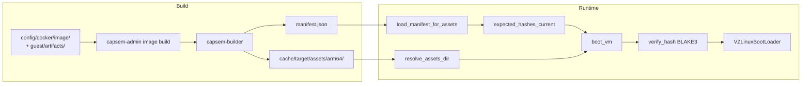

The asset pipeline moves kernel, initrd, and rootfs images from build through to boot. Assets are per-architecture (arm64 for Apple Silicon, x86_64 for Linux/KVM), integrity-checked with BLAKE3 hashes at every stage, and distributed via a version-scoped manifest.

## Build

Capsem builds one VM runtime. Its inputs are the image contract under
`config/docker/image/` and the guest payload under `guest/artifacts/`; no
application enters the build. The build rail materializes a backend
image workspace before Docker runs:

```
config/docker/image/ + guest/artifacts/
  -> capsem-admin image build
  -> generated backend image spec
  -> capsem-builder
  -> cache/target/assets/{arch}/
```

Applications are not runtime assets. They are OCI images under `images/`,
published by `images.yaml` and pulled per session through the image catalog.

Two build templates exist:

| Template | Output | What it does |
|----------|--------|-------------|
| `kernel` | `vmlinuz`, `initrd.img` | Builds a minimal Linux kernel from `defconfig` |
| `rootfs` | `rootfs.erofs` | Builds the runtime guest filesystem: `runtime_apt_packages`, guest binaries, diagnostics |

The build process also cross-compiles guest agent binaries (`capsem-pty-agent`, `capsem-net-proxy`, `capsem-mcp-server`) for the target architecture and injects them into the rootfs.

### Output layout

```
cache/target/assets/
  arm64/
    vmlinuz
    initrd.img
    rootfs.erofs
  x86_64/
    vmlinuz
    initrd.img
    rootfs.erofs
  manifest.json
  B3SUMS
```

### Commands

| Command | What it does |
|---------|-------------|
| `just build-assets [arch]` | Full runtime build: kernel + rootfs + checksums |
| `just _build-kernel <arch>` / `just _build-rootfs <arch>` | One template for one arch (CI-facing primitives) |
| `just shell` / `just exec "CMD"` | Repack initrd, materialize dev service config, sign, boot |
| `capsem-admin manifest generate cache/target/assets` | Generate `cache/target/assets/manifest.json` from the repository asset directory |
| `capsem-admin assets channel build` | Generate `cache/target/release/distribution` with `assets/<channel>/manifest.json` for release.capsem.org |
| `capsem-admin image build --config-root config --arch arm64 --template rootfs` | Build one template for one arch directly |

Local dev, smoke tests, CI, and release all build the runtime through this
same rail; there is no dev-only image patcher. The release unit is the
runtime: `just release-assets <channel> <source-commit>` publishes it.

## Manifest Format

The manifest (`cache/target/assets/manifest.json`, format 2) is a single top-level file covering every arch. Asset versions and binary versions are tracked independently with compatibility ranges (`min_binary`, `min_assets`):

```json
{
  "format": 2,
  "refresh_policy": "24h",
  "assets": {
    "current": "2026.0421.30",
    "releases": {
      "2026.0421.30": {
        "date": "2026-04-21",
        "deprecated": false,
        "min_binary": "1.0.0",
        "arches": {
          "arm64": {
            "vmlinuz":         {"hash": "<64-char blake3>", "size": 7797248},
            "initrd.img":      {"hash": "<blake3>",         "size": 2314963},
            "rootfs.erofs":    {"hash": "<blake3>",         "size": 720896000}
          },
          "x86_64": { "...": "..." }
        }
      }
    }
  },
  "binaries": {
    "current": "1.0.1776688771",
    "releases": {
      "1.0.1776688771": {
        "date": "2026-04-21",
        "deprecated": false,
        "min_assets": "2026.0421.30"
      }
    }
  }
}
```

The public asset channel is a deployed view of that same manifest. The generated
Cloudflare Pages root is `cache/target/release/distribution/`, with the machine manifest at
`cache/target/release/distribution/assets/stable/manifest.json`. After deployment the URL
is `https://release.capsem.org/assets/stable/manifest.json`.
The release-channel deploy smoke verifies public `Cache-Control` headers after
Cloudflare publishes the generated site: mutable pointers (`/`, `/health.json`,
and `/assets/<channel>/manifest.json`) stay `no-cache, must-revalidate`, while
immutable asset and runtime release artifacts stay
`public, max-age=31536000, immutable`.
It also verifies that `health.assets.files` matches the fetched channel
manifest's current asset release for each VM asset URL, BLAKE3 hash, and size,
so the release health index cannot drift away from the canonical manifest.
For host packages, the smoke verifies that `health.binary.files` and
`evidence.host_binary_files` match the fetched manifest's current binary
release for each package/SBOM URL, SHA-256 hash, and size.
It also validates SBOM and VM OBOM evidence from `health.json`: host SBOM
documents must be SPDX 2.3, VM OBOM documents must be CycloneDX, and
attestation subjects and predicate URLs must resolve against the published
evidence lists. VM asset attestations are incomplete unless
`github_attestations_vm_assets` is present and its `predicate_url` points at the
published VM OBOM evidence for the current asset release.
Runtime-owned image, software inventory, and OBOM records are validated from
the `runtime` document of `/assets/<channel>/manifest.json`; the
release-channel contract publishes no config file. Released runtime files live under
`/runtime/releases/<channel>/<revision>/<architecture>/<file>`.

Key points:
- **Single file, not per-arch.** Arches are nested under `assets.releases.<ver>.arches.<arch>`.
- **Filenames are bare** (`"vmlinuz"`, not `"arm64/vmlinuz"`) -- the arch map provides the context.
- **GitHub release asset names are arch-prefixed.** The published files are
  named `arm64-vmlinuz`, `arm64-initrd.img`, `arm64-rootfs.erofs`,
  `x86_64-vmlinuz`, and so on. The manifest intentionally keeps bare logical
  filenames because the arch map already names the architecture.
- **Hashes are BLAKE3**, 64 lowercase hex characters. Format is validated by `asset_manager.rs`; non-format-2 manifests are rejected.
- **Compatibility is explicit.** `min_binary` on an asset release and `min_assets` on a binary release define the allowed pairings for upgrades and downloads.
  The runtime selector enforces both directions: an older binary will not hydrate
  asset bytes whose release declares a newer `min_binary`.
- **Deprecated releases are history, not candidates.** Deprecated VM asset
  releases remain in the channel manifest and release-site history for audit and
  pinned-VM compatibility, but new sessions and asset hydration skip them when
  selecting a compatible release.

### Manifest producer

`capsem-admin manifest generate <assets_dir>` is the public and supported
manifest producer. It points at an asset directory, computes BLAKE3 hashes and
sizes for every built architecture, writes `B3SUMS`, writes
`<assets_dir>/manifest.json`, and reports the manifest in admin-readable JSON
when `--json` is passed.

`just build-assets`, `just _pack-initrd`, CI, release, and corp custom
builds must all use this build rail. The lower-level builder code is an
implementation detail behind `capsem-admin`; docs and automation should not call
manifest generator internals directly.

After manifest generation, `build_system/scripts/build/create_hash_assets.py` creates
`<stem>-<hex16>.<ext>` hardlinks so the dev layout matches the
content-addressable names used by the installed layout.

The local development service resolves the runtime from the manifest in its
assets directory (`cache/target/assets/manifest.json` in a checkout), exactly
as an installed service reads `~/.capsem/assets/manifest.json`. A repacked
initrd is picked up by regenerating that manifest, never by hand-editing a
hash.

### Custom corp build manifest flow

Corporate/custom asset builds use the same sequence as release:

```bash
capsem-admin manifest generate /path/to/assets --version 1.3.corp.1 --json
capsem-admin manifest check /path/to/assets/manifest.json --json
bash build_system/packaging/macos/build-pkg.sh \
  --manifest file:///path/to/assets/manifest.json \
  cache/target/cargo/release/bundle/macos/Capsem.app \
  cache/target/release \
  /path/to/assets \
  1.3.corp.1
```

The package copies that selected manifest into its payload and writes
`manifest-metadata.json`. Installed service status exposes the manifest path,
BLAKE3 hash, origin, and source so corp can debug exactly which manifest a
machine is using. `--manifest` is always URL-shaped: local custom manifests use
`file:///absolute/path/to/manifest.json`, while hosted corp channels use
`https://...` or `http://...`. Do not use `capsem update --corp` for asset
channels; `--corp` provisions corporate policy config, while corporate VM asset
channels use `capsem update --assets --manifest <URL>`.

## Runtime Hash Verification

Asset hashes are **not** baked into the binary at compile time -- that would tie every binary release to a specific asset release and defeat the `min_binary`/`min_assets` compatibility model. Instead, the binary is hash-agnostic. The selected manifest names asset URLs, and BLAKE3 hashes verify the bytes before boot.

On an installed host the selected channel manifest's `runtime` document is the
runtime contract; a revoked runtime is refused. In dev/test the service reads
the same descriptors from `cache/target/assets/manifest.json`:

1. VM create resolves the runtime's current host-arch kernel, initrd, and
   rootfs assets.
2. An `--image` session additionally pulls its OCI image, pinned by digest.
3. Asset ensure/download verifies bytes against the recorded BLAKE3 hash and size.
4. The resolved paths and hashes are passed to `VmConfig::builder()`;
   `VmConfig::build()` hashes the files and refuses to boot on mismatch.

Failure modes:

- **Generated config missing**: the justfile service path fails before launch.
- **Manifest invalid**: `capsem-admin manifest check` rejects a malformed or
  inconsistent manifest before it is used.
- **Asset bytes mismatch**: asset ensure or `VmConfig::build()` rejects the
  file and the VM does not boot.

Release authenticity evidence is handled by SBOM and build provenance
attestations. Runtime asset authorization is manifest URL selection plus
BLAKE3 byte verification.

## Runtime Asset Resolution

### Step 1: Find assets directory

`resolve_assets_dir()` searches these locations in order, returning the first that contains `vmlinuz`:

1. `CAPSEM_ASSETS_DIR` environment variable (dev override)
2. macOS `.app` bundle `Contents/Resources/`
3. `./assets` (workspace root)
4. `../../assets` (from crate directory)

For each candidate, it checks **per-arch first** (`candidate/{arch}/vmlinuz`), then **flat** (`candidate/vmlinuz`).

### Step 2: Find rootfs

`resolve_rootfs()` checks in order:

1. **Dev logical asset**: the materialized catalog's current-arch
   `file://.../assets/{arch}/rootfs.erofs`
2. **Installed hash asset**: `~/.capsem/assets/rootfs-{hash16}.erofs`

### Step 3: Download if missing

If rootfs is not found locally, `create_asset_manager()` loads the manifest and initiates download:

1. Reads the runtime's asset URL/hash/size descriptor
2. Downloads the URL when the hash-prefixed local asset is missing
3. Verifies BLAKE3 hash and size after download, deletes on mismatch
4. Atomically renames temp file to final path

The compatible asset selector ignores releases marked `deprecated: true` for
new downloads. Existing VM pins and cleanup preserve already-pinned asset bytes
through the VM lifecycle rail; deprecation prevents new selection rather than
rewriting running VMs.

Release installers are intentionally thin. They install host binaries and the
selected `manifest.json`; kernel/initrd/rootfs bytes are downloaded from the
GitHub release as separate arch-prefixed assets on first use and verified before
boot.

### Step 4: Boot

`boot_vm()` builds `VmConfig` with the runtime's asset paths and hashes:

```
VmConfig::builder()
    .kernel_path(assets/vmlinuz)    + runtime kernel hash
    .initrd_path(assets/initrd.img) + runtime initrd hash
    .disk_path(rootfs.erofs)        + runtime rootfs hash
    .build()  // verifies all hashes
```

`build()` calls `verify_hash()` for each file -- reads in 64KB chunks, computes BLAKE3, compares with expected. A `HashMismatch` error prevents boot entirely.

## Hash Verification Summary

Assets are verified at multiple points:

| When | Where | What happens on mismatch |
|------|-------|-------------------------|
| After download | `asset_manager.rs` | Temp file deleted, download retried |
| Before boot | `vm/config.rs` | `ConfigError::HashMismatch`, boot prevented |

Both use BLAKE3 with 64-character hex format. In dev/test, expected hashes come
from `cache/target/assets/manifest.json`, written by
`capsem-admin manifest generate`.

## Per-Architecture Isolation

- A Capsem binary supports exactly **one architecture** (no runtime switching); `std::env::consts::ARCH` is used to select the manifest arch key.
- `host_manifest_arch()` maps `aarch64` -> `arm64` (the key used in the manifest).
- The manifest has **separate hash entries per arch** -- no cross-arch confusion is possible.


