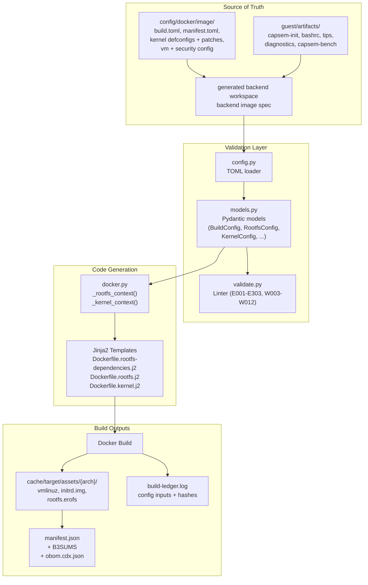
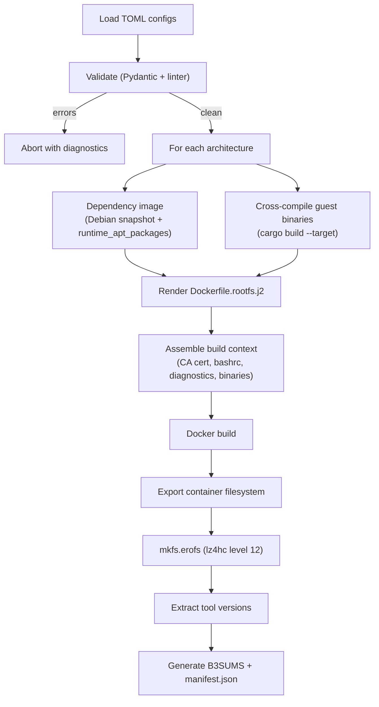
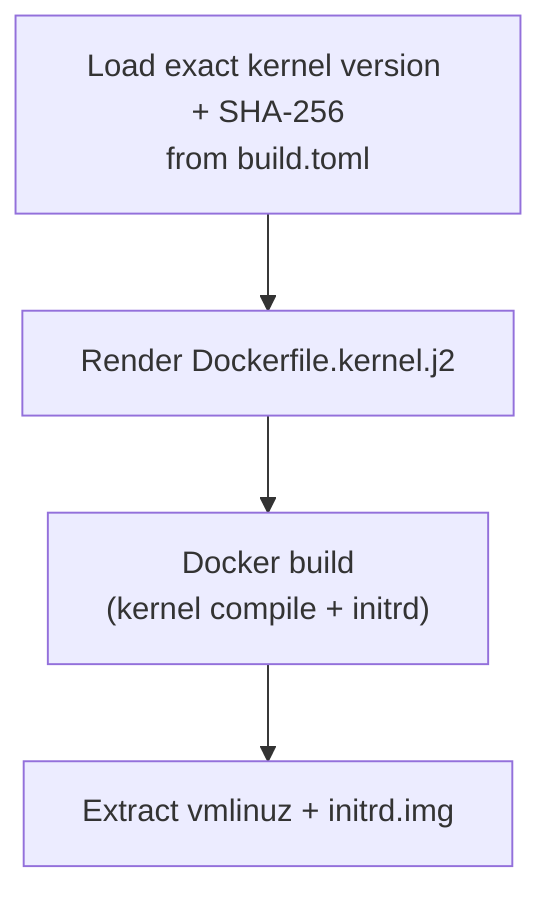
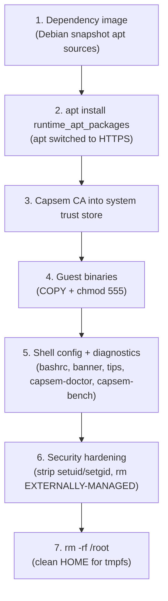
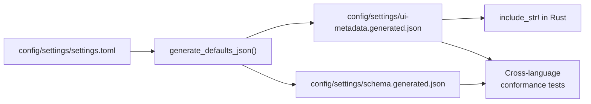

Capsem builds one VM runtime: a kernel, initrd, and rootfs per architecture.
Its only inputs are the checked-in image contract under `config/docker/image/`
and the guest payload under `guest/artifacts/`; no application
enters the build. `capsem-admin image build` resolves those inputs into a
generated backend workspace, then invokes the private Python builder backend
to validate the backend image spec, render Jinja2 Dockerfiles, and produce
per-architecture VM assets. `capsem-builder` is not a public image-authoring
CLI.

Applications are not baked into the runtime. They are OCI images under
`images/`, published by `images.yaml` and resolved through the image catalog
when a session is created with `--image`.

## Architecture



### Data flow

The data flows through four layers:

1. **Image contract** (`config/docker/image/`) -- kernel version and source
   hash, kernel patches and defconfigs, EROFS format, rootfs size ceilings,
   per-architecture base images, and the runtime package set
   (`runtime_apt_packages`).
2. **Image materialization** (`capsem-admin image build`) -- copies the image
   contract and guest payload into a generated backend image workspace.
3. **Pydantic models** (`models.py`) -- validate the generated backend image
   spec with frozen models and cross-field validators.
4. **Context dicts and Jinja2 templates** (`docker.py`, `config/docker/`) --
   produce per-architecture Dockerfiles and build contexts.

Three outputs are produced:

1. **Rendered Dockerfiles** -- Jinja2 templates (`Dockerfile.rootfs.j2`,
   `Dockerfile.kernel.j2`) parameterized per architecture.
2. **VM assets** -- `vmlinuz`, `initrd.img`, and `rootfs.erofs`.
3. **build-ledger.log** -- JSONL debug evidence for rendered inputs, context
   hashes, the runtime package set, EROFS settings, git revision, and project
   version.

## Backend Image Spec

| File | Model | Purpose | Key Fields |
|------|-------|---------|------------|
| `build.toml` | `BuildConfig` | Kernel source, architectures, EROFS format, runtime packages | `kernel.version`, `kernel.sha256`, `erofs.compression`, `rootfs.runtime_apt_packages`, `architectures.*` |
| `manifest.toml` | `ImageManifestConfig` | Image identity and changelog | `name`, `version`, `description`, `changelog` |
| `vm/environment.toml` | `VmEnvironmentConfig` | Guest shell environment | `environment.shell` (term, PATH, bashrc, tmux) |
| `security/web.toml` | `WebSecurityConfig` | Web upstream ports and domain lists checked by the linter | `web.http_upstream_ports`, `web.<section>.<key>.domains` |
| `kernel/defconfig.*` | (raw) | Kernel configs per arch | Linux kernel defconfig files |
| `kernel/patches/*.patch` | (raw) | Kernel patches applied in order with `--fuzz=0` | -- |

These files are the backend image spec, copied into a generated workspace under
`cache/target/` by the build rail. They are implementation detail, not product
authoring API. Do not add provider authorization, credentials, security policy,
UI settings, or MCP runtime truth to the backend image spec. Those belong to
corp config, rule files, and plugins.

Example `build.toml`:

```toml
[build]
materialize_network = "default"

[build.erofs]
enabled = true
compression = "lz4hc"
compression_level = 12

[build.rootfs]
runtime_apt_packages = ["runc", "umoci", "python3", "..."]

[build.kernel]
version = "X.Y.Z"
sha256 = "<64 lowercase hex characters>"

[build.architectures.arm64]
base_image = "docker.io/library/debian@sha256:<arm64 child-manifest digest>"
docker_platform = "linux/arm64"
rust_target = "aarch64-unknown-linux-musl"
kernel_image = "arch/arm64/boot/Image"
defconfig = "kernel/defconfig.arm64"
node_major = 24
```

Each architecture names its own immutable child manifest, not a mutable tag or
multi-platform index. The gate checks the local Docker image store and pulls a
missing exact child through the Docker daemon before entering the build lanes;
the sealed gate process itself does not gain general network access. The
Docker build still receives `--platform`, while the rendered `FROM` line names
only the exact digest.

`runtime_apt_packages` is the whole package set of the VM runtime: the
container launcher's tools (`runc`, `umoci`, `python3`, `iptables`,
`iproute2`), what `capsem-init` needs (`auditd`, `e2fsprogs`), the system trust
store the Capsem CA is installed into (`ca-certificates`), and what
`capsem-doctor`, `capsem-bench`, and the network diagnostics run with. Add a
package there only when Capsem's own guest machinery needs it. A tool an
application or agent needs belongs in an OCI image under `images/`. Provider
allow/block decisions live in corp enforcement rules. Credentials are captured
and materialized by the credential broker plugin at runtime and logged only as
BLAKE3 references.

## Validation Pipeline

The Python builder keeps compiler-style diagnostics internally, with error
codes, severity levels, and file:line references. Errors block the image build;
warnings are informational. There is no public `capsem-builder build`,
render-only, inspect, validate, MCP, or dry-run rail for product images.

### Error Codes

| Code | Category | Examples |
|------|----------|----------|
| E001-E002 | TOML parsing | Missing `build.toml`, invalid TOML syntax |
| E003 | Pydantic validation | Schema violations, invalid enum values |
| E006 | Domain validation | URLs in domain fields, ports, path components |
| E008 | Duplicate keys | Same key in multiple files within a directory |
| E300 | Kernel | Missing defconfig for a declared architecture |
| E301 | Artifacts | Missing `capsem-ca.crt` |
| E302 | Artifacts | Missing guest artifact or directory (capsem-init, diagnostics, ...) |
| E303 | Kernel | Missing kernel patch |

### Warning Codes

| Code | Description |
|------|-------------|
| W003 | Potential secrets detected in MCP headers/env or shell content |
| W007 | Overly broad wildcard domain |
| W010 | PATH missing essential directories (`/usr/bin`, `/bin`) |
| W012 | Unknown Rust target (not a known musl target) |

Diagnostic output format:

```
error: [E006] config/docker/image/security/web.toml: Invalid domain pattern 'https://api.anthropic.com'
warning: [W012] config/docker/image/build.toml: Unknown rust_target 'aarch64-unknown-linux-gnu' for arm64 (expected musl target)
```

## Multi-Architecture Support

Two architectures are supported. Each is self-contained in `build.toml` and produces an independent asset directory.

| Architecture | Hypervisor | Docker Platform | Rust Target | Kernel Image |
|-------------|------------|-----------------|-------------|--------------|
| arm64 | Apple VZ (macOS) / KVM (Linux) | `linux/arm64` | `aarch64-unknown-linux-musl` | `arch/arm64/boot/Image` |
| x86_64 | KVM | `linux/amd64` | `x86_64-unknown-linux-musl` | `arch/x86_64/boot/bzImage` |

Output layout:

```
cache/target/assets/
  arm64/
    vmlinuz
    initrd.img
    rootfs.erofs
    tool-versions.txt
  x86_64/
    vmlinuz
    initrd.img
    rootfs.erofs
    tool-versions.txt
  manifest.json
  B3SUMS
```

## Build Pipeline



The kernel build follows a parallel path:



Key implementation details:

- **Container runtime auto-detection.** Docker CLI.
- **CI cache integration.** Docker buildx with GitHub Actions cache (`type=gha`) when `GITHUB_ACTIONS` is set.
- **Immutable kernel source.** The checked-in build contract selects one exact
  kernel release and its SHA-256. The Docker build verifies the downloaded
  source archive before extraction, so the sealed candidate does not consult a
  mutable “latest patch” feed and identical source selects identical bytes.
- **Pinned Debian packages.** The dependency image installs
  `runtime_apt_packages` from one dated Debian snapshot, so a rebuild resolves
  the same package versions.
- **Cross-compilation.** Guest agent binaries are cross-compiled with `cargo build --target {rust_target}` using `rust-lld` as the linker (configured in `.cargo/config.toml`).
- **Clock skew resilience.** All `apt-get update` calls use `-o Acquire::Check-Valid-Until=false` to handle container VM clock drift.

## Container Runtime Requirements

On macOS, Docker runs inside a Colima VM with limited resources. The kernel and
rootfs builds and the install tests need substantial memory.

| Threshold | RAM | Notes |
|-----------|-----|-------|
| **Minimum** | 12 GB | Tauri install-test cold build SIGTERMs below this (exit 143 mid-cargo) |
| **Recommended** | 16 GB | Comfortable margin for build-assets + install-test together |
| **CI (GitHub Actions)** | 7 GB | Standard runner; install-test container uses pre-baked image so no cold build |

```bash
# Colima (macOS): configure VM resources
colima stop
colima start --vm-type vz --vz-rosetta --memory 16 --cpu 8 --disk 200

# Linux: Docker runs natively, no memory tuning needed
# sudo apt install docker.io
```

The cache policy requires 160 GiB Docker disks, recommends 200 GiB for new
runtimes, keeps an 80 GiB BuildKit cache cohort, and reserves 40 GiB free for
the active rail. The source of truth is `config/cache.toml`; `just doctor`
reports an undersized existing
Colima disk before an expensive gate begins.

## Rootfs Dockerfile layer structure

The rootfs is built in two stages. The ordering is load-bearing: third-party
dependencies are resolved once, with network, in their own input-keyed image;
the first-party assembly then runs with networking disabled.



At runtime `/root` is a tmpfs overlay, so anything baked into the rootfs under
`/root/` is hidden. Every guest binary is installed `chmod 555`, enforcing the
guest binary security invariant: all binaries are read-only, non-writable by
the guest. Applications installed by an OCI image live in that image's own
rootfs, not in the runtime's.

## Manifest, Build Ledger, and OBOM

Every build produces `manifest.json` at the asset root. The manifest records
asset hashes and compatibility, including the per-arch CycloneDX
`obom.cdx.json`. The per-arch `build-ledger.log` records debug evidence for
the inputs that produced the assets, but release uploads expose the OBOM as the
installed base-image package/component truth. The OBOM does not describe user
session mutations, workspace writes, or post-boot state.

| Section | Source | Contents |
|---------|--------|----------|
| Assets | `b3sum` output | Filename, BLAKE3 hash, size in bytes |
| Build ledger | build pipeline | Debug-only rendered Dockerfile/context hashes, exact kernel version/source SHA-256, runtime package set, EROFS settings |
| OBOM | cdxgen | Published installed base-image package/component names and versions |

## Runtime Outputs in the Release Graph

Runtime builds feed the release graph through the one runtime-owned record of
each channel manifest. The root `channels.json` file lists stable, nightly, and
any future channel, each with versioned manifest records and one `status` enum
value: `current`, `supported`, `deprecated`, or `revoked`. A channel manifest
can change package artifacts and per-binary inventory without changing the
runtime. A runtime release (`just release-assets <channel> <source-commit>`)
changes that channel's runtime images, software inventory, OBOM evidence, and
manifest runtime digest without changing packages or other channels.

The graph hierarchy is:

```text
channels.json
  -> assets/<channel>/manifest.json
    -> packages
      -> binaries
    -> runtime
      -> architectures: runtime images, software inventory, OBOM evidence
```

The runtime may declare `min_capsem_version` when its images require a newer
client. It does not reference the selected Capsem package or binary; the
manifest owns package metadata and every per-binary SHA-256, BLAKE3, and
SBOM component reference.

The `audit` subcommand parses vulnerability scanner output and fails on CRITICAL or HIGH findings.

## CLI Commands

| Command | Description | Key Options |
|---------|-------------|-------------|
| `capsem-admin image build` | Build the runtime's kernel/rootfs assets | `--config-root`, `--guest-dir`, `--arch`, `--template`, `--output`, `--clean`, `--json` |
| `capsem-builder doctor` | Backend prerequisite checks used by the build rail | -- |
| `capsem-builder agent` | Cross-compile guest agent binaries for initrd repack | `--arch`, `--output` |
| `capsem-builder audit` | Parse vulnerability scan results | `--scanner` (trivy/grype), `--input`, `--json` |
| `capsem-builder validate-skills` | Validate repository development skills | `--json` |

Usage:

```bash
# Build rootfs for arm64
cargo run -p capsem-admin -- image build --config-root config --arch arm64 --template rootfs

# Build kernel for all architectures
cargo run -p capsem-admin -- image build --config-root config --template kernel
```

In the repository, prefer `just build-assets [arch]`, which runs the same build
through the gate. There is no public `capsem-builder build`,
`capsem-builder validate`, `capsem-builder inspect`, builder MCP, or
`--dry-run` rendering rail.

## Settings JSON Generation

Settings schema generation is separate from image building. Settings are UI/app
preferences; the runtime image owns only the guest machinery.



`generate_defaults_json()` transforms host settings source into the
hierarchical JSON tree consumed by the Rust settings UI metadata. This JSON defines
each setting's name, description, type, default value, and UI metadata.

The schema is generated from `SettingsRoot.model_json_schema()` (Pydantic) and written to `config/settings/schema.generated.json`. Cross-language conformance tests verify that:

1. The generated settings UI metadata validates against the JSON schema.
2. Rust's compiled-in defaults match the Python-generated output.
3. Every setting referenced in Rust code exists in the schema.

This ensures the Python build tooling and Rust runtime never drift.
